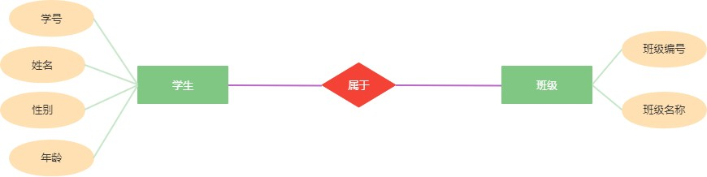

# 第一章 初识`MySQL`数据库
## 第一节 数据库操作

### 1. 创建数据库的语法

```sql
CREATE DATABASE [IF NOT EXISTS] 数据库名称 DEFAULT CHARACTER SET 字符集 COLLATE 排序规则;
```

<font color="blue" >实例</font>：创建数据库lesson，并指定字符集为`GBK`，排序规则为`GBK_CHINESE_CI` 

```sql
CREATE DATABASE IF NOT EXISTS lesson DEFAULT CHARACTER SET GBK COLLATE GBK_CHINESE_CI;
```

### 2.修改数据库的语法

```sql
ALTER DATABASE 数据库名称 CHARACTER SET 字符集 COLLATE 排序规则;
```

<font color="blue" >实例</font>：修改数据库lesson，并指定字符集为`UTF8`，排序规则为`UTF8_GENERAL_CI` 

```sql
ALTER DATABASE lesson CHARACTER SET UTF8 COLLATE UTF8 GENERAL_CI;
```

### 3.删除数据库的语法

```sql
DROP DATABASE [IF EXISTS] 数据库名称;
```

<font color="blue" >实例</font>：删除数据库lesson

```sql
DROP DATABASE IF EXISTS lesson;
```

### 4.查看数据库语法

```sql
SHOW DATABASE;
```

### 5.使用数据库语法

```sql
USE 数据库名称;
```

<font color="blue" >实例</font>：使用数据库lesson

```sql
USE lesson;
```


## 第二节 列类型

在`MySQL`中，常用列类型主要为数值类型、日期时间类型、字符串类型

### 1. 数值类型

| `tinyint` | `smallint` | `mediumint` | `int` | `bigint` |   `float`   |  `double`   |  `decimal`  |
| :-------: | :--------: | :---------: | :---: | :------: | :---------: | :---------: | :---------: |
|   1字节   |   2字节    |    3字节    | 4字节 |  8字节   | 4字节(浮点) | 8字节(浮点) | m字节(浮点) |

> 注：`decimal(m, d)` 为字符串存储的浮点数，其中m表示总位数，d表示保留小数位数

### 2. 日期时间类型

| `DATE`(日期) | `TIME`(时间) |     `DATETIME`      | `TIMESTAMP(时间戳)` | `YEAR` |
| :----------: | :----------: | :-----------------: | :-----------------: | :----: |
| `YYYY-MM-dd` |  `HH:mm:ss`  | `YY-MM-dd HH:mm:ss` | `YY-MM-dd HH:mm:ss` | `YYYY` |

### 3. 字符串类型

| 类型           | 说明                                    | 最大长度    |
| :------------- | :-------------------------------------- | :---------- |
| `char`[(M)]    | 固定长字符串，索引快但费空间，0<=M<=255 | M字符       |
| `varchar`[(M)] | 可变字符串，0<=M<=65535                 | 变长度      |
| `text`         | 文本串                                  | 2^16^-1字节 |

> 注： `char(50)` ：不论插入值占用多少位空间，在数据库中都会占50个长度。比如"男"
>
> ​		`varchar(50)`：最大占用50个长度。比如"男"占用1个
>
> ​		`text`：用于存储长文本

### 4. 列类型修饰属性

| 类型             | 说明                                                         | 示例                                                         |
| :--------------- | :----------------------------------------------------------- | :----------------------------------------------------------- |
| `UNSIGNED`       | 无符号，只能修饰数值类型，表明该列数据不能出现负数           | `UNSIGNED` INT(4)，表示只能为4位大于等于0整数                |
| `ZEROFILL`       | 不足的位数使用0                                              | INT(4) `ZEROFILL`，如果给定的值位10，此时只有2位，而该列需要4位，不足的2位由0来填充，最终值为0010 |
| `NOT NULL`       | 表示该列类型的值不能为空                                     | `VARCHAR`(20) NOT NULL，表示该列不能为空值                   |
| `DEFAULT`        | 表示设置默认值                                               | INT(4) DEFAULT 0，表示该列不赋值时默认为0                    |
| `AUTO_INCREMENT` | 表示自增长，只能应用于数值列类型，该列类型必须为键，且不能为空 | INT(11) AUTO_INCREMENT NOT NULL PRIMARY KEY。第一次为该列中插入值时为1，第二次为2，以此类推 |


## 第三节 数据表操作

### 1. 数据表类型

`MySQL`中的数据表类型由许多，如`MyISAM`、`InnoDB`、`HEAP`、`BOB`、`CSV`等。其中最常用的就是`MyISAM`和`InnoDB`

#### `MyISAM`和`InnoDB`的区别

| 名称       | `MyISAM` | `InnoDB`    |
| :--------- | :------- | :---------- |
| 事务处理   | 不支持   | 支持        |
| 数据行锁定 | 不支持   | 支持        |
| 外键约束   | 不支持   | 支持        |
| 全文索引   | 支持     | 不支持      |
| 表空间大小 | 较小     | 较大，约2倍 |

事务：涉及的所有操作是一个整体，要么都执行，要么都不执行。

数据行锁定：一行数据，当一个用户在修改该数据时，可以将该条数据锁定。


> 注：如何选择数据表的类型?

```te
当涉及的业务操作以查询居多，修改和删除较少时，可以使用 MyISAM 。当涉及的业务操作经常会有修改和删除操作时使用 InnoDB
```

### 2. 创建数据表

```sql
CREATE TABLE [IF NOT EXISTS] 数据表名称(
	字段名1 列类型(长度) [修饰属性] [键/索引] [注释],
    字段名2 列类型(长度) [修饰属性] [键/索引] [注释],
    字段名3 列类型(长度) [修饰属性] [键/索引] [注释],
    ......
    字段名n 列类型(长度) [修饰属性] [键/索引] [注释]
) [ENGINE = 数据表类型][CHARSET = 字符集编码] [COMMENT = 注释];
```

<font color=blue>示例</font>：创建学生表，表中有字段学号、姓名、性别、年龄和成绩

```sql
CREATE TABLE IF NOT EXISTS student(
	`number` VARCHAR(30) NOT NULL PRIMARY KEY COMMENT '学号，主键',
	name VARCHAR(30) NOT NULL COMMENT '姓名',
	sex TINYINT(1) UNSIGNED DEFAULT 0 COMMENT '性别：0-男 1-女 2-其他',
	age TINYINT(3) UNSIGNED DEFAULT 0 COMMENT '年龄',
	score DOUBLE(5, 2) UNSIGNED DEFAULT NULL COMMENT '成绩'
)ENGINE=InnoDB CHARSET=UTF8 COMMENT='学生表'; 
```

### 3. 修改数据表

- 修改表名

  ```sql
  ALTER TABLE 表名 RENAME AS 新表名;
  ```

  <font color=blue>示例</font>：将`student`表名修改为`stu`

  ```sql
  ALTER TABLE student RENAME AS stu;
  ```

- 增加字段

  ```sql
  ALTER TABLE 表名 ADD 字段名 列类型(长度) [修饰属性] [键/索引] [注释];
  ```

  <font color=blue>示例</font>：在`stu`中添加字段联系电话(phone)，类型为字符串，长度为11，非空

  ```sql
  ALTER TABLE stu ADD phone VARCHAR(11) NOT NULL COMMENT '联系电话';
  ```

- 查看表结构

  ```sql
  DESC 表名; --查看表结构
  ```

- 修改字段

  ```sql
  -- MODIFY 只能修改字段的修饰属性
  ALTER TABLE 表名 MODIFY 字段名 列类型(长度) [修饰属性] [键/索引] [注释];
  -- CHANGE 可以修改字段的名字以及修饰属性
  ALTER TABLE 表名 CHANGE 字段名 新字段名 列类型(长度) [修饰属性] [键/索引] [注释];
  ```

  <font color=blue>示例</font>：将`stu`表中的sex字般的类型设置为`VARCHAR`，长度为2，默认值为男，注释为"性别，男，女，其他"

  ```sql
  ALTER TABLE stu MODIFY sex VARCHAR(2) DEFAULT '男' COMMENT '性别：男，女，其他'; 
  ```
  
  <font color=blue>示例</font>：将`stu`表中的`phone`字段修改为`moblie`，属性保持不变

  ```sql
  ALTER TABLE stu CHANGE phone mobile VARCHAR(11) NOT NULL COMMENT '联系电话';
  ```
  
  

- 删除字段

  ```sql
  ALTER TABLE 表名 DROP 字段名;
  ```

  <font color=blue>示例</font>：将`stu`表中的`mobile`字段删除

  ```sql
  ALTER TABLE stu DROP mobile;
  ```


- 删除数据表

  ```sql
  DROP TABLE [IF EXISTS] 表名;
  ```

  <font color=blue>示例</font>：删除数据表`stu`

  ```sql
  DROP TABLE IF EXISTS stu;
  ```

  

## 第四节 综合练习

**1. 在数据库exercise中创建课程表`stu_course`，包含字段课程编号(number)，类型为整数，长度为11，是主键，自增长，非空；课程名称(name)，类型为字符串，长度为20，非空；学分(score)， 类型为浮点数，小数点后面保留2位有效数字，长度为5， 非空**

   ```sql
	-- 如果数据库不存在则创建数据库
	CREATE DATABASE IF NOT EXISTS exercise DEFAULT CHARACTER SET UTF8 COLLATE UTF8_GENERAL_CI;
	-- 使用数据库
	USE exercise;
	-- 在数据库中创建数据表stu_course
	CREATE TABLE IF NOT EXISTS stu_course(
		`number` INT(11) AUTO_INCREMENT NOT NULL PRIMARY KEY COMMENT '课程编号',
	    name VARCHAR(20) NOT NULL COMMENT '课程名称',
	    score DOUBLE(5, 2) NOT NULL COMMENT '学分'
	)ENGINE=InnoDB CHARSET=UTF8 COMMENT '课程表';
   ```

**2. 将课程表重命名为course**

```sql
ALTER TABLE stu_course RENAME AS course;
```

**3. 在课程表中添加字段学时(time)，类型为整数，长度为3，非空**

```sql
ALTER TABLE course ADD `time` INT(3) NOT NULL COMMENT '学时';
```

**4. 修改课程表学分类型为浮点数，小数点后面保留1位有效数字，长度为3，非空**

```sql
ALTER TABLE course MODIFY score DOUBLE(3, 1) NOT NULL COMMENT '学时';
```

**5. 删除课程表**

```sql
DROP TABLE IF EXISTS course;
```

**6. 删除数据库exercise**

```sql
DROP DATABASE IF EXISTS exercise;
```

---


# 第二章 `MySQL`数据库的增删改查


## 第一节 `DML`语句

### 1. 什么是`DML`

`DML`为Data Manipulation Language，表示数据操作语言。主要体现于对表数据的增删改操作。因此`DML`仅包括`INSERT`、`UPDATE`和`DELEETE`语句。

### 2. INSERT语句

```sql
-- 需要注意，VALUES后的字段值必须与表名后的字段名一一对应
INSERT INTO 表名(字段名1, 字段名2, ..., 字段名n) VALUES(字段值1, 字段值2, ..., 字段值n);
-- 需要注意，VALUES后的字段值必须与创建表时的字段顺序保持一一对应
INSERT INTO 表名 VALUES(字段值1, 字段值2, ..., 字段值n);
-- 一次性插入多条数据
INSERT INTO 表名(字段名1, 字段名2, ..., 字段名n) VALUES(字段值1, 字段值2, ..., 字段值n),(字段值1, 字段值2, ..., 字段值n), ... , (字段值1, 字段值2, ..., 字段值n);
INSERT INTO 表名 VALUES(字段值1, 字段值2, ..., 字段值n), (字段值1, 字段值2, ..., 字段值n), ..., (字段值1, 字段值2, ..., 字段值n);
```

<font color=blue>示例</font>：向课程表中插入数据

```sql
INSERT INTO course (`number`, name, score, `time`) VALUES (1, 'Java', 8, 80);
INSERT INTO course VALUE (2, 'Golang', 6, 60);
INSERT INTO course (`number`, score, name, `time`) VALUES (3, 5, 'Python', 50);
INSERT INTO course (`number`, name, score, `time`) VALUES (4, 'C/Cpp', 3, 30),(5, 'Spring', 4, 40);
INSERT INTO course VALUE (6, 'SpringMVC', 4 ,40),(7, 'SpringBoot', 5, 50);
```

### 3. UPDATE语句

```sql
UPDATE 表名 SET 字段名1=字段值1[,字段名2=字段值2, ..., 字段名n=字段值n] [WHERE 修改条件];
```

#### 3.1 WHERE条件子句

3.1 `WHERE`条件子句
在`Java`中，条件的表示通常都是使用关系运算符来表示，在`SQL`语句中也是一样，使用 >, <, >=, <=, != 来表示。不同的是，除此之外，`SQL`中还可以使用`SQL`专用的关键字来表示条件。这些将在后面的`DQL`语句中详细讲解。
在`Java`中，条件之间的衔接通常都是使用逻辑运算符来表示，在`SQL`语句中也是一样，但通常使用`AND`来表示逻辑与(`&&`)，使用`OR`来表示逻辑或(`||`)
<font color=blue>示例</font>：

```sql
WHERE time > 20 AND time < 60; 
-- 等价于
WHERE time > 20 && time < 60;
```

#### 3.2 UPDATE语句使用

将`C/Cpp`的学分更改为2，学时更改为20

```sql
UPDATE course SET score=2, `time`=20 WHERE name='C/Cpp';
```

### 4. DELETE语句

```sql
DELETE FROM 表名 [WHERE 删除条件];
```

<font color=blue>示例</font>：删除课程表中课程编号为1的数据

```sql
DELETE FROM course WHERE 'number'=1;
```

### 5. TRUNCATE语句

```sql
-- 清空表中的数据
TRUNCATE [TABLE] 表名;
```

<font color=blue>示例</font>：清空表course中的数据

```sql
TRUNCATE course;
```

### 6. DELETE与TRUNCATE区别

- DELETE语句根据条件删除表中数据，而TRUNCATE语句则是将表中数据全部清空；如果DELETE语句要删除表中所有数据，那么在效率上要低于TRUNCATE语句。
- 如果表中有自增长列，TRUNCATE语句会重置自增长的计数器，但DELETE语句不会。
- TRUNCATE语句执行后，数据无法恢复，而DELETE语句执行后，可以使用事务回滚进行恢复。


## 第二节 `DQL`语句

### 1. 什么是`DQL`

`DQL`全称是Data Query Language，表示数据查询语言。体现在数据的查询操作上，因此，`DQL`仅包括`SELECT`语句。

### 2. SELECT语句

```sql
SELECT ALL/DISTINCT * | 字段名1 AS 别名1[,字段名1 AS 别名1, ..., 字段名n AS 别名n] FROM 表名 WHERE 查询条件
```

> 注：`ALL`表示查询所有满足条件的记录，可以省略；`DISTINCT`表示去掉查询结果中重复的记录AS可以给数据列、数据表取一个别名

<font color=blue>示例</font>：从课程表中查询课程编号小于5的课程名称，从课程表中查询Java课程的学分(score)和学时(time)，从课程表中查询Java课程的学分和学时并重命名

```sql
SELECT name FROM course WHERE `number` < 5;
SELECT score, `time` FROM course name='Java';
SELECT score AS '学分', `time` AS '学时' FROM course name='Java';
-- AS可以省略
SELECT score '学分', `time` '学时' FROM course name='Python';
-- 给表起别名
SELECT c.name, c.score, c.time FROM course c WHERE c.name='Java';
-- 给表起别名的同时给字段重命名
SELECT c.name '课程名称', c.score '学分', c.time '学时' FROM course c WHERE c.name='Python';
```

### 3. 比较操作符

| 操作符              | 语法                             | 说明                                                         |
| :------------------ | :------------------------------- | :----------------------------------------------------------- |
| IS NULL             | 字段名 IS NULL                   | 如果字段的值为NULL，则条件满足                               |
| IS NOT NULL         | 字段名 IS NOT NULL               | 如果字段的值不为NULL，则条件满足                             |
| BETWEEN ... AND ... | 字段名 BETWEEN 最小值 AND 最大值 | 如果字段的值在最小值与最大值之间（能够取到最小值和最大值），则条件满足 |
| LIKE                | 字段名 LIKE '%匹配内容%'         | 如果字段值包含有匹配内容，则条件满足                         |
| IN                  | 字段名 IN(值1，值2，...， 值n)   | 如果字段值在值1,值2, ...，值n中，则条件满足                  |

<font color=blue>示例</font>：从课程表查询课程名为NULL的课程信息

```sql
SELECT * FROM course WHERE name IS NULL;
```

<font color=blue>示例</font>：从课程表查询课程名不为NULL的课程信息

```sql
SELECT * FROM coures WHERE name IS NOT NULL;
```

<font color=blue>示例</font>：从课程表查询学分在2~4之间的课程信息

```sql
SELECT * FROM course WHERE score BETWEEN 2 AND 4;
-- 等价于
SELECT * FROM course WHERE score >= 2 ANDE score <= 4;
```

<font color=blue>示例</font>：从课程表查询课程名包含"V"的课程信息

```sql
SELECT * FROM course WHERE name LIKE '%V%';
```

<font color=blue>示例</font>：从课程表查询课程名以"J"开头的课程信息

```sql
SELECT * FROM course WHERE name LIKE 'J%';
```

<font color=blue>示例</font>：从课程表查询课程名以"p"结尾的课程信息

```sql
SELECT * FROM course WHERE name LIKE '%p';
```

<font color=blue>示例</font>：从课程表查询课程名只有三个字符的课程信息

```sql
SELECT * FROM course WHERE name LIKE '___';
```

<font color=blue>示例</font>：从课程表查询课程编号为1,3,5的课程信息

```sql
SELECT * FROM course WHERE `number` IN (1, 3, 5);
```

### 4. 分组

数据表准备：新建学生表student，包含字段学号（no），类型为长整数，长度为20，是主键，自增长，非空；姓名（name），类型为字符串，长度为20，非空；性别（sex），类型为字符串，长度为2，默认值为"男"；年龄（age），类型为整数，长度为3，默认值为0；成绩（score），类型为浮点数，长度为5，小数点后面保留2位有效数字

```sql
CREATE TABLES IF NOT EXISTS student(
    `no` BIGINT(20) AUTO_INCREMENT NOT NULL PRIMARY KEY COMMENT '学号',
	name VARCHAR(20) NOT NULL COMMENT '姓名',
    sex VARCHAR(2) DEFAULT '男' COMMENT '性别',
    age VARCHAR(3) INT(3) DEFAULT 0 COMMENT '年龄',
    score DOUBLE(5, 2) COMMENT '成绩'
)ENGINE=InnoDB CHARSET=UTF8 COMMENT '学生表'
```

插入测试数据：

```sql
INSERT INTO student(no, name, sex, age, score) VALUES (DEFAULT, '枫阿雨', '男', 19, 89);
INSERT INTO student(no, name, sex, age, score) VALUES (DEFAULT, '雨阿枫', '男' 19, 90);
INSERT INTO student(no, name, sex, age, score) VALUES (DEFAULT, '阿枫雨', '男', 19, 62);
INSERT INTO student(no, name, sex, age, score) VALUES (DEFAULT, '枫雨阿', '男', 22, 75);
INSERT INTO student(no, name, sex, age, score) VALUES (DEFAULT, '雨枫阿', '女', 18, 59);
INSERT INTO student(no, name, sex, age, score) VALUES (DEFAULT, '阿雨枫', '其他', 27, 88);
INSERT INTO student(no, name, sex, age, score) VALUES (DEFAULT, '亚烟雨', '男', 19, 88);
INSERT INTO student(no, name, sex, age, score) VALUES (DEFAULT, '烟亚雨', '女', 28, 81);
INSERT INTO student(no, name, sex, age, score) VALUES (DEFAULT, '雨亚烟', '其他', 32, 62);
```

#### 4.1 分组查询

```sql
SELECT ALL/DISTINCT * | 字段名1 AS	别名1[,字段名1 AS 别名1, ..., 字段名n AS 别名n] FROM 表名 WHERE 查询条件 GROUP BY 字段名1, 字段名2, ...,字段名n;
```

> 注：分组查询所得结果只会展示组内的第一条数据

<font color=blue>示例</font>：从学生表查询成绩在80分以上的学生信息并按性别分组

```sql
SELECT * FROM student WHERE score > 80 GROUP BY sex;
```

<font color=blue>示例</font>：从学生表查询成绩在60~80之间的学生信息并按性别和年龄分组

```sql
SELECT * FROM student WHERE score >= 60 AND score <= 80 GROUP BY sex, age;
```

#### 4.2 聚合函数

- <font color=red>**COUNT()：**</font>统计满足条件的数据总条数

  <font color=blue>示例</font>：从学生表查询成绩在80分以上的学生人数

  ```sql
  SELECT COUNT(*) total FROM student WHERE score > 80;
  ```
  
- <font color=red>**SUM()：**</font>只能用于数值类型的字段或表达式，九三该满足条件的字段值的总和

  <font color=blue>示例</font>：从学生表查询不及格的学生人数和总成绩

  ```sql
  SELECT COUNT(*) totalCount, SUM(score) totalScore FROM student WHERE score < 60;  
  ```

- <font color=red>**AVG()：**</font>只能用于数值类型的字段或者表达式，计算该满足条件的字段值的平均值

  <font color=blue>示例</font>：从学生表查询男生、女生、其他类型的学生的平均成绩

  ```sql
  SELECT sex, AVG(score) avgScore FROM student GROUP BY sex; 
  ```

- <font color=red>**MAX()：**</font>只能用于数值类型的字段或者表达式，计算该满足条件的字段值的最大值

  <font color=blue>示例</font>：从学生表查询学生的最大年龄

  ```sql
  SELECT MAX(age) FROM student;
  ```

- <font color=red>**MIN()：**</font>只能用于数值类型的字段或者表达式，计算该满足条件的字段值的最小值

  <font color=blue>示例</font>：从学生表查询学生的最低分

  ```sql
  SELECT MIN(score) FROM student;
  ```

#### 4.3 分组查询结果筛选

分组后如果还需要满足其他条件，则需要使用HAVING子句来完成。

```sql
SELECT ALL/DISTINCT * | 字段名1 AS	别名1[,字段名1 AS 别名1, ..., 字段名n AS 别名n] FROM 表名 WHERE 查询条件 GROUP BY 字段名1, 字段名2, ...,字段名n HAVING 筛选条件;
```

<font color=blue>示例</font>：从学生表查询年龄在18~22之间的学生信息并按性别分组，找出组内平均分在75分以上的组

```sql
SELECT * FROM student WHERE age BETWEEN 18 AND 22 GROUP BY sex HAVING AVG(score) > 75;
```


### 5. 排序

```sql
SELECT ALL/DISTINCT * | 字段名1 AS 别名1[,字段名1 AS 别名1, ..., 字段名n AS 别名n] FROM 表名 WHERE 查询条件 ORDER BY 字段名1 ASC|DESC，字段名2 ASC|DESC,..., 字段名n ASC|DESC;
-- DESC : 降序排序
-- ASC : 升序排序
```

> 注：`ORDER BY`必须位于`WHERE` 条件之后。

<font color=blue>示例</font>：从学生表查询年龄在18~30岁之间的学生信息并按成绩从高到低排列，如果成绩相同，则按年龄从小到大排列

```sql
SELECT * FROM student WHERE age BETWEEN 18 AND 30 ORDER BY score DESC, age ASC;
```

### 6. 分页

```sql
SELECT ALL/DISTINCT * | 字段名1 AS 别名1[,字段名1 AS 别名1, ..., 字段名n AS 别名n] FROM 表名 WHERE 查询条件 LIMIT 偏移量, 查询条数
```

LIMIT的第一个参数表示偏移量，也就是跳过的行数。
LIMIT的第二个参数表示查询返回的最大行数，可能没有给定的数量那么多行。

<font color=blue>示例</font>：从学生表分页查询成绩及格的学生信息，每页显示3条，查询第2页学生信息

```sql
SELECT * FROM student WHERE score >= 60 LIMIT 3, 3;
```

> 注：如果一个查询中包含分组、排序和分页，那么它们之间必须按照<font color=red>**分组->排序->分页**</font>的先后顺序排列。


## 第三节 综合练习

**1. 创建员工表 `emp`，包含字段员工编号（no），类型为整数，长度为20，是主键，自增长，非空；姓名（name），类型为字符串，长度为20，非空；性别（sex），类型为字符串，长度为2，默认值为"男"；年龄（age），类型为整数，长度为3，非空；所属部门（dept），类型为字符串，长度为20，非空；薪资（salary），类型为浮点数，长度为10，小数点后面保留2位有效数字，非空。**

```sql
CREATE TABLES IF NOT EXISTS emp(
	`no` BIGINT(20) AUTO_INCREMENT NOT NULL PRIMARY KEY COMMENT '员工编号',
    name VARCHAR(20) NOT NULL COMMENT '姓名',
    sex VARCHAR(2) DEFAULT '男' COMMENT '性别',
    age TINYINT(3) UNSIGNED NOT NULL COMMENT '年龄',
    dept VARCHAR(20) NOT NULL COMMENT '所属部门',
    salary DOUBLE(10, 2) NOT NULL COMMENT '薪资'
)ENGINE=InnoDB CHARSET=UTF8 COMMENT '员工表';
```

**2. 向员工表插入如下数据：**

| 姓名   | 性别 | 年龄 | 部门   | 薪资  |
| :----- | :--- | :--- | ------ | ----- |
| 枫阿雨 | 男   | 19   | 研发部 | 27000 |
| 雨阿枫 | 男   | 24   | 研发部 | 22000 |
| 阿枫雨 | 女   | 23   | 财务部 | 16000 |
| 枫雨阿 | 女   | 26   | 财务部 | 17000 |
| 阿雨枫 | 男   | 28   | 研发部 | 25000 |
| 亚烟雨 | 女   | 24   | 研发部 | 23000 |
| 烟亚雨 | 女   | 24   | 测试部 | 12000 |
| 雨亚烟 | 女   | 26   | 测试部 | 14000 |

```sql
INSERT INTO emp (name, sex, age, dept, salary) VALUES ('枫阿雨', ''男'', 19, '研发部', 27000),('雨阿枫', 男, 24, '研发部', 22000),('阿枫雨', '女', 23, '财务部', 16000),('枫雨阿', '女', 26, '财务部', 17000),('阿雨枫', '男', 28, '研发部', 25000),('亚烟雨', '女', 24, '研发部', 23000),('烟亚雨', '女', 24, '测试部', 12000),('雨亚烟', '男', 26, '研发部', 14000);
```

**3. 烟亚雨 因工作出色而被提升为测试主管，薪资调整为16000**

```sql
UPDATE emp SET salary=16000 WHERE name='烟亚雨';
```

**4. 研发部 阿雨枫 离职**

```sql
DELETE FROM emp WHERE name='阿雨枫';
```

**5. 从员工表中查询出平均年龄小于25的部门**

```sql
SELECT dept FROM emp GROUP BY dept HAVING AVG(age) < 25;
```

**6. 从员工表中统计研发部的最高薪资、最低薪资、平均薪资和总薪资**

```sql
SELECT MAX(salary), MIN(salary), AVG(salary) FROM emp WHERE dept='研发部';
```

**7. 从员工表中统计各个部门的员工数量**

```sql
SELECT dept, COUNT(*) FROM emp GROUP BY dept; 
```

**8. 从员工表中查询薪资在14000以上的员工信息并按薪资从高到低排列**

```sql
SELECT * FROM emp WHERE salary > 14000 ORDER BY salary DESC;
```

**9. 从员工表中分页查询员工信息，每页显示5条员工信息，按薪资从高到低排列，查询第2页员工信息**

```sql
SELECT * FROM emp ORDER BY salary DESC LIMIT 5, 5;
```

---


# 第三章 `MySQL`常用函数

## 第一节 常用数学函数

| 函数           | 说明                                               | 示例                        |
| :------------- | :------------------------------------------------- | :-------------------------- |
| ABS(X)         | 返回X的绝对值                                      | SELECT ABS(-8);             |
| FLOOR(X)       | 返回不大于X的最大整数                              | SELECT FLOOR(1.3);          |
| CEIL(X)        | 返回不小于X的最小整数                              | SELECT CEIL(1.3);           |
| TRUNCATE(X, D) | 返回值X保留到小数点后D位的值，截断时不进行四舍五入 | SELECT TRUNCATE(1.2328, 3); |
| ROUND(X)       | 返回离X最近的整数，截断时要进行四舍五入            | SELECT ROUND(1.8);          |
| ROUND(X, D)    | 返回X小数点后D位的值，截断时要进行四舍五入         | SELECT ROUND(1.2323, 3);    |
| RAND()         | 返回0-1的随机数                                    | SELECT RAND();              |
| MOD(N, M)      | 返回N除以M以后的余数                               | SELECT MOD(2, 9);           |


## 第二节 常用字符串函数

| 函数                      | 说明                                                     | 示例                                                   |
| :------------------------ | :------------------------------------------------------- | :----------------------------------------------------- |
| CHAR_LENGTH(str)          | 计算字符串字符个数                                       | SELECT CHAR_LENGTH('枫阿雨'); --3                      |
| LENGTH(str)               | 返回值位字符串str的长度，单位为字节                      | SELECT LENGTH('枫阿雨'); --9                           |
| CONCAT(s1, s2, ...)       | 将多个字符串拼接在一起，其中任意一个为NULL则返回值为NULL | SELECT CONCAT('枫', '阿', '雨'); --枫阿雨              |
| LOWER(str)<br/>LCASE(str) | 将字符串中的字母全部转换成小写                           | SELECT LOWER('JAVA');<br/>SELECT LCASE('JAVA'); --java |
| UPPER(str)<br/>UCASE(str) | 将字符串中的字母全部转换成大写                           | SELECT UPPER('java');<br/>SELECT LCASE('java'); --JAVA |
| LEFT(s, n)                | 返回字符串s从最左边开始的n个字符                         | SELECT LEFT('枫阿雨带帅比', 3); --枫阿雨               |
| RIGHT(s, N)               | 返回字符串s从最右边开始的n个字符                         | SELECT RIGHT('枫阿雨带帅比', 3); --带帅比              |
| LTRIM(str)                | 返回字符串s，其左边的所有空格被删除                      | SELECT LTRIM('Java'); --Java                           |
| RTRIM(str)                | 返回字符串s，其右边的所有空格被删除                      | SELECT RTRIM('Java '); --Java                          |
| TRIM(str)                 | 返回字符串str删除了两边空格之后的字符串                  | SELECT TRIM('  Java '); --Java                         |
| REPLACE(s, s1, s2)        | 返回一个字符串，用字符串s2替代字符串s中的所有字符串s1    | SELECT REPLACE('疯阿雨', '疯', '枫'); --枫阿雨         |
| SUBSTRING(s, n, len)      | 从字符串s中返回一个第n个字符开始 长度为len的字符串       | SELECT SUBSTRING('枫阿雨带帅比', 2, 2); --阿雨         |

<font color=blue>示例</font>：假设表中有信管和大数据四个班(class)，查询信管和大数据各有多少人

```sql
SELECT LEFT(class, 2), COUNT(*) FROM student GROUP BY LEFT(class, 2);
```

<font color=blue>示例</font>：查询名字有4个字的学生信息

```sql
SELECT * FROM student WHERE CHAR_LENGTH(name)=4;
```

<font color=blue>示例</font>：查询成绩能够被10整除的考试信息

```sql
SELECT * FROM student WHERE MOD(score, 10)=0;
```


## 第三节 日期和时间函数

| 函数                                         | 说明                                    | 示例                                                 |
| :------------------------------------------- | :-------------------------------------- | :--------------------------------------------------- |
| CURDATE()<br/>CURRENT_DATE()                 | 返回当前日期：`YY-MM-dd `               | SELECT CURDATE();                                    |
| CURTIME()<br/>CURRENT_TIME()                 | 返回当前时间：`HH:mm:ss`                | SELECT CURTIME;                                      |
| NOW()<br/>CURRENT_TIMESTAMP()<br/>SYSDATE(); | 返回当前日期和时间：`YY-MM-dd HH:mm:ss` | SELECT NOW();                                        |
| YEAR(d)                                      | 返回日期 d 中的年份值                   | SELECT YEAR(NOW());                                  |
| MONTH(d)                                     | 返回日期 d 中的月份值，范围是1~12       | SELECT MONTH(NOW());                                 |
| WEEKDAY(d)                                   | 返回日期 d 是星期几                     | SELECT WEEKDAY(NOW());                               |
| DAYOFMONTH(d)                                | 返回给定日期 d 是当月的第几天           | SELECT DAYOFMONTH(NOW());                            |
| HOUR(d)                                      | 返回日期 d 的小时数                     | SELECT HOUR(NOW());                                  |
| MINUTE(d)                                    | 返回日期 d 的分钟数                     | SELECT MINUTE(NOW());                                |
| SECOND(d)                                    | 返回日期 d 的秒数                       | SELECT SECOND(NOW());                                |
| ADDDATE(d, n)                                | 返回起始日期 d 加上 n 天的日期          | SELECT ADDDATE(NOW(), 3);                            |
| TIMESTAMPDIFF(INTERVAL expr type, d1, d2)    | 返回给定日期 d1 和 d2 的时间差          | SELECT TIMESTAMPDIFF(YEAR, '2003-1-4', '2022-1-22'); |
| DATE_FORMAT(d, f)                            | 返回给定日期格式的字符串                | SELECT DATE_FORMAT(NOW(), '%Y-%m-%d %H:%i:%s');      |

<font color=blue>示例</font>：查询年龄在20岁以上的学生信息

```sql
SELECT * FROM student WHERE TIMESTAMPDIFF(YEAR, birthday, NOW()) > 20;
```

<font color=blue>示例</font>：查询今天过生日的学生信息

```sql
SELECT * FROM student WHERE MONTH(birthday)=MONTH(NOW()) AND DATEOFMONTH(birthday)=DATEOFMONTH(NOW());
```

<font color=blue>示例</font>：查询本周过生日的学生信息

```sql
SELECT * FROM student WHERE RIGHT(birthday, 5) > RIGHT(DATE_FORMAT(ADDDATE(NOW(), -DAYOFWEEK(NOW())), '%Y-%m-%d'), 5) AND RIGHT(birthday, 5) <= 
RIGHT(DATE_FORMAT(ADDDATE(NOW(),7-DAYOFMONTH(NOW())), '%Y-%m-%d'), 5);
```


## 第四节 条件判断函数

### 1. IF 函数

#### 1.1 IF

```sql
IF(条件, 表达式1, 表达式2)
```

如果条件满足，则使用表达式1，否则使用表达式2

<font color=blue>示例</font>：将学生成绩展示为及格和不及格

```sql
SELECT id, name, IF(score >= 60, '及格', '不及格') finalScore FROM scoreTable;
```

#### 1.2 IFNULL

```sql
IFNULL(字段, 表达式)
```

如果字段值为空，则使用表达式，否则，使用字段值

<font color=blue>示例</font>：将未参加考试的学生成绩展示为缺考

```sql
SELECT id, name, IFNULL(score, '缺考') finalScore FROM scoreTable;
```

### 2. CASE ... WHEN 语句

#### 2.1 CASE WEHN

```sql
CASE WHEN 条件1 THEN 表达式1 [WHEN 条件2 THEN 表达式2 ...] ELSE 表达式n END
```

如果条件1满足，则使用表达式1；【如果条件2满足，则使用表达式2， ... 】否则，使用表达式n。相当于Java中的多重if..else语句

<font color=blue>示例</font>：行转列，查看每人每科的分数

```sql
SELECT 
	name,
	course,
	MAX(CASE WHEN (course = 'Java') THEN score ELSE 0 END) JavaScore,
	MAX(CASE WHEN (course = 'Python') THEN score ELSE 0 END) PythonScore,  
	MAX(CASE WHEN (course = 'C/Cpp') THEN score ELSE 0 END) C/CppScore,  
	MAX(CASE WHEN (course = 'Golang') THEN score ELSE 0 END) GolangScore
FROM scoreTable
GROUP BY name;
```

#### 2.2 CASE ... WHEN

```sql
CASE 表达式 WHEN 值1 THEN 表达式1 [WHEN 值2 THEN 表达式2 ...] ELSE 表达式n END 
```

如果表达式的执行结果为值1，则使用表达式1；【执行结果为值2，则使用表达式2， ... 】否则，使用表达式n。相当于Java中的switch语句

<font color=blue>示例</font>：行转列，查看每人每科的分数

```sql
SELECT 
	name,
	course,
	MAX(CASE course WHEN 'Java' THEN score ELSE 0 END) JavaScore,
	MAX(CASE course WHEN 'Python' THEN score ELSE 0 END) PythonScore,  
	MAX(CASE course WHEN 'C/Cpp' THEN score ELSE 0 END) C/CppScore,  
	MAX(CASE course WHEN 'Golang' THEN score ELSE 0 END) GolangScore
FROM scoreTable
GROUP BY name;
```

<font color=blue>练习</font>：查询各班级人数，查询结果格式为 班级 男 女 其他

```sql
SELECT
	class,
	SUM(CASE sex WHEN '男' THEN sex ELSE 0 END) '男',
	SUM(CASE sex WHEN '女' THEN sex ELSE 0 END) '女',
	SUM(CASE sex WHEN '其他' THEN sex ELSE 0 END) '其他'
FROM scoreTable
GROUP BY class;
```


## 第五节 其他函数

### 1. 数字格式化函数

```sql
FORMAT(X, D)
```

将数字X格式化，将X保留到小数点后D位，截断时要进行四舍五入

<font color=blue>示例</font>：

```sql
SELECT FORMAT(1.2353, 2);
```

### 2. 系统信息函数

| 函数                                        | 说明               | 示例                                                         |
| :------------------------------------------ | :----------------- | :----------------------------------------------------------- |
| VERSION()                                   | 获取服务器的版本号 | SELECT VERSION();                                            |
| CONNECTION_ID()                             | 获取服务器的连接数 | SELECT CONNECTION_ID();                                      |
| DATEBASE()<br/>SCHEMA()                     | 获取当前数据库名   | SELECT DATEBASE();<br/>SELECT SCHEMA();                      |
| USER()<br/>SYSTEM_USER()<br/>SESSION_USER() | 获取当前用户名     | SELECT USER();<br/>SELECT SYSTEM_USER();<br/>SELECT SESSION_USER(); |
| CURRENT_USER()<br/>CURRENT_USER             | 获取当前用户名     | SELECT CURRENT_USER;                                         |


##  第六节 综合练习

**1. 求字符串`'ABCdEfGHIJkLMn'`的字符数**

```sql
SELECT CHAR_LENGTH('ABCdEfGHIJkLMn');
```

**2. 将`'枫阿雨'`和`'带帅比'`拼接成新的字符串**

```;
SELECT CONCAT('枫阿雨', '带帅比');
```

**3. 求`'2003-01-04'`到现在总过有多少天**

```sql
SELECT TIMESTAMPDIFF(DAY, '2003-01-04', NOW());
```

**4. 如果字段score的值大于90，则展示为优秀，否则展示为良好**

```sql
SELECT IF(score > 90, '优秀', '良好') score;
```

****


# 第四章 联表查询

## 第一节 表与表之间的关系

### 1. 表与表之间的关系

数据表是用来描述实体信息的，比如可以使用数据表来描述学生信息，也可以用数据表来描述班级信息，这样就会存在学生表和班级表。而学生和班级显然存在着一种关系：



这种关系在数据库中体现就称之为表与表之间的关系。数据库通过**主外键关联关系**来体现表与表之间的关联关系

### 2. 主外键关联关系


如图所示，此时学生表和班级表并没有任何关系，然而实际上学生和班级是存在归属关系。可以在学生表中添加一个字段，表明该学生所属班级，该字段值使用的是班级表中的主键，在学生表中称之为外键。这样学生表中的所属班级（外键）与班级表中的编号（主键）就产生关联关系，这种关联关系称为主外键关联关系。


### 3. 主外键关联关系的对应

```sql
CREATE TABLE IF NOT EXISTS clss(
    id INT(20) AUTO_INCREMENT NOT NULL PRIMARY KEY COMMENT '学号',
    name VARCHAR(30) NOT NULL COMMENT '班级名称',
    grade VARCHAR(30) NOT NULL COMMENT '年级',
)ENGINE=InnoDB CHARSET=UTF8 COMMENT '班级表';
    
CREATE TABLE IF NOT EXISTS stu(
    number BIGINT(20) AUTO_INCREMENT NOT NULL COMMENT '学号',
    name VARCHAR(30) NOT NULL COMMENT '姓名',
    sex VARCHAR(2) NOT NULL DEFAULT '男' COMMENT '性别',
	age TINYINT(3) UNSIGNED DEFAULT 0 COMMENT '年龄',
    class_id INT(11) NOT NULL COMMENT '所属班级',
    -- 指定number为主键
    PRIMARY KEY(number),
    -- 字段class_id与cls表中的number字段相关联
    FOREIGN KEY(class_id) REFERENCES class(id)
)ENGINE=InnoDB CHARSET=UTF8 COMMENT '学生表';
```


### 4. 约束

#### 4.1 主键约束

- 添加主键约束，保证数据的唯一性

  ```sql
  ALTER TABLE 表名 ADD PRIMARY KEY(字段名1,字段名2, ..., 字段名n);
  ```

  <font color=blue>示例</font>：

  ```sql
  ALTER TABLE stu ADD PRIMARY KEY(number);
  ```

- 删除主键约束

  ```sql
  ALTER TABLE 表名 DROP PRIMARY KEY;
  ```

  > 注：若主键自增则无法直接删除主键约束
  
  <font color=blue>示例</font>：
  
  ```sql
  ALTER TABLE stu DROP PRIMARY KEY;
  ```

#### 4.2 外键约束

- 添加外键约束

  ```sql
  ALTER TABLE1 表名 ADD CONSTRAINT 外键名称 FOREIGN KEY (表名1的字段名) REFERENCES 表名2(表名2的字段名);
  ```

  > 注：  `MyISAM`不支持外键索引

  <font color=blue>示例</font>：

  ```sql
  ALTER TABLE stu ADD CONSTRAINT fk_class_id FOREIGN KEY (class_id) REFERENCES class(id);
  ```

- 删除外键约束

  ```sql
  ALTER TABLE 表名 DROP FOREIGN KEY 外键名称;
  ```

  > 注：因外键可以多个，故需要声明外键名称

  <font color=blue>示例</font>：

  ```sql
  ALTER TABLE stu DROP FOREIGN KEY fk_class_id;
  ```

#### 4.3 唯一约束

- 为字段添加唯一约束

  ```sql
  ALTER TABLE 表名 ADD CONSTRAINT 约束名称 UNIQUE(字段名1, 字段名2, ..., 字段名n);
  ```

  <font color=blue>示例</font>：

  ```sql
  ALTER TABLE stu ADD CONSTRAINT un_name UNIQUE(name);
  ```
  
- 删除字段的唯一约束

  ```sql
  ALTER TABLE 表名 DROP KEY 约束名称;
  ```

  <font color=blue>示例</font>：

  ```sql
  ALTER TABLE stu ADD CONSTRAINT un_name UNIQUE(name);
  ```
#### 4.4 非空约束

- 为字段添加非空约束

  ```sql
  ALTER TABLE 表名 MODIFY 字段名 列类型 NOT NULL;
  ```

- 删除字段的非空约束

  ```sql
  ALTER TABLE 表名 MODIFY 字段名 列类型 NULL;
  ```

#### 4.5 默认值约束

- 为字段添加默认值

  ```sql
  ALTER TABLE 表名 ALTER 字段名 SET DEFAULT 默认值;
  ```

- 删除字段的非空约束

  ```sql
  ALTER TABLE 表名 ALTER 字段名 DROP DEFAULT;
  ```

#### 4.6 自增约束

- 为字段添加自增约束

  ```sql
  ALTER TABLE 表名 MODIFY 字段名 列类型 AUTO_INCREMENT;
  ```

- 删除字段的自增约束

  ```sql
  ALTER TABLE 表名 MODIFY 字段名 列类型;
  ```


## 第二节 索引

### 1. 什么是索引

在关系数据库中，索引是一种单独的、物理的对数据库表中一列或多列的值进行排序的一种存储结构，它是表中一列或多列值的集合和相应的指向表中物理标识这些值的数据页的逻辑指针清单。


对比书籍目录理解

### 2. 索引的作用

- 保证数据的准确性
- 提高检索速度
- 提高系统性能

### 3. 索引的类型

- 唯一索引（`UNIQUE`）：不可以出现相同的值，可以有NULL值
- 普通索引（`INDEX`）：允许出现相同的索引内容
- 主键索引（`PRIMARY KEY`）：不允许出现相同的值
- 全文索引（`FULLTEXT INDEX`）：可以针对值中的某个单词，但效率确实不敢恭维
- 组合索引：实质上是将多个字段建到一个索引里，列值的组合必须唯一。注意组合索引在进行匹配时，遵循最左原则。

### 4. 索引的创建、查看、删除

- 创建索引

  ```sql
  ALTER TABLE 表名 ADD INDEX 索引名称 (字段名1, 字段名2, ..., 字段名n);
  ```

- 创建全文索引

  ```sql
  ALTER TABLE 表名 ADD FULLTEXT 索引名称 (字段名1, 字段名2, ..., 字段名n);
  ```

  > 注：5.56版本之前的 `InnoDB` 不支持全文索引

- 查看索引

  ```sql
  SHOW INDEX FROM 表名;
  ```

- 删除索引

  ```sql
  ALTER TABLE 表名 DROP INNDEX 索引名称;
  ```

- 使用全文索引示例

  ```sql
  -- 创建表单
  CREATE TABLE articles (
    id INT UNSIGNED AUTO_INCREMENT NOT NULL PRIMARY KEY,
    title VARCHAR(200),
    body TEXT,
    FULLTEXT (body));
    
  -- 插入数据
  INSERT INTO articles VALUES
  	(NULL,'MySQL Tutorial', 'DBMS stands for DataBase ...'),
  	(NULL,'How To Use MySQL Efficiently', 'After you went through a ...'),
  	(NULL,'Optimising MySQL','In this tutorial we will show ...'),
  	(NULL,'1001 MySQL Tricks','1. Never run mysqld as root. 2. ...'),
  	(NULL,'MySQL vs. YourSQL', 'In the following database comparison ...'),
  	(NULL,'MySQL Security', 'When configured properly, MySQL ...');
  ```

  查询语句

  ```sql
  SELECT * FROM articles WHERE MATCH (body) AGAINST ('database');
  ```

  其查询结果等同于

  ```sql
  SELECT * FROM articles WHERE body like '%database%';
  ```

  > 注：注意全文索引如何定义字段的，match中就必须是哪些字段，against中定义需要模糊匹配的字符串，用作查找的字符串实际上是被分词之后的结果，如果进行模糊匹配的不是一个词语，那么会查找失败，但是它的效率远高于下面的这种写法

- 查看索引的执行情况

  可以使用`EXPLAIN`语句（它可以用于分析select语句的执行计划，也就是MySQL到底是如何在执行某条select语句的）来分析查询语句到底有没有通过索引进行匹配。

  ```sql
  EXPLAIN SELECT * FROM student WHERE name = '小王';
  ```

  得到的结果如下：

  * select_type：查询类型，上面的就是简单查询（SIMPLE）
  * table：查询的表
  * type：MySQL决定如何查找对应的记录，效率从高到低：system > const > eq_ref > ref > range > index > all
  * possible_keys：执行查询时可能会用到的索引
  * key：实际使用的索引
  * key_len：Mysql在索引里使用的字节数，字段的最大可能长度
  * rows：扫描的行数
  * extra：附加说明

### 5. 使用索引的注意事项

- 虽然索引大大提高了查询速度，但也会降低更新表的速度，比如对表进行`INSERT`、`UPDATE`和`DELETE`操作，此时，数据库不仅要保存数据，还要保存一下索引文件
- 建立索引会占用磁盘空间的索引文件。如果索引创建过多（尤其是在字段多、数据量大的表上创建索引），就会导致索引文件过大，这样反而会降低数据库性能。因此，索引要建立在经常进行查询操作的字段上
- 不要在列上进行运算（包括函数运算），这会忽略索引的使用
- 不建议使用`LIKE`操作，如果非使用不可，注意正确的使用方式。`LIKE '%查询内容%' `不会使用索引，而`LIKE '查询内容%'`可以使用索引
- 避免使用`IS NULL`、`NOT IN`、`<>`、`!=`、`OR`操作，这些操作都会忽略索引而进行全表扫描

### 6. 索引底层原理 *

既然我们要通过索引来快速查找内容，那么如何设计索引就是我们的重点内容，因为索引是存储在硬盘上的，跟我们之前使用的HashMap之类的不同，它们都是在内存中的，但是硬盘的读取速度远小于内存的速度，每一次IO操作都会耗费大量的时间，我们也不可能把整个磁盘上的索引全部导入内存，因此我们需要考虑尽可能多的减少IO次数，索引的实现可以依靠两种数据结构，一种是我们在JavaSE阶段已经学习过的Hash表，还有一种就是B-Tree。

我们首先来看看哈希表，实际上就是计算Hash值来快速定位：


通过对Key进行散列值计算，我们可以直接得到对应数据的存放位置，它的查询效率能够达到O(1)，但是它也存在一定的缺陷：

* Hash索引仅仅能满足“=”，“in”查询条件，不能使用范围查询。 
* Hash碰撞问题。
* 不能用部分索引键来搜索，因为组合索引在计算哈希值的时候是一起计算的。

那么，既然要解决这些问题，我们还有一种方案就是使用类似于二叉树那样的数据结构来存储索引，但是这样相比使用Hash索引，会牺牲一定的读取速度。

但是这里并没有使用二叉树，而是使用了B-Tree，它是专门为磁盘数据读取设计的一种度为n的查找树：

* 树中每个结点最多含有m个孩子（m >= 2）
* 除根结点和叶子结点外，其它每个结点至少有[ceil(m / 2)]个孩子。
* 若根结点不是叶子结点，则至少有2个孩子。
* 所有叶子结点都出现在同一层。
* 每个非终端结点中包含有n个键值信息： (P1，K1，P2，K2，P3，......，Kn，Pn+1)。其中： 
         
  1. Ki (i=1...n)为键值，且键值按顺序升序排序K(i-1)< Ki。  
  2. Pi为指向子树根的结点，且指针P(i)指向的子树中所有结点的键值均小于Ki，但都大于K(i-1)。  
  3. 键值的个数n必须满足： [ceil(m / 2)-1] <= n <= m-1。


比如现在我们要对键值为**10**的记录进行查找，过程如下：

1. 读取根节点数据（目前进行了一次IO操作）
2. 根据根节点数据进行判断得到10<17，因为P1指向的子树中所有值都是小于17的，所以这时我们将P1指向的节点读取（目前进行了两次IO操作）
3. 再次进行判断，得到8<10<12，因为P2指向的子树中所有的值都是小于12大于8的，所以这时读取P2指向的节点（目前进行了三次IO操作）
4. 成功找到。

我们接着来看，虽然B-Tree能够很好地利用二叉查找树的思想大幅度减少查找次数，但是它的查找效率还是很低

因此它的优化版本 **B+Tree** 诞生了，它拥有更稳定的查询效率和更低的IO读取次数：


我们可以发现，它和BTree有一定的区别：

* 有n棵子树的结点中含有n个键值，B-Tree只有n-1个。
* 所有的键值信息只在叶子节点中包含，非叶子节点仅仅保存子节点的最小（或最大）值，和指向叶子节点的指针，这样相比B-Tree每一个节点在硬盘中存放了更少的内容（没有键值信息了）
* 所有叶子节点都有一个根据大小顺序指向下一个叶子节点的指针Q，本质上数据就是一个链表。

这样，读取IO的时间相比BTree就减少了很多，并且查询任何键值信息都需要完整地走到叶子节点，保证了查询的IO读取次数一致。因此MySQL默认选择B+Tree作为索引的存储数据结构。

这是MyISAM存储引擎下的B+Tree实现：


这是InnoDB存储引擎下的B+Tree实现：


InnoDB与MyISAM实现的不同之处：

* 数据本身就是索引的一部分（所以这里建议主键使用自增）
* 非主键索引的数据实际上存储的是对应记录的主键值（因此InnoDB必须有主键，若没有也会自动查找替代）

> 注：可阅读此文章进行适当拓展 [MySQL InnoDB数据表缺少主键会怎样 - 知乎 ](https://zhuanlan.zhihu.com/p/98084061)


## 第三节 多表查询

### 1. 笛卡尔积

笛卡尔积又称为笛卡尔乘积，由笛卡尔提出，表示两个集合相乘的结果。


笛卡尔积与多表查询有什么关系呢？每一张表可以看做是一个数据的集合，多表关联串时，这些表中的数据就会形成笛卡尔积。

### 2. 内连接

内连接相当于在笛卡尔积的基础上加上了连接条件。当没有连接条件时，内连接上升为笛卡尔积。

```sql
SELECT 字段名1, 字段名2, ..., 字段名n FROM 表1 [INNER] JOIN 表2 [ON 链接条件];
-- 等价于
SELECT 字段名1, 字段名2, ..., 字段名n FROM 表1, 表2 [WHERE 关联条件 AND 查询条件];
```

<font color=blue>示例</font>：

```sql
SELECT COUNT(*) FROM stu INNER JOIN score ON stu.id=score.stu_id;
-- 等价于
SELECT COUNT(*) FROM stu, score WHERE stu.id=score.stu.id;
```

> 注：上方写法效率更高，下方写法为`ORACLE`的写法，`MySQL`仍支持

### 3. 外连接

外连接涉及到两张表：主表和从表，要查询的信息主要来自于哪张表，哪张表就是主表。
**<font color=red>外连接查询的结果为主表中所有的记录。如果从表中有和它匹配的，则显示匹配的值，这部分相当于内连接查询出来的结果；如果从表中没有和它匹配的，则显示null。</font>**
**<font color=red>外连接查询的结果 = 内连接的结果 + 主表中有的而内连接结果中没有的记录</font>**
外连接分为左外连接和右外连接两种。左外连接使用`LEFT JOIN`关键字，`LEFT JOIN`左边的是主表；右外连接使用`RIGHT JOIN`关键字，`RIGHT JOIN`右边的是主表。

#### 3.1 左外连接

```sql
SELECT 字段名1, 字段名2, ..., 字段名n FROM 主表 LEFT JOIN 从表 [ON 链接条件]
```

<font color=blue>示例</font>：

```sql
SELECT * FROM stu a LEFT JOIN score b ON a.id=b.stu_id;
```


#### 3.2 右外连接

```sql
SELECT 字段名1, 字段名2, ..., 字段名n FROM 从表 RIGHT JOIN 主表 [ON 连接条件];
```

<font color=blue>示例</font>：

```sql
SELECT * FROM stu a RIGHT JOIN score b ON a.id=b.stu_id;
```


## 第四节 子查询

### 1. 什么是子查询

子查询就是嵌套在其他查询中的查询。因此，子查询出现的位置只有3种情况：在`SELECT ... FROM` 之间、在`FROM ... WHERE`之间、在`WHERE`之后

> 注：下面示例中`stu`表中有学生信息，`score`表中有成绩对应信息

### 2. SELECT ... FROM 之间

<font color=blue>示例</font>：查询`stu`表所有学生信息，并将性别按男、女、其他展示

```sql
-- 先创建字典表
CREATE TABLE IF NOT EXISTS dict(
    id 	INT AUTO_INCREMENT NOT NULL PRIMARY KEY COMMENT '学生id',
    type VARCHAR(50) NOT NULL COMMENT '类型',
    `value` VARCHAR(50) NOT NULL COMMENT '原始值',
    `text` VARCHAR(50) NOT NULL COMMENT '转换值',
)ENGINE=InnoDB CHARSET=UTF8 COMMENT '字典表';

-- 向字典表插入字典转换内容
INSERT INTO dict (1, sex, 0, '男'), (2, sex, 1, '女'), (3, sex, 2, '其他');

-- 执行查询
SELECT
	id,
    `name`,
    (SELECT text FROM dict WHERE tYPE='sex' ANDE value=sex) sex,
    birthday,
    class
FROM
	stu;
```

> 注：执行时机是在查询结果出来之后

### 3. FROM ... WHERE 之间

<font color=blue>示例</font>：查询年龄与Java成绩都与枫阿雨的年龄与Java成绩都相同的学生信息

```sql
SELECT c.*, d.* FROM stu c
INNER JOIN 
	score d
    ON c.id=d.stu_id
INNER JOIN
	(SELECT
		TIMESTAMPDIFF(YEAR, a.birthday, NOW()) age,
    	b.score 
	FROM stu a INNER JOIN score b ON a.id=b.stu_id 
	WHERE a.name='枫阿雨' AND b.score='Java') e
ON TIMESTAMPDIFF(YEAR, a.birthday, NOW())=e.age AND d.score=e.score
WHERE d.course='Java';
```

> 注：执行时机是一开始就执行

### 4. WHERE 之后

<font color=blue>示例</font>：查询Java成绩最高的所有学生信息

```sql
SELECT a.*, b.* FROM stu a INNER JOIN score b ON a.id=b.stu_id 
WHERE b.score=(SELECT MAX(score) FROM score WHERE course='Java')
AND b.course='Java';
```


### 第五节 综合练习

**1. 查询有哪些分类**

```sql
内连接：衔接的多表必须保证数据一一对应才可能展示结果
左外连接：衔接的主表(LEFT JOIN 左边的表为主表) 为准，从表中没忽悠的数据以NULL形式展示
右外连接：衔接的主表(RIGHT JOIN 右边的表为主表) 为准，从表中没忽悠的数据以NULL形式展示
```

**2. 子查询有哪些分类**

```sql
在 SELECT ... FROM 之间：执行时机就是查询出结果后执行
在 FROM ... WHERE 之间：执行时机是一开始就先执行
在 WHERE 之后：执行时机是筛选数据时执行
```

---


# 第五章 存储过程、函数、触发器和视图


## 第一节 变量

在 `MySQL`中，变量分为四种类型，即局部变量、用户变量、会话变量和全局变量。其中局部变量和用户变量在实际应用中使用较多，会话变量和全局变量使用较少，因此作为了解即可。

### 1. 全局变量

`MySQL`全局变量会影响服务器整体操作，当服务启动时，它将所有全局变量初始化为默认值。要想更改全局变量，必须具有管理员权限。其作用域为服务器的整个生命周期。

```sql
-- 显示所有的全局变量
SHOW GLOBAL VARIABLES;

-- 设置全局变量的值的两种方式
SET GLOBAL sql_warnings = ON;
SET @@GLOBAL.sql_warnings = OFF;

-- 查询全局变量的值的两种方式
SELECT @@GLOBAL.sql_warnings;
SHOW GLOBAL VARIABLES LIKE '%sql_warnings%';
```

### 2. 会话变量

`MySQL`会话变量是服务器为每个连接的客户端维护的一系列变量。其作用域仅限于当前连接，因此，会话变量是独立的。

```sql
-- 显示所有的会话变量
SHOW SESSION VARIABLES;

-- 设置会话变量的值的三种方式
SET SESSION auto_increment_increment = 1;
SET @@SESSION.auto_increment_increment = 2;

-- 当省略SESSION关键字时，默认缺省为SESSION，即设置会话变量的值
SET auto_increment_increment = 3;

-- 查询会话变量的值的三种方式
SELECT @@auto_increment_increment;
SELECT @@SESSION.auto_increment_increment;
-- SESSION关键字可以省略，也可以用关键字LOCAL替代
SHOW SESSION VARIABLES LIKE '%auto_increment_increment%';

SET @@LOCAL.auto_increment_increment = 1;
SELECT @@LOCAL.auto_increment_increment;
```


### 3. 用户变量

`MySQL`用户变量， `MySQL`中用户变量不用提前申明，在用的时候直接用“@变量名”使用就可以了。其作用域为当前连接。

```sql
-- 第一种用法，使用SET时可以用“=”或“:=”两种赋值符号赋值
SET @age = 18;

-- 第二种用法，使用SELECT时必须用“:=”赋值符号赋值
SELECT @age := 19;
SELECT @age := age FROM stu WHERE `name` = '枫阿雨';

-- 第三种用法，使用SELECT...INTO语句赋值
SELECT age INTO @age FROM stu WHERE `name` = '枫阿雨';
SELECT @age;
```

<font color=blue>示例</font>：筛选所有id大于100的成绩信息，并引入用户变量作为递增序号`num`

```sql
SELECT
	(SELECT @index := @index + 1) num,
    a.*
FROM
	score a,
	(SELECT @index := 0) b
WHERE id > 100;
```


### 4. 局部变量

`MySQL`局部变量，只能用在`BEGIN/END`语句块中，比如存储过程中的BEGIN/END语句块。

```sql
-- 定义局部变量
DECLARE age INT(3) DEFAULT 0;
-- 为局部变量赋值
SET age = 10;
SELECT age := 10;
SELECT 10 INTO age;
SELECT age;
```


## 第二节 存储过程

### 1. 存储过程的概念

在大型数据库系统中，存储过程是一组为了完成特定功能而存储在数据库中的 `SQL`语句集，一次编译后永久有效

### 2. 为什么要使用存储过程

- **运行速度快**：
  在存储过程创建的时候，数据库已经对其进行了一次解析和优化。存储过程一旦执行，在内存中就会保留一份这个存储过程，下次再执行同样的存储过程时，可以从内存中直接调用，所以执行速度会比普通 `SQL`快。  
- **减少网络传输：**
  存储过程直接就在数据库服务器上跑，所有的数据访问都在数据库服务器内部进行，不需要传输数据到其它服务器，所以会减少一定的网络传输。 
- **增强安全性**：
  提高代码安全，防止 `SQL`被截获、篡改。

### 3. 如何使用存储过程

<font color=blue>语法</font>

```sql
-- 声明分隔符
[DELIMITER $$]
CREATE PROCEDURE 存储过程名称 ([IN | OUT | INOUT] 参数名1 数据类型, [[IN | OUT | INOUT] 参数名2 数据类型, ..., [IN | OUT | INOUT] 参数名n 数据类型]) 
-- 语句块开始
BEGIN
-- SQL语句集
END[$$]
-- 还原分隔符
[DELIMITER ; ]

-- 调用存储过程
CALL 存储过程名(参数1, 参数2, ...);
```

<font color=blue>语法</font>：使用存储过程完成银行业务转账

```sql
-- 创建存储过程
DELIMITER //
CREATE PROCEDURE transferMoney(IN transferFROM BIGINT, IN transferTo BIGINT, IN money DOUBLE(20, 3))
BEGIN
	UPDATE account SET balance = balance - money WHERE account = transferFrom;
	UPDATE account SET balance = balance + money WHERE account = transferTo;
END //
DELIMITER ;

-- 调用存储过程
CALL transferMoney(123456, 123456, 2000);
```

如果转账账户余额不足，上面的 `SQL`代码依然可以正常执行，只是执行完后，转账账户的余额变为了负数。这显然不符合常理。因此需要修正。

```sql
-- 创建存储过程
DELIMITER //
CREATE PROCEDURE transferMoney(IN transferFROM BIGINT, IN transferTo BIGINT, IN money DOUBLE(20, 3))
BEGIN
	-- 定义变量表示执行结果：0-失败，1-成功
	DECLARE result TINYINT(1) DEFAULT 0;
	-- 转账账户必须保证余额大于等于转账金额
	UPDATE account SET balance = balance - money WHERE account = transferFrom AND balance >= money;
	-- 检测受影响的行数是否为1，为1表示更新成功
	IF ROW_COUNT() = 1 THEN
		UPDATE account SET balance = balance + money WHERE account = transferTo;
		-- 目标账号余额增加
		IF ROW_COUNT() = 1 THEN
			-- 更新执行结果为1
			SET result = 1;
		END IF;
	END IF;
	-- 查询结果
	SELECT result;
END //
DELIMITER ;

-- 调用存储过程
CALL transferMoney(123456, 123456, 2000);
```

如果转账账户已经将钱转出去，而在执行目标账户增加余额的时候出现了异常或者目标账户输入错误，此时应该怎么办呢？
`MySQL`对数据的操作提供了事务的支持，用来保证数据的一致性,可以有效的解决此类问题。

### 4. 事务

#### 4.1 什么是事务

事务( Transaction)是访问并可能操作各种数据项的一个数据库操作序列，这些操作要么全部执行,要么全部不执行，是一个不可分割的工作单位。事务由事务开始与事务结束之间执行的全部数据库操作组成。

#### 4.2 事务的特性(ACID)

- **原子性（Atomicity）**
  事务的各元素是不可分的（原子的）,它们是一个整体。要么都执行，要么都不执行。
- **一致性（Consistency）**
  当事务完成时，必须保证所有数据保持一致状态。当转账操作完成时，所有账户的总金额应该保持不变，此时数据处于一致性状态；如果总金额发生了改变，说明数据处于非一致性状态。
- **隔离性（Isolation）**
  对数据操作的多个并发事务彼此独立，互不影响。比如张三和李四同时都在进行转账操作，但彼此都不影响对方。
- **持久性（Durability）**
  对于已提交事务，系统必须保证该事务对数据库的改变不被丢失，即使数据库出现故障

#### 4.3 事务解决银行转账问题

```sql
-- 创建存储过程
DELIMITER //
CREATE PROCEDURE transferMoney(IN transferFROM BIGINT, IN transferTo BIGINT, IN money DOUBLE(20, 3))
BEGIN
	-- 定义变量表示执行结果：0-失败，1-成功
	DECLARE result TINYINT(1) DEFAULT 0;
	-- 声明SQLEXCEPTION处理器，当有SQLEXCEPTION发生时，错误标识符的值设为0
 	-- 发生SQLEXCEPTION时的处理方式：CONTINUE，EXIT
 	-- CONTINUE表示即使有异常发生，也会执行后面的语句
 	-- EXIT表示，有异常发生时，直接退出当前存储过程
	DECLARE CONTINUE HANDLER FOR SQLEXCEPTION SET result = 0;
	-- 开启事务
	START TRANSACTION;
	UPDATE account SET balance = balance - money WHERE account = transferFrom AND balance >= money;
	IF ROW_COUNT() = 1 THEN
		UPDATE account SET balance = balance + money WHERE account = transferTo;
		IF ROW_COUNT() = 1 THEN
			SET result = 1;
		END IF;
	END IF;
	-- 如果result的值为0，表示操作存在失败的情况，事务回滚，数据恢复到更改之前的状态
	IF result = 0 THEN ROLLBACK;
	-- 否则，表示所有操作都成功，提交事务
	ELSE COMMIT;
	END IF;
	-- 查询结果
	SELECT result;
END //
DELIMITER ;
```


#### 5. 存储过程输出

```sql
-- 创建存储过程
DELIMITER //
CREATE PROCEDURE transferMoney(IN transferFROM BIGINT, IN transferTo BIGINT, IN money DOUBLE(20, 3), OUT TINYINT(1))
BEGIN
	-- 为SQL异常声明一个持续处理的处理器，一旦出现异常，则将result的值更改为0
	DECLARE CONTINUE HANDLER FOR SQLEXCEPTION SET result = 0;
	-- 开启事务
	START TRANSACTION;
	UPDATE account SET balance = balance - money WHERE account = transferFrom AND balance >= money;
	-- 检测受影响的行数是否为1，为1表示更新成功
	IF ROW_COUNT() = 1 THEN
		UPDATE account SET balance = balance + money WHERE account = transferTo;
		-- 执行成功则设置result值为1
		IF ROW_COUNT() = 1 THEN
			-- 更新执行结果为1
			SET result = 1;
		ELSE SET result = 0;
		END IF;
	ELSE SET result = 0;
	END IF;
	-- 如果result的值为0，表示操作存在失败的情况，事务回滚，数据恢复到更改之前的状态
	IF result = 0 THEN ROLLBACK;
	-- 否则，表示所有操作都成功，提交事务
	ELSE COMMIT;
	END IF;
END //
DELIMITER ;

CALL transferMoney(123456, 123458, 2000 , @result)

SELECT @result;
```


## 第三节 自定义函数

### 1.自定义函数的概念

函数就是在大型数据库系统中，一组为了完成特定功能而存储在数据库中的 `SQL `语句集，一次编译后永久有效

### 2. 自定义函数

`MySQL`本身提供了一些内置函数，这些函数给我们日常的开发和数据操作带来了很大的便利，比如聚合函数`SUM()`、`AVG()`以及日期时间函数等。但这并不能完全满足开发的需要，有时我们需要一个函数来完成一些复杂功能的实现，而 `MySQL`中又没有这样的函数，因此，我们需要自定义函数来实现。

### 3. 如何使用自定义函数

```sql
CREATE FUNCTION 函数名称 (参数名1 数据类型, 参数名2 数据类型, ..., 参数名n 数据类型]) RETURNS 数据类型
-- 函数特征：
-- DETERMINISTIC: 不确定的
-- NO SQL:没有SQL语句，当然也不会修改数据
-- READS SQL DATA: 只是读取数据，不会修改数据
-- MODIFIES SQL DATA:要修改数据
-- CONTAINS SQL：包含了SQL语句
DETERMINISTIC | NO SQL | READS SQL DATA | MODIFIES SQL DATA | CONTAINS SQL 
-- 语句块开始
BEGIN
	-- SQL语句
	RETURN 结果;
-- 语句块结束
END
```

<font color=blue>示例</font>：使用函数实现求score表中的成绩最大差值

```sql
CREATE FUNCTION getMaxDiff()
RETURNS DOUBLE(5, 2)
DETERMINISTIC
BEGIN
	RETURN (SELECT MAX(score) - MIN(score) FROM score);
END

-- 调用函数
SELECT getMaxDiff();
```

### 4. 循环结构

```sql
WHILE 循环条件 DO
	-- SQL语句集
END WHILE:

REPEAT
	-- SQL语句集
UNTIL 循环终止条件 END REPEAT;

标号: LOOP
	-- SQL语句集
			IF 循环终止条件 THEN LEAVE 标号;
			END IF;
		END LOOP;
```

<font color=blue>示例</font>：使用函数实现求0~给定的任意整数的累加和

```sql
-- 使用WHILE 循环实现
CREATE FUNCTION getTotal(maxNum INT(11))
RETURNS INT(11)
NO SQL
BEGIN
	DECLARE total INT(11) DEFAULT 0;
	DECLARE i INT(11) DEFAULT 0;
	WHILE i <= maxNum DO
		SET total = total + i;
		SET i = i + 1;
	END WHILE;
	RETURN total;
END

-- 使用REPEAT UNTIL实现
CREATE FUNCTION getTotal1(maxNum INT(11))
RETURNS INT(11)
NO SQL
BEGIN
	DECLARE total INT(11) DEFAULT 0;
	DECLARE i INT(11) DEFAULT 0;
	REPEAT
		SET total = total + i;
		SET i = i + 1;
	UNTIL i > maxNum END REPEAT;
	RETURN total;
END

-- 使用LOOP实现
CREATE FUNCTION getTotal2(maxNum INT(11))
RETURNS INT(11)
NO SQL
BEGIN
	DECLARE total INT(11) DEFAULT 0;
	DECLARE i INT(11) DEFAULT 0;
	a: LOOP
		SET total = total + i;
		SET i = i + 1;
		IF i > maxNum THEN LEAVE a;
		END IF;
	END LOOP;
	RETURN total;
END

-- 调用函数
SELECT getTotal(100);
SELECT getTotal1(100);
SELECT getTotal2(100);
```

<font color=blue>练习</font>：使用函数实现生成一个指定长度的随机字符串

<font color=blue>思路</font>：

1. 定义变量保存字符和数字组成字符串
2. 定义变量保存生成的字符串
3. 循环获取随机数，使用字符串截取的方式获得随机字符，并使用字符串拼接函数完成组装

```sql
CREATE FUNCTION rodomString(stringLength INT(11))
RETURNS VARCHAR(255);
NO SQL
BEGIN
	DECLARE str VARCHAR(64) DEFAULT 'ABCDEFGHIJKLMOPQRSTUVWXYZabcdefghijklmnopqrstuvwxyz0123456789';
	DECLARE result VARCHAR(255) DEFAULT NULL;
	DECLARE position INT(11);
	DECLARE i INT(11) DEFAULT 0;
	WHILE i < stringLength DO
		SELECT ROUND(RAND() * 62) INTO position;
		SET result = CONCAT(result, SUBSTRING(str, position, 1));
		SET i = i + 1;
	END WHILE;
	RETURN result;
END
```

### 5. 函数和存储过程的区别

> 注：此部分内容选自 [函数和存储过程的区别 - 随情 - 博客园](https://www.cnblogs.com/shanzzs/p/10677810.html)

- **函数和存储过程的优点：**

　　1、共同使用的代码可以只需要被编写一次，而被需要该代码的任何应用程序调用（.net, C++, Java，也可以使`DLL`库）。

　　2、这种几种编写、几种维护更新、大家共享的方法，简化了应用程序的开发维护，提高了效率和性能。

　　3、这种模块化的方法使得一个复杂的问题、大的程序逐步简化成几个简单的、小的程序部分，进行分别编写，因此程序的结构更加清晰，简单，也容易实现。

　　4、可以在各个开发者之间提供处理数据、控制流程、提示信息等方面的一致性。

　　5、节省内存空间。它们以一种压缩的形式被存储在外存中，当被调用时才被放入内存进行处理。而且多个用户在调用同一个存储过程或函数时，只需要加载一次即可。

　　6、提高数据的安全性和完整性。通过把一些对数据的操作方到存储过程或函数中，就可以通过是否授予用户有执行该语句的权限，来限制某些用户对数据库进行这些操作。

- **函数和存储过程的区别**：

　　1、存储过程用户在数据库中完成特定操作或者任务（如插入，删除等），函数用于返回特定的数据。

　　2、存储过程声明用`PROCEDURE`，函数用`FUNCTION`。

　　3、存储过程不需要返回类型，函数必须要返回类型。

　　4、存储过程可作为独立的pl-sql执行，函数不能作为独立的plsql执行，必须作为表达式的一部分。

　　5、存储过程只能通过out和in/out来返回值，函数除了可以使用out，in/out以外，还可以使用return返回值。

　　6、SQL语句（`DML`或SELECT)中不可用调用存储过程，而函数可以。

- **适用场合**：

　　1、如果需要返回多个值和不返回值，就使用存储过程；如果只需要返回一个值，就使用函数。

　　2、存储过程一般用于执行一个指定的动作，函数一般用于计算和返回一个值。

　　3、可以再SQL内部调用函数来完成复杂的计算问题，但不能调用存储过程。

- **存储过程与存储函数的区别和联系**

　　相同点：1.创建语法结构相似，都可以携带多个传入参数和传出参数。

　　　　    	2.都是一次编译，多次执行。

　　不同点：1.存储过程定义关键字用`PROCEDURE`，函数定义用`FUNCTION`。

　　　　　　2.存储过程中**不能用**`RETURN`返回值，但函数中可以，而且函数中**必须有**`RETURN`子句。

　　　　　　3.执行方式略有不同，存储过程的执行方式有两种（1.使用execute 2.使用begin和end），函数除了存储过程的两种方式						  外，还可以当做表达式使用，例如放在select中（ SELECT f1() FROM dual; ）。

- **总结：如果只有一个返回值，用存储函数，否则，一般用存储过程。**


## 第四节 触发器

### 1. 触发器概念

触发器（trigger）是用来保证数据完整性的一种方法，由事件来触发，比如当对一个表进行增删改操作时就会被激活执行。经常用于加强数据的完整性约束和业务规则

### 2. 如何定义触发器

```sql
-- 删除触发器
DROP TRIGGER [IF EXISTS] 触发器名称;
-- 创建触发器
-- 触发时机为BEFORE或者AFTER
-- 触发事件，为INSERT 、 UPDATE或者DELETE 
CREATE TRIGGER 触发器名称 {BEFORE|AFTER} {INSERT|UPDATE|DELETE} ON 表名 FOR EACH ROW 
BEGIN
-- 执行的SQL操作
END
```

### 3. 触发器类型

| 触发器类型    | NEW 和 OLD 的使用                                          |
| ------------- | ---------------------------------------------------------- |
| INSERT 触发器 | `NEW` 表示将要或者已经新增的数据                           |
| UPDATE 触发器 | `OLD` 表示将要或者已经修改的数据，`NEW` 表示将要修改的数据 |
| DELETE 触发器 | `OLD` 表示将要或者已经删除的数据                           |

### 4. 触发器使用场景

<font color=blue>场景一</font>：现有商品表goods和订单表order，每一个订单的生成都意味着商品数量的减少，请使用触发器完成这一过程。

```sql
-- 表数据关系
-- order 订单 id goods_id sales_id sale_count created_time state
-- goods 商品 id name number price agent_id

-- 创建触发器
CREATE TRIGGER addOrder AFTER INSERT ON `order` FOR EACH ROW
BEGIN
	UPDATE goods SET number = number - NEW.sale_count WHERE id=NEW.goods_id; END
	
-- 测试代码
INSERT INTO `order` (`goods_id`, `sales_id`, `sale_count`, `created_time`, `state`)
VALUES(1, 1, 6, '2021-08-16', 1);
```

<font color=blue>场景二</font>：现有商品表goods和订单order，每一个订单的取消都意味着商品数量的增加，请使用触发器完成这一过程。

```sql
-- 创建触发器
CREATE TRIGGER deleteOrder AFTER DELETE ON `order` FOR EACH ROW
BEGIN
	UPDATE goods SET number = number + OLD.sale_count WHERE id=OLD.goods_id;
END

-- 测试代码
DELETE FROM `order` WHERE id =350001;
```

<font color=blue>场景三</font>：现有商品表goods和订单表order，每一个订单购买数量的更新都意味着商品数量的变动，请使用触发器完成这一过程。

```sql
-- 创建触发器
CREATE TRIGGER updateOrder AFTER UPDATE ON `order` FOR EACH ROW
BEGIN
	DECLARE changeNum INT(11) DEFAULT 0;
	SET changeNum = NEW.sale_count - OLD.sale_count;
	UPDATE goods SET number = number - changeNum WHERE id = old.goods_id;
END

-- 测试代码
UPDATE `order` SET sale_count = sale_count + 2 WHERE id=20;
UPDATE `order` SET sale_count = sale_count - 4 WHERE id=20;
```


## 第五节 视图

### 1. 视图的概念

视图是一张虚拟表，本身并不存储数据，当 `SQL`操作视图时所有数据都是从其他表中查出来，运用了封装的思想，实质类似于 子查询并重命名

### 2. 如何使用视图

- 创建视图

  ```sql
  CREATE VIEW 视图名称 AS SELECT 列1[, 列2, ...] FROM 表名 WHERE 条件;
  ```

- 更新视图

  ```sql
  CREATE OR REPLACE VIEW 视图名称 AS SELECT 列1[, 列2, ...] FROM 表名 WHERE 条件; 
  ```

- 删除视图

  ```sql
  DROP VIEW IF EXISTS 视图名称;
  ```

### 3. 为什么使用视图

- **定制用户数据，聚焦特定的数据**

<font color=blue>示例</font>：如果频繁获取销售人员编号、姓名和代理商名称，可以创建视图

```sql
CREATE OR REPLACE VIEW salesInfo AS
SELECT
	a.id,
	a.`name` saleName,
	b.`name` agentName
FROM
	sales a,
	agent b
WHERE
	a.agent_id = b.id;
	
-- 测试代码
SELECT id, saleName FROM salesInfo;
```

- **简化数据操作**

<font color=blue>示例</font>：进行关联查询时，涉及到的表可能会很多，这时写的 `SQL`语句可能会很长，如果这个动作频繁发生的话，可以创建视图

```sql
CREATE OR REPLACE VIEW searchOrderDetail AS
SELECT
    a.id regionId,
    a.`name` regionName,
    b.id agentId,
    b.`name` agentName,
    c.id saleId,
    c.`name` saleName,
    d.sale_count saleCount,
    d.created_time createdTime,
    e.`name` goodsName
FROM
	region a,
	agent b,
	sales c,
	`order` d,
	goods e
WHERE
	a.id = b.region_id
AND b.id = c.agent_id
AND c.id = d.sales_id
AND d.goods_id = e.id;

-- 测试代码
SELECT * FROM searchOrderDetail;
```

- **提高安全性能**

<font color=blue>示例</font>：例如：用户密码属于隐私数据，用户不能直接查看密码。可以使用视图过滤掉这一字段

```sql
CREATE OR REPLACE VIEW userInfo AS
SELECT
	 username, 
     salt,
     failure_times,
     last_log_time
FROM
	`user`;
	
SELECT username, salt FROM userInfo;
```

> 注：<font color=red>**视图并不能提升查询速度，只是方便了业务开发，但同时也加大了数据库服务器的压力，因此，需要合理的使用视图**</font>


## 第六节 综合练习

**1. 创建存储过程的语法**

```sql
CREATE PROCEDURE 存储过程的名称(IN|OUT 参数名1 参数类型1, ..., IN|OUT 参数名n 参数类型n)
BEGIN
-- 存储过程语句
END
```

**2. 创建函数的语法**

```sql
CREATE FUNCTION 函数名称(参数名1 参数类型1, ..., 参数名n 参数类型n) RETURNS 数据类型
DETERMINISTIC | NO SQL | READ SQL DATA | CONTAINS SQL
BEGIN

	RETURN 结果;
END
```

**3. 创建触发器的语法**

```sql
CREATE TRIGGER 触发器名称 BEFORE|AFTER INSERT|UPDATE|DELETE ON 表名 FOR EACH ROW
BEGIN

END
```

**4. 创建视图的语法**

```sql
CREATE OR REPLACE VIEW 视图名称 AS SELECT 语句;
```


# 第六章 数据库设计

## 第一节 设计数据库

### 1. 什么是实体

实体就是软件开发过程中所涉及到的事物，通常都是一类数据对象的个体。

### 2. 什么是数据库设计

数据库设计就是将实体与实体之间的关系进行规划和结构化的过程

### 3. 为什么要对数据库进行设计

当存储的数据比较少的时候，当然不需要对数据库进行设计。但是，当对数据的需求量越来越大时，对数据库的设计就很有必要性了！如果数据库的设计不当，会造成数据冗余、修改复杂、操作数据异常等问题。而好的数据库设计，则可以减少不必要的数据冗余，通过合理的数据规划提高系统的性能

### 4. 如何设计数据库

- **<font color=red>收集信息</font>**
  在确定客户要做什么之后，收集一切相关的信息，尽量不遗漏任何信息

- **<font color=red>标识实体</font>**
  实体一般是名词，每个实体只描述一件事情，不能重复出现含义相同的实体

- **<font color=red>标识实体的详细属性</font>**

  标识每个实体需要存储的详细信息

- **<font color=red>标识实体之间的关系</font>**
  理清实体与实体之间的关系


## 第二节 ER 图

### 1. 什么是 ER 图

ER = Entity Relational （实体关系）

 ER图就是实体关系图

### 2. 如何绘制 ER 图


<font color=blue>示例</font>：


## 第三节 数据库模型图

### 1. 什么是关系模式

实体关系的描述称为关系模式，关系模式通常使用二维表的形式表示

<font color=blue>示例</font>：
学生（学号，姓名，性别，年龄，所属班级）
班级（班级编号， 班级名称）

### 2. 关系模式转为数据库模型图

将关系模式使用Navicat工具转换为数据库模型图，转换步骤如下：

- 将各实体转换为对应的表，将各属性转换为各表对应的列
- 标识每个表的主键列
- 在表之间建立主外键，体现实体


## 第四节 数据库三大范式

### 1. 数据库第一范式

**<font color=red>第一范式是最基本的范式，确保每列保持原子性，也就是每列不可再分</font>**

<font color=blue>示例</font>：


### 2. 数据库第二范式

**<font color=red>第二范式是在第一范式的基础上，每张表的属性完全依赖于主键，也就是每张表只描述一件事情</font>**

<font color=blue>示例</font>：


### 3. 数据库第三范式

**<font color=red>第三范式是在第二范式的基础上，确保每列都直接依赖于主键，而不是间接依赖于主键，也就是不能存在传递依赖。比如A依赖于B，B依赖于C，这样A间接依赖于C</font>**


## 第五节 综合练习

假设某建筑公司要设计一个数据库。公司的业务规则概括说明如下：

- 公司承担多个工程项目，每一项工程有：工程号、工程名称、施工人员等
- 公司有多名职工，每一名职工有：职工号、姓名、性别、职务（工程师、技术员）等
- 公司按照工时和小时工资率支付工资，小时工资率由职工的职务决定（例如，技术员的小时工资率与工程师不同）

<font color=blue>分析</font>：

1. 找出实体（工程、员工、职务、工时）
2. 找出实体关系
3. 绘制 ER 图，然后将 ER 图转换为数据库模型图
4. 使用三大范式规范数据库设计

- ER 图


- 数据库模型图


> 此时发现按照数据库模型图回推ER图时会发现关联有误，故需要更改ER图

- 修改后的 ER 图


<font color=red>**注意：**</font>在实际开发过程中，为了满足性能的需要，数据库的设计可能会打破数据库三大范式的约束。

<font color=red>**以空间换时间：**</font>当数据库中存储的数据越来越多时，查询效率下降，为了提升了查询效率，可能会在表中增加新的字段，此时，数据库的设计就不再满足三大范式。

---


# 第七章 `JDBC` 与 反射

## 第一节 `JDBC`

### 1. 概念

`JDBC`(Java Database Connection)是Java数据库连接技术的简称，提供连接数据库的能力。

### 2. `JDBC API`

Java 作为目前世界上最流行的高级开发语言，当然不可能考虑去实现各种数据库的连接与操作。但 Java 语言的开发者对数据库的连接与操作提供了相关的接口，供各大数据库厂商去实现。这些接口位于`java.sql`包中。

#### 2.1 `Driver`

`java.sql.Driver`：数据库厂商提供的 `JDBC`驱动包中必须包含该接口的实现，该接口中就包含连接数据库的功能。

```java
//根据给定的数据库url地址连接数据库
Connection connect(String url, java.util.Properties info) throws SQLException;
```

#### 2.2 `DriverManager`

`java.sql.DriverManager`：数据库厂商的提供的 `JDBC`驱动交给 `DriverManager`来管理， `DriverManager`主要负责获取数据库连接对象 `Connection`

```java
//通过给定的账号、密码和数据库地址获取一个连接
public static Connection getConnection(String url, String user,
                                       String password) throws SQLException;
```

#### 2.3 `Connection`

`java.sql.Connection`：连接接口，数据库厂商提供的 `JDBC`驱动包中必须包含该接口的实现，该接口主要提供与数据库的交互功能

```java
//创建一个SQL语句执行对象
Statement createStatement() throws SQLException;
//创建一个预处理SQL语句执行对象
PreparedStatement prepareStatement(String sql) throws SQLException; 
//创建一个存储过程SQL语句执行对象
CallableStatement prepareCall(String sql) throws SQLException;
//设置该连接上的所有操作是否执行自动提交
void setAutoCommit(boolean autoCommit) throws SQLException;
//提交该连接上至上次提交以来所作出的所有更改
void commit() throws SQLException;
//回滚事务，数据库回滚到原来的状态
void rollback() throws SQLException;
//关闭连接
void close() throws SQLException;
//设置事务隔离级别
void setTransactionIsolation(int level) throws SQLException;
```

```java
//不支持事务
int TRANSACTION_NONE             = 0;
//读取未提交的数据
int TRANSACTION_READ_UNCOMMITTED = 1;
//读取已提交的数据
int TRANSACTION_READ_COMMITTED   = 2;
//可重复读
int TRANSACTION_REPEATABLE_READ  = 4;
//串行化
int TRANSACTION_SERIALIZABLE     = 8;
```

#### 2.4 `Statement`

`java.sql.Statement`：SQL语句执行接口，数据库厂商提供的 `JDBC`驱动包中必须包含该接口的实现，该接口主要提供执行 SQL语句的功能

```java
//执行查询，得到一个结果集
ResultSet executeQuery(String sql) throws SQLException; 
//执行更新，得到受影响的行数
int executeUpdate(String sql) throws SQLException;
//关闭SQL语句执行器
void close() throws SQLException;
//将SQL语句添加到批处理执行SQL列表中
void addBatch( String sql ) throws SQLException;
//执行批处理，返回列表中每一条SQL语句的执行结果
int[] executeBatch() throws SQLException;
```

#### 2.5 `ResultSet`

`java.sql.ResultSet`：查询结果集接口，数据库厂商提供的 `JDBC`驱动包中必须包含该接口的实现，该接口主要提供查询结果的获取功能

```java
//光标从当前位置（默认位置位为0）向前移动一行，如果存在数据，则返回true，否则返回false boolean next() throws SQLException;
//传入 索引 或 列名 都可以得到结果
//关闭结果集
void close() throws SQLException;
//获取指定列的字符串值
String getString(int columnIndex) throws SQLException;
String getString(String columnName) throws SQLException;
//获取指定列的布尔值
boolean getBoolean(int columnIndex) throws SQLException;
boolean getBoolean(String columnName) throws SQLException;
//获取指定列的整数值
int getInt(int columnIndex) throws SQLException;
int getInt(String columnName) throws SQLException;
//获取指定列的对象
Object getObject(int columnIndex, Class type) throws SQLException;
Object getObject(String columnName, Class type) throws SQLException;
//获取结果集元数据：查询结果的列名称、列数量、列别名等等
ResultSetMetaData getMetaData() throws SQLException;
//光标从当前位置（默认位置位为0）向后移动一行，如果存在数据，则返回true，否则返回false boolean previous() throws SQLException;
```

### 3. `JDBC`操作步骤

#### 3.1 引入驱动包

新建工程后，将 `mysql-connector-java.jar`引入工程中

#### 3.2 加载驱动

```java
//MySQL 5.0
//Class.forName("com.mysql.jdbc.Driver"); 
//MySQL 8.0 路径中多一个 .cj
Class.forName("com.mysql.cj.jdbc.Driver");
```

#### 3.3 获取连接

```java
Connection connection = DriverManager.getConnection(url, username, password);
```

#### 3.4 创建SQL语句执行器

```java
Statement statement = connection.createStatement();
```

#### 3.5 执行SQL语句

```java
//查询
ResultSet resultSet = statement.executeQuery(sql);
while(resultSet.next()){
     //获取列信息
}

//更新
int affectedRows = statement.executeUpdate();
```

#### 3.6 释放资源

```java
resultSet.close(); 
statement.close();
connection.close();
```

<font color=blue>示例</font>

```java
public class jdbcTest {
    public static void main(String[] args) {
        //jdbc: 使用jdbc链接技术
        //http://www.baidu.com  (协议://服务器地址)
        //mysql://localhost3306 使用的时MySQL数据库协议，访问的时本地计算机3306端口
        //lesson 端口上对应的lesson数据库
        //?severTimezone=Asia/Shanghai 时区使用的是亚洲的上海
        String url = "jdbc:mysql://localhost:3306/lesson?serverTimezone=Asia/Shanghai";
        //MySQL设置的用户名
        String username = "root";
        //MySQL设置的用户密码
        String password = "root";
        //查询语句
        String sql = "SELECT account, balance, state FROM account";
        //更改语句
        String updateSql = "UPDATE account SET balance = balance + 1000 WHERE account = 123457";
        //有多条数据,使用对象列表封装存储
        List<Account> accountList = new ArrayList<>();
        try {
            //加载驱动
            Class.forName("com.mysql.cj.jdbc.Driver");
            //获取链接
            Connection connection = DriverManager.getConnection(url, username, password);
            //在连接上创建sql语句执行器
            Statement statement = connection.createStatement();
            //使用执行器执行查询，得到一个结果集
            ResultSet resultSet = statement.executeQuery(sql);

//            while (resultSet.next()) {//光标移动
//                //通过列名称获取列的值
//                String account = resultSet.getString("account");
//                double balance = resultSet.getDouble(2);
//                int state = resultSet.getInt("state");
//                Account account1 = new Account(account, balance, state);
//                accountList.add(account1);
//            }
//            resultSet.close();
            
            
            //执行更新时,返回的都是受影响的行数
            int  affectedRows = statement.executeUpdate(updateSql);
            System.out.println(affectedRows);
			//关闭资源
            statement.close();
            connection.close();
        } catch (ClassNotFoundException | SQLException e) {
            e.printStackTrace();
        }
        //打印对象列表中的数据
//        accountList.forEach(System.out::println);
    }
}

//封装的用户类
public class Account {
    private String account;

    private double balance;

    private int state;

    public Account(String account, double balance, int state) {
        this.account = account;
        this.balance = balance;
        this.state = state;
    }

    @Override
    public String toString() {
        return "Account{" +
                "account='" + account + '\'' +
                ", balance=" + balance +
                ", state=" + state +
                '}';
    }
}
```

### 4. 预处理SQL

在日常开发中，我们经常会根据用户输入的信息从数据库中进行数据筛选，现有 `stu`表数据如下：

|     id     |  name  | sex  | age  |
| :--------: | :----: | :--: | :--: |
| `D2021001` | 枫阿雨 |  男  |  19  |
| `D2021002` | 雨阿枫 |  男  |  20  |
| `D2021002` | 阿枫雨 |  男  |  22  |
| `D2021004` | 亚烟雨 |  女  |  21  |

现要根据用户输入的学生姓名查询学生信息。

```java
Scanner sc = new Scanner(System.in);
System.out.println("请输入学生姓名：");
String name = sc.next();
String sql = "SELECT id, name, sex, age FROM stu WHERE name='" + name + "'";
```

如果此时用户输入信息为： `枫阿雨' or 1='1`， 那么，上面的代码执行后 SQL语句变为：

```sql
SELECT id, name, sex, age FROM stu WHERE name='张华' or 1='1';
```

明显查询的结果发生了变化，这样的情况被称作为 `SQL注入`。为了防止 SQL注入，Java 提供了 `PreparedStatement`接口对 SQL进行预处理，该接口是 `Statement`接口的子接口，其常用方法如下：

```java
//执行查询，得到一个结果集
ResultSet executeQuery() throws SQLException;
//执行更新，得到受影响的行数
int executeUpdate() throws SQLException;
//使用给定的整数值设置给定位置的参数
void setInt(int parameterIndex, int x) throws SQLException;
//使用给定的长整数值设置给定位置的参数
void setLong(int parameterIndex, long x) throws SQLException;
//使用给定的双精度浮点数值设置给定位置的参数
void setDouble(int parameterIndex, double x) throws SQLException; //使用给定的字符串值设置给定位置的参数
void setString(int parameterIndex, String x) throws SQLException; //使用给定的对象设置给定位置的参数
void setObject(int parameterIndex, Object x) throws SQLException; //获取结果集元数据
ResultSetMetaData getMetaData() throws SQLException;
```

如何获取 `PreparedStatement`接口对象呢？

```java
PreparedStatement ps = connection.prepareStatement(sql);
```

`PreparedStatement`是如何进行预处理的？

使用 `PreparedStatement`时， SQL语句中的参数一律使用 ?号来进行占位，然后通过调用`setXxx()`方法来对占位的 `?`号进行替换。从而将参数作为一个整体进行查询。

上面的示例使用 `PreparedStatement`编写 SQL语句为：

```java
Scanner sc = new Scanner(System.in);
System.out.println("请输入学生姓名：");
String name = sc.next();
String sql = "SELECT id, name, sex, age FROM stu WHERE name=?"; PreparedStatement ps = connection.prepareStatement(sql);
ps.setString(1, name);
ResultSet rs = ps.executeQuery();
```

**预处理`MySQL`内部实现原理：**

1. 将未拼接参数的SQL语句作为SQL指令，先段递给数据库进行预编译。
2. 再将参数传递给数据库，此时传递的参数不会再作为指令执行，会被当成文本处理。


## 第二节 反射

### 1. Class类

我们编写的 Java 程序先经过编译器编译，生成`class`文件，而`class`文件的执行场所是在 `JVM` 中，那么` JVM` 如何存储我们编写的类的信息？

首先我们回想一下，一个类有哪些组成部分


如果要定义一个类来描述所有类的共有特征，应该如何来设计？

```java
public class Class {

private String name; //类名private Package pk; //包名
    
private Constructor[] constructors; //构造方法，因为可能存在多个，所以使用数组

private Field[] fields; //字段，因为可能存在多个，所以使用数组
    
private Method[] methods; //方法，因为可能存在多个，所以使用数组

private Class<?> interfaces; //实现的接口，因为可能存在多个，所以使用数组

private Class<?> superClass; //继承的父类

//省略getter/setter
}

```

为什么要设计这样的类？因为我们编写的程序从本质上来说也是文件， `JVM`加载类的过程相当于对文件内容进行解析，解析内容就需要找到共有特征（ Class 类定义），然后再将这特征（使用 Class 对象）存储起来，在使用的时候再取出来。通过 Class 对象反向推到我们编写的类的内容，然后再进行操作，这个过程就称为反射。

在 `JDK` 中已经提供了这样的类： `java.lang.Class`， 因此，我们不需要再来设计，只需要学习它即可。

如何获取一个类对应的 Class 对象呢？

```java
Class<类名> clazz = 类名.class;
Class<类名> clazz = 对象名.getClass();
Class<类名> clazz = clazz.getSuperClass();
Class clazz = Class.forName("类的全限定名");//类的全限定名=包名 + "." + 类名
Class<类名> clazz = 包装类.TYPE;
```

Class类常用方法

```java
//获取类中使用public修饰的字段
public Field[] getFields() throws SecurityException;
//获取类中定义的所有字段
public Field[] getDeclaredFields() throws SecurityException;
//通过给定的字段名获取类中定义的字段
public Field getField(String name) throws NoSuchFieldException, SecurityException;
//获取类中使用public修饰的方法
public Method[] getMethods() throws SecurityException;
//获取类中定义的所有方法
public Method[] getDeclaredMethods() throws SecurityException;
//通过给定的方法名和参数列表类型获取类中定义的方法
public Method getDeclaredMethod(String name, Class<?>... parameterTypes)
       throws NoSuchMethodException, SecurityException;
//获取类中使用public修饰的构造方法
public Constructor<?>[] getConstructors() throws SecurityException;
//通过给定的参数列表类型获取类中定义的构造方法
public Constructor<T> getConstructor(Class<?>... parameterTypes)
       throws NoSuchMethodException, SecurityException;
//获取类的全限定名
public String getName();
//获取类所在的包
public Package getPackage();
//判断该类是否是基本数据类型
public native boolean isPrimitive();
//判断该类是否是接口
public native boolean isInterface();
//判断该类是否是数组
public native boolean isArray();
//通过类的无参构造创建一个实例
public T newInstance() throws InstantiationException, IllegalAccessException;
```

`java.lang.reflect.AccessibleObject`

```java
//修改访问权限
public void setAccessible(boolean flag) throws SecurityException；
```

<font color=blue>示例</font>：

```java
package com.kirov.jdbc.reflection;

import java.lang.reflect.Constructor;
import java.lang.reflect.Field;
import java.lang.reflect.InvocationTargetException;
import java.lang.reflect.Method;
import java.util.Arrays;

/**
 * @author ：枫阿雨
 * @description：TODO
 * @date ：2022-01-24 16:30
 */

public class RelectionTest {
    public static void main(String[] args) throws ClassNotFoundException, NoSuchMethodException, NoSuchFieldException, InvocationTargetException, InstantiationException, IllegalAccessException {
        //构造一个学生对象，并为每个字段赋值
        Class<Student> clazz = Student.class;

        Constructor<? extends Student> constructor = clazz.getDeclaredConstructor();
        //Student类中的无参构造方法是私有的，因此需要先修改访问权限
        constructor.setAccessible(true);
        //创建Student类的实例(此处使用无参构造)
        Student student = constructor.newInstance();
        //获取名为"name"的成员变量本身
        Field nameFiled = clazz.getDeclaredField("name");
        //Student类中的name属性是私有的，因此需要先修改访问权限
        nameFiled.setAccessible(true);
        //给指定对象中的该字段赋值
        nameFiled.set(student, "枫阿雨");
        //age字段,过程与name相似
        Field ageField = clazz.getDeclaredField("age");
        ageField.setAccessible(true);
        ageField.set(student, 19);

        //调用getName和setName方法

        //单独拿出简化运算
        String filedName = nameFiled.getName();
        //调用get方法(有参)
        String methodName = "get" + filedName.substring(0, 1).toUpperCase() + filedName.substring(1);
        //获取clazz[即Student]中的 getMethodName()[即setName()]方法
        Method method = clazz.getDeclaredMethod(methodName);
        //调用方法并将值存在String中
        String name = (String) method.invoke(student);
        //查看函数调用返回值结果
        System.out.println(name);
        System.out.println("===========================");
        //调用set方法(有参数)
        //找到setName()方法
        String setMethodName = "set" + filedName.substring(0, 1).toUpperCase() + filedName.substring(1);
        //获取clazz[即Student]中的 setMethodName(nameFiled.getType())[即setName(String)]方法
        Method setMethod = clazz.getDeclaredMethod(setMethodName, nameFiled.getType());
        //调用获取的setMethod方法并传入String参数
        setMethod.invoke(student, "雨阿枫");
        //打印对象查看是否更改成功
        System.out.println(student);
    }

    private static void getMethod() throws NoSuchMethodException {
        Class<Student> clazz = Student.class;

        //获取给类的所有方法
        Method[] methods = clazz.getDeclaredMethods();
        for (Method method : methods) {
            System.out.print(method.getModifiers() + " ");
            System.out.print(method.getName() + " (");
            System.out.print(Arrays.toString(method.getParameterTypes()) + " ");
            System.out.println(")");
        }
        System.out.println("====================");
        //会获取所有公开的方法包括继承来的方法
        methods = clazz.getMethods();
        for (Method method : methods) {
            System.out.print(method.getModifiers() + " ");
            System.out.print(method.getName() + " (");
            System.out.print(Arrays.toString(method.getParameterTypes()) + " ");
            System.out.println(")");
        }
        System.out.println("====================");
        //获取指定方法名和指定参数列表的方法对象
        Method method = clazz.getDeclaredMethod("setName", String.class);
        System.out.print(method.getModifiers() + " ");
        System.out.print(method.getName() + " (");
        System.out.print(Arrays.toString(method.getParameterTypes()) + " ");
        System.out.println(")");
    }

    public static void getField() throws NoSuchFieldException {
        Class<Student> clazz = Student.class;

        //获得全部的字段
        Field[] fields = clazz.getDeclaredFields();
        for (Field field : fields) {
            System.out.print(field.getModifiers() + " ");
            System.out.print(field.getType().getName() + " ");
            System.out.println(field.getName() + " ");
        }
        System.out.println("===========================");
        //获取公开的字段
        fields = clazz.getFields();
        for (Field field : fields) {
            System.out.print(field.getModifiers() + " ");
            System.out.print(field.getType().getName() + " ");
            System.out.println(field.getName() + " ");
        }
        System.out.println("===========================");
        //获取指定字段名的字段
        Field field = clazz.getDeclaredField("name");
        System.out.print(field.getModifiers() + " ");
        System.out.print(field.getType().getName() + " ");
        System.out.println(field.getName() + " ");
    }

    private static void getConstructor() throws NoSuchMethodException {
        Class<Student> clazz = Student.class;

        //获取类中定义的构造方法
        Constructor[] constructors = clazz.getDeclaredConstructors();
        for (Constructor constructor : constructors) {
            //打印修饰符 1是公开 2是私有 的
            System.out.println(constructor.getModifiers());
            String name = clazz.getName();//构造方法的名字
            Class[] types = constructor.getParameterTypes();
            System.out.print(name + " ");
            System.out.println(Arrays.toString(types));
        }

        System.out.println("=================================");
        //只能获取公开构造器数组
        constructors = clazz.getConstructors();
        for (Constructor constructor : constructors) {
            //打印修饰符 1是公开 2是私有 的
            System.out.println(constructor.getModifiers());
            String name = clazz.getName();//构造方法的名字
            Class[] types = constructor.getParameterTypes();
            System.out.print(name + " ");
            System.out.println(Arrays.toString(types));
        }
        System.out.println("=================================");
        //只能获取特定参数列表的公开构造器
        Constructor constructor = clazz.getConstructor(String.class, int.class);
        System.out.println(constructor.getModifiers());
        String name = clazz.getName();//构造方法的名字
        Class[] types = constructor.getParameterTypes();
        System.out.print(name + " ");
        System.out.println(Arrays.toString(types));
    }

    public static void getClazz() throws ClassNotFoundException {
        //获取类的Class对象
        Class<Student> c1 = Student.class;
        //获取类名
        System.out.println(c1.getName());
        Student stu = new Student("枫阿雨", 19);
        //查看对象的类名
        Class<? extends Student> c2 = stu.getClass();
        //获取类的父类Class对象
        Class<? super Student> c3 = c1.getSuperclass();
        System.out.println(c3.getName());
        //返回与具有给定字符串名称的类或接口关联的Class对象
        Class c4 = Class.forName("com.kirov.jdbc.reflection.Student");
        //获取包装类的Class对象
        Class c5 = Integer.TYPE;
        System.out.println(c5.getName());
    }
}
```

### 2. 反射与数据库

数据库查询出的每一条数据基本上都会封装为一个对象，数据库中的每一个字段值都会存储在对象相应 的属性中。如果查询结果的每一个字段都与对象中的属性名保持一致，那么就可以使用反射来完成万能 查询。

<font color=blue>`JdbcUtil`构建示例</font>：

```java
package com.kirov.jdbc.reflection;

import java.lang.reflect.Constructor;
import java.lang.reflect.Field;
import java.lang.reflect.InvocationTargetException;
import java.lang.reflect.Method;
import java.sql.*;
import java.util.ArrayList;
import java.util.List;

/**
 * @author ：枫阿雨
 * @description：TODO
 * @date ：2022-01-24 19:32
 */

public class JdbcUtil {

    private static final String url = "jdbc:mysql://localhost:3306/lesson?severTimezone=Asia/Shanghai";
    private static final String username = "root";
    private static final String password = "root";

    //使用静态代码块，待类加载时执行驱动
    static {
        try {
            Class.forName("com.mysql.cj.jdbc.Driver");
        } catch (ClassNotFoundException e) {
            e.printStackTrace();
            System.out.println("驱动程序未加载");
        }
    }

    /**
     * 万能更新
     * @param sql
     * @param params
     * @return
     */
    public static int update(String sql, Object... params) {
        int result = 0;
        Connection connection = null;
        PreparedStatement preparedStatement = null;
        try {
            connection = DriverManager.getConnection(url, username, password);
            //
            preparedStatement = createPreparedStatement(connection, sql, params);
            result = preparedStatement.executeUpdate();
            preparedStatement.close();
            connection.close();
        } catch (Exception e) {
            e.printStackTrace();
        } finally {
            close(preparedStatement, connection);
        }
        return result;
    }

    /**
     * sql语句要和字段匹配
     * 万能查询通过反射实现，必须保证类中定义字段名与查询结果展示的列名称保持一直
     *
     * @param sql
     * @param clazz
     * @param params
     * @param <T>
     * @return
     */
    public static <T> List<T> query(String sql, Class<T> clazz, Object... params) {

        List<T> dataList = new ArrayList<>();
        Connection connection = null;
        PreparedStatement preparedStatement = null;
        ResultSet resultSet = null;

        try {
            connection = DriverManager.getConnection(url, username, password);
            preparedStatement = createPreparedStatement(connection, sql, params);
            resultSet = preparedStatement.executeQuery();
            //结果集元数据
            while (resultSet.next()) {
                T t = createInstance(clazz, resultSet);
                dataList.add(t);
            }
        } catch (Exception e) {
            e.printStackTrace();
        } finally {
            close(resultSet, preparedStatement, connection);
        }
        return dataList;
    }
    
    /**
     * 创建预编译处理器
     * @param connection
     * @param sql
     * @param params
     * @return
     * @throws SQLException
     */
    private static PreparedStatement createPreparedStatement(Connection connection, String sql, Object... params) throws SQLException {
        PreparedStatement preparedStatement = connection.prepareStatement(sql);
        //加入需要查询的值 params
        if (params != null && params.length > 0) {
            for (int i = 0; i < params.length; i++) {
                preparedStatement.setObject(i + 1, params[i]);
            }
        }
        return preparedStatement;
    }

    /**
     * 关闭连接,执行器,结果集
     *
     * @param closeables
     */
    private static void close(AutoCloseable... closeables) {
        if (closeables != null && closeables.length > 0) {
            for (AutoCloseable closeable : closeables) {
                if (closeable != null) {
                    try {
                        closeable.close();
                    } catch (Exception e) {
                    }
                }
            }
        }
    }

    /**
     * 反射创建对象
     * @param clazz
     * @param resultSet 查询结果集
     * @param <T>
     * @return
     * @throws Exception
     */
    private static<T> T createInstance(Class<T> clazz, ResultSet resultSet) throws Exception {
        Constructor<T> constructor = clazz.getConstructor();//获取无参构造
        T t = constructor.newInstance();//创建对象
        Field[] fields = clazz.getDeclaredFields();//获取类中定义的字段
        for (Field field : fields) {
            String fieldName = field.getName();
            String methodNme = "set" + fieldName.substring(0, 1).toUpperCase() + fieldName.substring(1);
            Method method = clazz.getDeclaredMethod(methodNme, field.getType());
            try {
                Object value = resultSet.getObject(fieldName, field.getType());
                method.invoke(t, value);
            } catch (Exception e) {
            }
        }
        return t;
    }

    
    public static List<Goods> getgoods() {
        String url = "jdbc:mysql://localhost:3306/lesson?severTimezone=Asia/Shanghai";
        String username = "root";
        String password = "root";
        List<Goods> goodsList = new ArrayList<>();

        try {
            Class.forName("com.mysql.cj.jdbc.Driver");
            Connection connection = DriverManager.getConnection(url, username, password);
            String sql = "SELECT id, name, number, price, agent_id FROM goods" +
                    " WHERE name LIKE ? AND price > ?";
            PreparedStatement preparedStatement = connection.prepareStatement(sql);
            preparedStatement.setString(1, "%魅%");
            preparedStatement.setDouble(2, 1000.00);
            ResultSet resultSet = preparedStatement.executeQuery();
            while (resultSet.next()) {
                Goods goods = new Goods();
                goods.setId(resultSet.getLong("id"));
                goods.setName(resultSet.getString("name"));
                goods.setNumber(resultSet.getInt("number"));
                goods.setPrice(resultSet.getDouble("price"));
                goods.setAgentId(resultSet.getInt("agent_id"));
                goodsList.add(goods);
            }
        } catch (ClassNotFoundException | SQLException e) {
            e.printStackTrace();
        }
        goodsList.forEach(System.out::println);
        return goodsList;
    }

    public static List<Agent> getAgents() {
        String url = "jdbc:mysql://localhost:3306/lesson?severTimezone=Asia/Shanghai";
        String username = "root";
        String password = "root";
        List<Agent> agents = new ArrayList<>();

        try {
            Class.forName("com.mysql.cj.jdbc.Driver");
            Connection connection = DriverManager.getConnection(url, username, password);
            String sql = "SELECT id, name, region_id FROM agent WHERE name LIKE ?";
            PreparedStatement preparedStatement = connection.prepareStatement(sql);
            preparedStatement.setString(1, "%魅%");
            ResultSet resultSet = preparedStatement.executeQuery();
            while (resultSet.next()) {
                Agent agent = new Agent();
                agent.setId(resultSet.getLong("id"));
                agent.setName(resultSet.getString("name"));
                agent.setRegionId(resultSet.getInt("region_id"));
                agents.add(agent);
            }
        } catch (ClassNotFoundException | SQLException e) {
            e.printStackTrace();
        }
        agents.forEach(System.out::println);
        return agents;
    }
}

```


## 第三节 综合练习

**1.` JDBC`操作步骤有哪些**

```java
//引入驱动包
//加载驱动
Class.forName("com.mysql.cj.jdbc.Driver");
//获取连接: 从驱动管理器中获取连接
Connection conn = DriverManager.getConnection(url, username, password);
//创建SQL语句执行器
PreparedStatement ps = conn.prepareStatement(sql);
//设置参数
ps.setString(1, "");
//执行查询或者更新
//查询:
ResultSet rs = ps.executeQuery();
//遍历结果集
While(rs.next()){
    rs.getString("name");
    rs.getInt(2);
}
//更新:
int affecteRows = ps.executeUpdate();
//关闭资源
rs.close();
ps.close();
conn.close();
```

**2. Class类的常用方法有哪些**

```java
Constructor c = clazz.getDeclaredConstructor();//获取类中定义的无参构造对象
c.setAccessible(true);//设置访问权限
Object o = c.newInstance();//通过无参构造创建类的实例对象
Filed[] fileds = clazz.getDeclaredFileds();//获取类的属性字段列表
Method m = clazz.getDeclaredMethod("方法名",参数类型列表);//获取指定方法名和参数列表的方法对象
m.invoke(o, 值);//执行方法
```

---


# 第八章 分层开发

## 第一节 生活中的分层


由上图可以看出，公司和学校对职工都进行了分层，为什么要进行这样的分层呢?

- 分层后每一层只专注于自己所做的事情，能够提高作业
- 质量便于分工协作，提高作业效率
- 便于业务拓展
- 方便问题排查

这样的分层有什么特点呢？

- 上层制定任务，下层接受任务，上层安排下层做事，但下层不能安排上层做事

- 下层只需要汇报做事的结果，不需要汇报做事的过程


## 第二节 分层开发

### 1. 三层结构

生活中的分层也可以应用于软件开发中，软件开发分层主要分为三层：

- **界面层，又称控制层（controller）**

  与用户进行交互，主要负责数据采集和展示

- **业务逻辑层（service）**

  负责处理功能模块的业务逻辑，以及界面层和数据访问层的数据流转

- **数据访问层（data access object => `dao`）**

  只负责与数据库进行交互

### 2. 分层原则

软件分层开发也具有生活中分层的特点，这些特点被称之为分层原则：

- **封装性原则**
  每层只向外公开接口，但隐藏了内部实现细节
- 顺序访问原则
  下层为上层服务，但下层不能使用上层服务
- **开闭原则**
  对扩展开放，对修改关闭

### 3. 分层的优点

- **各层专注于自己所做的事情，便于提高开发质量**
- **便于分工协作，提高开发效率**
- **便于程序扩展**
- **便于代码复用**
- **易于维护**

### 4. 分层开发案例

<font color=blue>实例</font>：使用分层开发完成用户注册与登录功能

> 注：此示例文件结构较为复杂，不便于在此文件中展示。[源码可以去我的`GitHub`仓库中查看]((https://github.com/Kirov7/Three-tier-architecture-demo))

---


# 第九章 MySQL 锁机制 *

在MySQL中，就很容易出现多线程同时操作表中数据的情况，如果要避免潜在的并发问题，那么我们可以使用之前讲解的事务隔离级别来处理，而事务隔离中利用了锁机制。

- **读未提交(Read Uncommitted)**：能够读取到其他事务中未提交的内容，存在脏读问题。
- **读已提交(Read Committed RC)**：只能读取其他事务已经提交的内容，存在不可重复读问题。
- **可重复读(Repeated Read RR)**：在读取某行后不允许其他事务操作此行，直到事务结束，但是依然存在幻读问题。
- **串行读(Serializable)**：一个事务的开始必须等待另一个事务的完成。

我们可以切换隔离级别分别演示一下：

```sql
set session transaction isolation level read uncommitted;
```

在RR级别下，MySQL在一定程度上解决了幻读问题：

* 在快照读（不加锁）读情况下，MySQL 通过 MVCC 来避免幻读。
* 在当前读（加锁）读情况下，MySQL 通过next-key来避免幻读。

> **`MVCC`**，全称 `Multi-Version Concurrency Control` ，即多版本并发控制。MVCC 是一种并发控制的方法，一般在数据库管理系统中，实现对数据库的并发访问，在编程语言中实现事务内存。


## 第一节 读锁和写锁

从对数据的操作类型上来说，锁分为读锁和写锁：

* **读锁：**也叫共享锁，当一个事务添加了读锁后，其他的事务也可以添加读锁或是读取数据，但是不能进行写操作，只能等到所有的读锁全部释放。
* **写锁：**也叫排他锁，当一个事务添加了写锁后，其他事务不能读不能写也不能添加任何锁，只能等待当前事务释放锁。


## 第二节 全局锁、表锁和行锁

从锁的作用范围上划分，分为全局锁、表锁和行锁：

* **全局锁：**锁作用于全局，整个数据库的所有操作全部受到锁限制。
* **表锁：**锁作用于整个表，所有对表的操作都会收到锁限制。
* **行锁：**锁作用于表中的某一行，只会通过锁限制对某一行的操作（仅InnoDB支持）

#### 1. 全局锁

我们首先来看全局锁，它作用于整个数据库，我们可以使用以下命令来开启读全局锁：

```sql
FLUSH TABLES WITH READ LOCK;
```

开启后，整个数据库被上读锁，我们只能去读取数据，但是不允许进行写操作（包括更新、插入、删除等）一旦执行写操作，会被阻塞，直到锁被释放，我们可以使用以下命令来解锁：

```sql
UNLOCK TABLES;
```

除了手动释放锁之外，当我们的会话结束后，锁也会被自动释放。

#### 2. 表锁

表锁作用于某一张表，也是MyISAM和InnoDB存储引擎支持的方式，我们可以使用以下命令来为表添加锁：

```sql
LOCK TABLE 表名称 READ/WRITE;
```

在我们为表添加写锁后，我们发现其他地方是无法访问此表的，一律都被阻塞。

#### 3. 行锁

表锁的作用范围太广了，如果我们仅仅只是对某一行进行操作，那么大可不必对整个表进行加锁，因此`InnoDB`支持了行锁，我们可以使用以下命令来对某一行进行加锁：

```sql
-- 添加读锁（共享锁）
SELECT * FROM ... LOCK IN SHARE MODE;
-- 添加写锁（排他锁）
SELECT * FROM ... FOR UPDATE;
```

使用InnoDB的情况下，在执行更新、删除、插入操作时，数据库也会自动为所**涉及的行**添加写锁（排他锁），直到事务提交时，才会释放锁，执行普通的查询操作时，不会添加任何锁。使用MyISAM的情况下，在执行更新、删除、插入操作时，数据库会对**涉及的表**添加写锁，在执行查询操作时，数据库会对涉及的表添加读锁。

**提问：**当我们不使用索引列进行选择，行锁会发生什么变化？（行锁升级）

如果没有走索引，引擎就无法得知SELECT语句到查询的是哪一行不，行锁就会升级为全表锁（本质为记录锁）。


## 第三节 记录锁、间隙锁和临键锁

我们知道InnoDB支持使用行锁，但是行锁比较复杂，它可以继续分为多个类型。

#### 1. 记录锁

（Record Locks）记录锁, 仅仅锁住索引记录的一行，在单条索引记录上加锁。Record lock锁住的永远是索引，而非记录本身，即使该表上没有任何索引，那么 InnodDB 会在后台创建一个隐藏的聚集主键索引，那么锁住的就是这个隐藏的聚集主键索引。所以说当一条sql没有走任何索引时，那么将会在每一条聚合索引后面加写锁，这个类似于表锁，但原理上和表锁应该是完全不同的。

#### 2. 间隙锁

（Gap Locks）仅仅锁住一个索引区间（开区间，不包括双端端点）。在索引记录之间的间隙中加锁，或者是在某一条索引记录之前或者之后加锁，并不包括该索引记录本身。比如在 1、2中，间隙锁的可能值有 (-∞, 1)，(1, 2)，(2, +∞)，间隙锁可用于防止幻读，保证索引间的不会被插入数据。

#### 3. 临键锁

（Next-Key Locks）Record lock + Gap lock，左开右闭区间。默认情况下，`InnoDB`正是使用Next-key Locks来锁定记录（如select … for update语句）它还会根据场景进行灵活变换：

| 场景                                       | 转换                           |
| :----------------------------------------- | ------------------------------ |
| 使用唯一索引进行精确匹配，但表中不存在记录 | 自动转换为 Gap Locks           |
| 使用唯一索引进行精确匹配，且表中存在记录   | 自动转换为 Record Locks        |
| 使用非唯一索引进行精确匹配                 | 不转换                         |
| 使用唯一索引进行范围匹配                   | 不转换，但是只锁上界，不锁下界 |

>  注：关于更多临键锁机制可以阅读此文章 [MySQL的锁机制 - 记录锁、间隙锁、临键锁 - 知乎 ](https://zhuanlan.zhihu.com/p/48269420)

