# 第一章 `JSP` 入门

## 第一节 程序结构

互联网发展到现在出现过两种结构：C / S结构 和 B / S结构

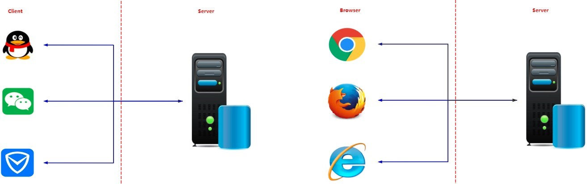

### 1. C / S 结构介绍

​	C / S 是 Client / Server 的简称，C / S 在技能上非常成熟，它的重要特征就是交互性强、拥有安全的存取形式，网络通信数量低、响应速度快、利于处置大量数据。

- 优点：
  1. 优秀的处理能力，很多工作能够在客户端处理后再提交给服务器，减少了服务器端的开销，因此，C / S结构的客户端响应速度快
  2. 操作界面漂亮、形式多样，能够足够满足客户自己的个性化要求
  3. 安全性能能够非常容易确保，能够对权限实行多层次校验，对信息安全的控制能力非常强
- 缺点：
  1. 需要安装客户端程序，分布功能弱
  2. 兼容性差

### 2. B / S 结构介绍

​	B / S 是 Browser / Server 的简称，就是只安装维护一个服务器，而客户端选用浏览器运行软件。B / S 结构应用程序相对于传统的C / S结构应用程序就是一个特别大的进步。B / S 结构的重要特征就是分步性强、维护方便、开发简单并且共享性强、总体拥有费用低

- 优点：
  1. 分布性强，只需有网络、浏览器，能够随时随地实行查询、浏览等业务处理
  2. 业务拓展简单便利，通过添加网页就可以添加服务器功能
  3. 维护简单便利，只需要更改网页，就可以完成全部用户的同步更新
  4. 开发简单，共享性强
- 缺点：
  1. 个性化特征明显减少，没办法完成拥有个性化的功能要求
  2. 在跨浏览器上，B / S 结构不尽如人意
  3. 在速度与安全性上需要花费超大的设计费用


## 第二节 Web服务器

### 1. Web 服务器概念

Web 服务器是可以向发出请求的浏览器提供文档的<font color=red>**程序**</font>，主要提供网上的信息浏览服务

### 2. 常见的Web服务器

-  `IIS` (Micro Soft)
- **Tomcat** (Apache) [重点]
- `WebLogic` (Oracle)
- `webSphere` (IBM)
- `Nginx`
- ...


## 第三节 Tomcat 服务器

Tomcat 是 Apache 软件基金会( Apache Software Foundation) 的 Jakarta 项目中的一个核心项目，由 Apache、Sun和其他一些公司及个人共同开发而成。Tomcat 服务器是一个免费的开放源代码的 Web 应用服务器，在中小型系统和并发访问用户不是很多的场合下被普遍使用，是调试 `JSP` 程序的首选

### 1. Tomcat 目录结构

| 目录       | 说明                                                     |
| ---------- | -------------------------------------------------------- |
| `/bin`     | 存放各种平台下用于启动和停止Tomcat的脚本文件             |
| `/conf`    | 存放Tomcat 服务器的各种配置文件                          |
| `/lib`     | 存放Tomcat 服务器所需的各种 `JAR` 文件                   |
| `/logs`    | 存放Tomcat 的日志文件                                    |
| `/temp`    | Tomcat 运行时用于存放临时文件                            |
| `/webapps` | 当发布Web应用时，默认情况会将Web应用的文件存放于此目录中 |
| `/work`    | Tomcat把由`JSP` 生成的 `Servlet` 存放于此目录下          |

### 2. 部署第一个应用

在 `webapps` 文件夹下创建一个文件夹 `firstApp`，编写一个 `first.html` ，然后放入 `firstApp` 文件夹

`first.html`

```html
<!DOCTYPE html>
<html lang="cn">
	<head>
   		<meta charset="UTF-8">
    	<meta http-equiv="X-UA-Compatible" content="IE=edge">
    	<meta name="viewport" content="width=device-width, initial-scale=1.0">
    	<title>第一个应用</title>
	</head>
	<body>
    	<h1>This Is My First APP!</h1>
	</body>
</html>
```

### 3. 启动 Tomcat 服务器

进入 `bin` 目录，然后双击 `startup.bat` ，启动 Tomcat 服务器

### 4. 访问 Tomcat 服务器

在浏览器地址栏输入网址 http://localhost:8080//firstApp/first.html 进行访问

这个网址有个专业名称，叫做 <font color=red>**统一资源定位符**</font>

统一资源定位符包含了一下三部分

- **协议**

  比如 `http`

- **主机地址**

  localhost 127.0.0.1 都是表示本机，可以用来代替本机的 `IP` 地址

  主机地址包括了主机 `IP` 地址和端口号，比如 `IP` 地址 `localhost`，端口号8080

- **资源地址**

  比如 `/firstApp/first.html`

### 5. 关闭 Tomcat 服务器

进入 `bin` 目录，然后 双击 `shutdown.bat`，关闭 Tomcat 服务器 或者直接关闭  `startup.bat` 启动的终端


## 第四节 Tomcat 配置

### 1. 端口号配置

进入 `conf` 文件夹，找到 `server.xml` 文件，使用文本编辑器打开，找到以下内容

```xml
<Connector port="8080" protocol="HTTP/1.1"
		   connectionTimeout="20000"
		   redirectPort="8443" />
```

<font color=blue>**解释说明:**</font>

- **`port`**

  端口号，默认配置为8080，可修改

- **`protocol`**

  Tomcat 服务器使用协议，默认配置为 `HTTP` 协议，HTTP协议版本为1.1

- **`connectionTimeout`**

  访问 Tomcat 时，连接的超时时间，默认配置为20000毫秒

- **`redirectPort`**

  重定向端口，默认配置8443，主要是针对于访问 Tomcat服务器上的资源时，如果该资源需要使用 `HTTP` 访问，此时，Tomcat 会将这个请求重定向到8443端口

### 2. 资源路径配置

#### 2.1 资源准备

在任一磁盘上 (比如D盘) 创建资源文件夹 actual，然后编写一个 `test.html`，将其放入actual 文件夹中

```xml
<Host name="localhost"  appBase="webapps" unpackWARs="true" autoDeploy="true">
	<Valve className="org.apache.catalina.valves.AccessLogValve" directory="logs"
           prefix="localhost_access_log" suffix=".txt"
           pattern="%h %l %u %t &quot;%r&quot; %s %b" />
</Host>
```

在 `<Host></Host>` 标签对之间添加如下内容

```xml
<Context path="/virtual" docBase="D:/AI/actual" />
```

#### 2.3 访问测试

在浏览器地址栏输入 http://localhost:9000/virtual/test.html 进行访问

> 注：本质是一种映射关系

### 3. web.xml 配置

#### 3.1 会话超时配置

```xml
<session-config>
        <!-- 这里的单位是分钟 -->
	<session-timeout>30</session-timeout>
</session-config>
```

会话指的是用户访问 Tomcat 服务器的有效时间。比如，当用户登录某网站后，30分钟内没，没有进行任何操作，此时，用户与该网站的会话已经超时。如果再进行页面操作，那么服务器将提示用户重新登录

#### 3.2 欢迎页配置

```xml
<welcome-file-list>
	<welcome-file>index.html</welcome-file>
    <welcome-file>index.htm</welcome-file>
    <welcome-file>index.jsp</welcome-file>
</welcome-file-list>
```

所谓的欢迎页就是当用户访问 Tomcat 服务器资源时，没有任何资源进行定位，此时，Tomcat 将使用配置的欢迎页进行展示

向web.xml文件中加入

```xml
    <welcome-file-list>
            <welcome-file>index.jsp</welcome-file>
    </welcome-file-list>
```


工程中的web.xml优先级要高于tomcat 服务器 conf 文件夹下的web.xml

这里的优先级高指的是相同的配置情况下，工程的web.xml配置生效

此时的配置就会讲 conf 文件夹下的web.xml中的该配置覆盖


## 第五节 初始 `JSP`

### 1. `JSP` 概念

`JSP` 是 Java Server Pages 的简称，意为 Java 服务器页面。其支持 Java 代码与 HTML 代码混合使用来完成页面的编写。

### 2. `JSP` page 指令

<font color=blue>语法：</font>

```jsp
<%@ page 属性名="属性值" [属性名="属性值" 属性名="属性值"]%>
```

<font color=blue>常用属性：</font>

| 属性        | 描述                                 | 默认值                      |
| ----------- | ------------------------------------ | --------------------------- |
| language    | 指定 `JSP` 页面使用的脚本语言        | Java                        |
| import      | 通过该属性来引用脚本语言中使用到的类 | 无                          |
| contentType | 用来执行 `JSP` 页面所采用的编码方式  | text/html ; chatset = UTF-8 |


### 3. `JSP` 小脚本

<font color=blue>小脚本代码的定义语法：</font>

```jsp
<%
//小脚本代码
%>
```

<font color=blue>小脚本代码的定义语法：</font>

```jsp
<%
//小脚本方法
%>
```

<font color=blue>小脚本变量的定义语法：</font>

```jsp
<%= 变量名或者表达式 %>
```

<font color=blue>示例：</font>

```jsp
你好，今天是
<%
SimpleDateFormat sdf = new SimpleDateFormat("yyyy-MM-dd"); String currentTime = sdf.format(new Date());
%>
<%!
	String date2Str(Date date){
		SimpleDateFormat sdf = new SimpleDateFormat("yyyy-MM-dd");
		return sdf.format(date);
	}
%>
<%= currentTime %>
<%= date2Str(new Date()) %>
<%
	String[] names = {"枫阿雨", "雨阿枫", "阿枫雨"};
%>
<%
	for(String name : names){//循环内容被拆开
%>
<div>
	<%=name%>
</div>
<%
    }
%>
```


### 4. `JSP` 的交互流程

`JSP` 文件在第一次被访问时会被翻译成 java文件，然后被编译为 class文件才能被执行，编译好的class文件可以被重用

---


# 第二章 `JSP` 数据传递

## 第一节 `JSP` 内置对象

### 1. `JSP` 内置对象的概念

`JSP` 内置对象是 Web 容器创建的一组对象，在页面中可以直接使用。 `JSP` 常用内置对象入下图所示：

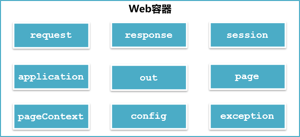

### 2. 内置对象 out

#### 2.1 out 对象的数据类型

`javax.servlet.jsp.JspWriter`

#### 2.2 out 对象的作用

<font color=red> **向Web浏览器内输出信息，负责管理对客户端的输出**</font>

#### 2.3 out 对象的用法

```jsp
<%
	//在界面上输出Hello JSP
	out.println("Hello JSP");
%>
```

### 3. 内置对象 request

#### 3.1 request 对象的数据类型

`javax.servlet.http.HttpServletRequest`

#### 3.2 request 对象的作用

获取客户端的参数和数据流

#### 3.3 request 对象的常用方法

```java
//根据表单组件名称获取提交数据  
String getParameter(String name);
//获取表单组件对应多个值时的请求数据
String[] getParameterValues(String name);
//指定请求的编码
void setCharacterEncoding(String charset);
//返回一个RequestDispatcher对象，该对象的forward()方法用于转发请求
RequestDispatcher getRequestDispatcher(String  path);
//获取客户端cookie  
Cookie[] getCookies();
//获取请求中所有参数和参数值的映射  
Map<String,String[]> getParameterMap();
//获取当前会话
HttpSession getSession();
```


#### 3.4 request 案例

使用内置对象 request 完成注册信息显示

`register.jsp`

```jsp
<form action="info.jsp" method="post">
  <div>
    <span>用户名</span>
    <input type="text" name="username">
  </div>
  <div>
    <span>密码</span>
    <input type="password" name="password">
  </div>
  <div>
    <span>信息来源</span>
    <input type="checkbox" name="channel" value="报刊">报刊
    <input type="checkbox" name="channel" value="网络">网络
    <input type="checkbox" name="channel" value="朋友推荐">朋友推荐
    <input type="checkbox" name="channel" value="电视">电视
  </div>
  <div>
    <input type="submit" value="注册">
    <input type="submit" value="重置">
  </div>
</form>
```

`info.jsp`

```jsp
<%
    //从请求中获取参数username的值
    String username = request.getParameter("username");
    String password = request.getParameter("password");
    //因为前端传输的数据是一个数组所以要使用数组接收
    String[] channels = request.getParameterValues("channel");
%>
<div><%=username%></div>
<div><%=password%></div>
<div><%=Arrays.toString(channels)%></div>
```

访问 `register.jsp` ，然后点击 注册 按钮，跳转后的页面中显示呈现乱码，如何解决呢？在小脚本的第一行代码前面添加如下代码：

```java
//在从请求中获取参数值之前，先对该请求的字符集编码进行设置
request.setCharacterEncoding("UTF-8");
```

再次测试，显示正常。但如果将 `form` 表单的提交方式修改为 `get` ，再测试，又出现了乱码，这如何解释呢？
这是因为 `request.setCharacterEncoding("UTF-8");` 只能解决 `post` 请求方式的出现的乱码，而 `get` 请求方式的乱码需要使用字符串转码的方式来解决。

```java
//使用字符串的构造方法进行转码
new String(字符串.getBytes("ISO-8859-1"), "UTF-8");
```

#### 3.5 GET 和 POST 请求的区别

- GET 请求的参数在URL中，而 POST 请求的参数在请求体（body） 中
- GET 请求有数据长度限制，这个长度限制是浏览器或者服务器为了提升处理效率而做出的限制，而POST 请求没有。
- GET 请求的安全性低，因为参数在URL中，直接暴露了信息，而 POST 请求的安全性高，因为 
- POST 请求的参数在请求体（body） 中，隐藏了信息

### 4. 内置对象 response

#### 3.1 response 对象的数据类型

`javax.servlet.http.HttpServletResponse`

#### 3.2 response 对象的作用

<font color=red>**对客户端请求做出响应**</font>

#### 3.3 response 对象的常用方法

```java
//添加cookie
void addCookie(Cookie c);
//重新定位新的资源，也叫重定向
void sendRedirect(String url);
//设置响应状态码
void setStatus(int status);
//获取打印流，主要用于向页面传输数据
PrintWriter getWriter();
//获取输出流，主要用于图片传输、下载等功能
ServletOutputStream getOutputStream();
//设置向页面输出的数据的字符集编码
void setCharacterEncoding(String charset);
```

#### 3.4 response 案例

实现登录页面跳转功能，并在跳转的页面中显示登录信息
`login.jsp`

```jsp
<form action="process.jsp" method="post">
    <div><span>用户名</span><input type="text" name="username"></div>
    <div><span>密码</span><input type="password" name="password"></div>
    <div>
        <input type="submit" value="登录">
    </div>
</form>
```

`process.jsp`

```jsp
<%@ page contentType="text/html;charset=UTF-8" language="java" %>
<%
  //获取参数username的值
  String username = request.getParameter("username");
  //获取参数password的值
  String password = request.getParameter("password");
  if ("admin".equals(username) && "123456".equals(password)){
    //页面重定向至主页面
    response.sendRedirect("main.jsp");
  }
%>
```

`main.jsp`

```jsp
<%@ page contentType="text/html;charset=UTF-8" language="java" %>
<%
    String username = request.getParameter("username");
    String password = request.getParameter("password");
%>
<div>用户名: <%=username%></div>
<div>密码: <%=password%></div>
```

访问 `login.jsp` ，然后点击 `登录` 按钮，查看地址栏信息与页面信息。**地址栏信息发生了变化，说明：**
**重定向发生在客户端，相当于客户端再发了一次请求，重新定位了新的资源。由于这次请求是新的请求，与之前的登录请求完全独立，因此页面信息中展示全是null**

<font color=blue>思考：</font>如何才能将登录信息在跳转的页面中显示呢？

可以通过请求转发来实现，修改 `process.jsp`

```jsp
<%@ page contentType="text/html;charset=UTF-8" language="java" %>
<%
  //获取参数username的值
  String username = request.getParameter("username");
  //获取参数password的值
  String password = request.getParameter("password");
  if ("admin".equals(username) && "123456".equals(password)){

    //从请求中获取一个请求转发的对象，既然是转发请求，那么上一次请求的信息，转发的对象也应该清楚
    //因此可以从转发的新的请求中获取上一次请求的参数
    RequestDispatcher dispatcher = request.getRequestDispatcher("main.jsp");
    dispatcher.forward(request, response);
  }
%>
```

访问 `login.jsp` ，然后点击 `登录` 按钮，查看地址栏信息与页面信息。**地址栏信息未发生变化，而页面进行了跳转，说明转发发生在服务器，由服务器完成。转发后，页面能够展示登录信息，说明转发可以共享请求的参数**

### 5. 内置对象 session 

#### 5.1 session 对象的概念

<font color=red>**session 就是浏览器与服务器之间的一次通话**</font>

HTTP 协议是一种无状态协议，用户在访问服务器时，服务器无法感知到用户是哪一个用户，也就无法追踪用户的后续操作。为了解决这一问题，服务器端设计了一个类 `HttpSession` 来感知用户，这个类产生的对象就是 session。在用户第一次访问服务器时，服务器就会为该用户生成了一个 session 对象，session 对象一产生就会生成了一个唯一标识符 `JSESSIONID`， 并将这个唯一标识符使用Cookie存储在浏览器中，用户后续进行的每一个操作都将携带这个唯一标识符，服务器就根据这个唯一标识符追踪用户。session 对象产生时就有一个过期时间，主要用于检测用户是否还在进行有效的操作。如果用户具有有效的操作，那么每一次用户的有效操作都将重置该session的过期时间。这个过期时间就是检测用户登录超时的依据。除此之外，session 还可以存储数据。

#### 5.2 session 对象的数据类型

`javax.servlet.http.HttpSession`

#### 5.3 response 对象的常用方法

```java
//以key/value的形式保存对象值
void setAttribute(String key, Object value);
//通过key获取对象值
Object getAttribute(String key);
//设置session对象失效
void invalidate();
// 获取sessionid
String getId();
//设定session的非活动时间
void setMaxInactiveInterval(int interval);
//获取session的有效非活动时间(以秒为单位)
int getMaxInactiveInterval();
//从session中删除指定名称(key)所对应的对象
void removeAttribute(String key);
```

#### 5.4 response 案例

使用 session 完成登录成功后页面显示登录信息，要求登录处理使用重定向。
`process.jsp`

```jsp
<%
  //获取参数username的值
  String username = request.getParameter("username");
  //获取参数password的值
  String password = request.getParameter("password");
  if ("admin".equals(username) && "123456".equals(password)){
    //讲用户名和密码存储在session中，因为session是针对用户来的，
    //因此只有用户本人能够获取自己存储的数据
    session.setAttribute("username", username);
    session.setAttribute("password", password);
    //页面重定向至主页面
    response.sendRedirect("main.jsp");
  }
%>
```

`main.jsp`

```jsp
<%
    String username = (String) session.getAttribute("username");
    String password = (String) session.getAttribute("password");
    String sessionId = session.getId();
%>
<div>response的数据类型: <%=response.getClass().getName()%></div>
<div>session的数据类型: <%=session.getClass().getName()%></div>
<div>sessionId: <%=sessionId%></div>
<div>用户名: <%=username%></div>
<div>密码: <%=password%></div>
```

#### 5.5 include 指令

```jsp
<!-- 语法 -->
<%@ include file="文件名"%>
```

在开发过程中，开发的页面数量总是很多，如何确保用户的每一次操作都是有效操作呢？所谓的有效操作是指在登录没有超时的情况下进行的操作。

可以编写一个检测登录超时的页面，然后使用 include 指令引入至每一个页面中
`timeout.jsp`

```jsp
<%
    String user = (String) session.getAttribute("username");
    //为空说明登陆超时，因为session超时了，session会被回收掉session里面存储的数据都没有了
    //用户又发起了请求，此时服务器端发现浏览器传来的JSESSIONID不存在，就重新为该用户创建一个
    //新的session，就然是新的session，当然就没有之前存储的数据了，由此来判断session已经超时
    if (user == null) {
        response.sendRedirect("login.jsp");
    }
%>
```

`process.jsp`

```java
session.setMaxInactiveInterval(5);
```

`main.jsp`

```jsp
<%@include file="timeout.jsp"%>
```

#### 5.6 session 超时设置

- **第一种方式：** Tomcat 中的 `web.xml`

```xml
<session-config>
	<!-- 单位：分钟 -->
	<session-timeout>30</session-timeout>
</session-config>
```

- **第二种方式：** 工程中的 `web.xm`l

```xml
<session-config>
	<!-- 单位：分钟 -->
	<session-timeout>30</session-timeout>
</session-config>
```

- **第三种方式：** Java 代码实现

```java
//设置会话超时时间，单位：秒
session.setMaxInactiveInterval(15 * 60);
```


### 6. 内置对象 application 

#### 3.1 application 对象的数据类型

`javax.servlet.ServletContext`

#### 3.2 application 对象的作用

<font color=red>**实现用户数据共享，将信息保存在服务器中，直到服务器关闭**</font>

#### 3.3 application 对象的常用方法

```java
// 以key/value的形式保存对象值
void setAttribute(String key,Object value);
//通过key获取对象值
Object getAttribute(String  key);
//返回相对路径的真实路径
String getRealPath(String  path);
```

#### 3.4 application 案例

统计网站访问次数
`statistics.jsp`

```jsp
<%
    Integer count = (Integer) application.getAttribute("count");
    if (count == null) {
        //这行代码表示这是第一个用户访问
        count = 1;
    } else {
        count += 1;
    }
    application.setAttribute("count", count);
%>
<body>
<div><%=application.getClass().getName()%></div>
<div>网站访问次数: <%=count%></div>
```

启动服务器，然后访问测试


## 第二节 Cookie

### 1. 什么是 Cookie

Cookie 是 Web 服务器保存在客户端的一系列文本信息。Session 机制采用的是在服务端保持状态的方案，而Cookie 机制则是在客户端保持状态的方案，Cookie 又叫会话跟踪机制，用来弥补HTTP无状态协议的不足

### 2. Cookie 的作用

- 弥补HTTP无状态协议的不足
- 简化登录，比如记住密码、自动登录等

### 3. Cookie 的常用方法

```java
//构造方法
Cookie cookie = new Cookie("名称", "值");
//设置cooki的有效期，以秒为单位
void setMaxAge(int expiry);
//在cookie创建后，对cookie进行赋值
void setValue(String value);
//获取cookie的名称
String getName();
//获取cookie的值
String getValue();
//获取cookie的有效时间，以秒为单位
String getMaxAge();
```

### 4. Cookie 案例

使用 Cookie 完成记住账号和密码功能

`login.jsp`

```jsp
<%@ page contentType="text/html;charset=UTF-8" language="java" %>
<html>
<head>
    <title>login</title>
</head>
<%
    String username = "", password = "";
    boolean rememberMe = false;
    //从请求中获取cookie信息
    Cookie[] cookies = request.getCookies();
    if (cookies != null) {
        for (Cookie cookie : cookies) {
            String name = cookie.getName();
            if ("username".equals(name)){
                username = cookie.getValue();
            }else if ("password".equals(name)){
                password = cookie.getValue();
            }else if ("remeberMe".equals(name)){
                rememberMe = "on".equals(cookie.getValue());
            }
        }
    }
%>
<body>
<form action="process.jsp" method="post">
    <div>
        <span>用户名</span><input type="text" name="username" value="<%=username%>">
    </div>
    <div>
        <span>密码</span><input type="password" name="password" value="<%=password%>">
    </div>
    <div>
        <input type="checkbox" name="rememberMe" <%=rememberMe ? "checked": ""%>>记住密码
    </div>
    <div>
        <input type="submit" value="登录">
    </div>
</form>
</body>
</html>
```

`process.jsp`

```jsp
<%@ page contentType="text/html;charset=UTF-8" language="java" %>
<%
    //获取参数username的值
    String username = request.getParameter("username");
    //获取参数password的值
    String password = request.getParameter("password");
    String rememberMe = request.getParameter("rememberMe");
    if ("admin".equals(username) && "123456".equals(password)) {
        session.setAttribute("username", username);
        session.setAttribute("password", password);
        //只有登录成功且勾选了记住密码的情况下才记住密码
        if (!"on".equals(rememberMe)) {
            username = "";
            password = "";
            rememberMe = "";
            //记住密码是属于服务器端对用户操作的一种响应，这个响应就是使用cookie来存储账号和密码的
        }
        Cookie usernameCookie = new Cookie("username", username);
        Cookie passwordCookie = new Cookie("password", password);
        Cookie rememberMeCookie = new Cookie("rememberMe", rememberMe);
        response.addCookie(usernameCookie);
        response.addCookie(passwordCookie);
        response.addCookie(rememberMeCookie);
        //页面重定向至主页面
        response.sendRedirect("main.jsp");
    }
%>
```

`main.jsp`

```jsp
<%@ page contentType="text/html;charset=UTF-8" language="java" %>
<%
    String username = (String) session.getAttribute("username");
    String password = (String) session.getAttribute("password");
    String sessionId = session.getId();
%>
<div>response的数据类型: <%=response.getClass().getName()%></div>
<div>session的数据类型: <%=session.getClass().getName()%></div>
<div>sessionId: <%=sessionId%></div>
<div>用户名: <%=username%></div>
<div>密码: <%=password%></div>
```

---


# 第三章 Servlet 与 MVC

## 第一节 Servlet

### 1. Servlet 概念

Servlet 是在服务器上运行的能够对客户端请求进行处理，并返回处理结果的程序

### 2. Servlet 体系结构

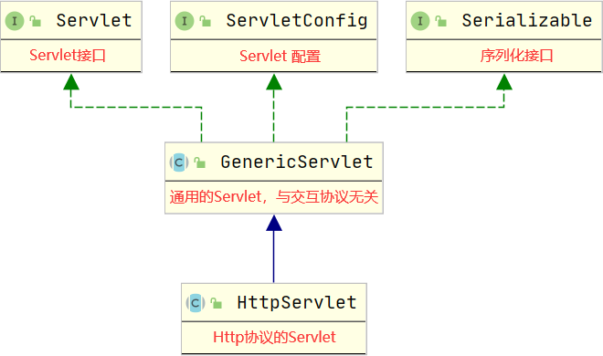

#### 2.1 Servlet 接口

```java
//Servlet对象的初始化，Servlet 对象初始化后才能处理请求，由 Servlet 容器调用
public void init(ServletConfig config) throws ServletException;
//获取Servlet配置信息
public ServletConfig getServletConfig();
//处理客户端的请求，由 Servlet 容器调用
public void service(ServletRequest req, ServletResponse res)
   throws ServletException, IOException;
//返回有关 Servlet 的信息，比如作者、版本和版权
public String getServletInfo();
//销毁Servlet，由 Servlet 容器调用
public void destroy();
```

#### 2.2 ServletConfig 接口

```java
//获取Servlet的实例名称
public String getServletName();
//返回正在执行的Servlet所在的上下文对象
public ServletContext getServletContext();
//获取Servlet中给定名称的初始化参数
public String getInitParameter(String name);
//获取Servlet中所有的初始化参数
public Enumeration<String> getInitParameterNames();
```

#### 2.3 Servlet 案例

- 编写Servlet `FirstServlet.java`

  ```java
  package com.example.webtest;
  
  
  import javax.servlet.*;
  import java.io.IOException;
  import java.util.Enumeration;
  
  /**
   * @author ：枫阿雨
   * @description：TODO
   * @date ：2022-02-02 22:30
   */
  
  public class FirstServlet implements Servlet {
  
      private ServletConfig servletConfig;
  
      //Servlet实例在该Servlet处理的第一次请求的时候才会创建，
      // 创建之后立刻调用初始化方法完成Servlet的齿梳化
      public FirstServlet(){
          System.out.println("创建Servlet实例");
      }
  
      //Servlet初始化，只有初始化完成的Servlet才能够提供处理请求的服务
      //init 方法在该Servlet对象第一次处理请求的时候才调用
      @Override
      public void init(ServletConfig servletConfig) throws ServletException {
          this.servletConfig = servletConfig;
          Enumeration<String> initParameterNames = servletConfig.getInitParameterNames();
          while (initParameterNames.hasMoreElements()){
              //下一个参数名
              String parameterName = initParameterNames.nextElement();
              //获取给定参数名称的参数值
              String parameterValue = servletConfig.getInitParameter(parameterName);
              System.out.println(parameterName + "=>" + parameterValue);
          }
          System.out.println("Servlet 初始化完成");
      }
  
      //获取Servlet配置
      @Override
      public ServletConfig getServletConfig() {
          return servletConfig;
      }
  
      //处理请求的服务方法
      @Override
      public void service(ServletRequest servletRequest, ServletResponse servletResponse) throws ServletException, IOException {
          System.out.println("Servlet处理请求并做出响应");
      }
  
  
      @Override
      public String getServletInfo() {
          return "";
      }
  
      //Servlet 销毁不再提供服务
      @Override
      public void destroy() {
          System.out.println("Servlet销毁，不再提供服务");
      }
  }
  
  ```

- 配置 `web.xml`

  ```xml
  <?xml version="1.0" encoding="UTF-8"?>
  <web-app xmlns="http://xmlns.jcp.org/xml/ns/javaee"
           xmlns:xsi="http://www.w3.org/2001/XMLSchema-instance"
           xsi:schemaLocation="http://xmlns.jcp.org/xml/ns/javaee http://xmlns.jcp.org/xml/ns/javaee/web-app_4_0.xsd"
           version="4.0">
  
      <!--Servlet配置-->
      <servlet>
          <!--给Servlet取一个名字-->
          <servlet-name>firstServlet</servlet-name>
          <!--Servlet类型配置-->
          <servlet-class>com.example.webtest.FirstServlet</servlet-class>
          <init-param>
              <!--初始化参数的名称-->
              <param-name>characterEncoding</param-name>
              <!--初始化参数的值-->
              <param-value>UTF-8</param-value>
          </init-param>
          <init-param>
              <param-name>secondParameter</param-name>
              <param-value>2</param-value>
          </init-param>
      </servlet>
  
      <!--Servlet请求匹配配置-->
      <servlet-mapping>
          <servlet-name>firstServlet</servlet-name>
          <!--Servlet处理的请求的URL-->
          <url-pattern>/first</url-pattern>
      </servlet-mapping>
  </web-app>
  ```

- 启动服务器，打开Servlet处理的请求的URL，查看控制台信息

  可以发现控制台打印信息中并没有打印 "Servlet 销毁" 信息

  **由此可以得出：Servlet 处理完了请求后，并没有销毁**

- 关闭服务器，查看控制台信息

  可以发现控制台打印了 "Servlet 销毁" 信息

  **由此可以得出：在 Tomcat 关闭之前，Servlet 被销毁**

- **<font color=red>结论：</font>**

  Servlet 在第一次接收请求时，由容器（如 Tomcat）创建实例，紧接着就由容器调用该 Servlet 的 `init `方法完成初始化，然后由容器调用该 Servlet 的 `service` 方法进行请求处理，请求处理完成后，Servlet 并不会消亡， 而是跟随容器共存亡，在容器关闭之前，由容器调用 Servlet 的 `destroy` 方法进行销毁

- **`JSP` 本质**

`.jsp` 文件会先被翻译成 `.java` 文件，随后编译为 `.class` 文件

查看翻译的 `.java` 文件，可以发现继承了 `HttpJspBase` 查看继承关系会发现其最终仍是继承自 `Servlet`

```java
package org.apache.jsp;
import javax.servlet.*;
import javax.servlet.http.*;
import javax.servlet.jsp.*;
public final class index_jsp extends org.apache.jasper.runtime.HttpJspBase
     implements org.apache.jasper.runtime.JspSourceDependent,
 				org.apache.jasper.runtime.JspSourceImports {
                    ...
                }
```

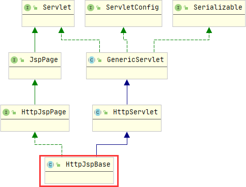

由此可以得出：<font color=red>**JSP 的本质就是Servlet，只是 JSP 注重的是页面内容的展示，而Servlet注重的是逻辑的处理。**</font>

### 3. 请求处理与响应

#### 3.1 体系结构

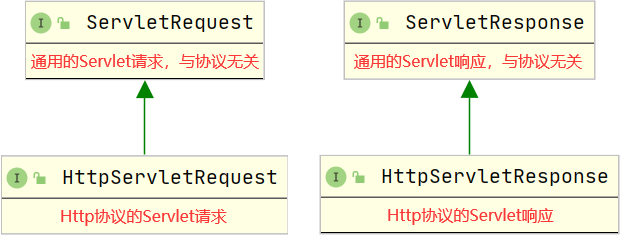

#### 3.2 请求接口

- ServletRequest 接口常用方法

  ```java
  //从请求中获取给定属性名对应的属性值
  Object getAttribute(String attributeName);
  //将给定的属性值以给定的属性名存储在请求中
  void setAttribute(String attributeName, Object attributeVaue);
  //从请求中将给定的属性名移除
  void removeAttribute(String attributeName);
  //获取请求中存储的所有属性名
  Enumeration<String> getAttributeNames();
  //从请求中获取给定参数名对应的参数值（参数值是单个数据）
  String getParameter(String parameterName);
  //从请求中获取给定参数名对应的参数值（参数值是多个数据）
  String[] getParameterValues(String parameterName);
  //从请求中获取所有的参数名
  Enumeration<String> getParameterNames();
  //从请求中获取所有的参数名和参数值形成的映射
  Map<String, String[]> getParameterMap();
  //从请求中获取字符集编码
  String getCharacterEncoding();
  //设置请求的字符集编码
  void setCharacterEncoding(String charset) throws UnsupportedEncodingException;
  //从请求中获取字符流，该字符流只能读取请求体中的数据信息，与下面的 getInputStream 方法只能二选一
  BufferedReader getReader() throws IOException;
  //从请求中获取字节流，该字节流只能读取请求体中的数据信息
  ServletInputStream getInputStream() throws IOException;
  //从请求中获取当前Servlet所在的上下文对象
  ServletContext getServletContext();
  //从请求中获取请求转发的对象
  RequestDispatcher getRequestDispatcher(String path);
  ```

- 用法

  ```java
  @Override
  public void service(ServletRequest servletRequest, ServletResponse servletResponse) throws ServletException, IOException {
  	System.out.println("请求的字符集编码需要在读取请求信息之前进行设置，否则，设置的字符集编码格式将不生效");
      System.out.println("请求字符集编码：" + servletRequest.getCharacterEncoding());
  	servletRequest.setCharacterEncoding("UTF-8");
  	System.out.println("请求字符集编码：" + servletRequest.getCharacterEncoding());
      BufferedReader reader = servletRequest.getReader();  System.out.println("开始读取请求参数信息");
   	String line;
   	while ((line = reader.readLine()) != null){
      	System.out.println(line);
  	}
   	System.out.println("请求参数信息读取完毕");  System.out.println("================");  					System.out.println("开始获取请求中存储的数据");
      Enumeration<String> attributeNames = servletRequest.getAttributeNames();
      while (attributeNames.hasMoreElements()){
      	String attributeName = attributeNames.nextElement();
  		Object attributeValue = servletRequest.getAttribute(attributeName);  									System.out.println(attributeName + " => " + attributeValue);
  	}
   	System.out.println("请求中存储的数据获取完毕");
   	System.out.println("================");
   	System.out.println("方式一：开始获取请求参数信息");
   	Enumeration<String> parameterNames = servletRequest.getParameterNames();
      while (parameterNames.hasMoreElements()){
      	String parameterName = parameterNames.nextElement();
   		String parameterValue = servletRequest.getParameter(parameterName);  									System.out.println(parameterName + " => " + parameterValue);
  	}
   	System.out.println("方式一：请求参数信息获取完毕");
   	System.out.println("================");
   	System.out.println("方式二：开始获取请求参数信息");
   	Map<String, String[]> parameterMap = servletRequest.getParameterMap();
      parameterMap.forEach((k, values) -> System.out.println(k + " => " + Arrays.toString(values)));
      System.out.println("方式二：请求参数信息获取完毕");
      System.out.println("请求所使用的上下文路径：" + servletRequest.getServletContext().getContextPath());
  }
  ```

- POST 请求测试

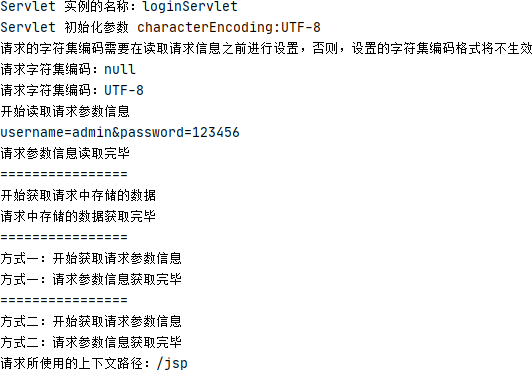

- GET 请求测试

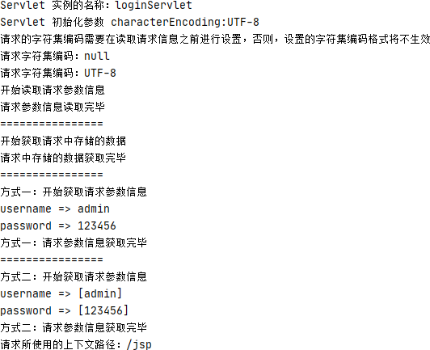

- 结论

  <font color=red>**使用GET方式发送的请求，只能通过getParameter 方法获取；使用POST方式发送的请求，只能使用流来获取。**这是因为使用GET方式发送的请求，参数在URL地址中，解析这些参数的时候将其存放在一个Map集合中，因此可以直接获取。而POS方式发送的请求，参数在请求体中，这部分内容只能通过流来读取，然后再进行处理。</font>

#### 3.3 响应接口

- ServletResponse 接口常用方法

  ```java
  //获取响应的字符集编码
  String getCharacterEncoding();
  //设置响应的字符集编码
  void setCharacterEncoding(String charset);
  //获取响应的内容类型
  String getContentType();
  //设置响应的内容类型
  void setContentType(String contentType);
  //获取输出流，主要用于下载文件
  ServletOutputStream getOutputStream() throws IOException; //获取打印流，主要用于向页面传输信息
  PrintWriter getWriter() throws IOException;
  ```

- 用法（在 service 方法最后追加如下代码）

  ```java
  System.out.println();
  System.out.println();
  System.out.println("==========================================="); System.out.println("响应的字符集编码：" + 
  servletResponse.getCharacterEncoding());
  servletResponse.setCharacterEncoding("UTF-8");
  System.out.println("响应的字符集编码：" + 
  servletResponse.getCharacterEncoding());
  System.out.println("响应的内容类型：" + servletResponse.getContentType()); servletResponse.setContentType("text/html;charset=utf-8");
  System.out.println("响应的内容类型：" + servletResponse.getContentType()); PrintWriter writer = servletResponse.getWriter();
  writer.print("登录请求已处理");
  writer.flush();
  writer.close();
  ```

- 测试

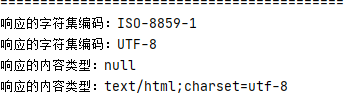

#### 3.4 HTTP 请求和响应

- HttpServletRequest 接口常用方法

  ```java
  //从请求中获取Cookie信息
  Cookie[] getCookies();
  //从请求中获取给定请求头名称对应的属性值
  String getHeader(String headerName);
  //从请求中获取所有的请求头名称
  Enumeration<String> getHeaderNames();
  //获取请求的方式：GET、POST、PUT、DELETE等
  String getMethod();
  //从请求中获取上下文路径
  String getContextPath();
  //从请求中获取session
  HttpSession getSession();
  //获取请求地址
  String getRequestURI();
  ```

- HttpServletResponse 接口常用方法

  ```java
  //添加客户端存储的Cookie信息
  void addCookie(Cookie cookie);
  //返回错误状态及错误信息
  void sendError(int status, String errorMsg) throws IOException; 
  //返回错误状态
  void sendError(int status) throws IOException;
  //重定向至新的资源
  void sendRedirect(String redirectURL) throws IOException;
  //设置响应头信息
  void setHeader(String headerName, String headerValue);
  //添加响应头信息
  void addHeader(String headerName, String headerValue);
  //设置响应状态
  void setStatus(int status);
  ```

- HttpServlet 常用方法（支持 HTTP 协议的 Servlet）

  ```java
  //对父类抽象方法的实现，该方法是对HTTP协议的交互信息的实现，调用的是下面的 service 方法
  void service(ServletRequest req,ServletResponse res);
  //HTTP协议的交互信息的实现，该方法主要针对不同的请求方式进行处理。GET请求会调用 doGet 方法处理，
  //POST请求会调用 doPost 处理， PUT请求会调用 doPut 方法处理， DELETE请求会调用 doDelete 方法处理 
  void service(HttpServletRequest  req, HttpServletResponseres);
  //GET请求处理
  void doGet(HttpServletRequestreq,HttpServletResponse res);
  //POST请求处理
  void doPost(HttpServletRequestreq,HttpServletResponse res);
  //PUT请求处理
  void doPut(HttpServletRequestreq,HttpServletResponse res);
  //DELETE请求处理
  void doDelete(HttpServletRequestreq,HttpServletResponse res);
  ```

- 用法

  `secondServlet.java`

  ```java
  public class SecondServlet extends HttpServlet {
  
      @Override
      protected void doPost(HttpServletRequest req, HttpServletResponse resp) throws ServletException, IOException {
          System.out.println("读取请求头部信息...");
          Enumeration<String> headerNames = req.getHeaderNames();
          while (headerNames.hasMoreElements()){
              String headerName = headerNames.nextElement();
              String headerValue = req.getHeader(headerName);
              System.out.println(headerName + "=>" + headerValue);
          }
          System.out.println("=======================");
          //获取上下文路径
          String contextPath = req.getContextPath();
          System.out.println("上下文路径" + contextPath);
          //包含上下文路径在内的请求地址
          String requestURI = req.getRequestURI();
          requestURI = requestURI.replace(contextPath, "");
          System.out.println("当前请求路径:" + requestURI);
          System.out.println();
  
          System.out.println("开始做出响应");
          resp.setCharacterEncoding("UTF-8");
          resp.setContentType("text/html;charset=UTF-8");
          PrintWriter writer = resp.getWriter();
          writer.println("请求已处理");
          writer.flush();
          writer.close();
      }
  }
  ```

  `second.jsp`

  ```jsp
  <%@ page import="java.util.Date" %>
  <%@ page import="java.text.SimpleDateFormat" %>
  <%@ page contentType="text/html; charset=UTF-8" pageEncoding="UTF-8" %>
  <!DOCTYPE html>
  <html>
  <head>
      <title>JSP - Hello World</title>
  </head>
  <body>
  <form action="second" method="post">
      <div>
          <input type="text" name="username">
      </div>
      <div>
          <input type="text" name="sex">
      </div>
      <div>
          <input type="submit" value="测试">
      </div>
  </form>
  </body>
  </html>
  ```

  

  `web.xml`

  ```xml
  ...
      <servlet>
          <servlet-name>secondServlet</servlet-name>
          <servlet-class>com.example.webtest.SecondServlet</servlet-class>
      </servlet>
  
      <servlet-mapping>
          <servlet-name>secondServlet</servlet-name>
          <url-pattern>/second</url-pattern>
      </servlet-mapping>
  ```

  

#### 3.5 Servlet 交互流程

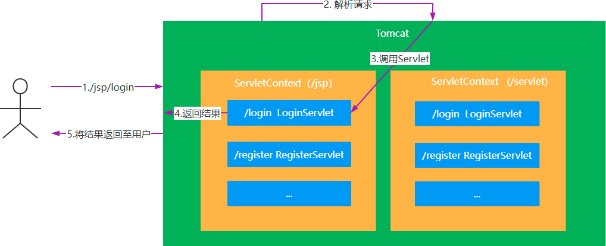

### 4. ServletContext

#### 4.1 常用方法

```java
//获取上下文参数
String getContextPath();
//获取给定相对路径对应的绝对路径
String getRealPath(String path);
//获取上下文初始化参数中给定参数名对应的参数值
String getInitParameter(String parameterName);
//获取上下文初始化参数中所有的参数名
Enumeration<String> getInitParameterNames();
//获取上下文存储的数据中给定属性名对应的属性值
Object getAttribute(String attributeName);
//获取上下文存储的数据中所有的属性名
Enumeration<String> getAttributeNames();
//将给定的属性值使用给定的属性名存储在上下文中
void setAttribute(String attributeName, Object attributeValue);
//从上下文存储的数据中将给定的属性名移出
void removeAttribute(String attributeName);
```

#### 4.2 用法

`secondServlet.jsp`

```java
    ...
	@Override
    public void init(ServletConfig config) throws ServletException {
        ServletContext servletContext = config.getServletContext();
        Enumeration<String> initParameterNames = servletContext.getInitParameterNames();
        while (initParameterNames.hasMoreElements()){
            String parameterName = initParameterNames.nextElement();
            String parameterValue = servletContext.getInitParameter(parameterName);
            System.out.println(parameterName + "=>" + parameterValue);
        }
    }
```

`web.xml`

```xml
...
	<context-param>
        <param-name>name</param-name>
        <param-value>枫阿雨</param-value>
    </context-param>
...
```


## 第二节 MVC

### 1. 什么是MVC

模型-视图-控制器（MVC模式）是一种非常经典的软件架构模式，在UI框架和UI设计思路中扮演着非常重要的角色。从设计模式的角度来看，MVC模式是一种复合模式，它将多个设计模式在一种解决方案中结合起来，用来解决许多设计问题。MVC模式把用户界面交互分拆到不同的三种角色中，使应用程序被分成三个核心部件：Model（模型）、View（视图）、Control（控制器） 

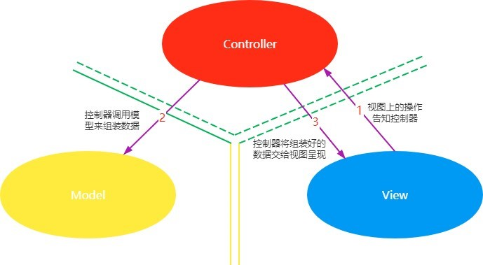

- 模型：模型持有所有的数据、状态和程序逻辑。模型独立于视图和控制器。
- 视图：用来呈现模型。视图通常直接从模型中取得它需要显示的状态与数据。对于相同的信息可以有多个不同的显示形式或视图。
- 控制器：位于视图和模型中间，负责接受用户的输入，将输入进行解析并反馈给模型

MVC模式将它们分离以提高系统的灵活性和复用性，不使用MVC模式，用户界面设计往往将这些对象混在一起。MVC模式实现了模型和视图的分离，使得其具有以下优点：

- **一个模型提供不同的多个视图表现形式，也能够为一个模型创建新的视图而无须重写模型。一旦模型的数据发生变化，模型将通知有关的视图，每个视图相应地刷新自己。**
- **模型可复用。因为模型是独立于视图的，所以可以把一个模型独立地移植到新的平台工作。**
- **提高开发效率。在开发界面显示部分时，仅仅需要考虑的是如何布局一个好的用户界面；开发模型时，仅仅要考虑的是业务逻辑和数据维护，这样能使开发者专注于某一方面的开发，提高开发效率。**

### 2. JSP 中的 MVC

**在 JSP 中 Servlet 扮演的是控制器， JSP 页面扮演的是视图，Java Bean 扮演的是模型。**

<font color=blue>案例：</font>将用户信息呈现在页面上

- 编写视图 `user.jsp`

  ```jsp
  <%@ page contentType="text/html;charset=UTF-8" language="java" %>
  <html>
  <head>
      <title>显示用户信息</title>
  </head>
  <body>
  	<a href="showUserInfo">显示用户信息</a>
  </body>
  </html>
  ```

- 编写模型 `User.java`

  ```java
  public class User {
      private String name;
  
      private String sex;
  
      private int age;
  
      public User(String name, String sex, int age) {
          this.name = name;
          this.sex = sex;
          this.age = age;
      }
  
      @Override
      public String toString() {
          return "User{" +
                  "name='" + name + '\'' +
                  ", sex='" + sex + '\'' +
                  ", age=" + age +
                  '}';
      }
  }
  ```

- 编写控制器 `UserInfoServlet.java`

  ```java
  //注释表示标识的类是一个Servlet，不需要再在web.xml中对该Servlet进行配置
  @WebServlet("/showUserInfo")
  public class UserServlet extends HttpServlet {
  
      @Override
      protected void doGet(HttpServletRequest req, HttpServletResponse resp) throws ServletException, IOException {
          //只是简单的数据模型，在这里演示使用。在实际开发的业务中，往往数据的获取都
          //会由业务层处理时从DAO获取，然后组装完成整个模型
          User user = new User("张三", "男", 25);
          resp.setCharacterEncoding("UTF-8");
          resp.setContentType("text/html;charset=UTF-8");
          PrintWriter writer = resp.getWriter();
          writer.println(user);
          writer.flush();
          writer.close();
      }
  }
  ```

## 第三节 过滤器

### 1. 什么是过滤器

过滤器是一个服务器端的组件，可以拦截客户端的请求和响应信息并对这些信息进行过滤。

### 2. 过滤器体系结构

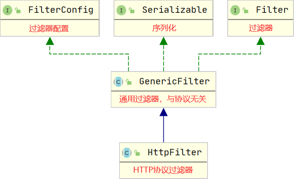

#### 2.1 Filter 接口

```java
//过滤器初始化
default void init(FilterConfig filterConfig) throws ServletException {}
//过滤操作，与协议无关
void doFilter(ServletRequest req, ServletResponse resp, FilterChain chain) throws IOException,																								ServletException;
//过滤器销毁
default void destroy() {}
```

#### 2.2 FilterConfig 接口

```java
//获取过滤器实例的名称
String getFilterName();
//获取Servlet上下文
ServletContext getServletContext();
//从过滤器初始化配置中获取给定属性名对应的属性值
String getInitParameter(String parameterName);
//获取过滤器初始化配置中所有的属性名
Enumeration<String> getInitParameterNames();
```

#### 2.3 案例

使用过滤器完成中文乱码处理

- 编写过滤器 `CharacterEncodingFilter.java`

  ```java
  @WebFilter(urlPatterns = "/*", initParams = {
          @WebInitParam(name = "encoding", value = "UTF-8")
  })
  public class CharacterEncodingFilter implements Filter {
  
      private String encoding;
  
      public CharacterEncodingFilter(){
          System.out.println("过滤器创建实例");
      }
      @Override
      public void init(FilterConfig filterConfig) throws ServletException {
          System.out.println("过滤器初始化");
          encoding = filterConfig.getInitParameter("encoding");
      }
  
      @Override
      public void doFilter(ServletRequest request,
                           ServletResponse response,
                           FilterChain chain)
              throws IOException, ServletException {
          System.out.println("过滤器过滤处理");
          request.setCharacterEncoding(encoding);
          response.setCharacterEncoding(encoding);
          //多个过滤器会形成一条过滤器立链，当前过滤器做完事情之后必须调用chain.doFilter方法
          //让下一个过滤器做事情，所有的过滤器做完事情之后才会将请求送达Servlet。如果过滤的
          //请求不需要Servlet来处理，那么就不需要调用chain.doFilter方法，直接使用response对象
          //做出响应即可
          chain.doFilter(request, response);
  
      }
      @Override
      public void destroy() {
          System.out.println("过滤器销毁");
      }
  }
  ```

#### 2.4 HttpFilter 抽象类

```java
//重写无协议过滤器操作，调用下面支持HTTP协议请求过滤操作的方法
public void doFilter(ServletRequest request, ServletResponse response, FilterChain chain) throws IOException, ServletException {}
//HTTP协议请求过滤操作的方法
protected void doFilter(HttpServletRequest request, HttpServletResponse response, FilterChain chain) throws IOException, ServletException {}
```

#### 2.5 案例

使用过滤器完成登录超时处理

```java
//如果这里配置为 "/*" ，那么所有请求都将被拦截，登录也会被拦截，就会造成还没有登录就已经超时
//所以在过滤时需要对不需要过滤的请求放行
@WebFilter("/*")
public class TimeOutFilter extends HttpFilter {
    @Override
    protected void doFilter(HttpServletRequest req, HttpServletResponse res, FilterChain chain) throws IOException, ServletException {
        String requestURI = req.getRequestURI();
        String contextPath = req.getContextPath();
        requestURI = requestURI.replace(contextPath, "");
        if ("/".equals(requestURI) || "/showUserInfo".equals(requestURI) || requestURI.startsWith("/second")){
            //登录没有超时，让下一个过滤器做事情
            chain.doFilter(req, res);
        }else {
            HttpSession session = req.getSession();
            Object user = session.getAttribute("user");
            if (user == null) {//登录超时了
                //直接让页面跳转至登录
                res.sendRedirect("second.jsp");
            }else {
                //登录没有超时，让下一个过滤器做事情
                chain.doFilter(req, res);
            }
        }
    }
}
```


#### 2.6 Filter 交互流程

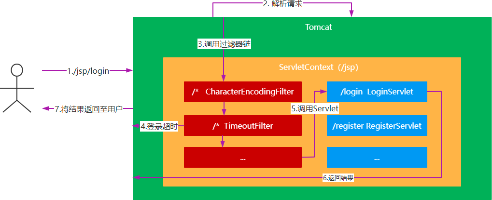


---


# 第四章 EL 表达式和 JSTL 标签

## 第一节 EL表达式

### 1. 什么是 EL 表达式

EL 全称为 Expression Language（表达式语言）

### 2. 为什么要使用 EL 表达式

在 JSP 页面中编写小脚本，会存在以下不足：

- 代码结构混乱
- 脚本与HTML混合，容易出错
- 代码不易于维护
- 获取 JavaBean 属性必须要实例化及强制类型转化
- 为了解决这些不足，JSP提供了 EL 表达式来简化编码，可以使用 EL 表达式来替换 JSP 页面中的小脚本，使得页面和业务逻辑处理相分离，同时还能实现数据类型的自动转型

### 3. 如何使用 EL 表达式

#### 3.1 EL 获取变量的值

<font color=blue>语法：</font>

```jsp
${变量名}
```

<font color=blue>案例：</font>

```java
HttpSession session = request.getSession();
//存入session
session.setAttribute("user", "admin");
request.getRequestDispatcher("main.jsp").forward(request,resp);
```

```jsp
当前用户名：${user}
```

<font color=blue>测试：</font>

查看页面中显示内容

<font color=blue>修改代码：</font>

```java
//存入request
request.setAttribute("user", "admin");
request.getDispatcher("main.jsp").forward(request,resp);
```

<font color=blue>再次测试：</font>
查看页面中显示内容
<font color=red>结论：</font>
**不论变量是存储在 request 中，还是存储在 session 中，都可以使用 EL 表达式进行取值。**
<font color=blue>思考：</font>
如果 request 和 session 中都存有相同的属性值，那么使用 EL 取值的时候，是从哪个对象中取值呢？

```java
    @Override
    protected void doPost(HttpServletRequest req, HttpServletResponse resp) throws ServletException, IOException {
        HttpSession session = req.getSession();
        session.setAttribute("user", "session");
        req.setAttribute("user", "request");
        req.getRequestDispatcher("manage.jsp").forward(req,resp);
    }
```

<font color=blue>测试：</font>

查看页面中显示内容

<font color=red>结论：</font>

**如果 reqeust 和 session 中都存有相同属性的变量，那么 EL 表达式会从 reqeust 中进行取值。**

如果需要从 session 中取值，怎么取呢？需要使用 EL 隐式对象

#### 3.2 EL 隐式对象

| 对象名称           | 说明                                           |
| ------------------ | ---------------------------------------------- |
| `pageScope`        | 返回页面范围的变量名，这些名称已映射至相应的值 |
| `requestScope`     | 返回请求范围的变量名，这些名称已映射至相应的值 |
| `sessionScope`     | 返回会话范围的变量名，这些名称已映射至相应的值 |
| `applicationScope` | 返回应用范围内的变量，并将变量名映射至相应的值 |
| `param`            | 返回客户端的请求参数的字符串值                 |
| `paramValues`      | 返回映射至客户端的请求参数的一组值             |
| `pageContext`      | 提供对用户请求和页面信息的访问                 |


#### 3.3 EL 获取对象的属性值

<font color=blue>语法：</font>

```jsp
<!-- Java中的访问方式 -->
${ 对象名.属性名 }
<!-- JS中的访问方式 -->
${ 对象名["属性名"] }
```

<font color=blue>示例：</font>

```jsp
<div>
	${requestScope.user.name} &nbsp;&nbsp; ${requestScope.user["sex"]}
</div>
<div>
	${sessionScope.user.name} &nbsp;&nbsp; ${sessionScope.user["sex"]}
</div>
```

#### 3.4 EL 获取 List 集合中的值

<font color=blue>语法：</font>

```jsp
${ 集合名称[下标] }
```

<font color=blue>示例：</font>

`MangeServlet.java`

```jsp
...        
	List<User> users = Arrays.asList(new User("u1", "其他"), 
        							new User("u2", "男"));
	session.setAttribute("users", users);
    req.getRequestDispatcher("manage.jsp").forward(req, resp);
```

`manage.jsp`

```jsp
...
	<div>
   		${sessionScope.users[0].name} &nbsp;&nbsp; ${sessionScope.users[0]["sex"]}
	</div>
    <div>
        ${sessionScope.users[1].name} &nbsp;&nbsp; ${sessionScope.users[1]["sex"]}
    </div>
...
```

#### 3.5 EL 获取 Map 集合中的值

<font color=blue>语法：</font>

```jsp
<!-- Java中的访问方式 -->
${ 集合名称.键名 }
<!-- JS中的访问方式 -->
${ 集合名称["键名"] }
```

<font color=blue>示例：</font>

`MangeServlet.java`

```jsp
...        
	Map<String,Object> data = new HashMap<>();
    data.put("map1",90);
    data.put("map2",80);
```

`manage.jsp`

```jsp
...
	<div>
    	${sessionScope.data.map1}
	</div>
    <div>
        ${sessionScope.data.map2}
    </div>
...
```

#### 3.6 EL 表达式中的操作符

<font color=blue>语法：</font>

| 关系操作符   | 说明     | 示例                | 结果  |
| ------------ | -------- | ------------------- | ----- |
| `==（或eq）` | 等于     | ${23==5} ${23 eq 5} | false |
| `!=（或ne）` | 不等于   | ${23!=5} ${23 ne 5} | true  |
| `<（或lt）`  | 小于     | ${23<5} ${23 lt 5}  | false |
| `>（或gt）`  | 大于     | ${23>5} ${23 gt 5}  | true  |
| `<=（或le）` | 小于等于 | ${23<=5} ${23 le 5} | false |
| `>=（或ge）` | 大于等于 | ${23>=5} ${23 ge 5} | true  |

| 逻辑操作符    | 说明   | 示例                                        | 结果  |
| ------------- | ------ | ------------------------------------------- | ----- |
| `&&（或and）` | 逻辑与 | 如果A为true，B为false，则A&&B（或A and B）  | false |
| `||（或or）`  | 逻辑或 | 如果A为true，B为false，则A\|\|B（或A or B） | true  |
| `!（或not）`  | 逻辑非 | 如果A为true，则!A（或not A）                | false |

| Empty操作符 | 说明   | 示例                      | 结果  |
| ----------- | ------ | ------------------------- | ----- |
| `empty`     | 不存在 | ${empty a}，如果a存在     | false |
| `not empty` | 存在   | ${not empty a}，如果a存在 | true  |

<font color=blue>示例：</font>

`manage.jsp`

```jsp
<div>
    ${sessionScope.data.map1 >= 90}//true
</div>
<div>
    ${sessionScope.data.map2 < 60 ? "不及格" : "及格"}//及格
</div>
```


## 第二节 JSTL 标签

### 1. 什么是 JSTL

JSTL 全称为 JavaServerPages Standard Tag Library，意味 JSP标准标签库

### 2. 为什么要使用 JSTL

EL 能够简化 JSP 页面编码，但是，却不能进行逻辑判断，也不能进行循环处理，为了弥补 EL 这方面的不足，JSP 提供了 JSTL 标签，JSTL 标签通常都会与 EL 配合使用，解决页面的逻辑问题。

### 3. JSTL 标签库的分类

| 标准库名称          | 资源标示符(URI)                        | 前缀(prefix) |
| ------------------- | -------------------------------------- | ------------ |
| 核心标签库          | http://java.sun.com/jsp/jstl/core      | c            |
| 国际化/格式化标签库 | http://java.sun.com/jsp/jstl/fmt       | fmt          |
| XML标签库           | http://java.sun.com/jsp/jstl/xml       | x            |
| 数据库标签库        | http://java.sun.com/jsp/jstl/sql       | sql          |
| 函数标签库          | http://java.sun.com/jsp/jstl/functions | fn           |

经常使用的标签就是**核心标签库**和**格式化标签库**

### 4. JSTL 标签库的使用步骤

- 引入JSTL标签库支持的jar包： `jstl.jar` 和 `standard.jar` 

- JSP 页面引入标签库，如

  ```jsp
  <%@ taglib uri="http://java.sun.com/jsp/jstl/core" prefix="c"%>
  ```

### 5. JSTL 核心标签库

#### 5.1 通用标签

| 标签类别 | 标签名 | 说明                           |
| -------- | ------ | ------------------------------ |
| 通用标签 | set    | 设置指定范围内的变量名和变量值 |
| 通用标签 | out    | 输出变量的值                   |
| 通用标签 | remove | 删除指定范围内的变量           |

- `<c:set>`标签

  <font color=blue>语法：</font>

  ```jsp
  <!-- 将value值存储到范围为scope的变量variable中 -->
  <c:set var="变量名" value="变量值" scope="变量的作用范围" />
  <!-- 将value值设置到对象的属性中 -->
  <c:set target="目标对象" property="对象属性" value="对象属性值" />
  ```

  <font color=blue>示例：</font>

  ```jsp
  <div>
      <c:set var="test" value="测试" scope="page"/>
      页面范围内的变量: ${pageScope.test}
  </div>
  
  <%
      User user = new User();
  %>
  <div>
      <c:set target="<%=user%>" value="管理员" property="name"/>
      <%= user.getName()%>//这里只能用脚本来表示
  </div>
  ```

- `<c:remove> `标签

  <font color=blue>语法：</font>

  ```jsp
  <c:remove var="变量名" scope="变量的作用范围" />
  ```

  <font color=blue>示例：</font>

  ```jsp
  <div>
      <c:set var="test" value="测试" scope="page"/>
      页面范围内的变量: ${pageScope.test}
      <c:remove var="test" scope="page"/>
      页面范围内的变量: ${pageScope.test}
  </div>
  ```


#### 5.2 条件标签

- `<c:if>`标签

  <font color=blue>语法：</font>

  ```jsp
  <c:if test="条件表达式" var="存储表达式的结果的变量" scope="变量的作用范围">
  ```

  <font color=blue>示例：</font>

  ```jsp
  <c:if test="${sessionScope.user1.score > 80}" var="result" scope="request">
      <div>成绩高于80</div>
  </c:if>
  成绩高于80吗? ${requestScope.result}
  ```


-  `<c:choose>`标签

  <font color=blue>语法：</font>

  ```jsp
  <c:choose>
  	<c:when test="条件表达式"></c:when>
  	<c:when test="条件表达式"></c:when>
  	<c:otherwise></c:otherwise>
  </c:choose>
  ```
  
  <font color=blue>示例：</font>
  
  ```jsp
  <c:choose>
      <c:when test="${sessionScope.user1.score > 90}">
          <div>成绩优秀</div>
      </c:when>
      <c:when test="${sessionScope.user1.score > 80}">
          <div>成绩良好</div>
      </c:when>
      <c:when test="${sessionScope.user1.score > 60}">
          <div>成绩及格</div>
      </c:when>
      <c:otherwise>
          <div>成绩不及格</div>
      </c:otherwise>
  </c:choose>
  ```
  
- `<c:forEach>`标签

  <font color=blue>语法：</font>

  ```jsp
  <c:forEach items="遍历的集合" var="每次遍历的对象" begin="遍历开始的位置" end="遍历结束的位置" step="遍历的步长">
  </c:forEach>
  ```

  <font color=blue>示例：</font>

  ```jsp
  <table>
      <thead>
      <tr>
          <th>姓名</th>
          <th>成绩</th>
      </tr>
      </thead>
      <tbody>
      <c:forEach items="${sessionScope.scores}" var="score" begin="2" step="3" end="14">
          <tr>
              <td>${score.name}</td>
              <td>${score.score}</td>
          </tr>
      </c:forEach>
      </tbody>
  </table>
  ```
  
  

### 6. 格式化标签

| 标签类别   | 标签名       | 说明             |
| ---------- | ------------ | ---------------- |
| 格式化标签 | formatDate   | 对日期进行格式化 |
| 格式化标签 | formatNumber | 对数字进行格式化 |

- `<fmt:formatDate>`标签

  <font color=blue>语法：</font>

  ```jsp
  <fmt:formatDate value="日期对象" pattern="日期格式" />
  ```

  <font color=blue>示例：</font>

  ```jsp
  <tr>
  	<td>${score.name}</td>
      <td>${score.score}</td>
      <td>
      	<fmt:formatDate value="${score.examDate}" pattern="yyyy-MM-dd HH:mm:ss"/>
  	</td>
  </tr>
  ```

- `<fmt:formatNumber> `标签

  <font color=blue>语法：</font>

  ```jsp
  <!-- 货币格式的数字 -->
  <fmt:formatNumber value="数字" type="currency" />
  <!-- 数字格式化 -->
  <fmt:formatNumber value="数字" type="number" maxIntegerDigits="整数部分位数" /> <fmt:formatNumber value="数字" type="number" maxFractionDigits="小数部分位数" />
  <fmt:formatNumber value="数字" type="number" pattern="数字格式" />
  <!-- 数字百分比 -->
  <fmt:formatNumber value="数字" type="percent" maxIntegerDigits="整数部分位数" />
  <fmt:formatNumber value="数字" type="percent" maxFractionDigits="小数部分位数" />
  ```

  <font color=blue>示例：</font>

  ```jsp
  <div>
      <c:set var="test" value="测试" scope="page"/>
      页面范围内的变量: ${pageScope.test}
      <c:remove var="test" scope="page"/>
      页面范围内的变量: ${pageScope.test}
  </div>
  ```

---


# 第五章 ajax 与 JSON

## 第一节 ajax

### 1. 什么是 ajax

AJAX 全称为 `Asynchronous JavaScript And Xml`，表示异步的 Java 脚本和 xml 文件，是一种异步刷新技术。

### 2. 为什么要使用 ajax

`Servlet` 进行网页的变更往往是通过请求转发或者是重定向来完成，这样的操作更新的是整个网页，如果我们只需要更新网页的局部内容，就需要使用到 `AJAX` 来处理了。因为只是更新局部内容，因此， Servlet 传输的数据量就减少了，这不仅有效的利用了带宽，提高效率的同时还增加了用户的体验度，操作起来更为方便。

### 3. ajax 的核心

- IE浏览器： `ActiveXObject`

- 其他浏览器： `XMLHttpRequest`

AJAX的核心是一个对象，既然是对象，那么就应该存在属性和方法。

<font color=blue>常用方法：</font>

| 方法                                           | 说明                     |
| ---------------------------------------------- | ------------------------ |
| open(String method, String url, boolean async) | 创建一个新的HTTP请求     |
| send(String data)                              | 发送请到服务端           |
| setRequestHeader(String header, String value)  | 设置请求的某个HTTP头信息 |

<font color=blue>常用属性：</font>

- `onreadystatechange` : 监听就绪状态改变的事件，必须给定一个函数
- `readyState` : `XMLHttpRequest` 的状态信息
- `status` : HTTP的状态码
- `responseText` :  以文本形式获得响应的内容
- `responseXML `:  将XML格式的响应内容解析成DOM对象

### 4. 应用场景

#### 4.1 用户名检测

使用 ajax 完成注册时用户名是否可用

`register.jsp`

```jsp
<%@ page contentType="text/html;charset=UTF-8" language="java" %>
<html>
<head>
  <title>用户注册</title>
</head>
<body>
<form action="" method="post">
  <div>
    <span>用户名: </span>
    <input type="text" name="username" id="username">
    <span id="tip"></span>
  </div>
</form>
</body>
<script type="text/javascript">
  let element = document.getElementById("username");
  //为username元素添加一个失去焦点的事件
  element.onblur = function () {
    let value = element.value;
    if (value !== ''){
      let xmlHttpRequest;
      if (window.ActiveXObject){//检测window中是否存在ActiveXObject这个对象
        //微软的IE需要使用这种方式获取AJAX核心对象
        xmlHttpRequest = new ActiveXObject("Microsoft.XMLHttpRequest")
      }else{
        xmlHttpRequest = new XMLHttpRequest();
      }
      xmlHttpRequest.onreadystatechange = function () {
        //就绪状态为4的时候表示已经将服务器传输回来的信息读取完成
        if (xmlHttpRequest.readyState === 4){
          //http状态码为200的时候说明该请求处理成功
          if (xmlHttpRequest.status === 200){
            let tip = document.getElementById("tip");
            let result = xmlHttpRequest.responseText;
            //这里需要对结果进行处理
            if (result === '1'){
              tip.innerText = "该账号已被注册";
              tip.style.color = "red";
            } else {
              tip.innerText = "该账户可以注册"
              tip.style.color = "green";
            }
          }
        }
      }
      //GET请求发送数据的方式是在URL地址后面进行数据的拼接
      xmlHttpRequest.open("get", "checkUsername?username="+ value, true);
      xmlHttpRequest.send();//表示发送数据，GET请求直接为空即可
    }
  }
</script>
</html>

```

`CheckUsernameServlet.java`

```java
@WebServlet("/checkUsername")
public class CheckUsernameServlet extends HttpServlet {

    @Override
    protected void doGet(HttpServletRequest req, HttpServletResponse resp) throws ServletException, IOException {
        PrintWriter writer = resp.getWriter();
        String username = req.getParameter("username");
        if ("admin".equals(username)){
            writer.print(1);//用户已经存在
        }else {
            System.out.println(username);
            writer.print(2);//用户名可以注册
        }
        writer.flush();
        writer.close();
    }
}
```


#### 4.2 登录

`index.jsp`

```jsp
<%@ page contentType="text/html; charset=UTF-8" pageEncoding="UTF-8" %>
<!DOCTYPE html>
<html>
<head>
    <title>AJAX登录</title>
</head>
<body>
<form action="" method="post">
    <div>
        <input type="text" name="username" id="username">
    </div>
    <div>
        <input type="password" name="password" id="password">
    </div>
    <div>
        <input type="button" value="登录" id="loginBtn">
    </div>
</form>
</body>
<script type="text/javascript">
    document.getElementById("loginBtn").onclick = function () {
        let username = document.getElementById("username").value;
        let password = document.getElementById("password").value;
        let xmlHttpRequest;
        if (window.ActiveXObject){//检测window中是否存在ActiveXObject这个对象
            //微软的IE需要使用这种方式获取AJAX核心对象
            xmlHttpRequest = new ActiveXObject("Microsoft.XMLHttpRequest")
        }else{
            xmlHttpRequest = new XMLHttpRequest();
        }
        xmlHttpRequest.onreadystatechange = function () {
            //就绪状态为4的时候表示已经将服务器传输回来的信息读取完成
            if (xmlHttpRequest.readyState === 4){
                //http状态码为200的时候说明该请求处理成功
                if (xmlHttpRequest.status === 200){
                    let result = xmlHttpRequest.responseText;
                    //这里需要对结果进行处理
                    if (result === '0'){
                        alert("账号或密码错误");
                    }else {
                        alert("登录成功")
                    }
                }
            }
        }
        xmlHttpRequest.open("post", "login", true);
        //POST方式发送请求时携带数据一定要添加请求头，设置传输数据的类型
        //为application/x-www-form-urlencoded其作用将键值对的参数用&连接起来,
        //如果有空格，将空格转换为+加号:有特殊符号，将特殊符号转换为ASCII HEX值
        xmlHttpRequest.setRequestHeader("content-type", "application/x-www-form-urlencoded;charset=UTF-8")
        //POST请求发送数据需要在send方法中
        xmlHttpRequest.send("username=" + username +"&password="+password);
    }
</script>
</html>
```

`LoginServlet.java`

```java
@WebServlet("/login")
public class LoginServlet extends HttpServlet {
    @Override
    protected void doPost(HttpServletRequest req, HttpServletResponse resp) throws ServletException, IOException {
        String username = req.getParameter("username");
        String password = req.getParameter("password");
        int flag = 0;
        if ("admin".equals(username) && "123456".equals(password)){
            flag = 1;
        }
        PrintWriter writer = resp.getWriter();
        writer.print(flag);
        writer.flush();
        writer.close();
    }
}
```

### 5. ajax 封装

`index.jsp`

```jsp
...
<script type="text/javascript">
    document.getElementById("loginBtn").onclick = function () {

        let username = document.getElementById("username").value;
        let password = document.getElementById("password").value;
        ajax({
            url: 'login',
            method: 'post',
            contentType: 'application/x-www-form-urlencoded;charset=UTF-8',
            data: {
                username: username,
                password: password
            },
            success: function (resp) {
                if (resp === '0') {
                    alert("账号或密码错误");
                } else {
                    alert("登录成功")
                }
            }
        })
</script>
```

`ajax.js`

```js
function ajax(option) {
    let xmlHttpRequest;
    if (window.ActiveXObject){//检测window中是否存在ActiveXObject这个对象
        //微软的IE需要使用这种方式获取AJAX核心对象
        xmlHttpRequest = new ActiveXObject("Microsoft.XMLHttpRequest")
    }else{
        xmlHttpRequest = new XMLHttpRequest();
    }
    xmlHttpRequest.onreadystatechange = function () {
        //就绪状态为4的时候表示已经将服务器传输回来的信息读取完成
        if (xmlHttpRequest.readyState === 4){
            //http状态码为200的时候说明该请求处理成功
            if (xmlHttpRequest.status >= 200 && xmlHttpRequest.status < 300){
                let result = xmlHttpRequest.responseText;//得到的服务器端返回结果
                if (typeof option.success === 'function'){
                    option.success(result);//调用传递进来的回调函数
                }
            }else {
                if (typeof option.error === 'function'){
                    option.error(xmlHttpRequest.responseText);
                }
            }
        }
    }
    if (option.method.toLowerCase() === 'get'){
        let parameter = "?";
        //{username: admin, password: 123456} => username=admin&password=123456
        let keys = Object.keys(option.data);//获取对象中的所有属性名形成的一个集合
        keys.forEach(key =>{
            parameter += key + "=" + option.data[key] + "&";
        })
        parameter = parameter.substring(0, parameter.length - 1)
        option.url += parameter;
    }

    xmlHttpRequest.open(option.method, option.url, true);
    if (option.contentType)//表示如果contentType不为null，也不为undefined，那么就设置请求头
        xmlHttpRequest.setRequestHeader("content-type", option.contentType)

    let dataInfo = null;
    if (option.method.toLowerCase() !== "get"){
        dataInfo = option.data;
        if (option.contentType && option.contentType.indexOf('application/x-www-form-urlencoded') >= 0){
            let parameter = "";
            //{username: admin, password: 123456} => username=admin&password=123456
            let keys = Object.keys(option.data);//获取对象中的所有属性名形成的一个集合
            keys.forEach(key =>{
                parameter += key + "=" + option.data[key] + "&";
            })
            parameter = parameter.substring(0, parameter.length - 1)
            dataInfo = parameter;
        }
    }
    xmlHttpRequest.send(dataInfo);//表示发送数据，GET请求直接为空即可
}
```


## 第二节 jQuery ajax

### 1. 为什么要使用 jQuery ajax

原生 ajax 使用步骤繁琐，接收的数据格式需要处理，使用过程中涉及到的函数调用及状态验证较多，还需要处理浏览器的兼容性问题。而 jQuery ajax 对原生 ajax 进行了封装，使用起来非常方便，深受开发者的喜爱。

### 2. 如何使用 jQuery  ajax

```js
$.ajax({
	url: '', //请求提交的URL地址
	type: '',//请求类型
 	data: {},//请求携带的数据
 	contentType: '',//请求的数据类型
 	dataType: '',//服务器端传回的数据类型，默认是application/text
    //成功时执行的回调函数，resp用于接收服务器端传递回来的数据  
    success: function (resp) {},
 //请求过程中出现错误后执行的回掉函数，xhr用于接收失败后相关状态信息
    error: function(xhr, textStatus, errorThrown) {} 
});
```

### 3. 应用场景

#### 3.1 用户名检测

```js
$("#username").blur(function () {
    $.ajax({
		url: 'checkUsername',//请求发送的地址
        type: 'get',//请求发送的方式
		data: { //请求携带的数据
             username: $("#username").val()
 },
 //成功时的回掉函数，resp接收服务器端返回的数据
        success: function (resp) {
            if(resp == "true"){
				$("#username").siblings("span").text("该账号已被注册");
            } else {
				$("#username").siblings("span").text("该账号可以注册");
            }
        }
    });
});
```

#### 3.2 登录

```js
$("#loginBtn").click(function () {
     $.ajax({
		url: 'login',//请求发送的地址
        type: 'post',//请求发送的方式
        data: { //请求携带的数据
			username: $("#username").val(),
            password: $("#password").val()
		},
		contentType: 'application/x-www-form-urlencoded;charset=UTF-8',
        //成功时的回掉函数，resp接收服务器端返回的数据
		success: function (resp) {
			if(resp == '1'){
  				$("#username").siblings("span").text("该账号已被注册");
            } else {
                $("#username").siblings("span").text("该账号可以注册");
            }
        }
     });
});
```

#### 3.3 表格刷新

表格刷新主要利用的是 jQuery的 load() 方法进行表格刷新，这也是一种 ajax 的封装。load() 方法可以对页面的局部内容进行更新，load() 方法使用有两种方式：

```js
//这种方式是GET请求
$("选择器").load("请求地址");
//这种方式是POST请求
$("选择器").load("请求地址", data);
```

<font color=blue>使用load()对页面表格内容进行刷新</font>

```jsp
<!-- table.jsp -->
<input type="text" id="region">
<input type="button" value="查询" id="search">
<table>
	<thead>
    	<tr>
        	<th>代理商ID</th>
            <th>代理商编号</th>
            <th>代理商名称</th>
            <th>代理商区域</th>
		</tr>
	</thead>
  <tbody id="dataBox"></tbody>
</table>
<script type="text/javascript" src="js/jquery-3.4.1.js"></script>
<script type="text/javascript">
	$(function () {
    	$("#search").click(function () {
        	let data = { region: $("#region").val() }; 									$("#dataBox").load("search", data);
        });
    })
</script>
```

```jsp
<!-- data.jsp -->
<%@ page contentType="text/html;charset=UTF-8" language="java" %> <%@ taglib prefix="c" uri="http://java.sun.com/jsp/jstl/core" %>
 <c:forEach items="${agents}" var="agent">
     <tr>
		<td>${agent.aid}</td>
		<td>${agent.ano}</td>
		<td>${agent.aname}</td>  <td>${agent.aregion}</td>
     </tr>
</c:forEach>
```

```java
String region = req.getParameter("region");
AgentService service = new AgentServiceImpl();
List<Agent> agents = service.queryAgents(region); req.getSession().setAttribute("agents", agents); resp.sendRedirect("data.jsp");
```

## 第三节 JSON

### 1. 什么是 JSON

JSON 全称为 **JavaScript Object Notation**，表示 JavaScript 对象符号，是一种网络数据交换的格式，通常在服务器端和客户端之间使用。

> AJAX 和 JSON 的关系，参考以下文章：[AJAX与JSON - 知乎 ](https://zhuanlan.zhihu.com/p/38773438)

### 2. 如何定义 JSON

<font color=blue>语法：</font>

```js
//JSON格式的对象
let json = {
	"属性名1": "属性值1",
    "属性名2": "属性值2",
    "属性名3": "属性值3",
    ...
};
    
//JSON格式的数组
let jsonArray = [值1,值2,值3, ...];
//JSON格式的对象数组
let jsonObjectArray = [
     {"属性名1": "数值1","属性名2": "数值2", ...},
     {"属性名1": "数值1","属性名2": "数值2", ...}
}
```

### 3. Servlet 返回 JSON 格式数据

```java
//JSON对象 需要引入 fastJson 包
JSONObject json = new JSONObject();
//将集合放入JSON对象中，以便传回前端
json.put("numbers", new int[]{1,2,3,4,5,6,7,8}); resp.setCharacterEncoding("UTF-8");
PrintWriter pw = resp.getWriter();
//将JSON数据传回前端
pw.print(json);
pw.flush();
pw.close();
```

---


# 第六章 文件上传下载、EasyExcel

## 第一节 文件上传和下载

### 1. 文件处理的包

`commons-io.jar` 封装了常用的 IO 的相关操作，提供了 `IOUtils` 工具类供开发人员使用
`commons-fileupload.jar` 文件上传的处理包，因为文件上传也会涉及到 IO 操作，因此，该包需要配合 `commons-io.jar` 使用。

- `FileItemFactory` 文件项工厂，主要提供创建文件项的功能
- `DiskFileItemFactory` 磁盘文件项工厂，主要用于解析上传文件时，创建对应的文件项
- `ServletFileUpload`  `Servlet` 文件上传对象，主要用于判断请求是否是文件上传请求，以及请求中的内容解析。解析时需要使用文件项工厂来创建文件项

### 2. 文件上传

#### 2.1 form 表单上传

`uploadServlet.java`

```java
@WebServlet("/upload")
public class UploadServlet extends HttpServlet {

    private static final String SAVE_DIR = "C:\\Users\\25222\\Desktop\\新建文件夹 (2)\\course_design_j2se-master\\WebTest\\upload";

    @Override
    protected void doPost(HttpServletRequest req, HttpServletResponse resp) throws ServletException, IOException {
        //断如果是文件上传的请求
        if (ServletFileUpload.isMultipartContent(req)) {
            //创建一个磁盘文件项工厂
            DiskFileItemFactory factory = new DiskFileItemFactory();
            factory.setDefaultCharset("UTF-8");
            //设置临时文件的存储位置
            factory.setRepository(new File("java.io.tmpdir"));
            //设置每个文件项的最大大小位4096KB，超过这个大小，就会使用临时文件进行保存，保存的位置就是上面设置的位置
            factory.setSizeThreshold(4096 * 1024);
            //创建文件上传的对象
            ServletFileUpload upload = new ServletFileUpload(factory);
            //设置每一个上传文件的最大大小为5MB
            upload.setFileSizeMax(5 * 1024 * 1024);
            //设置每次上传的所有文件最大总大小为50MB
            upload.setSizeMax(50 * 1024 * 1024);
            upload.setHeaderEncoding("UFT-8");
            //开始解析请求，得到文件项
            try {
                List<FileItem> fileItems = upload.parseRequest(req);
                for (FileItem fileItem : fileItems) {
                    if (fileItem.isFormField()) {//判断是否是普通的表单字段，比如 name:123
                        //打印参数名和参数值
                        System.out.println(fileItem.getFieldName() + "=>" + fileItem.getString());
                    } else {//走到这里说明是上传的文件
                        File dir = new File(SAVE_DIR);
                        if (!dir.exists()) {
                            dir.mkdirs();
                        }
                        //创建保存的文件
                        File saveFile = new File(dir, fileItem.getName());
                        InputStream is = fileItem.getInputStream();//获取上传文件的输入流
                        OutputStream os = new FileOutputStream(saveFile);//获取上传文件的输出流
                        IOUtils.copy(is, os);//将输入流中的信息拷贝至输出流中，这就是文件保存
                        //关闭流
                        IOUtils.closeQuietly(is);
                        IOUtils.closeQuietly(os);
                    }
                }
                resp.setCharacterEncoding("UTF-8");
                resp.setContentType("text/html;charset=utf-8");
                resp.getWriter().print("上传成功");
            } catch (FileUploadException e) {
                e.printStackTrace();
                resp.setCharacterEncoding("UTF-8");
                resp.setContentType("text/html;charset=utf-8");
                resp.getWriter().print("上传失败");
            }
        } else {//抛出运行时异常
            throw new RuntimeException("请求头中未发现multipart/form-data");
        }
    }
}
```

`file.jsp`

```jsp
<%@ page contentType="text/html;charset=UTF-8" language="java" %>
<html>
<head>
    <title>文件上传和下载</title>
</head>
<body>
<%--使用form表单进行文件上传的时候，必须要设置enctype属性，而且这个属性值必须是multipart/form-data
    作用为：将文件对应的内容以二进制的形式传递给后台--%>
<form action="upload" method="post" enctype="multipart/form-data">
    <input type="text" name="name">
    <input type="file" name="uploadFile">
    <input type="submit" value="上传">
</form>
<input type="file" id="uploadFile" name="uploadFile">
<input type="button" value="上传" id="uploadBtn">
</body>
</html>
```

#### 2.2 ajax 文件上传

`file.jsp`

```jsp
<%@ page contentType="text/html;charset=UTF-8" language="java" %>
<html>
<head>
    <title>文件上传和下载</title>
</head>
<body>
<%--使用form表单进行文件上传的时候，必须要设置enctype属性，而且这个属性值必须是multipart/form-data--%>
<form action="upload" method="post" enctype="multipart/form-data">
    <input type="text" name="name">
    <input type="file" name="uploadFile">
    <input type="submit" value="上传">
</form>
<input type="file" id="uploadFile">
<input type="button" value="上传" id="uploadBtn">
</body>
<script type="text/javascript" src="js/jquery-3.6.0.js"></script>
<script type="text/javascript">
    $(function () {
        $("#uploadBtn").click(function () {
            let formData = new FormData();//创建的一个表单数据对象，主要用于模拟表单数据
            formData.append("file", $("#uploadFile")[0].files[0])
            formData.append("name", "admin")
            formData.append("name", "男")
            $.ajax({
                url: 'upload',
                type: 'post',
                data: formData,
                processData: false,//告诉jQuery 不要处理数据
                contentType: false,//告诉jQuery不要设置内容的类型
                success: function (resp) {
                    alert(resp)
                },
                error: function (xhr) {
                    alert(xhr)
                }
            })
        })
    })
</script>
</html>
```


> 注：在Servlet3.0版本以后，可以使用注解 @MultipartConfig 来简化Servlet中的操作

```java
@MultipartConfig
@WebServlet("/upload")
public class UploadServlet extends HttpServlet {

	private static final String SAVE_DIR = "C:\\Users\\25222\\Desktop\\新建文件夹 (2)\\course_design_j2se-master\\WebTest\\upload\\test.png";
    
    @Override
    protected void doPost(HttpServletRequest req, HttpServletResponse resp) throws ServletException, IOException {
        try(FileOutputStream stream = new FileOutputStream(SAVE_DIR)){
            Part part = req.getPart("uploadFile");
            IOUtils.copy(part.getInputStream(), stream);
            resp.setContentType("text/html;charset=UTF-8");
            resp.getWriter().write("文件上传成功！");
        }
    }
}
```


### 3. 文件下载

`file.jsp`

```jsp
...
<a href="download?name=测试图片.png">测试图片.png</a>
...
```

`DownloadServlet.java`

```java
@WebServlet("/download")
public class DownloadServlet extends HttpServlet {

    private static final String DOWNLOAD_DIR = "D:\\";

    @Override
    protected void doGet(HttpServletRequest req, HttpServletResponse resp) throws ServletException, IOException {
        String name = req.getParameter("name");//获取下载的文件的名字
        File file = new File(DOWNLOAD_DIR, name);
        if (file.exists()){
            byte[] data = name.getBytes(StandardCharsets.UTF_8);//获取下载的文件名的字节数据
            //转换编码格式，重新构建字符串，因为浏览器默认支持的编码是ISO_8859_1，因此要转换为这种编码下中文才能够显示
            name = new String(data, StandardCharsets.ISO_8859_1);
            //设置内容处理方案，以附件的形式处理
            resp.setHeader("content-Disposition", "attachment;filename=" + name);
            InputStream is = new FileInputStream(file);
            //获取相应的输出流，这个流就会将信息输出到页面，从而形成下载的效果
            OutputStream os = resp.getOutputStream();
            IOUtils.copy(is, os);//传输信息
            IOUtils.closeQuietly(is);
            IOUtils.closeQuietly(os);
        }else {
            resp.setCharacterEncoding("UTF-8");
            resp.setContentType("text/html;charset=utf-8");
            PrintWriter writer = resp.getWriter();
            writer.print("下载的文件不存在");
            writer.flush();
            writer.close();
        }
    }
}
```


## 第二节 Excel 处理

### 1. EasyExcel 介绍

`EasyExcel` 是阿里巴巴开源的一个 Excel 处理框架，以使用简单、节省内存著称。 `EasyExcel` 能大大减少占用内存的主要原因是在解析 Excel 时没有将文件数据一次性全部加载到内存中，而是从磁盘上一行行读取数据，逐个解析。

### 2. EasyExcel 生成 Excel

`Student.java`

```java
package com.example.model;

import com.alibaba.excel.annotation.ExcelProperty;

/**
 * @author ：枫阿雨
 * @description：TODO
 * @date ：2022-02-06 17:06
 */

public class Student {
    //思考一个问题 属性和表头如何一一对应：使用注解
    @ExcelProperty("姓名")
    
    private String name;
    @ExcelProperty("性别")
    
    private String sex;
    
    @ExcelProperty("年龄")
    private int age;
    
    @ExcelProperty("班级")
    private String className;

    //省略GETTER 和 SETTER
}

```

`ExcelUtil.java`

```java
public class ExcelUtil {
    public static void main(String[] args) {
        List<Student> students = new ArrayList<>();
        for (int i = 0; i < 100; i++) {
            Student student = new Student();
            student.setName("张三"+i);
            student.setAge(10+i);
            student.setSex(i % 2 == 0 ? "男" : "女");
            student.setClassName("120030601");
            students.add(student);
        }
        //如何将这个集合中的数据写入一个excel中?
        //excel必须有名，有存放位置
        String excelPath = "D:/学生信息表.xlsx";
        writExcel(students, Student.class, "学生信息表", excelPath);
    }

    private static <T> void writExcel(List<T> dataList, Class<T> clazz,
                                      String sheetName, String excelPath) {
        //EasyExcel写excel时必须指定excel存放位置，
        // 还需要指定写的时候excel的表头与属性的对应关系
        EasyExcel.write(excelPath, clazz)
                .sheet(sheetName) //指定写的时候sheet的名称
                .doWrite(dataList);//执行写数据操作
    }
}
```


### 3. EasyExcel 解析 Excel

`ExcelUtil.java`

```java
public class ExcelUtil {
    public static void main(String[] args) {

        String excelPath = "D:/学生信息表.xlsx";
        readExcel(excelPath, "学生信息表", Student.class);
    }

    private static <T> List<T> readExcel(String excelPath,
                                         String sheetName,
                                         Class<T> clazz) {
        List<T> datalist = new ArrayList<>();
        ReadListener<T> listener = new ReadListener<T>() {
            @Override
            public void invoke(T t, AnalysisContext analysisContext) {
                System.out.println("读取了一行数据：" + t);
                datalist.add(t);
            }

            @Override
            public void doAfterAllAnalysed(AnalysisContext analysisContext) {
                System.out.println("excel读取一个sheet完毕");
            }
        };
        //EasyExcel读取excel时需要指定读取的excel的位置，还需要指定读取的类型，
        // 因为这个类型中就指定了excel表头与类型定义的属性的映射关系
        // 还需要指定行的监听器，因为EasyExcel是按行读取的，监听器感知一行的读取

        EasyExcel.read(excelPath, clazz, listener)
                .sheet(sheetName)//指定读取的sheet的名
                .doRead();//执行读
        System.out.println(datalist.size());
        return datalist;
    }
}

```

### 4. EasyExcel 导入导出

`ExcelUtil.java`

```java
private static final int MAX_COUNT_PER_SHEET = 5000;//每个sheet中写的最大数据量
 
public static <T> void exportExcel(OutputStream os,
                                       Class<T> clazz,
                                       String sheetName,
                                       List<T> dataList) {
        ExcelWriter writer = EasyExcel.write(os, clazz).build();
        int size = dataList.size();//数据总条数
        int sheetCount = size / MAX_COUNT_PER_SHEET;
        if (size % MAX_COUNT_PER_SHEET > 0)
            sheetCount += 1;
        for (int i = 0; i < sheetCount; i++) {
            int start = i * MAX_COUNT_PER_SHEET;
            int end = (i + 1) * MAX_COUNT_PER_SHEET;
            List<T> sheetData = dataList.subList(start, end);
            WriteSheet sheet = new WriteSheet();
            sheet.setSheetNo(i);
            sheet.setSheetName(sheetName + (i + 1));
            writer.write(sheetData, sheet);
        }
        writer.finish();
    }

public static <T> List<T> importExcel(InputStream is, Class<T> clazz) {
	List<T> dataList = new ArrayList<>();
    ReadListener<T> listener = new ReadListener<T>() {
    	@Override
    	public void invoke(T t, AnalysisContext analysisContext) {
    		System.out.println("读取了一行数据：" + t);
        	dataList.add(t);
		}

    	@Override
    	public void doAfterAllAnalysed(AnalysisContext analysisContext) {
    		System.out.println("excel读取一个sheet完毕");
		}
	};
        EasyExcel.read(is, clazz, listener).doReadAll();
        return dataList;
}
```

---


# 第七章 监听器、RBAC 权限模型

## 第一节 监听器

### 1. 什么是监听器

监听器顾名思义就是监听某种事件的发生，一旦监听的事件触发，那么监听器就将开始执行。例如：在上课的时候，老师会观察每一位学生的听课情况，如果有学生上课打瞌睡，那么老师就会提醒他。这个场景中，老师就是一个监听器，监听的是学生是否打瞌睡，一旦学生出现打瞌睡的情况，监听器就开始执行（老师提醒学生）

### 2. ServletContextListener

ServletContextListener 是 Servlet上下文的监听器，该监听器主要监听的是Servlet上下文的初始化和销毁。一旦Servlet上下文初始化或者销毁，ServletContextListener 就执行响应的操作。

```java
public interface ServletContextListener extends EventListener {
	//Servlet上下文初始化
	default void contextInitialized(ServletContextEvent sce) {}
	//Servlet上下文销毁
	default void contextDestroyed(ServletContextEvent sce) {}
}
```

#### 2.1 示例

- 在resources目录下创建`jdbc.properties`

  ```properties
  jdbc.url=jdbc:mysql://localhost:3306/jsp?serverTimezone=UTF8 jdbc.driverClassName=com.mysql.cj.jdbc.Driver
  jdbc.username=root
  jdbc.password=root
  ```

- 在`web.xml`中配置上下文参数

  ```xml
  <context-param>
  	<param-name>jdbcConfig</param-name>
  	<param-value>/jdbc.properties</param-value>
  </context-param>
  ```

- 创建一个上下文监听器

  ```java
  @WebListener //标明这是一个监听器
  public class ApplicationContextListener implements ServletContextListener {
  
      @Override
      public void contextInitialized(ServletContextEvent sce) {
          System.out.println("Servlet上下文初始化");
          //获取Servlet上下文
          ServletContext servletContext = sce.getServletContext();
          String jdbcConfig = servletContext.getInitParameter("jdbcConfig");
          InputStream inputStream = this.getClass().getResourceAsStream(jdbcConfig);
          Properties properties = new Properties();
          try {
              properties.load(inputStream);
              System.out.println(properties);
          } catch (IOException e) {
              e.printStackTrace();
          }
      }
  
      @Override
      public void contextDestroyed(ServletContextEvent sce) {
          System.out.println("销毁");
      }
  }
  ```

- 启动服务器，查看控制台信息

- 关闭服务器，查看控制台信息

由此可以看出，`Servelt` 上下文监听器可以读取到上下文参数，这些参数可以用来配置开发中所需要的环境。

#### 2.2 DruidDataSource

DruidDataSource是阿里巴巴开发的一款高性能的数据源。利用Servlet上下文监听器建立工程中需要的数据源

- 引入DruidDataSource的依赖包

- 创建 JbdcUtil 工具类

  `JdbcUtil.java`

  ```java
  package com.example.Util;
  
  public class JdbcUtil {
      private static DruidDataSource dataSource = new DruidDataSource();
  
      /**
       * 初始化数据源
       * @param properties
       */
      public static void initDataSource(Properties properties){
          dataSource.configFromPropety(properties);
      }
  
      /**
       * 关闭数据源
       */
      public static void destroyDataSource(){
          dataSource.close();
      }
  
      /**
       * 封装的万能查询
       * @param sql
       * @param handler
       * @param parameters
       * @param <T>
       * @return
       */
      public static <T> T query(String sql, ResultHandler<T> handler, Object...parameters){
          try {
              DruidPooledConnection connection = dataSource.getConnection();
              PreparedStatement preparedStatement = connection.prepareStatement(sql);
              if (parameters != null && parameters.length > 0){
                  for (int i = 0; i < parameters.length; i++) {
                      preparedStatement.setObject(i+1, parameters[i]);
                  }
              }
              ResultSet resultSet = preparedStatement.executeQuery();
              T t = handler.handle(resultSet);
              resultSet.close();
              preparedStatement.close();
              connection.close();
              return t;
          } catch (SQLException e) {
              e.printStackTrace();
          }
          return null;
      }
      
      /**
       * 封装的万能更新
       * @param sql
       * @param parameters
       * @return
       */
      public static int update(String sql, Object...parameters){
          Connection connection = null;
          try {
              connection = dataSource.getConnection();
              PreparedStatement preparedStatement = connection.prepareStatement(sql);
              if (parameters != null && parameters.length > 0){
                  for (int i = 0; i < parameters.length; i++) {
                      preparedStatement.setObject(i+1, parameters[i]);
                  }
              }
              int affectedRows = preparedStatement.executeUpdate();
              connection.commit();
              preparedStatement.close();
              connection.close();
          } catch (SQLException e) {
              e.printStackTrace();
              if (connection != null) {
                  try {
                      connection.close();
                  } catch (SQLException ex) {
                      ex.printStackTrace();
                  }
              }
          }
          return -1;
      }
  }
  ```

- **view层**

  `query.jsp`

  ```jsp
  <%@ page contentType="text/html;charset=UTF-8" language="java" %>
  <html>
  <head>
      <title>查询</title>
  </head>
  <body>
  <input type="button" value="查询" id="searchBtn">
  </body>
  <script type="text/javascript" src="js/jquery-3.6.0.js"></script>
  <script type="text/javascript">
      $("#searchBtn").click(function () {
          $(function () {
              $.ajax({
                  url: 'search',
                  type: 'get',
                  data: {},
                  success: function (resp) {
                      console.log(resp)
                  }
              })
          })
      })
  </script>
  </html>
  ```

- **Service层**

  `StudentService.java`

  ```java
  package com.example.service;
  
  public interface StudentService {
      List<Student> searchStudents();
  }
  ```

  `StudentServiceImpl.java`

  ```java
  package com.example.service.impl;
  
  public class StudentServiceImpl implements StudentService {
  
      private StudentDao studentDao = new StudentDaoImpl();
  
      @Override
      public List<Student> searchStudents() {
          return studentDao.searchStudents();
      }
  }
  ```

- **Dao层**

  `StudentDao.java`

  ```java
  package com.example.dao;
  
  public interface StudentDao {
      List<Student> searchStudents();
  }
  ```

  `StudentDaoImpl.java`

  ```java
  package com.example.dao;
  
  public class StudentDaoImpl implements StudentDao{
  
      @Override
      public List<Student> searchStudents() {
          String sql = "SELECT id,name,sex,age FROM student";
          return JdbcUtil.query(sql, new MultiResultHandler<>(Student.class));
      }
  }
  ```

- Handler包

  `ResultHandler.java`

  ```java
  package com.example.handler;
  
  public interface ResultHandler<T> {
  
      T handle(ResultSet resultSet) throws SQLException;
  }
  ```

  `SingleResultHandler.java`

  ```java
  package com.example.handler;
  
  public class SingleResultHandler<T> implements ResultHandler<T> {
  
      private Class<T> clazz;
  
      public SingleResultHandler(Class<T> clazz) {
          this.clazz = clazz;
      }
  
      @Override
      public T handle(ResultSet resultSet) throws SQLException {
          int count = 0;
          while (resultSet.next()) {
              count++;
              if (count > 1) throw new RuntimeException("查询结果存在多条数据：" + count);
              try {
                  T t = clazz.newInstance();
                  Map<String, Object> values = new HashMap<>();
                  ResultSetMetaData resultSetMetaData = resultSet.getMetaData();
                  int columnCount = resultSetMetaData.getColumnCount();
                  for (int i = 1; i <= columnCount; i++) {
                      String columnLabel = resultSetMetaData.getColumnLabel(i);
                      Object columnValue = resultSet.getObject(columnLabel);
                      values.put(columnLabel, columnValue);
                  }
                  //使用工具类对我们的对象的属性值进行注入
                  BeanUtils.populate(t, values);
                  return t;
              } catch (InstantiationException | IllegalAccessException | InvocationTargetException e) {
                  e.printStackTrace();
              }
          }
          return null;
      }
  }
  ```

  `MultiResultHandler.java`

  ```java
  package com.example.handler;
  
  public class MultiResultHandler<T> implements ResultHandler<List<T>> {
  
      private Class<T> clazz;
  
      public MultiResultHandler(Class<T> clazz) {
          this.clazz = clazz;
      }
  
      @Override
      public List<T> handle(ResultSet resultSet) throws SQLException {
  
          List<T> dataList = new ArrayList<>();
          while (resultSet.next()){
              try {
                  T t = clazz.newInstance();
                  Map<String, Object> values = new HashMap<>();
                  ResultSetMetaData resultSetMetaData = resultSet.getMetaData();
                  int columnCount = resultSetMetaData.getColumnCount();
                  for (int i = 1; i <= columnCount; i++) {
                      String columnLabel = resultSetMetaData.getColumnLabel(i);
                      Object columnValue = resultSet.getObject(columnLabel);
                      values.put(columnLabel, columnValue);
                  }
                  //使用工具类对我们的对象的属性值进行注入
                  BeanUtils.populate(t, values);
                  dataList.add(t);
              } catch (InstantiationException | IllegalAccessException | InvocationTargetException e) {
                  e.printStackTrace();
              }
          }
          return dataList;
      }
  }
  ```

- Entity包

  `Student.java`

  ```java
  package com.example.model;
  
  public class Student {
      private String id;
  
      private String name;
  
      private String sex;
  
      private int age;
  
  
      public String getName() {
          return name;
      }
  
      public void setName(String name) {
          this.name = name;
      }
  
      public String getSex() {
          return sex;
      }
  
      public void setSex(String sex) {
          this.sex = sex;
      }
  
      public int getAge() {
          return age;
      }
  
      public void setAge(int age) {
          this.age = age;
      }
  
      public Student() {
      }
  
      @Override
      public String toString() {
          return "Student{" +
                  "id='" + id + '\'' +
                  ", name='" + name + '\'' +
                  ", sex='" + sex + '\'' +
                  ", age=" + age +
                  '}';
      }
  }
  ```

  

## 第二节 RBAC 权限模型

### 1. 什么是 RBAC

RBAC全称为Role-Based Access Control，表示基于角色的访问控制。在RBAC中，有三个最常用的术语：

- **用户：系统资源的操作者**
- **角色：具有一类相同操作权限的用户的总称**
- **权限：能够访问资源的资格**

RBAC的设计主要是控制服务器端的资源访问。

资源：服务器上的一切数据都是资源，比如静态文件，查询的动态数据等。

RBAC怎么与用户建立联系？服务器感知用户是通过session来感知的，因此，RBAC的实现需要与session配合。前提是用户需要登录，登录后将用户信息存储在session中，这样才能在session中获取用户的信息

### 2. RBAC 简单结构图

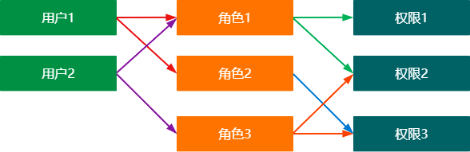

---


# 第八章 Thymeleaf 模板引擎

## 第一节 什么是 Thymeleaf 

虽然JSP为我们带来了便捷，但是其缺点也是显而易见的，那么有没有一种既能实现模板，又能兼顾前后端分离的模板引擎呢？

**Thymeleaf**（百里香叶）是一个适用于Web和独立环境的现代化服务器端Java模板引擎，官方文档：https://www.thymeleaf.org/documentation.html。

那么它和JSP相比，好在哪里呢，我们来看官网给出的例子：

```html
<table>
  <thead>
    <tr>
      <th th:text="#{msgs.headers.name}">Name</th>
      <th th:text="#{msgs.headers.price}">Price</th>
    </tr>
  </thead>
  <tbody>
    <tr th:each="prod: ${allProducts}">
      <td th:text="${prod.name}">Oranges</td>
      <td th:text="${#numbers.formatDecimal(prod.price, 1, 2)}">0.99</td>
    </tr>
  </tbody>
</table>
```

我们可以在前端页面中填写占位符，而这些占位符的实际值则由后端进行提供，这样，我们就不用再像JSP那样前后端都写在一起了。

那么我们来创建一个例子感受一下，首先还是新建一个项目，注意，在创建时，勾选Thymeleaf依赖。

首先编写一个前端页面，名称为`test.html`，注意，是放在resource目录下，在html标签内部添加`xmlns:th="http://www.thymeleaf.org"`引入Thymeleaf定义的标签属性：

```html
<!DOCTYPE html>
<html lang="en" xmlns:th="http://www.thymeleaf.org">
<head>
    <meta charset="UTF-8">
    <title>Title</title>
</head>
<body>
    <div th:text="${title}"></div>
</body>
</html>
```

接着我们编写一个Servlet作为默认页面：

```java
@WebServlet("/index")
public class HelloServlet extends HttpServlet {

    TemplateEngine engine;
    @Override
    public void init() throws ServletException {
        engine = new TemplateEngine();
        ClassLoaderTemplateResolver r = new ClassLoaderTemplateResolver();
        engine.setTemplateResolver(r);
    }

    @Override
    protected void doGet(HttpServletRequest req, HttpServletResponse resp) throws ServletException, IOException {
        Context context = new Context();
        context.setVariable("title", "我是标题");
        resp.setCharacterEncoding("UTF-8");
        engine.process("test.html", context, resp.getWriter());
    }
}
```

我们发现，浏览器得到的页面，就是已经经过模板引擎解析好的页面，而我们的代码依然是后端处理数据，前端展示数据，因此使用Thymeleaf就能够使得当前Web应用程序的前后端划分更加清晰。

虽然Thymeleaf在一定程度上分离了前后端，但是其依然是在后台渲染HTML页面并发送给前端，并不是真正意义上的前后端分离。


## 第二节 Thymeleaf语法基础

那么，如何使用Thymeleaf呢？

首先我们看看后端部分，我们需要通过`TemplateEngine`对象来将模板文件渲染为最终的HTML页面：

```java
TemplateEngine engine;
@Override
public void init() throws ServletException {
    engine = new TemplateEngine();
  	//设定模板解析器决定了从哪里获取模板文件，这里直接使用ClassLoaderTemplateResolver表示加载内部资源文件
    ClassLoaderTemplateResolver r = new ClassLoaderTemplateResolver();
    engine.setTemplateResolver(r);
}
```

由于此对象只需要创建一次，之后就可以一直使用了。接着我们来看如何使用模板引擎进行解析：

```java
@Override
protected void doGet(HttpServletRequest req, HttpServletResponse resp) throws ServletException, IOException {
    //创建上下文，上下文中包含了所有需要替换到模板中的内容
    Context context = new Context();
    context.setVariable("title", "<h1>我是标题</h1>");
    //通过此方法就可以直接解析模板并返回响应
    engine.process("test.html", context, resp.getWriter());
}
```

操作非常简单，只需要简单几步配置就可以实现模板的解析。接下来我们就可以在前端页面中通过上下文提供的内容，来将Java代码中的数据解析到前端页面。

接着我们来了解Thymeleaf如何为普通的标签添加内容，比如我们示例中编写的：

```html
<div th:text="${title}"></div>
```

我们使用了`th:text`来为当前标签指定内部文本，注意任何内容都会变成普通文本，即使传入了一个HTML代码，如果我希望向内部添加一个HTML文本呢？我们可以使用`th:utext`属性：

```html
<div th:utext="${title}"></div>
```

并且，传入的title属性，不仅仅只是一个字符串的值，而是一个字符串的引用，我们可以直接通过此引用调用相关的方法：

```html
<div th:text="${title.toLowerCase()}"></div>
```

这样看来，Thymeleaf既能保持JSP为我们带来的便捷，也能兼顾前后端代码的界限划分。

除了替换文本，它还支持替换一个元素的任意属性，我们发现，`th:`能够拼接几乎所有的属性，一旦使用`th:属性名称`，那么属性的值就可以通过后端提供了，比如我们现在想替换一个图片的链接：

```java
@Override
protected void doGet(HttpServletRequest req, HttpServletResponse resp) throws ServletException, IOException {
    Context context = new Context();
    context.setVariable("url", "http://n.sinaimg.cn/sinakd20121/600/w1920h1080/20210727/a700-adf8480ff24057e04527bdfea789e788.jpg");
  	context.setVariable("alt", "图片就是加载不出来啊");
    engine.process("test.html", context, resp.getWriter());
}
```

```html
<!DOCTYPE html>
<html lang="en" xmlns:th="http://www.thymeleaf.org">
<head>
    <meta charset="UTF-8">
    <title>Title</title>
</head>
<body>
    
</body>
</html>
```

现在访问我们的页面，就可以看到替换后的结果了。

Thymeleaf还可以进行一些算术运算，几乎Java中的运算它都可以支持：

```html
<div th:text="${value % 2}"></div>
```

同样的，它还支持三元运算：

```html
<div th:text="${value % 2 == 0 ? 'yyds' : 'lbwnb'}"></div>
```

多个属性也可以通过`+`进行拼接，就像Java中的字符串拼接一样，这里要注意一下，字符串不能直接写，要添加单引号：

```html
<div th:text="${name}+' 我是文本 '+${value}"></div>
```


## 第三节 Thymeleaf流程控制语法

除了一些基本的操作，我们还可以使用Thymeleaf来处理流程控制语句，当然，不是直接编写Java代码的形式，而是添加一个属性即可。

首先我们来看if判断语句，如果if条件满足，则此标签留下，若if条件不满足，则此标签自动被移除：

```java
@Override
protected void doGet(HttpServletRequest req, HttpServletResponse resp) throws ServletException, IOException {
    Context context = new Context();
    context.setVariable("eval", true);
    engine.process("test.html", context, resp.getWriter());
}
```

```html
<div th:if="${eval}">我是判断条件标签</div>
```

`th:if`会根据其中传入的值或是条件表达式的结果进行判断，只有满足的情况下，才会显示此标签，具体的判断规则如下：

- 如果值不是空的：
  - 如果值是布尔值并且为`true`。
  - 如果值是一个数字，并且是非零
  - 如果值是一个字符，并且是非零
  - 如果值是一个字符串，而不是“错误”、“关闭”或“否”
  - 如果值不是布尔值、数字、字符或字符串。
- 如果值为空，`th:if` 将计算为 `false` 

`th:if`还有一个相反的属性`th:unless`，效果完全相反，这里就不演示了。

我们接着来看多分支条件判断，我们可以使用`th:switch`属性来实现：

```html
<div th:switch="${eval}">
    <div th:case="1">我是1</div>
    <div th:case="2">我是2</div>
    <div th:case="3">我是3</div>
</div>
```

只不过没有default属性，但是我们可以使用`th:case="*"`来代替：

```html
<div th:case="*">我是Default</div>
```

最后我们再来看看，它如何实现遍历，假如我们有一个存放书籍信息的List需要显示，那么如何快速生成一个列表呢？我们可以使用`th:each`来进行遍历操作：

```java
@Override
protected void doGet(HttpServletRequest req, HttpServletResponse resp) throws ServletException, IOException {
    Context context = new Context();
    context.setVariable("list", Arrays.asList("伞兵一号的故事", "倒一杯卡布奇诺", "玩游戏要啸着玩", "十七张牌前的电脑屏幕"));
    engine.process("test.html", context, resp.getWriter());
}
```

```html
<ul>
    <li th:each="title : ${list}" th:text="'《'+${title}+'》'"></li>
</ul>
```

`th:each`中需要填写 "单个元素名称 : ${列表}"，这样，所有的列表项都可以使用遍历的单个元素，只要使用了`th:each`，都会被循环添加。因此最后生成的结果为：

```html
<ul>
        <li>《伞兵一号的故事》</li>
        <li>《倒一杯卡布奇诺》</li>
        <li>《玩游戏要啸着玩》</li>
        <li>《十七张牌前的电脑屏幕》</li>
    </ul>
```

我们还可以获取当前循环的迭代状态，只需要在最后添加`iterStat`即可，从中可以获取很多信息，比如当前的顺序：

```html
<ul>
    <li th:each="title, iterStat : ${list}" th:text="${iterStat.index}+'.《'+${title}+'》'"></li>
</ul>
```

状态变量在`th:each`属性中定义，并包含以下数据：

- 当前*迭代索引*，以0开头。这是`index`属性。
- 当前*迭代索引*，以1开头。这是`count`属性。
- 迭代变量中的元素总量。这是`size`属性。
- 每个迭代的*迭代变量*。这是`current`属性。
- 当前迭代是偶数还是奇数。这些是`even/odd`布尔属性。
- 当前迭代是否是第一个迭代。这是`first`布尔属性。
- 当前迭代是否是最后一个迭代。这是`last`布尔属性。

通过了解了流程控制语法，现在我们就可以很轻松地使用Thymeleaf来快速替换页面中的内容了。


## 第四节 Thymeleaf模板布局

在某些网页中，我们会发现，整个网站的页面，除了中间部分的内容会随着我们的页面跳转而变化外，有些部分是一直保持一个状态的，比如打开小破站，我们翻动评论或是切换视频分P的时候，变化的仅仅是对应区域的内容，实际上，其他地方的内容会无论内部页面如何跳转，都不会改变。

Thymeleaf就可以轻松实现这样的操作，我们只需要将不会改变的地方设定为模板布局，并在不同的页面中插入这些模板布局，就无需每个页面都去编写同样的内容了。现在我们来创建两个页面：

```html
<!DOCTYPE html>
<html lang="en" xmlns:th="http://www.thymeleaf.org">
<head>
    <meta charset="UTF-8">
    <title>Title</title>
</head>
<body>
    <div class="head">
        <div>
            <h1>我是标题内容，每个页面都有</h1>
        </div>
        <hr>
    </div>
    <div class="body">
        <ul>
            <li th:each="title, iterStat : ${list}" th:text="${iterStat.index}+'.《'+${title}+'》'"></li>
        </ul>
    </div>
</body>
</html>
```

```html
<!DOCTYPE html>
<html lang="en" xmlns:th="http://www.thymeleaf.org">
<head>
    <meta charset="UTF-8">
    <title>Title</title>
</head>
<body>
    <div class="head">
        <div>
            <h1>我是标题内容，每个页面都有</h1>
        </div>
        <hr>
    </div>
    <div class="body">
        <div>这个页面的样子是这样的</div>
    </div>
</body>
</html>
```

接着将模板引擎写成工具类的形式：

```java
public class ThymeleafUtil {

    private static final TemplateEngine engine;
    static  {
        engine = new TemplateEngine();
        ClassLoaderTemplateResolver r = new ClassLoaderTemplateResolver();
        engine.setTemplateResolver(r);
    }

    public static TemplateEngine getEngine() {
        return engine;
    }
}
```

```java
@WebServlet("/index2")
public class HelloServlet2 extends HttpServlet {

    @Override
    protected void doGet(HttpServletRequest req, HttpServletResponse resp) throws ServletException, IOException {
        Context context = new Context();
        ThymeleafUtil.getEngine().process("test2.html", context, resp.getWriter());
    }
}
```

现在就有两个Servlet分别对应两个页面了，但是这两个页面实际上是存在重复内容的，我们要做的就是将这些重复内容提取出来。

我们单独编写一个`head.html`来存放重复部分：

```html
<!DOCTYPE html>
<html xmlns:th="http://www.thymeleaf.org" lang="en">
<body>
    <div class="head" th:fragment="head-title">
        <div>
            <h1>我是标题内容，每个页面都有</h1>
        </div>
        <hr>
    </div>
</body>
</html>
```

现在，我们就可以直接将页面中的内容快速替换：

```html
<div th:replace="head.html::head-title"></div>
<div class="body">
    <ul>
        <li th:each="title, iterStat : ${list}" th:text="${iterStat.index}+'.《'+${title}+'》'"></li>
    </ul>
</div>
```

我们可以使用`th:insert`和`th:replace`和`th:include`这三种方法来进行页面内容替换，那么`th:insert`和`th:replace`（和`th:include`，自3.0年以来不推荐）有什么区别？

- `th:insert`最简单：它只会插入指定的片段作为标签的主体。
- `th:replace`实际上将标签直接*替换*为指定的片段。
- `th:include`和`th:insert`相似，但它没有插入片段，而是只插入此片段*的内容*。

你以为这样就完了吗？它还支持参数传递，比如我们现在希望插入二级标题，并且由我们的子页面决定：

```html
<div class="head" th:fragment="head-title">
    <div>
        <h1>我是标题内容，每个页面都有</h1>
        <h2>我是二级标题</h2>
    </div>
    <hr>
</div>
```

稍加修改，就像 `JS` 那样添加一个参数名称：

```html
<div class="head" th:fragment="head-title(sub)">
    <div>
        <h1>我是标题内容，每个页面都有</h1>
        <h2 th:text="${sub}"></h2>
    </div>
    <hr>
</div>
```

现在直接在替换位置添加一个参数即可：

```html
<div th:include="head.html::head-title('这个是第1个页面的二级标题')"></div>
<div class="body">
    <ul>
        <li th:each="title, iterStat : ${list}" th:text="${iterStat.index}+'.《'+${title}+'》'"></li>
    </ul>
</div>
```

这样，不同的页面还有着各自的二级标题。

---


# 第九章 探讨 Tomcat 类加载机制

有关JavaWeb的内容，我们就聊到这里，在最后，我们还是来看一下Tomcat到底是如何加载和运行我们的Web应用程序的。

Tomcat服务器既然要同时运行多个Web应用程序，那么就必须要实现不同应用程序之间的隔离，也就是说，Tomcat需要分别去加载不同应用程序的类以及依赖，还必须保证应用程序之间的类无法相互访问，而传统的类加载机制无法做到这一点，同时每个应用程序都有自己的依赖，如果两个应用程序使用了同一个版本的同一个依赖，那么还有必要去重新加载吗，带着诸多问题，Tomcat服务器编写了一套自己的类加载机制。


首先我们要知道，Tomcat本身也是一个Java程序，它要做的是去动态加载我们编写的Web应用程序中的类，而要解决以上提到的一些问题，就出现了几个新的类加载器，我们来看看各个加载器的不同之处：

- **`Common ClassLoader`**：Tomcat最基本的类加载器，加载路径中的class可以被Tomcat容器本身以及各个Web应用程序访问。
- **`Catalina ClassLoader`**：Tomcat容器私有的类加载器，加载路径中的class对于Web应用程序不可见。
- **`Shared ClassLoader`**：各个Web应用程序共享的类加载器，加载路径中的class对于所有Web应用程序可见，但是对于Tomcat容器不可见。
- **`Webapp ClassLoader`**：各个Web应用程序私有的类加载器，加载路径中的class只对当前Web应用程序可见，每个Web应用程序都有一个自己的类加载器，此加载器可能存在多个实例。
- **`JasperLoader`**：JSP类加载器，每个JSP文件都有一个自己的类加载器，也就是说，此加载器可能会存在多个实例。

通过这样进行划分，就很好地解决了我们上面所提到的问题，但是我们发现，这样的类加载机制，破坏了 JDK 的`双亲委派机制`，比如`Webapp ClassLoader`，它只加载自己的class文件，它没有将类交给父类加载器进行加载，也就是说，我们可以随意创建和 JDK 同包同名的类，岂不是就出问题了？

难道 Tomcat 的开发团队没有考虑到这个问题吗？


实际上，`WebAppClassLoade`r 的加载机制是这样的：`WebAppClassLoader` 加载类的时候，绕开了 `AppClassLoader`，直接先使用  `ExtClassLoader`  来加载类。这样的话，如果定义了同包同名的类，就不会被加载，而如果是自己定义 的类，由于该类并不是JDK内部或是扩展类，所有不会被加载，而是再次回到 `WebAppClassLoader` 进行加载，如果还失败，再使用 `AppClassloader` 进行加载。

---

