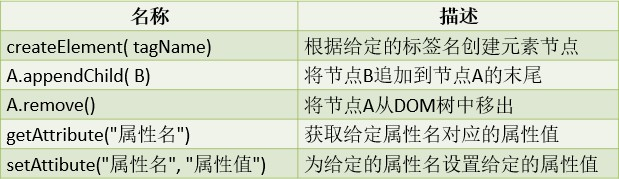

# 第一章 JavaScript 基础

## 第一节 JavaScript 基础

### 1. JavaScript 介绍

JavaScript 是一种解释性脚本语言（不用编译），主要用于向 HTML 添加交互行为，语法与 Java 语言类似。
JavaScript 由 ECMAScript（简称 ES）、DOM（Document Object Model） 和 BOM（Broswer Object Model） 三大部分组成。

### 2. JavaScript 基本结构

```html
<script type="text/javascript">
    //JavaScript 代码
</script>
```

该结构可以在HTML中的任意位置书写，但必须保证 JavaScript 脚本中使用到的元素必须在 JavaScript 脚本执行前完成加载。

### 3. JavaScript 执行过程

用户从浏览器发出页面请求，服务器接收请求并进行处理，处理完成后会将页面返回至浏览器，浏览器开始解释执行该页面，如果页面中包含有 JavaScript 脚本，那么浏览器会再次向服务器发出 JavaScript 脚本获取请求，服务器接收请求并进行处理，处理完成后会将 JavaScript 脚本返回至浏览器，浏览器开始解释执行JavaScript 脚本。


### 4. JavaScript 引入方法

JavaScript 的引入方式与 CSS样式引入方式是一致的，分为行内脚本、内部脚本和外部脚本。

<font color=blue>行内脚本</font>

```html
<input type="button" value="点击" onclick="alert('你点击了按钮');">
```

<font color=blue>内部脚本</font>

```html
<input type="button" value="点击" id="btn"> <script type="text/javascript">
	document.getElementById("btn").onclick=function(){
         alert('你点击了按钮');
     }
</script>
```

<font color=blue>外部脚本</font>

```javascript
// demo.js
document.getElementById("btn").onclick=function(){
	alert('你点击了按钮');
}
```

```html
<!-- demo.html -->
<input type="button" value="点击" id="btn">
<script type="text/javascript" src="demo.js"></script>
```


## 第二节 JavaScript 语法

### 1. 数据类型

| 数据类型  | 说明                                                         |
| --------- | ------------------------------------------------------------ |
| undefined | var msg; 变量msg没有赋初始值，默认为undefined                |
| null      | 空值，与undefined值相同，但类型不太同                        |
| number    | var num = 10;                                                |
| bollean   | var valid = true;                                            |
| string    | var name = "枫阿雨";  var sex = '男';                        |
| obeject   | var obj = new Object();  var stu = {name: '枫阿雨', sex'男'} |

### 2. 变量

#### 2.1 var 关键字定义变量

JavaScript 是一种弱类型语言（没有类型之分），因此，在定义的变量的时候统一使用<font color=red>**var**</font>关键字来定义。<font color=red>**在JavaScript中，变量也是严格区分大小写的**</font>

```js
// variable
var msg = 20; //赋值数字
msg = "字符串"; //赋值字符串msg = true; //赋值布尔值
msg = new Object(); //赋值对象
```

#### 2.2 let 关键字定义变量

```js
let name = "张三";
let number = 10;
```

#### 2.3 var 和 let 的区别

```js
{
    let innerLet = "代码块内定义的let变量";
    var innerVar = "代码块内定义的var变量";
}
console.log(innerVar);
console.log(innerLet);
```

由此可以得出：<font color=red>**let 声明的变量只在它所在的代码块有效。var 声明的变量属于全局变量**</font>

### 3. 字符串

#### 3.1 定义字符串

在JavaScript 中，凡事使用单引号或者双引号引起来的内容都属于字符串。

<font color=blue>示例</font>：

```js
let name = "枫阿雨"; //双引号表示的字符串
let sex = '男'; //单引号表示的字符串
```

> 注：JS中没有字符的数据类型

#### 3.2 字符串常用方法

| 方法名称                | 说明                                           |
| ----------------------- | ---------------------------------------------- |
| charAt(index)           | 返回在指定位置的字符                           |
| indexOf(str, index)     | 查找某个指定的字符串在字符串中首次出现的位置   |
| substring(start, end)   | 返回字符串中位于区间[start, end)内的字符串     |
| split(str)              | 将字符串按照给定的字符串分割为字符串数组       |
| replace(oldStr, newStr) | 将字符串中指定的子字符串使用新的字符串进行替换 |

<font color=blue>示例</font>：

```js
let str = "这是一个字符串";
console.log(str.length);//打印字符串的长度
let c = str.charAt(1); //获取下标为1的字符，在JS中没有字符，因此结果是一个字符串
console.log(c);
let index = str.indexOf("个");//如果没有传递第二个参数则默认为0，如果未找到返回-1
console.log(index);
let sub = str.substring(3, 6);; //获取字符串中位于区间[3, 6)之间的字符串
console.log(sub);
let arr = str.split(""); //将字符串按照空白字符串进行分割，分割结果为字符串数组
console.log(arr);
let replaceStr = str.replace("一个", "");//将字符串中的"一个"使用空白字符串替换
console.log(replaceStr);
```

### 4. 数组

#### 4.1 创建数组

```js
let 数组名 = new Array(数组长度);
let 数组名 = new Array(数组元素1, 数组元素2, ..., 数组元素n);
let 数组名 = [数组元素1, 数组元素2, ..., 数组元素n];
```

<font color=blue>示例</font>：

```js
let numbers = new Array(10);//创建了一个长度位10的数组
let names = new Array("A","B","C");
let characters = ['A', 'B', 'C'];//在JS中中括号表示数组
```

#### 4.2 数组元素赋值

```js
let numbers = new Array(10);//创建了一个长度位10的数组
numbers[0] = 1; //通过下标为数组元素赋值
numbers[1] = 2;
numbers[0] = 3; //修改数组中的元素
```

#### 4.3 数组常用方法

| 名称                                           | 描述                                                         |
| ---------------------------------------------- | ------------------------------------------------------------ |
| push(元素1, 元素2, ..., 元素n)                 | 将给定的元素添加到数组的末尾，并返回当前数组的长度           |
| join(str)                                      | 将数组中的每个元素按照给定的字符串组合起来                   |
| splice(index, count)                           | 从数组给定的下标位置删除给定数量的元素                       |
| splice(index, count, 元素1, 元素2, ..., 元素n) | 从数组给定的下标位置删除给定数量元素，然后将给定的元素插入到删除的位置 |
| concat(数组1, 数组2, ..., 数组n)               | 将给定的数组与当前数组一次拼接起来，返回一个新的数组         |

<font color=blue>示例</font>：

```js
let num1=  [1, 2, 3]
let length = num1.push(4, 5);//一次放入多个元素至数组中
console.log("数组长度：" + length);
let num2 = [6, 7, 8];
let num3 = num1.concat(num2);//将数组num2与num1进行在新数组中进行拼接，num2在num1之后
console.log("拼接后：" +num3);
num3.splice(2, 1); //将数组num3从下标为2的位置删除1个元素
console.log("删除元素后：" + num3);
num3.splice(3, 2, 10, 20, 30); //将数组num3从下标为3的位置删除2个元素，然后将10,20,30从删除位置添加到数组中
console.log("删除元素的同时增加元素：" + num3)
let str = num3.join(","); //将数组num3中所有元素使用","拼接起来
console.log(str);
```

### 5. 对象

```js
let 对象名 = new Object(); //创建对象
对象名.属性名1 = 属性值1; //为对象添加属性
对象名.属性名2 = 属性值2;
...
对象名.属性名n = 属性值n;
let 对象名 = { //使用大括号创建对象
    属性名1: 属性值1, //属性名和属性值的关系使用冒号表示，多个属性之间使用逗号分割开
    属性名2: 属性值2,
	...
 	属性名n: 属性值n;
};
```

<font color=blue>示例</font>：

```js
let stu = new Object();
stu.name = "枫阿雨";
stu.sex = "男";
stu.age = 19;
console.log(stu);

let programmer = {
    name : '枫阿雨',
    job : '后端工程师',
    salary : 27000
};
console.log(programmer);
```


## 第三节 运算符

| 类型       | 运算符                                        |
| ---------- | --------------------------------------------- |
| 算术运算符 | `+`  `-`  `*`  `/`  `%`  `++`  `--`           |
| 赋值运算符 | `=`  `+=`  `-=`                               |
| 比较运算符 | `>`  `<` ` >=`  `<=`  `==` `!=`  `===`  `!==` |
| 逻辑运算符 | `&&`  `||`  ` !`                              |

<font color=blue>示例</font>：

```js
let a = 1, b = 2;
console.log(a++);
console.log(a);
console.log(++a);
console.log(a);
a += b;
console.log(a);
//在Java中两个整数相除所得的结果一定是整数;但是在JavaScript中,
//两个整数相除,得到的结果可能是浮点数
let result = a / b;
console.log(result)
   console.log( a % b);
let c = "2";
console.log( b == c); //两个等号进行比较,只比较内容是否相同
console.log( b === c); //三个等号进行比较,比较内容是否相同的同时还要检查数据类型是否一致
console.log( b != c); //只有一个等号的不等于
console.log( b !== c);//有两个等号的不等于
let s1 = a > 1 && b === c; //逻辑与
let s2 = a > 1 || b === c; //逻辑或
let s3 = !a > 1 //逻辑非
 console.log(s1 + " " + s2 + " " + s3);
```


## 第四节 流程控制语句

### 1. if 语句

```js
if(条件){
    
} else {
    
}
```

<font color=blue>示例</font>：

```js
let a = 10;
if(typeof a === "number"){
 	console.log("变量a是一个数字")
} else {
 	console.log("变量a不是一个数字")
}
```

### 2. switch 语句

```js
switch(表达式){
	case 常量1: break;
    case 常量2: break;
    ...
	case 常量n: break;
    default:
        
}
```

<font color=blue>示例</font>：

```js
let a = 10;
switch (a % 3) {
	case 1:
 		console.log("变量a与3求模的结果是1")
        break
	case 2:
        console.log("变量a与3求模的结果是2")
        break;
    default:
        console.log("变量a能够被3整除")
}
```

### 3. 循环语句

```js
for(循环变量初始化;循环条件;循环变量更新){
    //循环操作
}

while(循环条件){
    //循环操作
}

do{
    //循环操作
} while(循环条件);

for(let 变量名 in 对象或数组){
    //循环操作
}

//循环语句中的break和continue
```


## 第四节 函数

### 1. 函数的概念

函数是用于完成特定功能的语句块，类似于 Java 语言中的方法。函数分为系统函数和自定义函数。

### 2. 系统函数

#### 2.1 窗体函数

| 函数名             | 说明       |
| ------------------ | ---------- |
| alert("提示信息")  | 提示对话框 |
| confir("提示信息") | 确认对话框 |
| prompt("提示信息") | 输入对话框 |

<font color=blue>示例</font>：

```js
// alert("这是提示信息");
//确认对话框会有一个返回值,该值表示用户是否进行了确认
// let result = confirm("确定要删除这些信息吗?");
// console.log(result);
//输入对话框有一个返回值,该值即为输入的信息;
//如果用户没有进行输入而进行确认,那么结果为空字符串;
//如果用户进行取消操作,那么结果为null
let input = prompt("请输入一个数字:");
console.log(input)
```

#### 2.2 数字相关函数

| 函数名       | 说明                       |
| ------------ | -------------------------- |
| pareInt()    | 将给定的字符串转换为整数   |
| parseFloat() | 将给定的字符串转换为浮点数 |
| isNaN()      | 判断给定的值是否不是数字   |

<font color=blue>示例</font>：

```js
//在JavaScript中,parseInt函数能够将以数字开头的任意字符串转换为整数
let a = parseInt("12a3");
console.log(a)
//在JavaScript中,parseFloat函数能够将以数字以及'.'号开头的任意字符串转换为浮点数let b = parseFloat(".123a")
console.log(b)
let result = isNaN("123");
console.log(result)
```

#### 2.3 Math 类函数

| 方法         | 说明                 | 示例                                 |
| ------------ | -------------------- | ------------------------------------ |
| ceil(数值)   | 向上取整             | Math.ceil(2.1); 结果为3              |
| floor(数值)  | 向下取整             | Math.floor(2.9); 结果为2             |
| round(数值)  | 取距离该数最近的数   | Math.round(2.5); 结果为3             |
| random(数值) | 取[0, 1]之间的随机数 | Math.random(); 结果为0~1之间的浮点数 |

<font color=blue>示例</font>：

```js
console.log(Math.ceil(0.2)); console.log(Math.floor(0.99999)); console.log(Math.abs(-1))
//返回与给定数值最近的一个整数
console.log(Math.round(-2.6))
console.log(Math.random());
```

### 3. 自定义函数

```js
function 函数名(参数1, 参数2, ... , 参数n){
	//JavaScript语句
	return 返回值; //需要返回值时使用return关键字返回；不需要时，不写return语句即可。
}

//函数调用
函数名(参数值1, 参数值2, ..., 参数值n);
```

<font color=blue>示例</font>：

```js
//int sum(int a, int b){
//   return a + b;
// }
//void show(){
//  System.out.println("这是Java中的方法"); // }
function sum(a, b) {
    return a + b;
}

function show() {
     console.log("这是JavaScript中的方法")
}

show();
let result = sum(1, 2);
console.log(result);
/**
*	在JavaScript中，一个函数的返回值也可以是一个函数
*	@param a
*	@param b
*	@param c
*	@returns {function(*): number}
*/
function calculate(a, b, c) {
    let result = a * b;
	return function (d) {
        return result + c * d;
    }
}

//此时需要注意的是，calculate函数执行后得到的结果是一个函数，也就是说，在JavaScript中， //变量可以存储一个函数，这种情况，我们把这个变量当作函数使用即可
let s = calculate(1, 2, 3);
let num = s(4); //再次调用函数，得到计算结果
console.log(num);
//闭包
let n = calculate(1, 2, 3)(4); //函数调用
console.log(n);
```

### 4. 元素事件与函数

| 名称      | 说明                               |
| --------- | ---------------------------------- |
| click     | 鼠标左键单击元素                   |
| blur      | 元素失去焦点                       |
| focus     | 元素获得焦点                       |
| keydown   | 键盘按键被按下                     |
| keyup     | 键盘按键被按下后释放               |
| mouseover | 鼠标移动至元素上                   |
| mouseout  | 鼠标移动至元素外                   |
| change    | 元素内容发生改变                   |
| input     | 元素内容发生改变(可完全替代change) |

开启元素事件只需要在事件名前面加上 `on`即可，关闭元素事件只需要在事件名前面加上 `off`即可

---


# 第二章 BOM 和 DOM

### 第一节 BOM

### 1. BOM 概念

BOM（Browser Object Model），即浏览器对象模型，BOM 提供了独立于内容的对象结构，可以与浏览器窗口进行互动


### 2. window 对象

window对象包含了3个对象：`history`、`document`和 `location`

#### 2.1 history 对象

history对象主要用于控制页面的历史记录的显示


<font color=blue>示例</font>：

```html
<!-- h1.html -->
<body>
    <a href="h2.html">去下一个界面</a>
</body>

<!-- h2.html -->
<body>
    <a href="javascript: history.back()">返回上一个界面</a>
    <a href="javascript: history.forward()">去下一个界面1</a>
    <a href="h3.html">去下一个界面3</a>
</body>

<!-- h3.html -->
<body>
    <a href="javascript: history.go(-2)">返回第一个页面</a>
</body>
```


#### 2.2 location 对象

location对象主要用于获取以及更改浏览器地址栏信息


<font color=blue>示例</font>：

```js
<body>
    <!-- javascript: void(0) 表示点击超链接时不做任何事情 -->
    <a href="javascript:void(0)" onclick="showAddress()">显示地址栏信息</a>
    <a href="javascript:void(0)" onclick="refresh()">刷新页面</a>
    <a href="javascript:void(0)" onclick="changePage()">替换新页面</a>
</body>
<script type="text/javascript">
    function showAddress() {
        console.log(1);
        console.log(location.host);
        console.log(location.hostname);
        console.log(location.href);
    }

    function refresh() {
        console.log(location.reload());
    }

    function changePage() {
        location.replace("h2.html");
    }
</script>
```

> 注：VSCode预览网页是通过打开本地文件，所以没有host和hostname

#### 2.3 document 对象


<font color=blue>示例</font>：

```html
<body>
    <div id="a">a</div>
    <div id="b" class="c">b</div>
    <div class="c">c</div>
    <div name="d">d</div>

</body>
<script type="text/javascript">
    let div = document.getElementById("a");//得到单个元素
    console.log(div)
    div.innerText = "将内容改变为b";//内部文本内容
    div.innerHTML = "<h1>将内容改变为b</h1>";//内部HTML内容
    div.textContent = "<h1>文本内容</h1>"; //作用域innerText一样
    console.log("==============")
    //通过标签名获取元素
    let divArr = document.getElementsByTagName("div");
    console.log(divArr)
    console.log("==============")
    //通过类名获取元素
    let arr = document.getElementsByClassName("c");
    console.log(arr)
    console.log("==============")
    let nameArr = document.getElementsByName("d");
    console.log(nameArr)
</script>
```


## 第二节 Date 类


<font color=blue>示例</font>：

```html
<script type="text/javascript">
    let now = new Date(); //创建一个日期对象，默认事件为系统当前时间
    let year = now.getFullYear(); //获取年份
    let month = now.getMonth() + 1; //获取月份 月份 在 0~11 之间
    let date = now.getDate(); //获取日期是当前月的第几天
    let hour = now.getHours(); //获取小时数
    let minute = now.getMinutes(); //获取分钟数
    let second = now.getSeconds(); //获取秒数
    let time = year + "-" + zerofill(month, 2) + "-" + zerofill(date, 2) + " " + zerofill(hour, 2) + ":" + zerofill(minute, 2) + ":" + zerofill(second, 2);
    console.log(time)
    let weekday = now.getDay(); //获取当前日期是一周的第几天，一周的开始是周日，值为0
    console.log(weekday)

    now.setMonth(month)
    now.setDate(0);
    console.log(now.getDate)//需要注意的是：在取当月最大天数时，需要将月份重新设置，日期设置为0即可

    function zerofill(num, tagetLent) {
        let str = num + "";
        while (str.length < tagetLent) {
            str = 0 + str;
        }
        return str;
    }
</script>
```


## 第三节 周期函数和延迟函数


<font color=blue>示例</font>：

```html
<body>
    <div id="time"></div>
</body>

<script type="text/javascript">
    let count = 0;
    function showTime() {
        let now = new Date(); //创建一个日期对象，默认事件为系统当前时间
        let year = now.getFullYear(); //获取年份
        let month = now.getMonth() + 1; //获取月份 月份 在 0~11 之间
        let date = now.getDate(); //获取日期是当前月的第几天
        let hour = now.getHours(); //获取小时数
        let minute = now.getMinutes(); //获取分钟数
        let second = now.getSeconds(); //获取秒数
        let time = year + "-" + zerofill(month, 2) + "-" + zerofill(date, 2) + " " + zerofill(hour, 2) + ":" + zerofill(minute, 2) + ":" + zerofill(second, 2);
        console.log(time)
        let div = document.getElementById("time");
        div.textContent = time;
        count++;
        //当count为10的时候周期函数需要停止
        // if (count == 10) {
        //     clearInterval(t);//清理给定的周期函数
        // }
    }

    // let t = setInterval(showTime, 1000);
    // setInterval("showTime()", 1000);

    let s = setTimeout(showTime, 3000)//在3秒后执行一次showtime函数
    clearTimeout(s);//清理后就不会再执行

    function zerofill(num, tagetLent) {
        let str = num + "";
        while (str.length < tagetLent) {
            str = 0 + str;
        }
        return str;
    }
</script>
```


## 第四节 DOM

### 1. DOM 概念

DOM（Document Object Model），即文档对象模型，DOM主要提供了对于页面内容的一些操作。<font color=red>**在DOM中，所有的内容（标签和文本）都是DOM节点，所有的标签都是DOM元素。**</font>

### 2. DOM 节点关系


### 3. 节点属性


<font color=blue>示例</font>：

```html
<body>
    <div id="box">
        <!-- 该位置处有个enter键 -->
        <div>
            <input type="text">
        </div>
        <a href="javascript:void(0)">超链接1</a>
        <a href="javascript:void(0)">超链接2</a>
        <a href="javascript:void(0)">超链接3</a>
        <a href="javascript:void(0)">超链接4</a>
        <a href="javascript:void(0)">超链接5</a>
    </div>
    <a href="javascript:void(0)">超链接6</a>
</body>
<script type="text/javascript">
    let box = document.getElementById("box");
    console.log(box.parentNode)//父节点
    let childNodes = box.childNodes;//文本内容包括enter键在内的换行和注释都属于节点
    console.log(childNodes)//下一级子节点
    console.log(box.firstChild)//第一个子节点(文本节点)
    console.log(box.lastChild)//最后一个子节点(文本节点)
    let first = childNodes[0];//第一个子节点
    console.log(first.nextSibling)
    let last = box.lastChild;//最后一个子节点
    console.log(last.previousSibling)
</script>
```

### 4. 元素属性


> 注：元素就只包含标签

<font color=blue>示例</font>：

```html
<body>
    <div id="box">
        <!-- 该位置处有个enter键 -->
        <div>
            <input type="text">
        </div>
        <a href="javascript:void(0)">超链接1</a>
        <a href="javascript:void(0)">超链接2</a>
        <a href="javascript:void(0)">超链接3</a>
        <a href="javascript:void(0)">超链接4</a>
        <a href="javascript:void(0)">超链接5</a>
    </div>
    <a href="javascript:void(0)">超链接6</a>
</body>
<script type="text/javascript">
    let box = document.getElementById("box");
    console.log(box.parentElement);//父元素, 也就是标签
    let children = box.children;
    console.log(children)
    console.log(box.firstElementChild)//第一个子元素
    console.log(box.lastElementChild)//最后一个子元素
    console.log(box.firstElementChild.nextElementSibling)//第一子元素的下一个同级元素
    console.log(box.firstElementChild.previousElementSibling)//第一子元素的上一个同级元素
</script>
```


### 5. 节点操作



<font color=blue>示例</font>：

```html
<body>
    <input type="button" value="查询" id="searchBtn">
    <table>
        <thead>
            <tr>
                <td>姓名</td>
                <td>性别</td>
                <td>年龄</td>
            </tr>
        </thead>
        <tbody id="dataBox"></tbody>
    </table>
</body>
<script type="text/javascript">
    let stus = [{
        name: '枫阿雨1',
        seX: '男',
        age: 19
    }, {
        name: '枫阿雨2',
        seX: '男',
        age: 19
    }, {
        name: '枫阿雨3',
        seX: '男',
        age: 19
    }, {
        name: '枫阿雨4',
        seX: '男',
        age: 19
    }];
    let btn = document.getElementById("searchBtn")
    btn.onclick = function () {
        let dataBox = document.getElementById("dataBox");
        let table = dataBox.parentElement;
        dataBox.remove();//将tbody从DOM树中移除
        dataBox = document.createElement("tbody");//创建tr标签
        dataBox.setAttribute("id", "dataBox");
        table.appendChild(dataBox);

        for (let i = 0; i < stus.length; i++) {
            let tr = document.createElement("tr");//创建tr标签
            let td = document.createElement("td");//创建td标签
            td.textContent = stus[i].name;
            tr.appendChild(td)//将td追加到tr的末尾
            td = document.createElement("td");
            td.textContent = stus[i].seX;
            tr.append(td);
            td = document.createElement("td");
            td.textContent = stus[i].age;
            tr.append(td);

            dataBox.appendChild(tr);
        }
    }
</script>
```

### 6. 节点样式

#### 6.1 style 样式

```js
// 节点.style.样点属性 = "值";
```

#### 6.2 class 样式

```js
// 节点.className = "样式名称";
```

<font color=blue>示例</font>：

```html
</head>
	<style>
        .box {
            width: 200px;
            height: 200px;
            border: 1px solid #ddd;
        }
        .active{
            background-color: red;
        }
    </style>
</head>

<body>
    <div id="a" class="box active"></div>
</body>
<script type="text/javascript">
    let div = document.getElementById("a");
    // div.style.height = "50px";
    // div.style.backgroundColor = "red";
    //div.className = "box";
    //div.className = "";
    div.className = "box";
```


### 7.节点属性


> 注：仅作了解

## 第五节 Promise 对象

### 1. Promise 简介

Promise 对象代表了未来将要发生的事件，用来传递异步操作的消息，其状态不受外界影响。Promise 对象代表一个异步操作，有三种状态：

- `pending`: 初始状态，不是成功或失败状态。
- `fulfilled`: 意味着操作成功完成。
- `rejected`: 意味着操作失败。

只有异步操作的结果，可以决定当前是哪一种状态，任何其他操作都无法改变这个状态。这也是 Promise 这个名字的由来，它的英语意思就是<font color=red>**承诺**</font>，表示其他手段无法改变。

一旦 Promise 对象从初始状态改变，就不会再变，任何时候都可以得到这个结果。Promise 对象的状态改变，只有两种可能：从 `Pending` 变为 `Resolved` 和从 `Pending` 变为 `Rejected`。只要这两种情况发生，状态就凝固了，不会再变了，会一直保持这个结果。

### 2. Promise 应用

```js
let promise = new Promise(function(resolve, reject) {
    // 异步处理
 	// 处理结束后、调用resolve 或 reject
});
promise.then(function(result){
    //result的值是上面调用resolve(...)方法传入的值.可以对该结果进行相应的处理
});

promise.catch(function(error){
    //error的值是上面调用reject(...)方法传入的值.可以对该结果进行相应的处理
});

//链式调用
let promise = new Promise(function(resolve, reject) {
 	// 异步处理
  	// 处理结束后、调用resolve 或 reject
}).then(function(result){
 	//result的值是上面调用resolve(...)方法传入的值.可以对该结果进行相应的处理 
}).catch(function(error){
    //error的值是上面调用reject(...)方法传入的值.可以对该结果进行相应的处理
});
```

Promise 构造函数包含一个参数和一个带有 resolve（解析）和 reject（拒绝）两个参数的回调。在回调中执行一些操作（例如异步），如果一切都正常，则调用 resolve，否则调用 reject。

<font color=blue>示例</font>：

```js
function calculate(a, b) {
	let promise = new Promise(function (resolve, reject) {
    	if (b === 0) { //异常情况处理使用reject函数进行拒绝
        	reject(new Error("除数不能为0"))
		} else { //成功处理的情况适合用resolve函数进行处理
            resolve(a / b);
        }
	});
    //这里resp接受的值就是promise对象中resolve函数的参数值
	promise.then(function (resp) {
    	console.log("处理成功: " + resp);
	});
    //这里error接收的值就是reject函数的参数值
    promise.catch(function (error) {
        console.log("处理失败: " + error);
    });
}

calculate(2, 0);
```


## 第六节 箭头函数

箭头函数相当于Java中的 lambda 表达式，传递的依然是实现过程。

<font color=blue>示例</font>：

```js
function calculate(a, b) {
	let promise = new Promise((resolve, reject) => {
    	if (b === 0) { //异常情况处理使用reject函数进行拒绝
        	reject(new Error("除数不能为0"))
		} else { //成功处理的情况适合用resolve函数进行处理
            resolve(a / b);
        }
	});
    //这里resp接受的值就是promise对象中resolve函数的参数值
	promise.then(resp => {
    	console.log("处理成功: " + resp);
	});
    //这里error接收的值就是reject函数的参数值
    promise.catch(error => {
        console.log("处理失败: " + error);
    });
}

calculate(2, 0);
```


## 第七节 综合练习

**1. location 对象有哪些常用属性**

```js
location.href="URL地址"; //设置浏览器地址栏的URL地址
location.host; //取主机信息:包括了IP地址和端口号
location.hostname; //取主机IP地址
location.port; //取端口号
```

**2. document 对象有哪些常用的方法**

```js
//根据name属性值查找元素,查找结果可能有多个元素,因此返回值是一个数组
document.getElementsByName("name属性值");
//根据标签名查找元素,查找结果可能有多个元素,因此返回值是一个数组
document.getElementsByTagName("标签名");
//根据类样式名称查找元素,查找结果可能有多个元素,因此返回值是一个数组
document.getElementsByClassName("类样式名称");
```

**3. Date 类有哪些常用的方法**

```js
let year = date.getFullYear(); //获取年份
let month = date.getMonth(); //获取月份, 月份的取值范围是0~11
let day = date.getDate(); //获取当前日期是当前月的第几天
let week = date.getDay(); //获取当前日期是周几
let hour = date.getHours(); //获取小时数
let minute = date.getMinutes(); //获取分钟数
let second = date.getSeconds(); //获取秒数
date.setDate(天数); //设置天数
```

**4. 周期函数和延迟函数如何使用**

```js
setInterval(函数, 时间);

let t = setInterval(function(){
  //周期性完成的事件
}, 1000);
clearInterval(t); //清除周期函数
setTimeout(函数, 时间);
let s = setTimeout(function(){
  //延迟后需要完成的事件
}, 1000);

clearTimeout(s); //清除延迟函数,清除后,延迟函数将不会执行
```

**5. DOM 元素和DOM 节点有什么区别**

```tex
DOM元素是指标签相关的内容,DOM节点是指标签和文本内容,因此可以得出:DOM节点囊括的范围比DOM元素要大
```

**6. Promise 函数的定义与使用**

```js
//reject函数表示失败时要处理的结果
let p = new Promise(function(resolve, reject){
    
});
p.then(function(result){
});
p.catch(function(error){
});

function calculate(a, b){
	let p = new Promise(function(resolve, reject){
         if(b == 0){//不能处理的情况,视为失败
			reject(new Error("除数不能为0"));
         } else {
			resolve(a/b);
         }
    });
    p.then(function(result){//成功的回调函数,result参数接收的是resolve函数传递的值
         console.log(result);
	});
	p.catch(function(error){//失败的回调函数,error参数接收的是reject函数传递的值
        console.log(error);
    });
}

function calculate(a, b){
	new Promise(function(resolve, reject){
		if(b == 0){//不能处理的情况,视为失败
			reject(new Error("除数不能为0"));
        } else {
             resolve(a/b);
        }
	}).then(function(result){//成功的回调函数,result参数接收的是resolve函数传递的值
		console.log(result);
    }).catch(function(error){//失败的回调函数,error参数接收的是reject函数传递的
        console.log(error);
    });
}
```

**7. 箭头函数的使用**

```js
setInterval(function(){
  console.log(1);
}, 1000);
setInterval(() => console.log(1), 1000);
setInterval(_ => console.log(1), 1000);
```

---

