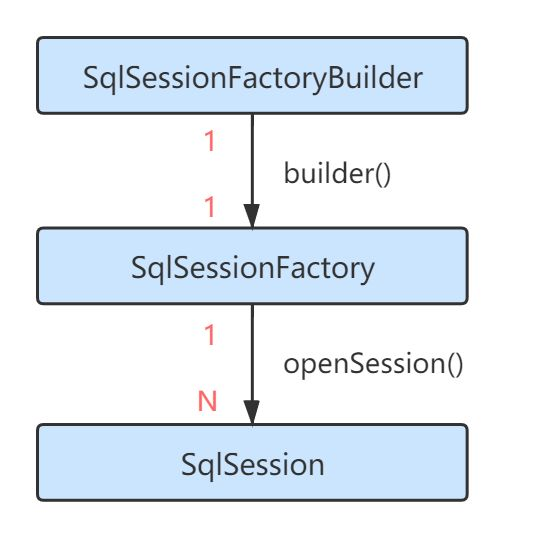
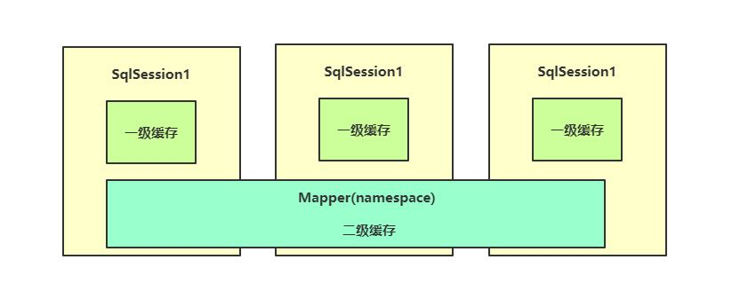
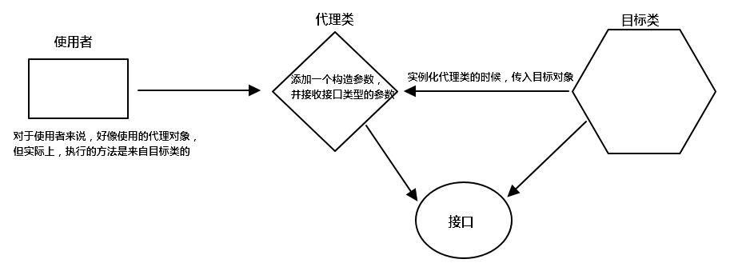
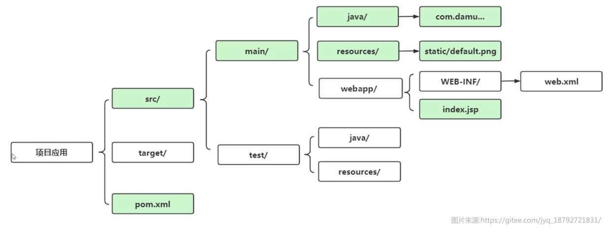
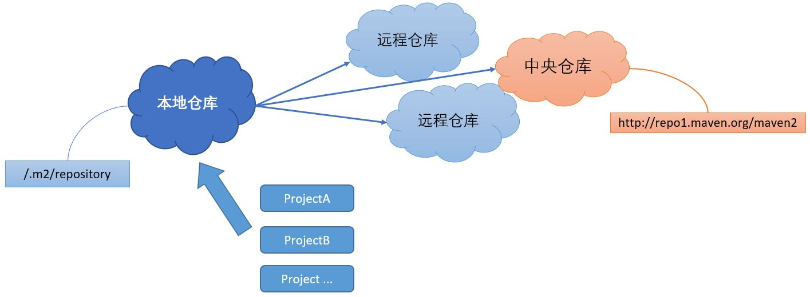
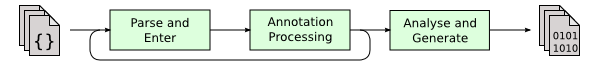
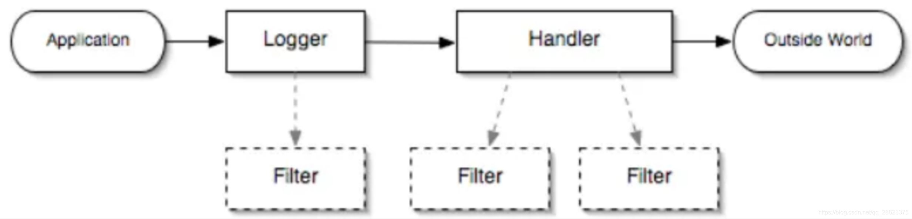

# 第一章 认识 MyBatis

在前面 JDBC 的学习中，虽然我们能够通过 JDBC 来连接和操作数据库，但是哪怕只是完成一个 SQL 语句的执行，都需要编写大量的代码，更不用说如果我还需要进行实体类映射，将数据转换为我们可以直接操作的实体类型， JDBC 很方便，但是还不够方便，我们需要一种更加简洁高效的方式来和数据库进行交互。


MyBatis 是一款优秀的持久层框架，它支持定制化 SQL、存储过程以及高级映射。MyBatis 避免了几乎所有的 JDBC 代码和手动设置参数以及获取结果集。MyBatis 可以使用简单的 XML 或注解来配置和映射原生信息，将接口和 Java 的 POJOs (Plain Ordinary Java Object，普通的 Java对象)映射成数据库中的记录。


## 第一节 初次使用 MyBatis

MyBatis 中文文档网站：https://mybatis.org/mybatis-3/zh/configuration.html

首先需要导入MyBatis的依赖，同样地放入到项目的根目录下，右键作为依赖即可！（依赖变多之后，我们可以将其放到一个单独的文件夹，不然会很繁杂）

依赖导入完成后，我们就可以编写 MyBatis 的配置文件了（现在不是在Java代码中配置了，而是通过一个XML文件去配置，这样就使得硬编码的部分大大减少，项目后期打包成Jar运行不方便修复，但是通过配置文件，我们随时都可以去修改，就变得很方便了，同时代码量也大幅度减少，配置文件填写完成后，我们只需要关心项目的业务逻辑而不是如何去读取配置文件）我们按照官方文档给定的提示，在项目根目录下新建名为`MyBatis-config.xml`的文件，并填写以下内容：

```dtd
<?xml version="1.0" encoding="UTF-8" ?>
<!DOCTYPE configuration
  PUBLIC "-//mybatis.org//DTD Config 3.0//EN"
  "http://mybatis.org/dtd/mybatis-3-config.dtd">
<configuration>
  <environments default="development">
    <environment id="development">
      <transactionManager type="JDBC"/>
      <dataSource type="POOLED">
        <property name="driver" value="${驱动类（含包名）}"/>
        <property name="url" value="${数据库连接URL}"/>
        <property name="username" value="${用户名}"/>
        <property name="password" value="${密码}"/>
      </dataSource>
    </environment>
  </environments>
</configuration>
```

引入的 `.dtd` 文档提前帮助我们规定了一些标签，我们就需要使用Mybatis提前帮助我们规定好的标签来进行配置（因为只有这样Mybatis才能正确识别我们配置的内容）

通过进行配置，我们就告诉了Mybatis我们链接数据库的一些信息，包括URL、用户名、密码等，这样Mybatis就知道该链接哪个数据库、使用哪个账号进行登陆了（也可以不使用配置文件，这里不做讲解，还请各位小伙伴自行阅读官方文档）

配置文件完成后，我们需要在Java程序启动时，让Mybatis对配置文件进行读取并得到一个`SqlSessionFactory`对象：

```java
public static void main(String[] args) throws FileNotFoundException {
    SqlSessionFactory sqlSessionFactory = new SqlSessionFactoryBuilder().build(new FileInputStream("mybatis-config.xml"));
    try (SqlSession sqlSession = sqlSessionFactory.openSession(true)){
			//暂时还没有业务
    }
}
```

那么`SqlSessionFactory`对象是什么东西：



每个基于 MyBatis 的应用都是以一个 `SqlSessionFactory` 的实例为核心的，可以通过 `SqlSessionFactory` 来创建多个新的会话， `SqlSession` 对象，每个会话就相当于不同的地方登陆一个账号去访问数据库，也可以认为这就是之前JDBC中的`Statement`对象，会话之间相互隔离，没有任何关联。

而通过 `SqlSession` 就可以完成几乎所有的数据库操作，可以发现这个接口中定义了大量数据库操作的方法，因此，现在只需要通过一个对象就能完成数据库交互了，极大简化了之前的流程。

我们来尝试一下直接读取实体类，读取实体类肯定需要一个映射规则，比如类中的哪个字段对应数据库中的哪个字段，在查询语句返回结果后，Mybatis就会自动将对应的结果填入到对象的对应字段上。首先编写实体类，可以直接使用 Lombok 加快开发速度：

```java
import lombok.Data;

@Data
public class Student {
    int sid;   //名称最好和数据库字段名称保持一致，不然可能会映射失败导致查询结果丢失
    String name;
    String sex;
}
```

在根目录下重新创建一个mapper文件夹，新建名为`TestMapper.xml`的文件作为我们的映射器，并填写以下内容：

```xml
<?xml version="1.0" encoding="UTF-8" ?>
<!DOCTYPE mapper
        PUBLIC "-//mybatis.org//DTD Mapper 3.0//EN"
        "http://mybatis.org/dtd/mybatis-3-mapper.dtd">
<mapper namespace="TestMapper">
    <select id="selectStudent" resultType="com.test.entity.Student">
        select * from student
    </select>
</mapper>
```

其中namespace就是命名空间，每个Mapper都是唯一的，因此需要用一个命名空间来区分，它还可以用来绑定一个接口。我们在里面写入了一个select标签，表示添加一个select操作，同时id作为操作的名称，resultType指定为我们刚刚定义的实体类，表示将数据库结果映射为`Student`类，然后就在标签中写入我们的查询语句即可。

编写好后，我们在配置文件中添加这个Mapper映射器：

```xml
<mappers>
    <mapper url="file:mappers/TestMapper.xml"/>
    <!--    这里用的是url，也可以使用其他类型    -->
</mappers>
```

最后在程序中使用我们定义好的Mapper即可：

```java
public static void main(String[] args) throws FileNotFoundException {
    SqlSessionFactory sqlSessionFactory = new SqlSessionFactoryBuilder().build(new FileInputStream("mybatis-config.xml"));
    try (SqlSession sqlSession = sqlSessionFactory.openSession(true)){
        List<Student> student = sqlSession.selectList("selectStudent");
        student.forEach(System.out::println);
    }
}
```

可以发现，Mybatis非常智能，只需要告诉一个映射关系，就能够直接将查询结果转化为一个实体类！

## 第二节 配置 MyBatis

由于`SqlSessionFactory`一般只需要创建一次，因此可以创建一个工具类来集中创建`SqlSession`，这样会更加方便一些：

```java
public class MybatisUtil {

    //在类加载时就进行创建
    private static SqlSessionFactory sqlSessionFactory;
    static {
        try {
            sqlSessionFactory = new SqlSessionFactoryBuilder().build(new FileInputStream("mybatis-config.xml"));
        } catch (FileNotFoundException e) {
            e.printStackTrace();
        }
    }

    /**
     * 获取一个新的会话
     * @param autoCommit 是否开启自动提交（跟JDBC是一样的，如果不自动提交，则会变成事务操作）
     * @return SqlSession对象
     */
    public static SqlSession getSession(boolean autoCommit){
        return sqlSessionFactory.openSession(autoCommit);
    }
}
```

现在我们只需要在main方法中这样写即可查询结果了：

```java
public static void main(String[] args) {
    try (SqlSession sqlSession = MybatisUtil.getSession(true)){
        List<Student> student = sqlSession.selectList("selectStudent");
        student.forEach(System.out::println);
    }
}
```

之前我们演示了，如何创建一个映射器来将结果快速转换为实体类，但是这样可能还是不够方便，我们每次都需要去找映射器对应操作的名称，而且还要知道对应的返回类型，再通过`SqlSession`来执行对应的方法，能不能再方便一点呢？

现在，我们可以通过`namespace`来绑定到一个接口上，利用接口的特性，我们可以直接指明方法的行为，而实际实现则是由Mybatis来完成。


```java
public interface TestMapper {
    List<Student> selectStudent();
}
```

将Mapper文件的命名空间修改为我们的接口，建议同时将其放到同名包中，作为内部资源：

```xml
<mapper namespace="com.test.mapper.TestMapper">
    <select id="selectStudent" resultType="com.test.entity.Student">
        select * from student
    </select>
</mapper>
```

作为内部资源后，我们需要修改一下配置文件中的mapper定义，不使用url而是resource表示是Jar内部的文件：

```xml
<mappers>
    <mapper resource="com/test/mapper/TestMapper.xml"/>
</mappers>
```

现在我们就可以直接通过`SqlSession`获取对应的实现类，通过接口中定义的行为来直接获取结果：

```java
public static void main(String[] args) {
    try (SqlSession sqlSession = MybatisUtil.getSession(true)){
        TestMapper testMapper = sqlSession.getMapper(TestMapper.class);
        List<Student> student = testMapper.selectStudent();
        student.forEach(System.out::println);
    }
}
```

接下来，我们再来看配置文件，之前我们并没有对配置文件进行一个详细的介绍：

```java
<configuration>
    <environments default="development">
        <environment id="development">
            <transactionManager type="JDBC"/>
            <dataSource type="POOLED">
                <property name="driver" value="com.mysql.cj.jdbc.Driver"/>
                <property name="url" value="jdbc:mysql://localhost:3306/study"/>
                <property name="username" value="test"/>
                <property name="password" value="123456"/>
            </dataSource>
        </environment>
    </environments>
    <mappers>
        <mapper resource="com/test/mapper/TestMapper.xml"/>
    </mappers>
</configuration>
```

首先就从`environments`标签说起，一般情况下，我们在开发中，都需要指定一个数据库的配置信息，包含连接URL、用户、密码等信息，而`environment`就是用于进行这些配置的！实际情况下可能会不止有一个数据库连接信息，比如开发过程中我们一般会使用本地的数据库，而如果需要将项目上传到服务器或是防止其他人的电脑上运行时，我们可能就需要配置另一个数据库的信息，因此，我们可以提前定义好所有的数据库信息，该什么时候用什么即可！

在`environments`标签上有一个default属性，来指定默认的环境，当然如果我们希望使用其他环境，可以修改这个默认环境，也可以在创建工厂时选择环境：

```java
sqlSessionFactory = new SqlSessionFactoryBuilder()
        .build(new FileInputStream("mybatis-config.xml"), "环境ID");
```

我们还可以给类型起一个别名，以简化Mapper的编写：

```java
<!-- 需要在environments的上方 -->
<typeAliases>
    <typeAlias type="com.test.entity.Student" alias="Student"/>
</typeAliases>
```

现在Mapper就可以直接使用别名了：

```xml
<mapper namespace="com.test.mapper.TestMapper">
    <select id="selectStudent" resultType="Student">
        select * from student
    </select>
</mapper>
```

如果这样还是很麻烦，我们也可以直接让Mybatis去扫描一个包，并将包下的所有类自动起别名（别名为首字母小写的类名）

```java
<typeAliases>
    <package name="com.test.entity"/>
</typeAliases>
```

也可以为指定实体类添加一个注解，来指定别名：

```java
@Data
@Alias("ohhhhhhhh")
public class Student {
    private int sid;
    private String name;
    private String sex;
}
```

当然，Mybatis也包含许多的基础配置，通过使用：

```xml
<settings>
    <setting name="" value=""/>
</settings>
```

所有的配置项可以在中文文档处查询，本文不会进行详细介绍，在后面我们会提出一些比较重要的配置项。

有关配置文件的介绍就暂时到这里为止，我们讨论的重心应该是Mybatis的应用，而不是配置文件，所以省略了一部分内容的讲解。

## 第三节 增删改查

在了解了Mybatis的一些基本配置之后，我们就可以正式来使用Mybatis来进行数据库操作了！

在前面我们演示了如何快速进行查询，我们只需要编写一个对应的映射器既可以了：

```xml
<mapper namespace="com.test.mapper.TestMapper">
    <select id="studentList" resultType="Student">
        select * from student
    </select>
</mapper>
```

当然，如果你不喜欢使用实体类，那么这些属性还可以被映射到一个Map上：

```xml
<select id="selectStudent" resultType="Map">
    select * from student
</select>
```

```java
public interface TestMapper {
    List<Map> selectStudent();
}
```

Map中就会以键值对的形式来存放这些结果了。

通过设定一个`resultType`属性，让Mybatis知道查询结果需要映射为哪个实体类，要求字段名称保持一致。那么如果我们不希望按照这样的规则来映射呢？我们可以自定义`resultMap`来设定映射规则：

```xml
<resultMap id="Test" type="Student">
    <result column="sid" property="sid"/>
    <result column="sex" property="name"/>
    <result column="name" property="sex"/>
</resultMap>
```

通过指定映射规则，我们现在名称和性别一栏就发生了交换，因为我们将其映射字段进行了交换。

如果一个类中存在多个构造方法，那么很有可能会出现这样的错误：

```java
### Exception in thread "main" org.apache.ibatis.exceptions.PersistenceException: 
### Error querying database.  Cause: org.apache.ibatis.executor.ExecutorException: No constructor found in com.test.entity.Student matching [java.lang.Integer, java.lang.String, java.lang.String]
### The error may exist in com/test/mapper/TestMapper.xml
### The error may involve com.test.mapper.TestMapper.getStudentBySid
### The error occurred while handling results
### SQL: select * from student where sid = ?
### Cause: org.apache.ibatis.executor.ExecutorException: No constructor found in com.test.entity.Student matching [java.lang.Integer, java.lang.String, java.lang.String]
	at org.apache.ibatis.exceptions.ExceptionFactory.wrapException(ExceptionFactory.java:30)
	...
```

这时就需要使用`constructor`标签来指定构造方法：

```xml
<resultMap id="test" type="Student">
    <constructor>
        <arg column="sid" javaType="Integer"/>
        <arg column="name" javaType="String"/>
    </constructor>
</resultMap>
```

值得注意的是，指定构造方法后，若此字段被填入了构造方法作为参数，**将不会通过反射给字段单独赋值**，而构造方法中没有传入的字段，依然会被反射赋值，有关`resultMap`的内容，后面还会继续讲解。

如果数据库中存在一个带下划线的字段，我们可以通过设置让其映射为以驼峰命名的字段，比如`my_test`映射为`myTest`

```xml
<settings>
    <setting name="mapUnderscoreToCamelCase" value="true"/>
</settings>
```

如果不设置，默认为不开启，也就是默认需要名称保持一致。

我们接着来看看条件查询，既然是条件查询，那么肯定需要我们传入查询条件，比如现在我们想通过sid字段来通过学号查找信息：

```java
Student getStudentBySid(int sid);
```

```xml
<select id="getStudentBySid" parameterType="int" resultType="Student">
    select * from student where sid = #{sid}
</select>
```

我们通过使用`#{xxx}`或是`${xxx}`来填入我们给定的属性，实际上Mybatis本质也是通过`PreparedStatement`首先进行一次预编译，有效地防止SQL注入问题，但是如果使用`${xxx}`就不再是通过预编译，而是直接传值，因此我们一般都使用`#{xxx}`来进行操作。

使用`parameterType`属性来指定参数类型（非必须，可以不用，推荐不用）

接着我们来看插入、更新和删除操作，其实与查询操作差不多，不过需要使用对应的标签，比如插入操作：

```xml
<insert id="addStudent" parameterType="Student">
    insert into student(name, sex) values(#{name}, #{sex})
</insert>
```

```java
int addStudent(Student student);
```

我们这里使用的是一个实体类，我们可以直接使用实体类里面对应属性替换到SQL语句中，只需要填写属性名称即可，和条件查询是一样的。

## 第四节 复杂查询

一个老师可以教授多个学生，那么能否一次性将老师的学生全部映射给此老师的对象呢，比如：

```java
@Data
public class Teacher {
    int tid;
    String name;
    List<Student> studentList;
}
```

映射为Teacher对象时，同时将其教授的所有学生一并映射为List列表，显然这是一种一对多的查询，那么这时就需要进行复杂查询了。而我们之前编写的都非常简单，直接就能完成映射，因此我们现在需要使用`resultMap`来自定义映射规则：

```xml
<select id="getTeacherByTid" resultMap="asTeacher">
        select *, teacher.name as tname from student inner join teach on student.sid = teach.sid
                              inner join teacher on teach.tid = teacher.tid where teach.tid = #{tid}
</select>

<resultMap id="asTeacher" type="Teacher">
    <id column="tid" property="tid"/>
    <result column="tname" property="name"/>
    <collection property="studentList" ofType="Student">
        <id property="sid" column="sid"/>
        <result column="name" property="name"/>
        <result column="sex" property="sex"/>
    </collection>
</resultMap>
```

可以看到，我们的查询结果是一个多表联查的结果，而联查的数据就是我们需要映射的数据（比如这里是一个老师有N个学生，联查的结果也是这一个老师对应N个学生的N条记录），其中`id`标签用于在多条记录中辨别是否为同一个对象的数据，比如上面的查询语句得到的结果中，`tid`这一行始终为`1`，因此所有的记录都应该是`tid=1`的教师的数据，而不应该变为多个教师的数据，如果不加id进行约束，那么会被识别成多个教师的数据！

通过使用collection来表示将得到的所有结果合并为一个集合，比如上面的数据中每个学生都有单独的一条记录，因此tid相同的全部学生的记录就可以最后合并为一个List，得到最终的映射结果，当然，为了区分，最好也设置一个id，只不过这个例子中可以当做普通的`result`使用。

了解了一对多，那么多对一又该如何查询呢，比如每个学生都有一个对应的老师，现在Student新增了一个Teacher对象，那么现在又该如何去处理呢？

```java
@Data
@Accessors(chain = true)
public class Student {
    private int sid;
    private String name;
    private String sex;
    private Teacher teacher;
}

@Data
public class Teacher {
    int tid;
    String name;
}
```

现在我们希望的是，每次查询到一个Student对象时都带上它的老师，同样的，我们也可以使用`resultMap`来实现（先修改一下老师的类定义，不然会很麻烦）：

```xml
<resultMap id="test2" type="Student">
    <id column="sid" property="sid"/>
    <result column="name" property="name"/>
    <result column="sex" property="sex"/>
    <association property="teacher" javaType="Teacher">
        <id column="tid" property="tid"/>
        <result column="tname" property="name"/>
    </association>
</resultMap>
<select id="selectStudent" resultMap="test2">
    select *, teacher.name as tname from student left join teach on student.sid = teach.sid
                                                 left join teacher on teach.tid = teacher.tid
</select>
```

通过使用`association`进行关联，形成多对一的关系，实际上和一对多是同理的，都是对查询结果的一种处理方式罢了。

## 第五节 事务操作

我们可以在获取`SqlSession`关闭自动提交来开启事务模式，和JDBC其实都差不多：

```java
public static void main(String[] args) {
    try (SqlSession sqlSession = MybatisUtil.getSession(false)){
        TestMapper testMapper = sqlSession.getMapper(TestMapper.class);

        testMapper.addStudent(new Student().setSex("男").setName("小王"));

        testMapper.selectStudent().forEach(System.out::println);
    }
}
```

我们发现，在关闭自动提交后，我们的内容是没有进入到数据库的，现在我们来试一下在最后提交事务：

```java
sqlSession.commit();
```

在事务提交后，我们的内容才会被写入到数据库中。现在我们来试试看回滚操作：

```java
try (SqlSession sqlSession = MybatisUtil.getSession(false)){
    TestMapper testMapper = sqlSession.getMapper(TestMapper.class);

    testMapper.addStudent(new Student().setSex("男").setName("小王"));

    testMapper.selectStudent().forEach(System.out::println);
    sqlSession.rollback();
    sqlSession.commit();
}
```

回滚操作也印证成功。

## 第六节 动态 SQL

动态 SQL 是 MyBatis 的强大特性之一。如果你使用过 JDBC 或其它类似的框架，你应该能理解根据不同条件拼接 SQL 语句有多痛苦，例如拼接时要确保不能忘记添加必要的空格，还要注意去掉列表最后一个列名的逗号。利用动态 SQL，可以彻底摆脱这种痛苦。

### 1. if

使用动态 SQL 最常见情景是根据条件包含 where 子句的一部分。比如：

```xml
<select id="findActiveBlogWithTitleLike"
     resultType="Blog">
  SELECT * FROM BLOG
  WHERE state = ‘ACTIVE’
  <if test="title != null">
    AND title like #{title}
  </if>
</select>
```

这条语句提供了可选的查找文本功能。如果不传入 “title”，那么所有处于 “ACTIVE” 状态的 BLOG 都会返回；如果传入了 “title” 参数，那么就会对 “title” 一列进行模糊查找并返回对应的 BLOG 结果（细心的读者可能会发现，“title” 的参数值需要包含查找掩码或通配符字符）。

如果希望通过 “title” 和 “author” 两个参数进行可选搜索该怎么办呢？首先，我想先将语句名称修改成更名副其实的名称；接下来，只需要加入另一个条件即可。

```xml
<select id="findActiveBlogLike"
     resultType="Blog">
  SELECT * FROM BLOG WHERE state = ‘ACTIVE’
  <if test="title != null">
    AND title like #{title}
  </if>
  <if test="author != null and author.name != null">
    AND author_name like #{author.name}
  </if>
</select>
```

### 2. **choose、when、otherwise**

有时候，我们不想使用所有的条件，而只是想从多个条件中选择一个使用。针对这种情况，MyBatis 提供了 choose 元素，它有点像 Java 中的 switch 语句。

还是上面的例子，但是策略变为：传入了 “title” 就按 “title” 查找，传入了 “author” 就按 “author” 查找的情形。若两者都没有传入，就返回标记为 featured 的 BLOG（这可能是管理员认为，与其返回大量的无意义随机 Blog，还不如返回一些由管理员精选的 Blog）。

```xml
<select id="findActiveBlogLike"
     resultType="Blog">
  SELECT * FROM BLOG WHERE state = ‘ACTIVE’
  <choose>
    <when test="title != null">
      AND title like #{title}
    </when>
    <when test="author != null and author.name != null">
      AND author_name like #{author.name}
    </when>
    <otherwise>
      AND featured = 1
    </otherwise>
  </choose>
</select>
```

### 3. trim、where、set

前面几个例子已经方便地解决了一个臭名昭著的动态 SQL 问题。现在回到之前的 “if” 示例，这次我们将 “state = ‘ACTIVE’” 设置成动态条件，看看会发生什么。

```
<select id="findActiveBlogLike"
     resultType="Blog">
  SELECT * FROM BLOG
  WHERE
  <if test="state != null">
    state = #{state}
  </if>
  <if test="title != null">
    AND title like #{title}
  </if>
  <if test="author != null and author.name != null">
    AND author_name like #{author.name}
  </if>
</select>
```

如果没有匹配的条件会怎么样？最终这条 SQL 会变成这样：

```
SELECT * FROM BLOG
WHERE
```

这会导致查询失败。如果匹配的只是第二个条件又会怎样？这条 SQL 会是这样:

```
SELECT * FROM BLOG
WHERE
AND title like ‘someTitle’
```

这个查询也会失败。这个问题不能简单地用条件元素来解决。这个问题是如此的难以解决，以至于解决过的人不会再想碰到这种问题。

MyBatis 有一个简单且适合大多数场景的解决办法。而在其他场景中，可以对其进行自定义以符合需求。而这，只需要一处简单的改动：

```
<select id="findActiveBlogLike"
     resultType="Blog">
  SELECT * FROM BLOG
  <where>
    <if test="state != null">
         state = #{state}
    </if>
    <if test="title != null">
        AND title like #{title}
    </if>
    <if test="author != null and author.name != null">
        AND author_name like #{author.name}
    </if>
  </where>
</select>
```

*where* 元素只会在子元素返回任何内容的情况下才插入 “WHERE” 子句。而且，若子句的开头为 “AND” 或 “OR”，*where* 元素也会将它们去除。

如果 *where* 元素与你期望的不太一样，你也可以通过自定义 trim 元素来定制 *where* 元素的功能。比如，和 *where* 元素等价的自定义 trim 元素为：

```
<trim prefix="WHERE" prefixOverrides="AND |OR ">
  ...
</trim>
```

*prefixOverrides* 属性会忽略通过管道符分隔的文本序列（注意此例中的空格是必要的）。上述例子会移除所有 *prefixOverrides* 属性中指定的内容，并且插入 *prefix* 属性中指定的内容。

用于动态更新语句的类似解决方案叫做 *set*。*set* 元素可以用于动态包含需要更新的列，忽略其它不更新的列。比如：

```
<update id="updateAuthorIfNecessary">
  update Author
    <set>
      <if test="username != null">username=#{username},</if>
      <if test="password != null">password=#{password},</if>
      <if test="email != null">email=#{email},</if>
      <if test="bio != null">bio=#{bio}</if>
    </set>
  where id=#{id}
</update>
```

这个例子中，*set* 元素会动态地在行首插入 SET 关键字，并会删掉额外的逗号（这些逗号是在使用条件语句给列赋值时引入的）。

来看看与 *set* 元素等价的自定义 *trim* 元素吧：

```
<trim prefix="SET" suffixOverrides=",">
  ...
</trim>
```

注意，我们覆盖了后缀值设置，并且自定义了前缀值。

### 4. foreach

动态 SQL 的另一个常见使用场景是对集合进行遍历（尤其是在构建 IN 条件语句的时候）。比如：

```
<select id="selectPostIn" resultType="domain.blog.Post">
  SELECT *
  FROM POST P
  <where>
    <foreach item="item" index="index" collection="list"
        open="ID in (" separator="," close=")" nullable="true">
          #{item}
    </foreach>
  </where>
</select>
```

*foreach* 元素的功能非常强大，它允许你指定一个集合，声明可以在元素体内使用的集合项（item）和索引（index）变量。它也允许你指定开头与结尾的字符串以及集合项迭代之间的分隔符。这个元素也不会错误地添加多余的分隔符，看它多智能！

<font color=blue>**提示：**</font>你可以将任何可迭代对象（如 List、Set 等）、Map 对象或者数组对象作为集合参数传递给 *foreach*。当使用可迭代对象或者数组时，index 是当前迭代的序号，item 的值是本次迭代获取到的元素。当使用 Map 对象（或者 Map.Entry 对象的集合）时，index 是键，item 是值。


## 第七节 缓存机制

MyBatis 内置了一个强大的事务性查询缓存机制，它可以非常方便地配置和定制。 

其实缓存机制我们在之前学习IO流的时候已经提及过了，我们可以提前将一部分内容放入缓存，下次需要获取数据时，我们就可以直接从缓存中读取，这样的话相当于直接从内存中获取而不是再去向数据库索要数据，效率会更高。

因此Mybatis内置了一个缓存机制，我们查询时，如果缓存中存在数据，那么我们就可以直接从缓存中获取，而不是再去向数据库进行请求。



Mybatis存在一级缓存和二级缓存，我们首先来看一下一级缓存，默认情况下，只启用了本地的会话缓存，它仅仅对一个会话中的数据进行缓存（一级缓存无法关闭，只能调整），我们来看看下面这段代码：

```java
public static void main(String[] args) throws InterruptedException {
    try (SqlSession sqlSession = MybatisUtil.getSession(true)){
        TestMapper testMapper = sqlSession.getMapper(TestMapper.class);
        Student student1 = testMapper.getStudentBySid(1);
        Student student2 = testMapper.getStudentBySid(1);
        System.out.println(student1 == student2);//true
    }
}
```

我们发现，两次得到的是同一个Student对象，也就是说我们第二次查询并没有重新去构造对象，而是直接得到之前创建好的对象。如果还不是很明显，我们可以修改一下实体类：

```java
@Data
@Accessors(chain = true)
public class Student {

    public Student(){
        System.out.println("我被构造了");
    }

    private int sid;
    private String name;
    private String sex;
}
```

我们通过前面的学习得知 Mybatis 在映射为对象时，在只有一个构造方法的情况下，无论你构造方法写成什么样子，都会去调用一次构造方法，如果存在多个构造方法，那么就会去找匹配的构造方法。我们可以通过查看构造方法来验证对象被创建了几次。

结果显而易见，只创建了一次，也就是说当第二次进行同样的查询时，会直接使用第一次的结果，因为第一次的结果已经被缓存了。

那么如果我修改了数据库中的内容，缓存还会生效吗：

```java
public static void main(String[] args) throws InterruptedException {
    try (SqlSession sqlSession = MybatisUtil.getSession(true)){
        TestMapper testMapper = sqlSession.getMapper(TestMapper.class);
        Student student1 = testMapper.getStudentBySid(1);
        testMapper.addStudent(new Student().setName("小李").setSex("男"));
        Student student2 = testMapper.getStudentBySid(1);
        System.out.println(student1 == student2);//false
    }
}
```

我们发现，当我们进行了插入操作后，缓存就没有生效了，我们再次进行查询得到的是一个新创建的对象。

也就是说，一级缓存，在进行 DML 操作后，会使得缓存失效，也就是说Mybatis知道我们对数据库里面的数据进行了修改，所以之前缓存的内容可能就不是当前数据库里面最新的内容了。还有一种情况就是，当前会话结束后，也会清理全部的缓存，因为已经不会再用到了。但是一定注意，一级缓存只针对于单个会话，多个会话之间不相通。

```java
public static void main(String[] args) {
    try (SqlSession sqlSession = MybatisUtil.getSession(true)){
        TestMapper testMapper = sqlSession.getMapper(TestMapper.class);

        Student student2;
        try(SqlSession sqlSession2 = MybatisUtil.getSession(true)){
            TestMapper testMapper2 = sqlSession2.getMapper(TestMapper.class);
            student2 = testMapper2.getStudentBySid(1);
        }

        Student student1 = testMapper.getStudentBySid(1);
        System.out.println(student1 == student2);
    }
}
```

**注意：**一个会话DML操作只会重置当前会话的缓存，不会重置其他会话的缓存，也就是说，其他会话缓存是不会更新的！

一级缓存给我们提供了很高速的访问效率，但是它的作用范围实在是有限，如果一个会话结束，那么之前的缓存就全部失效了，但是我们希望缓存能够扩展到所有会话都能使用，因此我们可以通过二级缓存来实现，二级缓存默认是关闭状态，要开启二级缓存，我们需要在映射器XML文件中添加：

```xml
<cache
       />
```

可见二级缓存是Mapper级别的，也就是说，当一个会话失效时，它的缓存依然会存在于二级缓存中，因此如果我们再次创建一个新的会话会直接使用之前的缓存，我们首先根据官方文档进行一些配置：

```xml
<cache
  eviction="FIFO"
  flushInterval="60000"
  size="512"
  readOnly="true"/>
```

我们来编写一个代码：

```java
public static void main(String[] args) {
    Student student;
    try (SqlSession sqlSession = MybatisUtil.getSession(true)){
        TestMapper testMapper = sqlSession.getMapper(TestMapper.class);
        student = testMapper.getStudentBySid(1);
    }

    try (SqlSession sqlSession2 = MybatisUtil.getSession(true)){
        TestMapper testMapper2 = sqlSession2.getMapper(TestMapper.class);
        Student student2 = testMapper2.getStudentBySid(1);
        System.out.println(student2 == student);
    }
}
```

我们可以看到，上面的代码中首先是第一个会话在进行读操作，完成后会结束会话，而第二个操作重新创建了一个新的会话，再次执行了同样的查询，我们发现得到的依然是缓存的结果。

那么如果我不希望某个方法开启缓存呢？我们可以添加useCache属性来关闭缓存：

```xml
<select id="getStudentBySid" resultType="Student" useCache="false">
    select * from student where sid = #{sid}
</select>
```

我们也可以使用flushCache="false"在每次执行后都清空缓存，通过这这个我们还可以控制DML操作完成之后不清空缓存。

```xml
<select id="getStudentBySid" resultType="Student" flushCache="true">
    select * from student where sid = #{sid}
</select>
```

添加了二级缓存之后，会先从二级缓存中查找数据，当二级缓存中没有时，才会从一级缓存中获取，当一级缓存中都还没有数据时，才会请求数据库，因此我们再来执行上面的代码：

```java
public static void main(String[] args) {
    try (SqlSession sqlSession = MybatisUtil.getSession(true)){
        TestMapper testMapper = sqlSession.getMapper(TestMapper.class);

        Student student2;
        try(SqlSession sqlSession2 = MybatisUtil.getSession(true)){
            TestMapper testMapper2 = sqlSession2.getMapper(TestMapper.class);
            student2 = testMapper2.getStudentBySid(1);
        }

        Student student1 = testMapper.getStudentBySid(1);
        System.out.println(student1 == student2);
    }
}
```

得到的结果就会是同一个对象了，因为现在是优先从二级缓存中获取。

读取顺序：二级缓存 => 一级缓存 => 数据库


那么二级缓存是在什么是更新的呢？

```java
public static void main(String[] args) {
    try (SqlSession sqlSession = MybatisUtil.getSession(true);
        SqlSession sqlSession2 = MybatisUtil.getSession(true)){
        TestMapper testMapper = sqlSession.getMapper(TestMapper.class);

		Student student2 = testMapper2.getStudentBySid(1);
        Student student1 = testMapper.getStudentBySid(1);
        
        System.out.println(student1 == student2);//false
    }
}
```

可以看到构造了两次。所以虽然它们两个共用的是同一个二级缓存，但是两个对话还没有结束，此时进行查询只会更新一级缓存，**只有对话结束的时候才会把一级缓存写道二级缓存中**。

虽然缓存机制给我们提供了很大的性能提升，但是缓存存在一个问题，我们之前在 `计算机组成原理` 中可能学习过缓存一致性问题，也就是说当多个CPU在操作自己的缓存时，可能会出现各自的缓存内容不同步的问题，而Mybatis也会这样，我们来看看这个例子：

```java
public static void main(String[] args) throws InterruptedException {
    try (SqlSession sqlSession = MybatisUtil.getSession(true)){
        TestMapper testMapper = sqlSession.getMapper(TestMapper.class);
        while (true){
            Thread.sleep(3000);
            System.out.println(testMapper.getStudentBySid(1));
        }
    }
}
```

我们现在循环地每三秒读取一次，而在这个过程中，我们使用IDEA手动修改数据库中的数据，将1号同学的学号改成100，那么理想情况下，下一次读取将无法获取到小明，因为小明的学号已经发生变化了。

但是结果却是依然能够读取，并且 `sid` 并没有发生改变，这也证明了Mybatis的缓存在生效，因为我们是从外部进行修改，Mybatis不知道我们修改了数据，所以依然在使用缓存中的数据，但是这样很明显是不正确的，因此，如果存在多台服务器或者是多个程序都在使用Mybatis操作同一个数据库，并且都开启了缓存，需要解决这个问题，要么就得关闭Mybatis的缓存来保证一致性：

```xml
<settings>
    <setting name="cacheEnabled" value="false"/>
</settings>
```

```xml
<select id="getStudentBySid" resultType="Student" useCache="false" flushCache="true">
    select * from student where sid = #{sid}
</select>
```

要么就需要实现缓存共用，也就是让所有的Mybatis都使用同一个缓存进行数据存取，在后面，我们会继续学习Redis、Ehcache、Memcache等缓存框架，通过使用这些工具，就能够很好地解决缓存一致性问题。

## 第八节 使用注解开发

在之前的开发中，我们已经体验到Mybatis为我们带来的便捷了，我们只需要编写对应的映射器，并将其绑定到一个接口上，即可直接通过该接口执行我们的SQL语句，极大的简化了我们之前JDBC那样的代码编写模式。那么，能否实现无需xml映射器配置，而是直接使用注解在接口上进行配置呢？答案是可以的，也是现在推荐的一种方式（也不是说XML就不要去用了，由于Java 注解的表达能力和灵活性十分有限，可能相对于XML配置某些功能实现起来会不太好办，但是在大部分场景下，直接使用注解开发已经绰绰有余了）

首先我们来看一下，使用XML进行映射器编写时，我们需要现在XML中定义映射规则和SQL语句，然后再将其绑定到一个接口的方法定义上，然后再使用接口来执行：

```xml
<insert id="addStudent">
    insert into student(name, sex) values(#{name}, #{sex})
</insert>
```

```java
int addStudent(Student student);
```

而现在，我们可以直接使用注解来实现，每个操作都有一个对应的注解：

```java
@Insert("insert into student(name, sex) values(#{name}, #{sex})")
int addStudent(Student student);
```

当然，我们还需要修改一下配置文件中的映射器注册：

```java
<mappers>
    <mapper class="com.test.mapper.MyMapper"/>
    <!--  也可以直接注册整个包下的 <package name="com.test.mapper"/>  -->
</mappers>
```

通过直接指定Class，来让Mybatis知道我们这里有一个通过注解实现的映射器。

我们接着来看一下，如何使用注解进行自定义映射规则：

```java
@Results({
        @Result(id = true, column = "sid", property = "sid"),
        @Result(column = "sex", property = "name"),
        @Result(column = "name", property = "sex")
})
@Select("select * from student")
List<Student> getAllStudent();
```

直接通过`@Results`注解，就可以直接进行配置了，此注解的value是一个`@Result`注解数组，每个`@Result`注解都都一个单独的字段配置，其实就是我们之前在XML映射器中写的：

```xml
<resultMap id="test" type="Student">
    <id property="sid" column="sid"/>
    <result column="name" property="sex"/>    
  	<result column="sex" property="name"/>
</resultMap>
```

现在我们就可以通过注解来自定义映射规则了。那么如何使用注解来完成复杂查询呢？我们还是使用一个老师多个学生的例子：

```java
@Results({
        @Result(id = true, column = "tid", property = "tid"),
        @Result(column = "name", property = "name"),
        @Result(column = "tid", property = "studentList", many =
            @Many(select = "getStudentByTid")
        )
})
@Select("select * from teacher where tid = #{tid}")
Teacher getTeacherBySid(int tid);

@Select("select * from student inner join teach on student.sid = teach.sid where tid = #{tid}")
List<Student> getStudentByTid(int tid);
```

我们发现，多出了一个子查询，而这个子查询是单独查询该老师所属学生的信息，而子查询结果作为`@Result`注解的一个many结果，代表子查询的所有结果都归入此集合中（也就是之前的collection标签）

```xml
<resultMap id="asTeacher" type="Teacher">
    <id column="tid" property="tid"/>
    <result column="tname" property="name"/>
    <collection property="studentList" ofType="Student">
        <id property="sid" column="sid"/>
        <result column="name" property="name"/>
        <result column="sex" property="sex"/>
    </collection>
</resultMap>
```

同理，`@Result`也提供了`@One`子注解来实现一对一的关系表示，类似于之前的`assocation`标签：

```java
@Results({
        @Result(id = true, column = "sid", property = "sid"),
        @Result(column = "sex", property = "name"),
        @Result(column = "name", property = "sex"),
        @Result(column = "sid", property = "teacher", one =
            @One(select = "getTeacherBySid")
        )
})
@Select("select * from student")
List<Student> getAllStudent();
```

如果现在我希望直接使用注解编写SQL语句但是我希望映射规则依然使用XML来实现，这时该怎么办呢？

```java
@ResultMap("test")
@Select("select * from student")
List<Student> getAllStudent();
```

提供了`@ResultMap`注解，直接指定ID即可，这样我们就可以使用XML中编写的映射规则了，这里就不再演示了。

那么如果出现之前的两个构造方法的情况，且没有任何一个构造方法匹配的话，该怎么处理呢？

```java
@Data
@Accessors(chain = true)
public class Student {

    public Student(int sid){
        System.out.println("我是一号构造方法"+sid);
    }

    public Student(int sid, String name){
        System.out.println("我是二号构造方法"+sid+name);
    }

    private int sid;
    private String name;
    private String sex;
}
```

我们可以通过`@ConstructorArgs`注解来指定构造方法：

```java
@ConstructorArgs({
        @Arg(column = "sid", javaType = int.class),
        @Arg(column = "name", javaType = String.class)
})
@Select("select * from student where sid = #{sid} and sex = #{sex}")
Student getStudentBySidAndSex(@Param("sid") int sid, @Param("sex") String sex);
```

得到的结果和使用`constructor`标签效果一致，这里就不多做讲解了。

我们发现，当参数列表中出现两个以上的参数时，会出现错误：

```java
@Select("select * from student where sid = #{sid} and sex = #{sex}")
Student getStudentBySidAndSex(int sid, String sex);
```

```java
Exception in thread "main" org.apache.ibatis.exceptions.PersistenceException: 
### Error querying database.  Cause: org.apache.ibatis.binding.BindingException: Parameter 'sid' not found. Available parameters are [arg1, arg0, param1, param2]
### Cause: org.apache.ibatis.binding.BindingException: Parameter 'sid' not found. Available parameters are [arg1, arg0, param1, param2]
	at org.apache.ibatis.exceptions.ExceptionFactory.wrapException(ExceptionFactory.java:30)
	at org.apache.ibatis.session.defaults.DefaultSqlSession.selectList(DefaultSqlSession.java:153)
	at org.apache.ibatis.session.defaults.DefaultSqlSession.selectList(DefaultSqlSession.java:145)
	at org.apache.ibatis.session.defaults.DefaultSqlSession.selectList(DefaultSqlSession.java:140)
	at org.apache.ibatis.session.defaults.DefaultSqlSession.selectOne(DefaultSqlSession.java:76)
	at org.apache.ibatis.binding.MapperMethod.execute(MapperMethod.java:87)
	at org.apache.ibatis.binding.MapperProxy$PlainMethodInvoker.invoke(MapperProxy.java:145)
	at org.apache.ibatis.binding.MapperProxy.invoke(MapperProxy.java:86)
	at com.sun.proxy.$Proxy6.getStudentBySidAndSex(Unknown Source)
	at com.test.Main.main(Main.java:16)
```

原因是Mybatis不明确到底哪个参数是什么，因此我们可以添加`@Param`来指定参数名称：

```java
@Select("select * from student where sid = #{sid} and sex = #{sex}")
Student getStudentBySidAndSex(@Param("sid") int sid, @Param("sex") String sex);
```

**探究：**要是我两个参数一个是基本类型一个是对象类型呢？

```java
System.out.println(testMapper.addStudent(100, new Student().setName("小陆").setSex("男")));
```

```java
@Insert("insert into student(sid, name, sex) values(#{sid}, #{name}, #{sex})")
int addStudent(@Param("sid") int sid, @Param("student")  Student student);
```

那么这个时候，就出现问题了，Mybatis就不能明确这些属性是从哪里来的：

```java
### SQL: insert into student(sid, name, sex) values(?, ?, ?)
### Cause: org.apache.ibatis.binding.BindingException: Parameter 'name' not found. Available parameters are [student, param1, sid, param2]
	at org.apache.ibatis.exceptions.ExceptionFactory.wrapException(ExceptionFactory.java:30)
	at org.apache.ibatis.session.defaults.DefaultSqlSession.update(DefaultSqlSession.java:196)
	at org.apache.ibatis.session.defaults.DefaultSqlSession.insert(DefaultSqlSession.java:181)
	at org.apache.ibatis.binding.MapperMethod.execute(MapperMethod.java:62)
	at org.apache.ibatis.binding.MapperProxy$PlainMethodInvoker.invoke(MapperProxy.java:145)
	at org.apache.ibatis.binding.MapperProxy.invoke(MapperProxy.java:86)
	at com.sun.proxy.$Proxy6.addStudent(Unknown Source)
	at com.test.Main.main(Main.java:16)
```

那么我们就通过参数名称.属性的方式去让Mybatis知道我们要用的是哪个属性：

```java
@Insert("insert into student(sid, name, sex) values(#{sid}, #{student.name}, #{student.sex})")
int addStudent(@Param("sid") int sid, @Param("student")  Student student);
```

那么如何通过注解控制缓存机制呢？

```java
@CacheNamespace(readWrite = false)
public interface MyMapper {

    @Select("select * from student")
    @Options(useCache = false)
    List<Student> getAllStudent();
```

使用`@CacheNamespace`注解直接定义在接口上即可，然后我们可以通过使用`@Options`来控制单个操作的缓存启用。

## 第九节 探究 MyBatis 的动态代理机制

在探究动态代理机制之前，我们要先聊聊什么是代理：其实顾名思义，就好比我开了个大棚，里面栽种的西瓜，那么西瓜成熟了是不是得去卖掉赚钱，而我们的西瓜非常多，一个人肯定卖不过来，肯定就要去多找几个开水果摊的帮我们卖，这就是一种代理。实际上是由水果摊老板在帮我们卖瓜，我们只告诉老板卖多少钱，而至于怎么卖的是由水果摊老板决定的。



那么现在我们来尝试实现一下这样的类结构，首先定义一个接口用于规范行为：

```java
public interface Shopper {

    //卖瓜行为
    void saleWatermelon(String customer);
}
```

然后需要实现一下卖瓜行为，也就是我们要告诉老板卖多少钱，这里就直接写成成功出售：

```java
public class ShopperImpl implements Shopper{

    //卖瓜行为的实现
    @Override
    public void saleWatermelon(String customer) {
        System.out.println("成功出售西瓜给 ===> "+customer);
    }
}
```

最后老板代理后肯定要用自己的方式去出售这些西瓜，成交之后再按照我们告诉老板的价格进行出售：

```java
public class ShopperProxy implements Shopper{

    private final Shopper impl;

    public ShopperProxy(Shopper impl){
        this.impl = impl;
    }

    //代理卖瓜行为
    @Override
    public void saleWatermelon(String customer) {
        //首先进行 代理商讨价还价行为
        System.out.println(customer + "：哥们，这瓜多少钱一斤啊？");
        System.out.println("老板：两块钱一斤。");
        System.out.println(customer + "：你这瓜皮子是金子做的，还是瓜粒子是金子做的？");
        System.out.println("老板：你瞅瞅现在哪有瓜啊，这都是大棚的瓜，你嫌贵我还嫌贵呢。");
        System.out.println(customer + "：给我挑一个。");

        impl.saleWatermelon(customer);   //讨价还价成功，进行我们告诉代理商的卖瓜行为
    }
}
```

现在我们来试试看：

```java
public class Main {
    public static void main(String[] args) {
        Shopper shopper = new ShopperProxy(new ShopperImpl());
        shopper.saleWatermelon("小强");
    }
}
```

这样的操作称为静态代理，也就是说我们需要提前知道接口的定义并进行实现才可以完成代理，而Mybatis这样的是无法预知代理接口的，我们就需要用到动态代理。

JDK提供的反射框架就为我们很好地解决了动态代理的问题，在这里相当于对JavaSE阶段反射的内容进行一个补充。

```java
public class ShopperProxy implements InvocationHandler {

    Object target;
    public ShopperProxy(Object target){
        this.target = target;
    }

    @Override
    public Object invoke(Object proxy, Method method, Object[] args) throws Throwable {
        String customer = (String) args[0];
        System.out.println(customer + "：哥们，这瓜多少钱一斤啊？");
        System.out.println("老板：两块钱一斤。");
        System.out.println(customer + "：你这瓜皮子是金子做的，还是瓜粒子是金子做的？");
        System.out.println("老板：你瞅瞅现在哪有瓜啊，这都是大棚的瓜，你嫌贵我还嫌贵呢。");
        System.out.println(customer + "：行，给我挑一个。");
        return method.invoke(target, args);
    }
}
```

通过实现InvocationHandler来成为一个动态代理，我们发现它提供了一个invoke方法，用于调用被代理对象的方法并完成我们的代理工作。现在就可以通过` Proxy.newProxyInstance`来生成一个动态代理类：

```java
public static void main(String[] args) {
    Shopper impl = new ShopperImpl();
    Shopper shopper = (Shopper) Proxy.newProxyInstance(impl.getClass().getClassLoader(),
            impl.getClass().getInterfaces(), new ShopperProxy(impl));
    shopper.saleWatermelon("小强");
  	System.out.println(shopper.getClass());
}
```

通过打印类型我们发现，就是我们之前看到的那种奇怪的类：`class com.sun.proxy.$Proxy0`，因此Mybatis其实也是这样的来实现的（肯定有人问了：Mybatis是直接代理接口啊，你这个不还是要把接口实现了吗？）那我们来改改，现在我们不代理任何类了，直接做接口实现：

```java
public class ShopperProxy implements InvocationHandler {

    @Override
    public Object invoke(Object proxy, Method method, Object[] args) throws Throwable {
        String customer = (String) args[0];
        System.out.println(customer + "：哥们，这瓜多少钱一斤啊？");
        System.out.println("老板：两块钱一斤。");
        System.out.println(customer + "：你这瓜皮子是金子做的，还是瓜粒子是金子做的？");
        System.out.println("老板：你瞅瞅现在哪有瓜啊，这都是大棚的瓜，你嫌贵我还嫌贵呢。");
        System.out.println(customer + "：行，给我挑一个。");
        return null;
    }
}
```

```java
public static void main(String[] args) {
    Shopper shopper = (Shopper) Proxy.newProxyInstance(Shopper.class.getClassLoader(),
            new Class[]{ Shopper.class },   //因为本身就是接口，所以直接用就行
            new ShopperProxy());
    shopper.saleWatermelon("小强");
    System.out.println(shopper.getClass());
}
```

我们可以去看看Mybatis的源码。

Mybatis的学习差不多就到这里为止了，不过，同样类型的框架还有很多，Mybatis属于半自动框架，SQL语句依然需要我们自己编写，虽然存在一定的麻烦，但是会更加灵活，而后面我们还会学习JPA，它是全自动的框架，你几乎见不到SQL的影子！

***

## 

# 第二章 使用Maven管理项目

Maven 翻译为"专家"、"内行"，是 Apache 下的一个纯 Java 开发的开源项目。基于项目对象模型（缩写：POM）概念，Maven利用一个中央信息片断能管理一个项目的构建、报告和文档等步骤。Maven 是一个项目管理工具，可以对 Java 项目进行构建、依赖管理。Maven 也可被用于构建和管理各种项目，例如 C#，Ruby，Scala 和其他语言编写的项目。Maven 曾是 Jakarta 项目的子项目，现为由 Apache 软件基金会主持的独立 Apache 项目。

通过Maven，可以帮助我们做：

* 项目的自动构建，包括代码的编译、测试、打包、安装、部署等操作。
* 依赖管理，项目使用到哪些依赖，可以快速完成导入。

我们之前并没有讲解如何将我们的项目打包为Jar文件运行，同时，我们导入依赖的时候，每次都要去下载对应的Jar包，这样其实是很麻烦的，并且还有可能一个Jar包依赖于另一个Jar包，就像之前使用JUnit一样，因此我们需要一个更加方便的包管理机制。

Maven也需要安装环境，但是IDEA已经自带了Maven环境，因此我们不需要再去进行额外的环境安装（无IDEA也能使用Maven，但是配置过程很麻烦，并且我们现在使用的都是IDEA的集成开发环境，所以这里就不讲解Maven命令行操作了）我们直接创建一个新的Maven项目即可。

## 第一节 Maven 项目结构

我们可以来看一下，一个Maven项目和我们普通的项目有什么区别：



那么首先，我们需要了解一下POM文件，它相当于是我们整个Maven项目的配置文件，它也是使用XML编写的：

```xml
<?xml version="1.0" encoding="UTF-8"?>
<project xmlns="http://maven.apache.org/POM/4.0.0"
         xmlns:xsi="http://www.w3.org/2001/XMLSchema-instance"
         xsi:schemaLocation="http://maven.apache.org/POM/4.0.0 http://maven.apache.org/xsd/maven-4.0.0.xsd">
    <modelVersion>4.0.0</modelVersion>

    <groupId>org.example</groupId>
    <artifactId>MavenTest</artifactId>
    <version>1.0-SNAPSHOT</version>

    <properties>
        <maven.compiler.source>8</maven.compiler.source>
        <maven.compiler.target>8</maven.compiler.target>
    </properties>

</project>
```

我们可以看到，Maven的配置文件是以`project`为根节点，而`modelVersion`定义了当前模型的版本，一般是4.0.0，我们不用去修改。

`groupId`、`artifactId`、`version`这三个元素合在一起，用于唯一区别每个项目，别人如果需要将我们编写的代码作为依赖，那么就必须通过这三个元素来定位我们的项目，我们称为一个项目的基本坐标，所有的项目一般都有自己的Maven坐标，因此我们通过Maven导入其他的依赖只需要填写这三个基本元素就可以了，无需再下载Jar文件，而是Maven自动帮助我们下载依赖并导入。

* `groupId` 一般用于指定组名称，命名规则一般和包名一致，比如我们这里使用的是`org.example`，一个组下面可以有很多个项目。
* `artifactId` 一般用于指定项目在当前组中的唯一名称，也就是说在组中用于区分于其他项目的标记。
* `version` 代表项目版本，随着我们项目的开发和改进，版本号也会不断更新，就像LOL一样，每次赛季更新都会有一个大版本更新，我们的Maven项目也是这样，我们可以手动指定当前项目的版本号，其他人使用我们的项目作为依赖时，也可以根本版本号进行选择（这里的SNAPSHOT代表快照，一般表示这是一个处于开发中的项目，正式发布项目一般只带版本号）

`properties`中一般都是一些变量和选项的配置，我们这里指定了JDK的源代码和编译版本为1.8，无需进行修改。

## 第二节 Maven 依赖导入

现在我们尝试使用Maven来帮助我们快速导入依赖，我们需要导入之前的JDBC驱动依赖、JUnit依赖、Mybatis依赖、Lombok依赖，那么如何使用Maven来管理依赖呢？

我们可以创建一个`dependencies`节点：

```xml
<dependencies>
    //里面填写的就是所有的依赖
</dependencies>
```

那么现在就可以向节点中填写依赖了，那么我们如何知道每个依赖的坐标呢？我们可以在：https://mvnrepository.com/ 进行查询（可能打不开，建议用流量，或是直接百度某个项目的Maven依赖），我们直接搜索lombok即可，打开后可以看到已经给我们写出了依赖的坐标：

```xml
<dependency>
    <groupId>org.projectlombok</groupId>
    <artifactId>lombok</artifactId>
    <version>1.18.22</version>
    <scope>provided</scope>
</dependency>
```

我们直接将其添加到`dependencies`节点中即可，现在我们来编写一个测试用例看看依赖导入成功了没有：

```java
public class Main {
    public static void main(String[] args) {
        Student student = new Student("小明", 18);
        System.out.println(student);
    }
}
```

```java
@Data
@AllArgsConstructor
public class Student {
    String name;
    int age;
}
```

项目运行成功，表示成功导入了依赖。那么，Maven是如何进行依赖管理呢，以致于如此便捷的导入依赖，我们来看看Maven项目的依赖管理流程：



通过流程图我们得知，一个项目依赖一般是存储在中央仓库中，也有可能存储在一些其他的远程仓库（私服），几乎所有的依赖都被放到了中央仓库中，因此，Maven可以直接从中央仓库中下载大部分的依赖（Maven第一次导入依赖是需要联网的），远程仓库中下载之后 ，会暂时存储在本地仓库，我们会发现我们本地存在一个`.m2`文件夹，这就是Maven本地仓库文件夹，默认建立在C盘，如果你C盘空间不足，会出现问题！

在下次导入依赖时，如果Maven发现本地仓库中就已经存在某个依赖，那么就不会再去远程仓库下载了。

可能在导入依赖时，小小伙伴们会出现卡顿的问题，我们建议配置一下IDEA自带的Maven插件远程仓库地址，我们打开IDEA的安装目录，找到`安装根目录/plugins/maven/lib/maven3/conf`文件夹，找到`settings.xml`文件，打开编辑：

找到mirros标签，添加以下内容：

```xml
<mirror>
      <id>nexus-aliyun</id>
      <mirrorOf>*</mirrorOf>
      <name>Nexus aliyun</name>
      <url>http://maven.aliyun.com/nexus/content/groups/public</url>
</mirror> 
```

这样，我们就将默认的远程仓库地址（国外），配置为国内的阿里云仓库地址了（依赖的下载速度就会快起来了）


## 第三节 Maven 依赖作用域

除了三个基本的属性用于定位坐标外，依赖还可以添加以下属性：

- **type**：依赖的类型，对于项目坐标定义的packaging。大部分情况下，该元素不必声明，其默认值为jar
- **scope**：依赖的范围（作用域，着重讲解）
- **optional**：标记依赖是否可选
- **exclusions**：用来排除传递性依赖（一个项目有可能依赖于其他项目，就像我们的项目，如果别人要用我们的项目作为依赖，那么就需要一起下载我们项目的依赖，如Lombok）

我们着重来讲解一下`scope`属性，它决定了依赖的作用域范围：

* **compile** ：为默认的依赖有效范围。如果在定义依赖关系的时候，没有明确指定依赖有效范围的话，则默认采用该依赖有效范围。此种依赖，在编译、运行、测试时均有效。
* **provided** ：在编译、测试时有效，但是在运行时无效，也就是说，项目在运行时，不需要此依赖，比如我们上面的Lombok，我们只需要在编译阶段使用它，编译完成后，实际上已经转换为对应的代码了，因此Lombok不需要在项目运行时也存在。
* **runtime** ：在运行、测试时有效，但是在编译代码时无效。比如我们如果需要自己写一个JDBC实现，那么肯定要用到JDK为我们指定的接口，但是实际上在运行时是不用自带JDK的依赖，因此只保留我们自己写的内容即可。
* **test** ：只在测试时有效，例如：JUnit，我们一般只会在测试阶段使用JUnit，而实际项目运行时，我们就用不到测试了，那么我们来看看，导入JUnit的依赖：

同样的，我们可以在网站上搜索Junit的依赖，我们这里导入最新的JUnit5作为依赖：

```xml
<dependency>
    <groupId>org.junit.jupiter</groupId>
    <artifactId>junit-jupiter</artifactId>
    <version>5.8.1</version>
    <scope>test</scope>
</dependency>
```

我们所有的测试用例全部编写到Maven项目给我们划分的test目录下，位于此目录下的内容不会在最后被打包到项目中，只用作开发阶段测试使用：

```java
public class MainTest {

    @Test
    public void test(){
        System.out.println("测试");
      	//Assert在JUnit5时名称发生了变化Assertions
        Assertions.assertArrayEquals(new int[]{1, 2, 3}, new int[]{1, 2});
    }
}
```

因此，一般仅用作测试的依赖如JUnit只保留在测试中即可，那么现在我们再来添加JDBC和Mybatis的依赖：

```xml
<dependency>
    <groupId>mysql</groupId>
    <artifactId>mysql-connector-java</artifactId>
    <version>8.0.27</version>
</dependency>
<dependency>
    <groupId>org.mybatis</groupId>
    <artifactId>mybatis</artifactId>
    <version>3.5.7</version>
</dependency>
```

我们发现，Maven还给我们提供了一个`resource`文件夹，我们可以将一些静态资源，比如配置文件，放入到这个文件夹中，项目在打包时会将资源文件夹中文件一起打包的Jar中，比如我们在这里编写一个Mybatis的配置文件：

```xml
<?xml version="1.0" encoding="UTF-8" ?>
<!DOCTYPE configuration
        PUBLIC "-//mybatis.org//DTD Config 3.0//EN"
        "http://mybatis.org/dtd/mybatis-3-config.dtd">
<configuration>
    <settings>
        <setting name="mapUnderscoreToCamelCase" value="true"/>
        <setting name="cacheEnabled" value="true"/>
        <setting name="logImpl" value="JDK_LOGGING" />
    </settings>
    <!-- 需要在environments的上方 -->
    <typeAliases>
        <package name="com.test.entity"/>
    </typeAliases>
    <environments default="development">
        <environment id="development">
            <transactionManager type="JDBC"/>
            <dataSource type="POOLED">
                <property name="driver" value="com.mysql.cj.jdbc.Driver"/>
                <property name="url" value="jdbc:mysql://localhost:3306/study"/>
                <property name="username" value="test"/>
                <property name="password" value="123456"/>
            </dataSource>
        </environment>
    </environments>
    <mappers>
        <mapper class="com.test.mapper.TestMapper"/>
    </mappers>
</configuration>
```

现在我们创建一下测试用例，顺便带大家了解一下Junit5的一些比较方便的地方：

```java
public class MainTest {

    //因为配置文件位于内部，我们需要使用Resources类的getResourceAsStream来获取内部的资源文件
    private static SqlSessionFactory factory;

    //在JUnit5中@Before被废弃，它被细分了：
    @BeforeAll // 一次性开启所有测试案例只会执行一次 (方法必须是static)
    // @BeforeEach 一次性开启所有测试案例每个案例开始之前都会执行一次
    @SneakyThrows
    public static void before(){
        factory = new SqlSessionFactoryBuilder()
                .build(Resources.getResourceAsStream("mybatis.xml"));
    }


    @DisplayName("Mybatis数据库测试")  //自定义测试名称
    @RepeatedTest(3)  //自动执行多次测试
    public void test(){
        try (SqlSession sqlSession = factory.openSession(true)){
            TestMapper testMapper = sqlSession.getMapper(TestMapper.class);
            System.out.println(testMapper.getStudentBySid(1));
        }
    }
}
```

那么就有人提问了，如果我需要的依赖没有上传的远程仓库，而是只有一个Jar怎么办呢？我们可以使用第四种作用域：

* **system**：作用域和provided是一样的，但是它不是从远程仓库获取，而是直接导入本地Jar包：

```xml
<dependency>
     <groupId>javax.jntm</groupId>
     <artifactId>lbwnb</artifactId>
     <version>2.0</version>
     <scope>system</scope>
     <systemPath>C://学习资料/4K高清无码/test.jar</systemPath>
</dependency>
```

比如上面的例子，如果scope为system，那么我们需要添加一个systemPath来指定jar文件的位置，这里就不再演示了。

## 第四节 Maven 可选依赖

当项目中的某些依赖不希望被使用此项目作为依赖的项目使用时，我们可以给依赖添加`optional`标签表示此依赖是可选的，默认在导入依赖时，不会导入可选的依赖：

```xml
<optional>true</optional>
```

比如Mybatis的POM文件中，就存在大量的可选依赖：

```xml
<dependency>
  <groupId>org.slf4j</groupId>
  <artifactId>slf4j-api</artifactId>
  <version>1.7.30</version>
  <optional>true</optional>
</dependency>
<dependency>
  <groupId>org.slf4j</groupId>
  <artifactId>slf4j-log4j12</artifactId>
  <version>1.7.30</version>
  <optional>true</optional>
</dependency>
<dependency>
  <groupId>log4j</groupId>
  <artifactId>log4j</artifactId>
  <version>1.2.17</version>
  <optional>true</optional>
</dependency>
 ...
```

由于Mybatis要支持多种类型的日志，需要用到很多种不同的日志框架，因此需要导入这些依赖来做兼容，但是我们项目中并不一定会使用这些日志框架作为Mybatis的日志打印器，因此这些日志框架仅Mybatis内部做兼容需要导入使用，而我们可以选择不使用这些框架或是选择其中一个即可，也就是说我们导入Mybatis之后想用什么日志框架再自己加就可以了。

## 第五节 Maven 排除依赖


## 第六节 Maven 继承关系


## 第七节 Maven 常用命令


## 第八节 Maven 测试项目


## 第九节 Maven 打包项目


# 第三章 常用插件与框架

## 第一节 Lombok

我们发现，在以往编写项目时，尤其是在类进行类内部成员字段封装时，需要编写大量的get/set方法，这不仅使得我们类定义中充满了get和set方法，同时如果字段名称发生改变，又要挨个进行修改，甚至当字段变得很多时，构造方法的编写会非常麻烦！

通过使用Lombok（小辣椒）就可以解决这样的问题！


我们来看看，使用原生方式和小辣椒方式编写类的区别，首先是传统方式：

```java
public class Student {
    private Integer sid;
    private String name;
    private String sex;

    public Student(Integer sid, String name, String sex) {
        this.sid = sid;
        this.name = name;
        this.sex = sex;
    }

    public Integer getSid() {             //长！
        return sid;
    }

    public void setSid(Integer sid) {     //到！
        this.sid = sid;
    }

    public String getName() {             //爆！
        return name;
    }

    public void setName(String name) {    //炸！
        this.name = name;
    }

    public String getSex() {
        return sex;
    }

    public void setSex(String sex) {
        this.sex = sex;
    }
}
```

而使用Lombok之后：

```java
@Getter
@Setter
@AllArgsConstructor
public class Student {
    private Integer sid;
    private String name;
    private String sex;
}
```

我们发现，使用Lombok之后，只需要添加几个注解，就能够解决掉我们之前长长的一串代码！

### 1. 配置 Lombok

* 首先我们需要导入Lombok的jar依赖，和 JDBC 依赖是一样的，放在项目目录下直接导入就行了。可以在这里进行下载：https://projectlombok.org/download
* 然后我们要安装一下 Lombok 插件，由于IDEA默认都安装了 Lombok 的插件，因此直接导入依赖后就可以使用了。
* 重启 IDEA

Lombok 是一种插件化注解 API ，是通过添加注解来实现的，然后在 javac 进行编译的时候，进行处理。

Java 的编译过程可以分成三个阶段：



1. 所有源文件会被解析成语法树。
2. 调用注解处理器。如果注解处理器产生了新的源文件，新文件也要进行编译。
3. 最后，语法树会被分析并转化成类文件。

实际上在上述的第二阶段，会执行*[lombok.core.AnnotationProcessor](https://github.com/rzwitserloot/lombok/blob/master/src/core/lombok/core/AnnotationProcessor.java)*，它所做的工作就是我们上面所说的，修改语法树。

### 2. 使用 Lombok

通过实战来演示一下 Lombok 的实用注解：

* 通过添加`@Getter`和`@Setter`来为当前类的所有字段生成get/set方法，他们可以添加到类或是字段上，注意静态字段不会生成，静态字段可以手动强制在字段上添加注解实现自动生成，final字段无法生成set方法。
  * 还可以使用@Accessors来控制生成Getter和Setter的样式。 
* 通过添加`@ToString`来为当前类生成预设的toString方法。
* 可以通过添加`@EqualsAndHashCode`来快速生成比较和哈希值方法，如果使用此注解的类有继承父类则在注解后面添加参数(callSuper = true)。
* 可以通过添加`@AllArgsConstructor`和`@NoArgsConstructor`来快速生成全参构造和无参构造。
* 可以添加`@RequiredArgsConstructor`来快速生成参数只包含`final`或被标记为`@NonNull`的成员字段。
* 使用`@Data`能代表`@Setter`、`@Getter`、`@RequiredArgsConstructor`、`@ToString`、`@EqualsAndHashCode`全部注解。
  * **一旦使用`@Data`就不建议此类有继承关系，因为`equal`方法可能不符合预期结果（尤其是仅比较子类属性）。**
* 使用`@Value`与`@Data`类似，但是并不会生成setter并且成员属性都是final的。
* 使用`@SneakyThrows`来自动生成try-catch代码块。
* 使用`@Cleanup`作用与局部变量，在最后自动调用其`close()`方法（可以自由更换）
* 使用`@Builder`来快速生成建造者模式。
  * 通过使用`@Builder.Default`来指定默认值。
  * 通过使用`@Builder.ObtainVia`来指定默认值的获取方式。


## 第二节 JUnit

首先一问：我们为什么需要单元测试？

随着我们的项目逐渐变大，比如我们之前编写的图书管理系统，我们都是边在写边在测试，而我们当时使用的测试方法，就是直接在主方法中运行测试，但是，在很多情况下，我们的项目可能会很庞大，不可能每次都去完整地启动一个项目来测试某一个功能，这样显然会降低我们的开发效率，因此，我们需要使用单元测试来帮助我们针对于某个功能或是某个模块单独运行代码进行测试，而不是启动整个项目。

同时，在我们项目的维护过程中，难免会涉及到一些原有代码的修改，很有可能出现改了代码导致之前的功能出现问题（牵一发而动全身），而我们又不一定能立即察觉到，因此，我们可以提前保存一些测试用例，每次完成代码后都可以跑一遍测试用例，来确保之前的功能没有因为后续的修改而出现问题。

我们还可以利用单元测试来评估某个模块或是功能的耗时和性能，快速排查导致程序运行缓慢的问题，这些都可以通过单元测试来完成，可见单元测试对于开发的重要性。

### 1. 尝试 JUnit

首先需要导入JUnit依赖，我们在这里使用Junit4进行介绍，最新的Junit5放到Maven板块一起讲解，Jar包已经放在视频下方简介中，直接去下载即可。同时IDEA需要安装JUnit插件（默认是已经捆绑安装的，因此无需多余配置）

现在我们创建一个新的类，来编写我们的单元测试用例：

```java
public class TestMain {
    @Test
    public void method(){
        System.out.println("我是测试用例1");
    }

    @Test
    public void method2(){
        System.out.println("我是测试用例2");
    }
}
```

我们可以点击类前面的测试按钮，或是单个方法前的测试按钮，如果点击类前面的测试按钮，会执行所有的测试用例。

运行测试后，我们发现控制台得到了一个测试结果，显示为绿色表示测试通过。

只需要通过打上`@Test`注解，即可将一个方法标记为测试案例，我们可以直接运行此测试案例，但是我们编写的测试方法有以下要求：

* 方法必须是public的
* 不能是静态方法
* 返回值必须是void
* 必须是没有任何参数的方法

对于一个测试案例来说，我们肯定希望测试的结果是我们所期望的一个值，因此，如果测试的结果并不是我们所期望的结果，那么这个测试就应该没有成功通过！

我们可以通过断言工具类来进行判定：

```java
public class TestMain {
    @Test
    public void method(){
        System.out.println("我是测试案例！");
        Assert.assertEquals(1, 2);    //参数1是期盼值，参数2是实际测试结果值
    }
}
```

通过运行代码后，我们发现测试过程中抛出了一个错误，并且IDEA给我们显示了期盼结果和测试结果，那么现在我们来测试一个案例，比如我们想查看冒泡排序的编写是否正确：

```java
@Test
public void method(){
    int[] arr = {0, 4, 5, 2, 6, 9, 3, 1, 7, 8};

    //错误的冒泡排序
    for (int i = 0; i < arr.length - 1; i++) {
        for (int j = 0; j < arr.length - 1 - i; j++) {
            if(arr[j] > arr[j + 1]){
                int tmp = arr[j];
                arr[j] = arr[j+1];
                // arr[j+1] = tmp;
            }
        }
    }

    Assert.assertArrayEquals(new int[]{0, 1, 2, 3, 4, 5, 6, 7, 8, 9}, arr);
}
```

通过测试，我们发现得到的结果并不是我们想要的结果，因此现在我们需要去修改为正确的冒泡排序，修改后，测试就能正确通过了。我们还可以再通过一个案例来更加深入地了解测试，现在我们想测试从数据库中取数据是否为我们预期的数据：

```java
@Test
public void method(){
    try (SqlSession sqlSession = MybatisUtil.getSession(true)){
        TestMapper mapper = sqlSession.getMapper(TestMapper.class);
        Student student = mapper.getStudentBySidAndSex(1, "男");

        Assert.assertEquals(new Student().setName("小明").setSex("男").setSid(1), student);
    }
}
```

那么如果我们在进行所有的测试之前需要做一些前置操作该怎么办呢，一种办法是在所有的测试用例前面都加上前置操作，但是这样显然是很冗余的，因为一旦发生修改就需要挨个进行修改，因此我们需要更加智能的方法，我们可以通过`@Before`注解来添加测试用例开始之前的前置操作：

```java
public class TestMain {

    private SqlSessionFactory sqlSessionFactory;
    @Before
    public void before(){
        System.out.println("测试前置正在初始化...");
        try {
            sqlSessionFactory = new SqlSessionFactoryBuilder()
                    .build(new FileInputStream("mybatis-config.xml"));
        } catch (FileNotFoundException e) {
            e.printStackTrace();
        }
        System.out.println("测试初始化完成，正在开始测试案例...");
    }

    @Test
    public void method1(){
        try (SqlSession sqlSession = sqlSessionFactory.openSession(true)){
            TestMapper mapper = sqlSession.getMapper(TestMapper.class);
            Student student = mapper.getStudentBySidAndSex(1, "男");

            Assert.assertEquals(new Student().setName("小明").setSex("男").setSid(1), student);
            System.out.println("测试用例1通过！");
        }
    }

    @Test
    public void method2(){
        try (SqlSession sqlSession = sqlSessionFactory.openSession(true)){
            TestMapper mapper = sqlSession.getMapper(TestMapper.class);
            Student student = mapper.getStudentBySidAndSex(2, "女");

            Assert.assertEquals(new Student().setName("小红").setSex("女").setSid(2), student);
            System.out.println("测试用例2通过！");
        }
    }
}
```

同理，在所有的测试完成之后，我们还想添加一个收尾的动作，那么只需要使用`@After`注解即可添加结束动作：

```java
@After
public void after(){
    System.out.println("测试结束，收尾工作正在进行...");
}
```

有关JUnit的使用我们就暂时只介绍这么多。


## 第三节 JUL 日志系统

首先一问：我们为什么需要日志系统？

我们之前一直都在使用`System.out.println`来打印信息，但是，如果项目中存在大量的控制台输出语句，会显得很凌乱，而且日志的粒度是不够细的，假如我们现在希望，项目只在debug的情况下打印某些日志，而在实际运行时不打印日志，采用直接输出的方式就很难实现了，因此我们需要使用日志框架来规范化日志输出。

而JDK为我们提供了一个自带的日志框架，位于`java.util.logging`包下，我们可以使用此框架来实现日志的规范化打印，使用起来非常简单：

```java
public class Main {
    public static void main(String[] args) {
      	// 首先获取日志打印器
        Logger logger = Logger.getLogger(Main.class.getName());
      	// 调用info来输出一个普通的信息，直接填写字符串即可
        logger.info("我是普通的日志");
    }
}
```

我们可以在主类中使用日志打印，得到日志的打印结果：

```tex
十一月 15, 2021 12:55:37 下午 com.test.Main main
信息: 我是普通的日志
```

我们发现，通过日志输出的结果会更加规范。

### 1. JUL 日志讲解

日志分为7个级别，详细信息我们可以在Level类中查看：

*  SEVERE（最高值）- 一般用于代表严重错误
*  WARNING  - 一般用于表示某些警告，但是不足以判断为错误
*  INFO （默认级别）  -  常规消息
*  CONFIG
*  FINE
*  FINER
*  FINEST（最低值）

我们之前通过`info`方法直接输出的结果就是使用的默认级别的日志，我们可以通过`log`方法来设定该条日志的输出级别：

```java
public static void main(String[] args) {
    Logger logger = Logger.getLogger(Main.class.getName());
    logger.log(Level.SEVERE, "严重的错误", new IOException("我就是错误"));
    logger.log(Level.WARNING, "警告的内容");
    logger.log(Level.INFO, "普通的信息");
    logger.log(Level.CONFIG, "级别低于普通信息");
}
```

我们发现，级别低于默认级别的日志信息，无法输出到控制台，我们可以通过设置来修改日志的打印级别：

```java
public static void main(String[] args) {
    Logger logger = Logger.getLogger(Main.class.getName());

    //修改日志级别
    logger.setLevel(Level.CONFIG);
    //不使用父日志处理器
    logger.setUseParentHandlers(false);
    //使用自定义日志处理器
    ConsoleHandler handler = new ConsoleHandler();
    handler.setLevel(Level.CONFIG);
    logger.addHandler(handler);

    logger.log(Level.SEVERE, "严重的错误", new IOException("我就是错误"));
    logger.log(Level.WARNING, "警告的内容");
    logger.log(Level.INFO, "普通的信息");
    logger.log(Level.CONFIG, "级别低于普通信息");
}
```

每个`Logger`都有一个父日志打印器，我们可以通过`getParent()`来获取：

```java
public static void main(String[] args) throws IOException {
    Logger logger = Logger.getLogger(Main.class.getName());
    System.out.println(logger.getParent().getClass());
}
```

我们发现，得到的是`java.util.logging.LogManager$RootLogger`这个类，它默认使用的是ConsoleHandler，且日志级别为INFO，由于每一个日志打印器都会直接使用父类的处理器，因此我们之前需要关闭父类然后使用我们自己的处理器。

我们通过使用自己日志处理器来自定义级别的信息打印到控制台，当然，日志处理器不仅仅只有控制台打印，我们也可以使用文件处理器来处理日志信息，我们继续添加一个处理器：

```java
//添加输出到本地文件
FileHandler fileHandler = new FileHandler("test.log");
fileHandler.setLevel(Level.WARNING);
logger.addHandler(fileHandler);
```

注意，这个时候就有两个日志处理器了，因此控制台和文件的都会生效。如果日志的打印格式我们不喜欢，我们还可以自定义打印格式，比如我们控制台处理器就默认使用的是`SimpleFormatter`，而文件处理器则是使用的`XMLFormatter`，我们可以自定义：

```java
//使用自定义日志处理器(控制台)
ConsoleHandler handler = new ConsoleHandler();
handler.setLevel(Level.CONFIG);
handler.setFormatter(new XMLFormatter());
logger.addHandler(handler);
```

我们可以直接配置为想要的打印格式，如果这些格式还不能满足你，那么我们也可以自行实现：

```java
public static void main(String[] args) throws IOException {
    Logger logger = Logger.getLogger(Main.class.getName());
    logger.setUseParentHandlers(false);

    //为了让颜色变回普通的颜色，通过代码块在初始化时将输出流设定为System.out
    ConsoleHandler handler = new ConsoleHandler(){{
        setOutputStream(System.out);
    }};
    //创建匿名内部类实现自定义的格式
    handler.setFormatter(new Formatter() {
        @Override
        public String format(LogRecord record) {
            SimpleDateFormat format = new SimpleDateFormat("yyyy-MM-dd HH:mm:ss.SSS");
            String time = format.format(new Date(record.getMillis()));  //格式化日志时间
            String level = record.getLevel().getName();  // 获取日志级别名称
            // String level = record.getLevel().getLocalizedName();   // 获取本地化名称（语言跟随系统）
            String thread = String.format("%10s", Thread.currentThread().getName());  //线程名称（做了格式化处理，留出10格空间）
            long threadID = record.getThreadID();   //线程ID
            String className = String.format("%-20s", record.getSourceClassName());  //发送日志的类名
            String msg = record.getMessage();   //日志消息

          //\033[33m作为颜色代码，30~37都有对应的颜色，38是没有颜色，IDEA能显示，但是某些地方可能不支持
            return "\033[38m" + time + "  \033[33m" + level + " \033[35m" + threadID
                    + "\033[38m --- [" + thread + "] \033[36m" + className + "\033[38m : " + msg + "\n";
        }
    });
    logger.addHandler(handler);

    logger.info("我是测试消息1...");
    logger.log(Level.INFO, "我是测试消息2...");
    logger.log(Level.WARNING, "我是测试消息3...");
}
```

日志可以设置过滤器，如果我们不希望某些日志信息被输出，我们可以配置过滤规则：

```java
public static void main(String[] args) throws IOException {
    Logger logger = Logger.getLogger(Main.class.getName());

    //自定义过滤规则
    logger.setFilter(record -> !record.getMessage().contains("普通"));

    logger.log(Level.SEVERE, "严重的错误", new IOException("我就是错误"));
    logger.log(Level.WARNING, "警告的内容");
    logger.log(Level.INFO, "普通的信息");
}
```

实际上，整个日志的输出流程如下：



### 2. Properties 配置文件

Properties文件是Java的一种配置文件，我们之前学习了XML，但是我们发现XML配置文件读取实在是太麻烦，那么能否有一种简单一点的配置文件呢？我们可以使用Properties文件：

```properties
name=Test
desc=Description
```

该文件配置很简单，格式为`配置项=配置值`，我们可以直接通过`Properties`类来将其读取为一个类似于Map一样的对象：

```java
public static void main(String[] args) throws IOException {
    Properties properties = new Properties();
    properties.load(new FileInputStream("test.properties"));
    System.out.println(properties);
}
```

我们发现，`Properties`类是继承自`Hashtable`，而`Hashtable`是实现的Map接口，也就是说，`Properties`本质上就是一个Map一样的结构，它会把所有的配置项映射为一个Map，这样我们就可以快速地读取对应配置的值了。

我们也可以将已经存在的Properties对象放入输出流进行保存，我们这里就不保存文件了，而是直接打印到控制台，我们只需要提供输出流即可：

```java
public static void main(String[] args) throws IOException {
    Properties properties = new Properties();
  	// properties.setProperty("test", "lbwnb");  //和put效果一样
    properties.put("test", "lbwnb");
    properties.store(System.out, "????");
  	//properties.storeToXML(System.out, "????");  保存为XML格式
}
```

我们可以通过`System.getProperties()`获取系统的参数，我们来看看：

```java
public static void main(String[] args) throws IOException {
    System.getProperties().store(System.out, "系统信息：");
}
```

### 3. 编写日志配置文件

我们可以通过进行配置文件来规定日志打印器的一些默认值：

```properties
# RootLogger 的默认处理器为
handlers= java.util.logging.ConsoleHandler
# RootLogger 的默认的日志级别
.level= CONFIG
```

我们来尝试使用配置文件来进行配置：

```java
public static void main(String[] args) throws IOException {
    //获取日志管理器
    LogManager manager = LogManager.getLogManager();
    //读取我们自己的配置文件
    manager.readConfiguration(new FileInputStream("logging.properties"));
    //再获取日志打印器
    Logger logger = Logger.getLogger(Main.class.getName());
    logger.log(Level.CONFIG, "我是一条日志信息");   //通过自定义配置文件，我们发现默认级别不再是INFO了
}
```

我们也可以去修改`ConsoleHandler`的默认配置：

```properties
# 指定默认日志级别 开启所有级别的记录
java.util.logging.ConsoleHandler.level = ALL
# 指定默认日志消息格式
java.util.logging.ConsoleHandler.formatter = java.util.logging.SimpleFormatter
# 指定默认的字符集
java.util.logging.ConsoleHandler.encoding = UTF-8
```

其实，我们阅读`ConsoleHandler`的源码就会发现，它就是通过读取配置文件来进行某些参数设置：

```java
// Private method to configure a ConsoleHandler from LogManager
// properties and/or default values as specified in the class
// javadoc.
private void configure() {
    LogManager manager = LogManager.getLogManager();
    String cname = getClass().getName();

    setLevel(manager.getLevelProperty(cname +".level", Level.INFO));
    setFilter(manager.getFilterProperty(cname +".filter", null));
    setFormatter(manager.getFormatterProperty(cname +".formatter", new SimpleFormatter()));
    try {
        setEncoding(manager.getStringProperty(cname +".encoding", null));
    } catch (Exception ex) {
        try {
            setEncoding(null);
        } catch (Exception ex2) {
            // doing a setEncoding with null should always work.
            // assert false;
        }
    }
}
```

### 4. 使用 Lombok 快速开启日志

我们发现，如果我们现在需要全面使用日志系统，而不是传统的直接打印，那么就需要在每个类都去编写获取Logger的代码，这样显然是很冗余的，能否简化一下这个流程呢？

前面我们学习了Lombok，我们也体会到Lombok给我们带来的便捷，我们可以通过一个注解快速生成构造方法、Getter和Setter，同样的，Logger也是可以使用Lombok快速生成的。

```java
@Log
public class Main {
    public static void main(String[] args) {
        System.out.println("自动生成的Logger名称："+log.getName());
        log.info("我是日志信息");
    }
}
```

只需要添加一个`@Log`注解即可，添加后，我们可以直接使用一个静态变量log，而它就是自动生成的Logger。我们也可以手动指定名称：

```java
@Log(topic = "打工是不可能打工的")
public class Main {
    public static void main(String[] args) {
        System.out.println("自动生成的Logger名称："+log.getName());
        log.info("我是日志信息");
    }
}
```

### 5. MyBatis 日志系统

Mybatis也有日志系统，它详细记录了所有的数据库操作等，但是我们在前面的学习中没有开启它，现在我们学习了日志之后，我们就可以尝试开启Mybatis的日志系统，来监控所有的数据库操作，要开启日志系统，我们需要进行配置：

```xml
<setting name="logImpl" value="STDOUT_LOGGING" />
```

`logImpl`包括很多种配置项，包括 SLF4J | LOG4J | LOG4J2 | JDK_LOGGING | COMMONS_LOGGING | STDOUT_LOGGING | NO_LOGGING，而默认情况下是未配置，也就是说不打印。我们这里将其设定为STDOUT_LOGGING表示直接使用标准输出将日志信息打印到控制台，我们编写一个测试案例来看看效果：

```java
public class TestMain {

    private SqlSessionFactory sqlSessionFactory;
    @Before
    public void before(){
        try {
            sqlSessionFactory = new SqlSessionFactoryBuilder()
                    .build(new FileInputStream("mybatis-config.xml"));
        } catch (FileNotFoundException e) {
            e.printStackTrace();
        }
    }

    @Test
    public void test(){
        try(SqlSession sqlSession = sqlSessionFactory.openSession(true)){
            TestMapper mapper = sqlSession.getMapper(TestMapper.class);
            System.out.println(mapper.getStudentBySidAndSex(1, "男"));
            System.out.println(mapper.getStudentBySidAndSex(1, "男"));
        }
    }
}
```

我们发现，两次获取学生信息，只有第一次打开了数据库连接，而第二次并没有。

现在我们学习了日志系统，那么我们来尝试使用日志系统输出Mybatis的日志信息：

```xml
<setting name="logImpl" value="JDK_LOGGING" />
```

将其配置为JDK_LOGGING表示使用JUL进行日志打印，因为Mybatis的日志级别都比较低，因此我们需要设置一下`logging.properties`默认的日志级别：

```properties
handlers= java.util.logging.ConsoleHandler
.level= ALL
java.util.logging.ConsoleHandler.level = ALL
```

代码编写如下：

```java
@Log
public class TestMain {

    private SqlSessionFactory sqlSessionFactory;
    @Before
    public void before(){
        try {
            sqlSessionFactory = new SqlSessionFactoryBuilder()
                    .build(new FileInputStream("mybatis-config.xml"));
            LogManager manager = LogManager.getLogManager();
            manager.readConfiguration(new FileInputStream("logging.properties"));
        } catch (IOException e) {
            e.printStackTrace();
        }
    }

    @Test
    public void test(){
        try(SqlSession sqlSession = sqlSessionFactory.openSession(true)){
            TestMapper mapper = sqlSession.getMapper(TestMapper.class);
            log.info(mapper.getStudentBySidAndSex(1, "男").toString());
            log.info(mapper.getStudentBySidAndSex(1, "男").toString());
        }
    }
}
```

但是我们发现，这样的日志信息根本没法看，因此我们需要修改一下日志的打印格式，我们自己创建一个格式化类：

```java
public class TestFormatter extends Formatter {
    @Override
    public String format(LogRecord record) {
        SimpleDateFormat format = new SimpleDateFormat("yyyy-MM-dd HH:mm:ss.SSS");
        String time = format.format(new Date(record.getMillis()));  //格式化日志时间
        return time + " : " + record.getMessage() + "\n";
    }
}
```

现在再来修改一下默认的格式化实现：

```properties
handlers= java.util.logging.ConsoleHandler
.level= ALL
java.util.logging.ConsoleHandler.level = ALL
java.util.logging.ConsoleHandler.formatter = com.test.TestFormatter
```

现在就好看多了，当然，我们还可以继续为Mybatis添加文件日志，这里就不做演示了。

