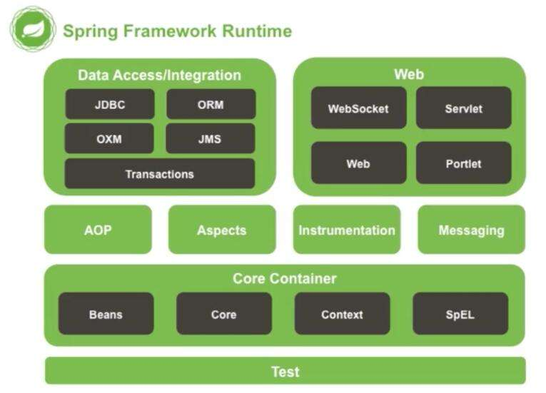
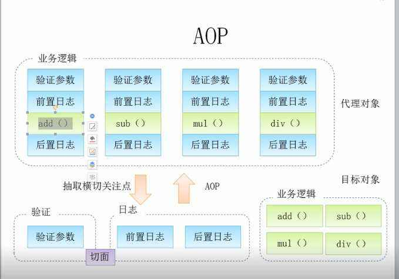

# 第一章 Spring 框架技术

## 第一节 什么是 Spring 框架

在JavaWeb阶段，我们已经学习了如何使用Java进行Web应用程序开发，我们现在已经具有搭建Web网站的能力，但是，我们在开发的过程中，发现存在诸多的不便，在编程实战中，我们发现虽然我们思路很清晰，知道如何编写对应的接口，但是这样的开发效率，实在是太慢了，并且对于对象创建的管理，存在诸多的不妥之处，因此，我们要去继续学习更多的框架技术，来简化和规范我们的Java开发。

Spring就是这样的一个框架（文档：https://docs.spring.io/spring-framework/docs/5.2.13.RELEASE/spring-framework-reference/），它就是为了简化开发而生，它是轻量级的**IoC**和**AOP**的容器框架，主要是针对**JavaBean**的生命周期进行管理的轻量级容器，并且它的生态已经发展得极为庞大。那么，首先一问，什么是**IoC**和**AOP**，什么又是**JavaBean**呢？只是听起来满满的高级感，实际上没有多高级（很多东西都是这样，名字听起来很牛，实际上只是一个很容易理解的东西）

因此，一切的一切，我们还要从JavaBean说起，从这颗豆子生根发芽开始。

## 第二节 什么是 JavaBean

JavaBean就是有一定规范的Java实体类，跟普通类差不多，不同的是类内部提供了一些公共的方法以便外界对该对象内部属性进行操作，比如set、get操作，实际上，就是我们之前一直在用的：

```java
public class User{
	private String name;
	private int age;
	public String getName(){
		return name;
	}
	public String getAge(){
		return age;
	}
	public void setName(String name){
		this.name = name;
	}
	public void setAge(int age){
		this.age = age;
	}
}
```

它的所有属性都是private，所有的属性都可以通过get/set方法进行访问，同时还需要有一个无参构造（默认就有）

因此我们之前编写的很多类，其实都可以是一个JavaBean。

## 第三节 IoC 理论基础

在我们之前的图书管理系统Web应用程序中，我们发现，整个程序其实是依靠各个部分相互协作，共同完成一个操作，比如要展示借阅信息列表，那么首先需要使用Servlet进行请求和响应的数据处理，然后请求的数据全部交给对应的Service（业务层）来处理，当Service发现要从数据库中获取数据时，再向对应的Mapper发起请求。

它们之间就像连接在一起的齿轮，谁也离不开谁：


就像一个团队，每个人的分工都很明确，流水线上的一套操作必须环环相扣，这是一种高度耦合的体系。

虽然这样的体系逻辑非常清晰，整个流程也能够让人快速了解，但是这样存在一个很严重的问题，我们现在的时代实际上是一个软件项目高速迭代的时代，我们发现很多App三天两头隔三差五地就更新，而且是什么功能当下最火，就马不停蹄地进行跟进开发，因此，就很容易出现，之前写好的代码，实现的功能，需要全部推翻，改成新的功能，那么我们就不得不去修改某些流水线上的模块，但是这样一修改，会直接导致整个流水线的引用关系大面积更新。

就像我不想用这个Service实现类了，我想使用其他的实现类用不同的逻辑做这些功能，那么这个时候，我们只能每个类都去挨个进行修改，当项目特别庞大时，光是改个类名就够你改一天。

因此，高耦合度带来的缺点是很明显的，也是现代软件开发中很致命的问题。如果要改善这种情况，我们只能将各个模块进行解耦，让各个模块之间的依赖性不再那么地强。也就是说，Service的实现类，不再由我们决定，而是让程序自己决定，所有的实现类对象，全部交给程序来管理，所有对象之间的关系，也由程序来动态决定，这样就引入了IoC理论。

IOC是Inversion of Control的缩写，翻译为：“控制反转”，把复杂系统分解成相互合作的对象，这些对象类通过封装以后，内部实现对外部是透明的，从而降低了解决问题的复杂度，而且可以灵活地被重用和扩展 。


我们可以将对象交给IoC容器进行管理，比如当我们需要一个接口的实现时，由它根据配置文件来决定到底给我们哪一个实现类，这样，我们就可以不用再关心我们要去使用哪一个实现类了，我们只需要关心，给到我的一定是一个可以正常使用的实现类，能用就完事了，反正接口定义了啥，我只管调，这样，我们就可以放心地让一个人去写视图层的代码，一个人去写业务层的代码，开发效率那是高的一匹啊。

高内聚，低耦合，是现代软件的开发的设计目标，而Spring框架就给我们提供了这样的一个IoC容器进行对象的管理。

## 第四节 使用 IoC 容器

### 1. 什么是 IoC 容器

首先一定要明确，使用Spring首要目的是为了使得软件项目进行解耦，而不是为了去简化代码！

Spring并不是一个独立的框架，它实际上包含了很多的模块：



而我们首先要去学习的就是Core Container，也就是核心容器模块。

Spring是一个非入侵式的框架，就像一个工具库一样，因此，我们只需要直接导入其依赖就可以使用了。

### 2. 第一个 Spring 项目

我们创建一个新的Maven项目，并导入Spring框架的依赖，Spring框架的坐标：

```xml
<dependency>
    <groupId>org.springframework</groupId>
    <artifactId>spring-context</artifactId>
    <version>5.3.13</version>
</dependency>
```

接着在resource中创建一个Spring配置文件，命名为`test.xml`，直接右键点击即可创建：

```xml
<?xml version="1.0" encoding="UTF-8"?>
<beans xmlns="http://www.springframework.org/schema/beans"
       xmlns:xsi="http://www.w3.org/2001/XMLSchema-instance"
       xsi:schemaLocation="http://www.springframework.org/schema/beans
        https://www.springframework.org/schema/beans/spring-beans.xsd">

</beans>
```

最后，在主方法中编写：

```java
public static void main(String[] args) {
    ClassPathXmlApplicationContext context = new ClassPathXmlApplicationContext("text");
    
}
```

这样，一个最基本的Spring项目就创建完成了，接着我们来看看如何向IoC容器中注册JavaBean，首先创建一个Student类：

```java
//注意，这里还用不到值注入，只需要包含成员属性即可，不用Getter/Setter。
public class Student {
    String name;
    int age;
}
```

然后在配置文件中添加这个bean：

```xml
<bean name="student" class="com.test.bean.Student"/>
```

现在，这个对象不需要我们再去生成了，而是由IoC容器来提供：

```java
public static void main(String[] args) {
    ClassPathXmlApplicationContext context = new ClassPathXmlApplicationContext("test.xml");
    Student student = (Student) context.getBean("student");
    System.out.println(student);
}
```

实际上，这里得到的Student对象是由Spring通过反射机制帮助我们创建的，初学者会非常疑惑，为什么要这样来创建对象，我们直接new一个它不香吗？为什么要交给IoC容器管理呢？在后面的学习中，我们再慢慢进行体会。

### 3. 将 JavaBean 交给 IoC 容器管理

通过前面的例子，我们发现只要将我们创建好的JavaBean通过配置文件编写，即可将其交给IoC容器进行管理，那么，我们来看看，一个JavaBean的详细配置：

```xml
<bean name="student" class="com.test.bean.Student"/>
```

其中`name`属性（也可以是`id`属性），全局唯一，不可出现重复的名称，我们发现，之前其实就是通过Bean的名称来向IoC容器索要对应的对象，也可以通过其他方式获取。

我们现在在主方法中连续获取两个对象：

```java
ClassPathXmlApplicationContext context = new ClassPathXmlApplicationContext("test.xml");
Student student = (Student) context.getBean("student");
Student student2 = (Student) context.getBean("student");
System.out.println(student);
System.out.println(student2);
```

我们发现两次获取到的实际上是同一个对象，也就是说，默认情况下，**通过IoC容器进行管理的JavaBean是单例模式的**，无论怎么获取始终为那一个对象，那么如何进行修改呢？只需要修改其作用域即可，添加`scope`属性：

```xml
<bean name="student" class="com.test.bean.Student" scope="prototype"/>
```

通过将其设定为`prototype`（原型模式）来使得其每次都会创建一个新的对象。我们接着来观察一下，这两种模式下Bean的生命周期，我们给构造方法添加一个输出：

```java
public class Student {
    String name;
    int age;

    public Student(){
        System.out.println("我被构造了！");
    }
}
```

接着我们在 main 方法中打上断点来查看对象分别是在什么时候被构造的。

我们发现，当Bean的作用域为单例模式，那么它会在一开始就被创建，而处于原型模式下，只有在获取时才会被创建，也就是说，单例模式下，Bean会被IoC容器存储，只要容器没有被销毁，那么此对象将一直存在，而原型模式才是相当于直接new了一个对象，并不会被保存。

我们还可以通过配置文件，告诉创建一个对象需要执行此初始化方法，以及销毁一个对象的销毁方法：

```java
public class Student {
    String name;
    int age;

    private void init(){
        System.out.println("我是初始化方法！");
    }

    private void destroy(){
        System.out.println("我是销毁方法！");
    }

    public Student(){
        System.out.println("我被构造了！");
    }
}
```

```java
public static void main(String[] args) {
    ClassPathXmlApplicationContext context = new ClassPathXmlApplicationContext("test.xml");
    Student student = (Student) context.getBean("student");
    System.out.println(student);
    context.close();  //手动销毁容器
}
```

最后在XML文件中编写配置：

```xml
<bean name="student" class="com.test.bean.Student" init-method="init" destroy-method="destroy"/>
```

接下来测试一下即可。

我们还可以手动指定Bean的加载顺序，若某个Bean需要保证一定在另一个Bean加载之前加载，那么就可以使用`depend-on`属性。

### 4. 依赖注入 DI

现在我们已经了解了如何注册和使用一个Bean，那么，如何向Bean的成员属性进行赋值呢？也就是说，IoC在创建对象时，需要将我们预先给定的属性注入到对象中，非常简单，我们可以使用`property`标签来实现，但是一定注意，此属性必须存在一个set方法，否则无法赋值：

```xml
<bean name="student" class="com.test.bean.Student">
    <property name="name" value="小明"/>
</bean>
```

```java
public class Student {
    String name;
    int age;

    public void setName(String name) {
        this.name = name;
    }

    public void say(){
        System.out.println("我是："+name);
    }
}
```

最后测试是否能够成功将属性注入到我们的对象中：

```java
public static void main(String[] args) {
    ClassPathXmlApplicationContext context = new ClassPathXmlApplicationContext("test.xml");
    Student student = (Student) context.getBean("student");
    student.say();
}
```

那么，如果成员属性是一个非基本类型非String的对象类型，我们该怎么注入呢？

```java
public class Card {
}
```

```java
public class Student {
    String name;
    int age;
    Card card;

    public void setCard(Card card) {
        this.card = card;
    }
  
  	public void setName(String name) {
        this.name = name;
    }

    public void say(){
        System.out.println("我是："+name+"，我的学生证："+card);
    }
}
```

我们只需要将对应的类型也注册为bean即可，然后直接使用`ref`属性来进行引用：

```xml
<bean name="card" class="com.test.bean.Card"/>
<bean name="student" class="com.test.bean.Student">
    <property name="name" value="小明"/>
    <property name="card" ref="card"/>
</bean>
```

那么，集合如何实现注入呢？我们需要在`property`内部进行编写：

```xml
<bean name="student" class="com.test.bean.Student">
    <property name="list">
        <list>
            <value type="double">100.0</value>
            <value type="double">95.0</value>
            <value type="double">92.5</value>
        </list>
    </property>
</bean>
```

现在，我们就可以直接以一个数组的方式将属性注入，注意如果是List类型的话，我们也可以使用`array`数组。同样的，如果是一个Map类型，我们也可以使用`entry`来注入：

```java
public class Student {
    String name;
    int age;
    Map<String, Double> map;

    public void setMap(Map<String, Double> map) {
        this.map = map;
    }

    public void say(){
        System.out.println("我的成绩："+ map);
    }
}
```

```xml
<bean name="student" class="com.test.bean.Student">
    <property name="map">
        <map>
            <entry key="语文" value="100.0"/>
            <entry key="数学" value="80.0"/>
            <entry key="英语" value="92.5"/>
        </map>
    </property>
</bean>
```

我们还可以使用自动装配来实现属性值的注入：

```xml
<bean name="card" class="com.test.bean.Card"/>
<bean name="student" class="com.test.bean.Student" autowire="byType"/>
```

自动装配会根据set方法中需要的类型，自动在容器中查找是否存在对应类型或是对应名称以及对应构造方法的Bean，比如我们上面指定的为`byType`，那么其中的card属性就会被自动注入类型为Card的Bean

我们已经了解了如何使用set方法来创建对象，那么能否不使用默认的无参构造方法，而是指定一个有参构造进行对象的创建呢？我们可以指定构造方法：

```xml
<bean name="student" class="com.test.bean.Student">
        <constructor-arg name="name" value="小明"/>
        <constructor-arg index="1" value="18"/>
    </bean>
```

```java
public class Student {
    String name;
    int age;

    public Student(String name, int age){
        this.name = name;
        this.age = age;
    }

    public void say(){
        System.out.println("我是："+name+"今年"+age+"岁了！");
    }
}
```

通过手动指定构造方法参数，我们就可以直接告诉容器使用哪一个构造方法来创建对象。

## 第五节 面向切面 AOP

### 1. 什么是 SpringAOP

AOP思想实际上就是：在运行时，动态地将代码切入到类的指定方法、指定位置上的编程思想就是面向切面的编程。也就是说，我们可以使用AOP来帮助我们在方法执行前或执行之后，做一些额外的操作，**实际上，就是代理！**

通过AOP我们可以在保证原有业务不变的情况下，添加额外的动作，比如我们的某些方法执行完成之后，需要打印日志，那么这个时候，我们就可以使用AOP来帮助我们完成，它可以批量地为这些方法添加动作。可以说，它相当于将我们原有的方法，在不改变源代码的基础上进行了增强处理。



相当于我们的整个业务流程，被直接斩断，并在断掉的位置添加了一个额外的操作，再连接起来，也就是在一个切点位置插入内容。它的原理实际上就是通过动态代理机制实现的，我们在JavaWeb阶段已经给大家讲解过动态代理了。不过Spring底层并不是使用的JDK提供的动态代理，而是使用的第三方库实现，它能够以父类的形式代理，而不是接口。

### 2. 使用 SpringAOP

Spring是支持AOP编程的框架之一（实际上它整合了AspectJ 框架的一部分），要使用AOP我们需要先导入一个依赖：

```xml
<dependency>
    <groupId>org.springframework</groupId>
    <artifactId>spring-aspects</artifactId>
    <version>5.3.13</version>
</dependency>
```

那么，如何使用AOP呢？首先我们要明确，要实现AOP操作，我们需要知道这些内容：

1. 需要切入的类，类的哪个方法需要被切入
2. 切入之后需要执行什么动作
3. 是在方法执行前切入还是在方法执行后切入
4. 如何告诉Spring需要进行切入

那么我们依次来看，首先需要解决的问题是，找到需要切入的类：

```java
public class Student {
    String name;
    int age;

		//分别在test方法执行前后切入
    public int test(String str) {
        System.out.println("我是一个测试方法："+str);
        return str.length();
    }
}
```

现在我们希望在`test`方法执行前后添加我们的额外执行的内容，接着，我们来看看如何为方法执行前和执行后添加切入动作。比如现在我们想在方法返回之后，再执行我们的动作，首先定义我们要执行的操作：

```java
public class AopTest {

    //执行之后的方法
    public void after(){
        System.out.println("我是执行之后");
    }

    //执行之前的方法
    public void before(){
        System.out.println("我是执行之前");
    }
}
```

那么，现在如何告诉Spring我们需要在方法执行之前和之后插入其他逻辑呢？首先我们将要进行AOP操作的类注册为Bean：

```xml
<bean name="student" class="com.test.bean.Student"/>
<bean name="aopTest" class="com.test.aop.AopTest"/>
```

一个是Student类，还有一个就是包含我们要切入方法的`AopTest`类，注册为Bean后，他们就交给Spring进行管理，这样Spring才能帮助我们完成AOP操作。

接着，我们需要告诉Spring，我们需要添加切入点，首先将顶部修改为，引入`aop`相关标签：

```xml
<?xml version="1.0" encoding="UTF-8"?>
<beans xmlns="http://www.springframework.org/schema/beans"
       xmlns:xsi="http://www.w3.org/2001/XMLSchema-instance"
       xmlns:aop="http://www.springframework.org/schema/aop"
       xsi:schemaLocation="http://www.springframework.org/schema/beans http://www.springframework.org/schema/beans/spring-beans.xsd
       http://www.springframework.org/schema/aop http://www.springframework.org/schema/aop/spring-aop.xsd">
```

通过使用`aop:config`来添加一个新的AOP配置：

```xml
<aop:config>
    
</aop:config>
```

首先第一行，我们需要告诉Spring，我们要切入的是哪一个类的哪个或是哪些方法：

```xml
<aop:pointcut id="test" expression="execution(* com.test.bean.Student.test(String))"/>
```

其中，`expression`属性的`execution`填写格式如下：

```xml
修饰符 包名.类名.方法名称(方法参数)
```

* 修饰符：public、protected、private、包括返回值类型、static等等（使用*代表任意修饰符）
* 包名：如 `com.test`（*代表全部，比如com.*代表com包下的全部包）
* 类名：使用*也可以代表包下的所有类
* 方法名称：可以使用*代表全部方法
* 方法参数：填写对应的参数即可，比如(String, String)，也可以使用*来代表任意一个参数，使用..代表所有参数。

也可以使用其他属性来进行匹配，比如`@annotation`可以用于表示标记了哪些注解的方法被切入。

接着，我们需要为此方法添加一个执行前动作和一个执行后动作：

```xml
<aop:aspect ref="aopTest">
    <aop:before method="before" pointcut-ref="test"/>
    <aop:after-returning method="after" pointcut-ref="test"/>
</aop:aspect>
```

这样，我们就完成了全部的配置，现在来实验一下吧：

```java
public static void main(String[] args) {
    ClassPathXmlApplicationContext context = new ClassPathXmlApplicationContext("test.xml");
    Student student = context.getBean(Student.class);
    student.test("lbwnb");
}
```

我们发现，方法执行前后，分别调用了我们对应的方法。但是仅仅这样还是不能满足一些需求，在某些情况下，我们可以需求方法执行的一些参数，比如方法执行之后返回了什么，或是方法开始之前传入了什么参数等等。

这个时候，我们可以为我们切入的方法添加一个参数，通过此参数就可以快速获取切点位置的一些信息：

```java
//执行之前的方法
public void before(JoinPoint point){
    System.out.println("我是执行之前");
    System.out.println(point.getTarget());  //获取执行方法的对象
    System.out.println(Arrays.toString(point.getArgs()));  //获取传入方法的实参
}
```

通过添加`JoinPoint`作为形参，Spring会自动给我们一个实现类对象，这样我们就能获取方法的一些信息了。

最后我们再来看环绕方法，环绕方法相当于完全代理了此方法，它完全将此方法包含在中间，需要我们手动调用才可以执行此方法，并且我们可以直接获取更多的参数：

```java
public Object around(ProceedingJoinPoint joinPoint) throws Throwable {
    System.out.println("方法开始之前");
    Object value = joinPoint.proceed();
    System.out.println("方法执行完成，结果为："+value);
    return value;
}
```

注意，如果代理方法存在返回值，那么环绕方法也需要有一个返回值，通过`proceed`方法来执行代理的方法，也可以修改参数之后调用`proceed(Object[])`，使用我们给定的参数再去执行：

```java
public Object around(ProceedingJoinPoint joinPoint) throws Throwable {
    System.out.println("方法开始之前");
    String arg = joinPoint.getArgs()[0] + "伞兵一号";
    Object value = joinPoint.proceed(new Object[]{arg});
    System.out.println("方法执行完成，结果为："+value);
    return value;
}
```

### 3. 使用接口实现 AOP

前面我们介绍了如何使用xml配置一个AOP操作，这节课我们来看看如何使用`Advice`实现AOP。

它与我们之前学习的动态代理更接近一些，比如在方法开始执行之前或是执行之后会去调用我们实现的接口，首先我们需要将一个类实现Advice接口，只有实现此接口，才可以被通知，比如我们这里使用`MethodBeforeAdvice`表示是一个在方法执行之前的动作：

```java
public class AopTest implements MethodBeforeAdvice {
    @Override
    public void before(Method method, Object[] args, Object target) throws Throwable {
        System.out.println("通过Advice实现AOP");
    }
}
```

我们发现，方法中包括了很多的参数，其中`args`代表的是方法执行前得到的实参列表，还有target表示执行此方法的实例对象。运行之后，效果和之前是一样的，但是在这里我们就可以快速获取到更多信息。

```xml
<aop:config>
    <aop:pointcut id="stu" expression="execution(* com.test.bean.Student.say(String))"/>
    <aop:advisor advice-ref="before" pointcut-ref="stu"/>
</aop:config>
```

除了此接口以外，还有其他的接口，比如`AfterReturningAdvice`就需要实现一个方法执行之后的操作：

```java
public class AopTest implements MethodBeforeAdvice, AfterReturningAdvice {
    @Override
    public void before(Method method, Object[] args, Object target) throws Throwable {
        System.out.println("我是方法执行之前！");
    }

    @Override
    public void afterReturning(Object returnValue, Method method, Object[] args, Object target) throws Throwable {
        System.out.println("我是方法执行之后！");
    }
}
```

其实，我们之前学习的操作正好对应了AOP 领域中的特性术语：

- 通知（Advice）: AOP 框架中的增强处理，通知描述了切面何时执行以及如何执行增强处理，也就是我们上面编写的方法实现。
- 连接点（join point）: 连接点表示应用执行过程中能够插入切面的一个点，这个点可以是方法的调用、异常的抛出，实际上就是我们在方法执行前或是执行后需要做的内容。
- 切点（PointCut）: 可以插入增强处理的连接点，可以是方法执行之前也可以方法执行之后，还可以是抛出异常之类的。
- 切面（Aspect）: 切面是通知和切点的结合，我们之前在xml中定义的就是切面，包括很多信息。
- 引入（Introduction）：引入允许我们向现有的类添加新的方法或者属性。
- 织入（Weaving）: 将增强处理添加到目标对象中，并创建一个被增强的对象，我们之前都是在将我们的增强处理添加到目标对象，也就是织入。


## 第六节 使用注解开发 Spring

前面我们已经了解了IoC容器和AOP实现，但是我们发现，要使用这些功能，我们就不得不编写大量的配置，这是非常浪费时间和精力的，并且我们还只是演示了几个小的例子，如果是像之前一样去编写一个完整的Web应用程序，那么产生的配置可能会非常多。能否有一种更加高效的方法能够省去配置呢？当然还是注解了。

### 1. 注解实现配置文件

那么，现在既然不使用XML文件了，那通过注解的方式就只能以实体类的形式进行配置了，我们在要作为配置的类上添加`@Configuration`注解，我们这里创建一个新的类`MainConfiguration`：

```java
@Configuration
public class MainConfiguration {
    //没有配置任何Bean
}
```

你可以直接把它等价于：

```xml
<?xml version="1.0" encoding="UTF-8"?>
<beans xmlns="http://www.springframework.org/schema/beans"
       xmlns:xsi="http://www.w3.org/2001/XMLSchema-instance"
       xsi:schemaLocation="http://www.springframework.org/schema/beans
        https://www.springframework.org/schema/beans/spring-beans.xsd">
		<!-- 没有配置任何Bean -->
</beans>
```

那么我们来看看，如何配置Bean，之前我们是直接在配置文件中编写Bean的一些信息，现在在配置类中，我们只需要编写一个方法，并返回我们要创建的Bean的对象即可，并在其上方添加`@Bean`注解：

```java
@Bean
public Card card(){
    return new Card();
}
```

这样，等价于：

```xml
<?xml version="1.0" encoding="UTF-8"?>
<beans xmlns="http://www.springframework.org/schema/beans"
       xmlns:xsi="http://www.w3.org/2001/XMLSchema-instance"
       xsi:schemaLocation="http://www.springframework.org/schema/beans
        https://www.springframework.org/schema/beans/spring-beans.xsd">
		<bean class="com.test.bean.Card"></bean>
</beans>
```

我们还可以继续添加`@Scope`注解来指定作用域，这里我们就用原型模式：

```java
@Bean
@Scope("prototype")
public Card card(){
    return new Card();
}
```

采用这种方式，我们就可以更加方便地控制一个Bean对象的创建过程，现在相当于这个对象时由我们创建好了再交给Spring进行后续处理，我们可以在对象创建时做很多额外的操作，包括一些属性值的配置等。

既然现在我们已经创建好了配置类，接着我们就可以在主方法中加载此配置类，并创建一个基于配置类的容器：

```java
public class Main {
    public static void main(String[] args) {
      	//使用AnnotationConfigApplicationContext来实现注解配置
        AnnotationConfigApplicationContext context = new AnnotationConfigApplicationContext(MainConfiguration.class); //这里需要告诉Spring哪个类作为配置类
        Card card = context.getBean(Card.class);  //容器用法和之前一样
        System.out.println(card);
    }
}
```

在配置的过程中，我们可以点击IDEA底部的Spring标签，打开后可以对当前向容器中注册的Bean进行集中查看，并且会标注Bean之间的依赖关系，我们可以发现，Bean的默认名称实际上就是首字母小写的方法名称，我们也可以手动指定：

```java
@Bean("lbwnb")
@Scope("prototype")
public Card card(){
    return new Card();
}
```

除了像原来一样在配置文件中创建Bean以外，我们还可以直接在类上添加`@Component`注解来将一个类进行注册**（现在最常用的方式）**，不过要实现这样的方式，我们需要添加一个自动扫描，来告诉Spring需要在哪些包中查找我们提供`@Component`声明的Bean。

只需要在配置类上添加一个`@ComponentScan`注解即可，如果要添加多个包进行扫描，可以使用`@ComponentScans`来批量添加。这里我们演示将`bean`包下的所有类进行扫描：

```java
@ComponentScan("com.test.bean")
@Configuration
public class MainConfiguration {

}
```

现在删除类中的Bean定义，我们在Student类的上面添加`@Component`注解，来表示此类型需要作为Bean交给容器进行管理：

```java
@Component//默认为类名，首字母小写
@Scope("prototype")
public class Student {
    String name;
    int age;
    Card card;
}
```

同样的，在类上也可以直接添加`@Scope`来限定作用域。

效果和刚刚实际上是相同的，我们可以来测试一下：

```java
public class Main {
    public static void main(String[] args) {
        AnnotationConfigApplicationContext context = new AnnotationConfigApplicationContext(MainConfiguration.class);
        System.out.println(context.getBean(Student.class));
    }
}
```

我们可以看到IDEA的Spring板块中也显示了我们刚刚通过直接在类上添加`@Component`声明的Bean。

与`@Component`同样效果的还有`@Controller`、`@Service`和`@Repository`，但是现在暂时不提，讲到 SpringMVC 时再来探讨。

现在我们就有两种方式注册一个Bean了，那么如何实现像之前一样的自动注入呢，比如我们将Card也注册为Bean，我们希望Spring自动将其注入到Student的属性中：

```java
@Component
public class Student {
    String name;
    int sid;
    Card card;
}
```

因此，我们可以将此类型，也通过这种方式注册为一个Bean：

```java
@Component
@Scope("prototype")
public class Card {
}
```

现在，我们在需要注入的位置，添加一个`@Resource`注解来实现自动装配：

```java
@Component
public class Student {
    String name;
    int sid;
    
    @Resource
    Card card;
}
```

这样的好处是，我们完全不需要创建任何的set方法，只需要添加这样的一个注解就可以了，Spring会跟之前配置文件的自动注入一样，在整个容器中进行查找，并将对应的Bean实例对象注入到此属性中，当然，如果还是需要通过set方法来注入，可以将注解添加到方法上：

```java
@Component
public class Student {
    String name;
    int sid;
    Card card;

    @Resource
    public void setCard(Card card) {
        System.out.println("通过方法");
        this.card = card;
    }
}
```

除了使用`@Resource`以外，我们还可以使用`@Autowired`（IDEA不推荐将其使用在字段上，会出现黄标，但是可以放在方法或是构造方法上）

> 注：关于为什么IDEA不推荐`@Autowired`的字段注入方式可以参考如下博客
>
> [为什么IDEA不推荐你使用@Autowired ？ - 程序猿DD - 博客园 (cnblogs.com)](https://www.cnblogs.com/didispace/p/15512243.html)

它们的效果是一样的，但是它们存在区别，虽然它们都是自动装配：

* @Resource默认**ByName**如果找不到则**ByType**，可以添加到set方法、字段上。
* @Autowired默认是**ByType**，可以添加在构造方法、set方法、字段、方法参数上。

并且`@Autowired`可以配合`@Qualifier`使用，来指定一个名称的Bean进行注入：

```java
@Autowired
@Qualifier("sxc")
public void setCard(Card card) {
    System.out.println("通过方法");
    this.card = card;
}
```

如果Bean是在配置文件中进行定义的，我们还可以在方法的参数中使用`@Autowired`来进行自动注入：

```java
@ComponentScan("com.test.bean")
@Configuration
public class MainConfiguration {

    @Bean
    public Student student(@Autowired Card card){
        Student student = new Student();
        student.setCard(card);
        return student;
    }
}
```

我们还可以通过`@PostConstruct`注解来添加构造后执行的方法，它等价于之前讲解的`init-method`：

```java
@PostConstruct
public void init(){
    System.out.println("我是初始化方法！1");
}
```

注意它们的顺序：Constructor(构造方法) -> @Autowired(依赖注入) -> @PostConstruct


同样的，如果需要销毁方法，也可以使用`@PreDestroy`注解，这里就不做演示了。

这样，两种通过注解进行Bean声明的方式就讲解完毕了，那么什么时候该用什么方式去声明呢？

* 如果要注册为Bean的类是由其他框架提供，我们无法修改其源代码，那么我们就使用第一种方式进行配置。
* 如果要注册为Bean的类是我们自己编写的，我们就可以直接在类上添加注解，并在配置中添加扫描。

### 2. 注解实现 AOP 操作

了解了如何使用注解注册Bean之后，我们接着来看如何通过注解实现AOP操作，首先我们需要在主类添加`@EnableAspectJAutoProxy`注解，开启AOP注解支持：

```java
@EnableAspectJAutoProxy
@ComponentScan("com.test.bean")
@Configuration
public class MainConfiguration {
}
```

接着我们只需在定义AOP增强操作的类上添加`@Aspect`注解和`@Component`将其注册为Bean即可，就像我们之前在配置文件中也要将其注册为Bean：

```java
@Component
@Aspect
public class AopTest {

}
```

接着，我们直接在里面编写方法，并将此方法添加到一个切点中，比如我们希望在Student的test方法执行之前执行我们的方法：

```java
public int test(String str){
    System.out.println("我被调用了:"+str);
    return str.length();
}
```

只需要添加`@Before`注解即可：

```java
@Before("execution(* com.test.bean.Student.test(..))")
public void before(){
    System.out.println("我是之前执行的内容！");
}
```

同样的，我们可以为其添加`JoinPoint`参数来获取切入点信息：

```java
@Before("execution(* com.test.bean.Student.test(..))")
public void before(JoinPoint point){
    System.out.println("参数列表："+ Arrays.toString(point.getArgs()));
    System.out.println("我是之前执行的内容！");
}
```

我们也可以使用`@AfterReturning`注解来指定方法返回后的操作：

```java
@AfterReturning(value = "execution(* com.test.bean.Student.test(..))", returning = "returnVal")
public void after(Object returnVal){
    System.out.println("方法已返回，结果为："+returnVal);
}
```

我们还可以指定returning属性，并将其作为方法某个参数的实参。同样的，环绕也可以直接通过注解声明：

```java
@Around("execution(* com.test.bean.Student.test(..))")
public Object around(ProceedingJoinPoint point) throws Throwable {
    System.out.println("方法执行之前！");
    Object val = point.proceed();
    System.out.println("方法执行之后！");
    return val;
}
```

### 3. 其他注解配置

配置文件可能不止一个，我们有可能会根据模块划分，定义多个配置文件，这个时候，可能会出现很多个配置类，如果我们需要`@Import`注解来快速将某个类加入到容器中，比如我们现在创建一个新的配置文件，并将数据库Bean也搬过去：

```java
public class Test2Configuration {
    @Bean
    public Connection getConnection() throws SQLException {
        System.out.println("创建新的连接！");
        return DriverManager.getConnection("jdbc:mysql://localhost:3306/study",
                "root",
                "root");
    }
}
```

```java
@EnableAspectJAutoProxy
@Configuration
@ComponentScan("com.test")
@Import(Test2Configuration.class)
public class TestConfiguration {

    @Resource
    Connection connection;

    @PostConstruct
    public void init(){
        System.out.println(connection);
    }
}
```

注意另一个配置类并没有添加任何注解，实际上，相当于导入的类被强制注册为了一个Bean，到现在，我们一共了解了三种注册为Bean的方式，利用这种特性，我们还可以将其他的类型也强制注册为Bean：

```java
@EnableAspectJAutoProxy
@Configuration
@ComponentScan("com.test")
@Import({Test2Configuration.class, Date.class})
public class TestConfiguration {

    @Resource
    Connection connection;
    @Resource
    Date date;

    @PostConstruct
    public void init(){
        System.out.println(date+" -> "+connection);
    }
}
```

可以看到，日期直接作为一个Bean放入到IoC容器中了，并且时间永远都是被new的那个时间，也就是同一个对象（因为默认是单例模式）。

通过`@Import`方式最主要为了实现的目标并不是创建Bean，而是为了方便一些框架的`Registrar`进行Bean定义，在讲解到Spring原理时，我们再来详细讨论，目前只做了解即可。

到这里，关于Spring框架的大致内容就聊得差不多了，其余的内容，我们会在后面继续讲解。

---


# 第二章 深入 Mybatis 框架

## 第一节 了解数据源

在之前，我们如果需要创建一个JDBC的连接，那么必须使用`DriverManager.getConnection()`来创建连接，连接建立后，我们才可以进行数据库操作。

而学习了Mybatis之后，我们就不用再去使用`DriverManager`为我们提供连接对象，而是直接使用Mybatis为我们提供的`SqlSessionFactory`工具类来获取对应的`SqlSession`通过会话对象去操作数据库。

那么，它到底是如何封装JDBC的呢？我们可以试着来猜想一下，会不会是Mybatis每次都是帮助我们调用`DriverManager`来实现的数据库连接创建？我们可以看看Mybatis的源码：

```java
public SqlSession openSession(boolean autoCommit) {
    return this.openSessionFromDataSource(this.configuration.getDefaultExecutorType(), (TransactionIsolationLevel)null, autoCommit);
}
```

在通过`SqlSessionFactory`调用`openSession`方法之后，它调用了内部的一个私有的方法`openSessionFromDataSource`，我们接着来看，这个方法里面定义了什么内容：

```java
private SqlSession openSessionFromDataSource(ExecutorType execType, TransactionIsolationLevel level, boolean autoCommit) {
    Transaction tx = null;

    DefaultSqlSession var8;
    try {
      	//获取当前环境（由配置文件映射的对象实体）
        Environment environment = this.configuration.getEnvironment();
      	//事务工厂（暂时不提，下一板块讲解）
        TransactionFactory transactionFactory = this.getTransactionFactoryFromEnvironment(environment);
      	//配置文件中：<transactionMasnager type="JDBC"/>
      	//生成事务（根据我们的配置，会默认生成JdbcTransaction），这里是关键，我们看到这里用到了environment.getDataSource()方法
        tx = transactionFactory.newTransaction(environment.getDataSource(), level, autoCommit);
      	//执行器，包括全部的数据库操作方法定义，本质上是在使用执行器操作数据库，需要传入事务对象
        Executor executor = this.configuration.newExecutor(tx, execType);
      	//封装为SqlSession对象
        var8 = new DefaultSqlSession(this.configuration, executor, autoCommit);
    } catch (Exception var12) {
        this.closeTransaction(tx);
        throw ExceptionFactory.wrapException("Error opening session.  Cause: " + var12, var12);
    } finally {
        ErrorContext.instance().reset();
    }
		
    return var8;
}
```

也就是说，我们的数据源配置信息，存放在了`Transaction`对象中，那么现在我们只需要知道执行器到底是如何执行SQL语句的，我们就知道到底如何创建`Connection`对象了，就需要获取数据库的链接信息了，那么我们来看看，这个`DataSource`到底是个什么：

```java
public interface DataSource  extends CommonDataSource, Wrapper {

  Connection getConnection() throws SQLException;

  Connection getConnection(String username, String password)
    throws SQLException;
}
```

我们发现，它是在`javax.sql`定义的一个接口，它包括了两个方法，都是用于获取连接的。因此，现在我们可以断定，并不是通过之前`DriverManager`的方法去获取连接了，而是使用`DataSource`的实现类来获取的，因此，也就正式引入到我们这一节的话题了：

> 数据库链接的建立和关闭是极其耗费系统资源的操作，通过DriverManager获取的数据库连接，一个数据库连接对象均对应一个物理数据库连接，每次操作都打开一个物理连接，使用完后立即关闭连接，频繁的打开、关闭连接会持续消耗网络资源，造成整个系统性能的低下。

因此，JDBC为我们定义了一个数据源的标准，也就是`DataSource`接口，告诉数据源数据库的连接信息，并将所有的连接全部交给数据源进行集中管理，当需要一个`Connection`对象时，可以向数据源申请，数据源会根据内部机制，合理地分配连接对象给我们。

一般比较常用的`DataSource`实现，都是采用池化技术，就是在一开始就创建好N个连接，这样之后使用就无需再次进行连接，而是直接使用现成的`Connection`对象进行数据库操作。


当然，也可以使用传统的即用即连的方式获取`Connection`对象，Mybatis为我们提供了几个默认的数据源实现，我们之前一直在使用的是官方的默认配置，也就是池化数据源：

```xml
<dataSource type="POOLED">
      <property name="driver" value="${driver}"/>
      <property name="url" value="${url}"/>
      <property name="username" value="${username}"/>
      <property name="password" value="${password}"/>
</dataSource>
```

一共三个选项：

* UNPOOLED    不使用连接池的数据源
* POOLED      使用连接池的数据源
* JNDI        使用 JNDI 实现的数据源


## 第二节 解读 Mybatis 数据源实现

那么我们先来看看，不使用池化的数据源实现，它叫做`UnpooledDataSource`，我们来看看源码：

```java
public class UnpooledDataSource implements DataSource {
    private ClassLoader driverClassLoader;
    private Properties driverProperties;
    private static Map<String, Driver> registeredDrivers = new ConcurrentHashMap();
    private String driver;
    private String url;
    private String username;
    private String password;
    private Boolean autoCommit;
    private Integer defaultTransactionIsolationLevel;
    private Integer defaultNetworkTimeout;
```

首先这个类中定义了很多的成员，包括数据库的连接信息、数据库驱动信息、事务相关信息等。

我们接着来看，它是如何实现`DataSource`中提供的接口的：

```java
public Connection getConnection() throws SQLException {
    return this.doGetConnection(this.username, this.password);
}

public Connection getConnection(String username, String password) throws SQLException {
    return this.doGetConnection(username, password);
}
```

实际上，这两个方法都指向了内部的一个`doGetConnection`方法，那么我们接着来看：

```java
private Connection doGetConnection(String username, String password) throws SQLException {
    Properties props = new Properties();
    if (this.driverProperties != null) {
        props.putAll(this.driverProperties);
    }

    if (username != null) {
        props.setProperty("user", username);
    }

    if (password != null) {
        props.setProperty("password", password);
    }

    return this.doGetConnection(props);
}
```

首先它将数据库的连接信息也给添加到`Properties`对象中进行存放，并交给下一个`doGetConnection`来处理，套娃就完事了呗，接着来看下一层源码：

```java
private Connection doGetConnection(Properties properties) throws SQLException {
  	//若未初始化驱动，需要先初始化，内部维护了一个Map来记录初始化信息，这里不多介绍了
    this.initializeDriver();
  	//传统的获取连接的方式
    Connection connection = DriverManager.getConnection(this.url, properties);
  	//对连接进行额外的一些配置
    this.configureConnection(connection);
    return connection;
}
```

到这里，就返回`Connection`对象了，而此对象正是通过`DriverManager`来创建的，因此，非池化的数据源实现依然使用的是传统的连接创建方式，那我们接着来看池化的数据源实现，它是`PooledDataSource`类：

```java
public class PooledDataSource implements DataSource {
    private static final Log log = LogFactory.getLog(PooledDataSource.class);
    private final PoolState state = new PoolState(this);
    private final UnpooledDataSource dataSource;
    protected int poolMaximumActiveConnections = 10;
    protected int poolMaximumIdleConnections = 5;
    protected int poolMaximumCheckoutTime = 20000;
    protected int poolTimeToWait = 20000;
    protected int poolMaximumLocalBadConnectionTolerance = 3;
    protected String poolPingQuery = "NO PING QUERY SET";
    protected boolean poolPingEnabled;
    protected int poolPingConnectionsNotUsedFor;
    private int expectedConnectionTypeCode;
```

我们发现，在这里的定义就比非池化的实现复杂得多了，因为它还要考虑并发的问题，并且还要考虑如何合理地存放大量的链接对象，该如何进行合理分配，因此它的玩法非常之高级，但是，再高级的玩法，我们都要拿下。

首先注意，它存放了一个UnpooledDataSource，此对象是在构造时就被创建，其实创建Connection还是依靠数据库驱动创建，我们后面慢慢解析，首先我们来看看它是如何实现接口方法的：

```java
public Connection getConnection() throws SQLException {
    return this.popConnection(this.dataSource.getUsername(), this.dataSource.getPassword()).getProxyConnection();
}

public Connection getConnection(String username, String password) throws SQLException {
    return this.popConnection(username, password).getProxyConnection();
}
```

可以看到，它调用了`popConnection()`方法来获取连接对象，然后进行了一个代理，我们可以猜测，有可能整个连接池就是一个类似于栈的集合类型结构实现的。那么我们接着来看看`popConnection`方法：

```java
private PooledConnection popConnection(String username, String password) throws SQLException {
    boolean countedWait = false;
  	//返回的是PooledConnection对象，
    PooledConnection conn = null;
    long t = System.currentTimeMillis();
    int localBadConnectionCount = 0;

    while(conn == null) {
        synchronized(this.state) {   //加锁，因为有可能很多个线程都需要获取连接对象
            PoolState var10000;
          	//PoolState存了两个List，一个是空闲列表，一个是活跃列表
            if (!this.state.idleConnections.isEmpty()) {   //有空闲连接时，可以直接分配Connection
                conn = (PooledConnection)this.state.idleConnections.remove(0);  //ArrayList中取第一个元素
                if (log.isDebugEnabled()) {
                    log.debug("Checked out connection " + conn.getRealHashCode() + " from pool.");
                }
              //如果已经没有多余的连接可以分配，那么就检查一下活跃连接数是否达到最大的分配上限，如果没有，就new一个
            } else if (this.state.activeConnections.size() < this.poolMaximumActiveConnections) {
              	//注意new了之后并没有立即往List里面塞，只是存了一些基本信息
              	//我们发现，这里依靠UnpooledDataSource创建了一个Connection对象，并将其封装到PooledConnection中
                conn = new PooledConnection(this.dataSource.getConnection(), this);
                if (log.isDebugEnabled()) {
                    log.debug("Created connection " + conn.getRealHashCode() + ".");
                }
              //以上条件都不满足，那么只能从之前的连接中寻找了，看看有没有那种卡住的链接（由于网络问题有可能之前的连接一直被卡住，然而正常情况下早就结束并且可以使用了，所以这里相当于是优化也算是一种捡漏的方式）
            } else {
              	//获取最早创建的连接
                PooledConnection oldestActiveConnection = (PooledConnection)this.state.activeConnections.get(0);
                long longestCheckoutTime = oldestActiveConnection.getCheckoutTime();
              	//判断是否超过最大的使用时间
                if (longestCheckoutTime > (long)this.poolMaximumCheckoutTime) {
                  	//超时统计信息（不重要）
                    ++this.state.claimedOverdueConnectionCount;
                    var10000 = this.state;
                    var10000.accumulatedCheckoutTimeOfOverdueConnections += longestCheckoutTime;
                    var10000 = this.state;
                    var10000.accumulatedCheckoutTime += longestCheckoutTime;
                  	//从活跃列表中移除此链接信息
                    this.state.activeConnections.remove(oldestActiveConnection);
                  	//如果开启事务，还需要回滚一下
                    if (!oldestActiveConnection.getRealConnection().getAutoCommit()) {
                        try {
                            oldestActiveConnection.getRealConnection().rollback();
                        } catch (SQLException var15) {
                            log.debug("Bad connection. Could not roll back");
                        }
                    }
										
                  	//这里就根据之前的连接对象直接new一个新的连接（注意使用的还是之前的Connection对象，只是被重新封装了）
                    conn = new PooledConnection(oldestActiveConnection.getRealConnection(), this);
                    conn.setCreatedTimestamp(oldestActiveConnection.getCreatedTimestamp());
                    conn.setLastUsedTimestamp(oldestActiveConnection.getLastUsedTimestamp());
                  	//过期
                    oldestActiveConnection.invalidate();
                    if (log.isDebugEnabled()) {
                        log.debug("Claimed overdue connection " + conn.getRealHashCode() + ".");
                    }
                } else {
                  //确实是没得用了，只能卡住了（阻塞）
                  //然后记录一下有几个线程在等待当前的任务搞完
                    try {
                        if (!countedWait) {
                            ++this.state.hadToWaitCount;
                            countedWait = true;
                        }

                        if (log.isDebugEnabled()) {
                            log.debug("Waiting as long as " + this.poolTimeToWait + " milliseconds for connection.");
                        }

                        long wt = System.currentTimeMillis();
                        this.state.wait((long)this.poolTimeToWait);   //要是超过等待时间还是没等到，只能放弃
                      	//注意这样的话con就为null了
                        var10000 = this.state;
                        var10000.accumulatedWaitTime += System.currentTimeMillis() - wt;
                    } catch (InterruptedException var16) {
                        break;
                    }
                }
            }
						
          	//经过之前的操作，已经成功分配到连接对象的情况下
            if (conn != null) {
                if (conn.isValid()) {  //是否有效
                    if (!conn.getRealConnection().getAutoCommit()) {  //清理之前遗留的事务操作
                        conn.getRealConnection().rollback();
                    }

                    conn.setConnectionTypeCode(this.assembleConnectionTypeCode(this.dataSource.getUrl(), username, password));
                    conn.setCheckoutTimestamp(System.currentTimeMillis());
                    conn.setLastUsedTimestamp(System.currentTimeMillis());
                  	//添加到活跃表中
                    this.state.activeConnections.add(conn);
                    //统计信息（不重要）
                    ++this.state.requestCount;
                    var10000 = this.state;
                    var10000.accumulatedRequestTime += System.currentTimeMillis() - t;
                } else {
                  	//无效的连接，直接抛异常
                    if (log.isDebugEnabled()) {
                        log.debug("A bad connection (" + conn.getRealHashCode() + ") was returned from the pool, getting another connection.");
                    }

                    ++this.state.badConnectionCount;
                    ++localBadConnectionCount;
                    conn = null;
                    if (localBadConnectionCount > this.poolMaximumIdleConnections + this.poolMaximumLocalBadConnectionTolerance) {
                        if (log.isDebugEnabled()) {
                            log.debug("PooledDataSource: Could not get a good connection to the database.");
                        }

                        throw new SQLException("PooledDataSource: Could not get a good connection to the database.");
                    }
                }
            }
        }
    }
	
  	//最后该干嘛干嘛，拿不到连接直接抛异常
    if (conn == null) {
        if (log.isDebugEnabled()) {
            log.debug("PooledDataSource: Unknown severe error condition.  The connection pool returned a null connection.");
        }

        throw new SQLException("PooledDataSource: Unknown severe error condition.  The connection pool returned a null connection.");
    } else {
        return conn;
    }
}
```

经过上面一顿猛如虎的操作之后，我们可以得到以下信息：

> 如果最后得到了连接对象（有可能是从空闲列表中得到，有可能是直接创建的新的，还有可能是经过回收策略回收得到的），那么连接(Connection)对象一定会被放在活跃列表中(state.activeConnections)

那么肯定有一个疑问，现在我们已经知道获取一个链接会直接进入到活跃列表中，那么，如果一个连接被关闭，又会发生什么事情呢，我们来看看此方法返回之后，会调用`getProxyConnection`来获取一个代理对象，实际上就是`PooledConnection`类：

```java
class PooledConnection implements InvocationHandler {
  private static final String CLOSE = "close";
    private static final Class<?>[] IFACES = new Class[]{Connection.class};
    private final int hashCode;
  	//会记录是来自哪一个数据源创建的的
    private final PooledDataSource dataSource;
  	//连接对象本体
    private final Connection realConnection;
  	//代理的链接对象
    private final Connection proxyConnection;
  ...
```

它直接代理了构造方法中传入的Connection对象，也是使用JDK的动态代理实现的，那么我们来看一下，它是如何进行代理的：

```java
public Object invoke(Object proxy, Method method, Object[] args) throws Throwable {
    String methodName = method.getName();
  	//如果调用的是Connection对象的close方法，
    if ("close".equals(methodName)) {
      	//这里并不会真的关闭连接（这也是为什么用代理），而是调用之前数据源的pushConnection方法，将此连接改为为空闲状态
        this.dataSource.pushConnection(this);
        return null;
    } else {
        try {
            if (!Object.class.equals(method.getDeclaringClass())) {
                this.checkConnection();
              	//任何操作执行之前都会检查连接是否可用
            }

          	//该干嘛干嘛
            return method.invoke(this.realConnection, args);
        } catch (Throwable var6) {
            throw ExceptionUtil.unwrapThrowable(var6);
        }
    }
}
```

那么我们最后再来看看`pushConnection`方法：

```java
protected void pushConnection(PooledConnection conn) throws SQLException {
    synchronized(this.state) {   //老规矩，先来把锁
      	//先从活跃列表移除此连接
        this.state.activeConnections.remove(conn);
      	//判断此链接是否可用
        if (conn.isValid()) {
            PoolState var10000;
          	//看看闲置列表容量是否已满（容量满了就回不去了）
            if (this.state.idleConnections.size() < this.poolMaximumIdleConnections && conn.getConnectionTypeCode() == this.expectedConnectionTypeCode) {
                var10000 = this.state;
                var10000.accumulatedCheckoutTime += conn.getCheckoutTime();
                if (!conn.getRealConnection().getAutoCommit()) {
                    conn.getRealConnection().rollback();
                }

              	//把唯一有用的Connection对象拿出来，然后重新创建一个PooledConnection
                PooledConnection newConn = new PooledConnection(conn.getRealConnection(), this);
              	//放入闲置列表，成功回收
                this.state.idleConnections.add(newConn);
                newConn.setCreatedTimestamp(conn.getCreatedTimestamp());
                newConn.setLastUsedTimestamp(conn.getLastUsedTimestamp());
                conn.invalidate();
                if (log.isDebugEnabled()) {
                    log.debug("Returned connection " + newConn.getRealHashCode() + " to pool.");
                }

                this.state.notifyAll();
            } else {
                var10000 = this.state;
                var10000.accumulatedCheckoutTime += conn.getCheckoutTime();
                if (!conn.getRealConnection().getAutoCommit()) {
                    conn.getRealConnection().rollback();
                }

                conn.getRealConnection().close();
                if (log.isDebugEnabled()) {
                    log.debug("Closed connection " + conn.getRealHashCode() + ".");
                }

                conn.invalidate();
            }
        } else {
            if (log.isDebugEnabled()) {
                log.debug("A bad connection (" + conn.getRealHashCode() + ") attempted to return to the pool, discarding connection.");
            }

            ++this.state.badConnectionCount;
        }

    }
}
```

这样，我们就已经完全了解了Mybatis的池化数据源的执行流程了。只不过，无论Connection管理方式如何变换，无论数据源再高级，我们要知道，它都最终都会使用`DriverManager`来创建连接对象，而最终使用的也是`DriverManager`提供的`Connection`对象。


## 第三节 整合 Mybatis 框架

通过了解数据源，我们已经清楚，Mybatis实际上是在使用自己编写的数据源（数据源有很多，之后我们再聊其他的）默认使用的是池化的数据源，它预先存储了很多的连接对象。

那么我们来看一下，如何将Mybatis与Spring更好的结合呢，比如我们现在希望将SqlSessionFactory交给IoC容器进行管理，而不是我们自己创建工具类来管理（我们之前一直都在使用工具类管理和创建会话）

首先导入依赖：

```xml
<dependency>
    <groupId>mysql</groupId>
    <artifactId>mysql-connector-java</artifactId>
    <version>8.0.25</version>
</dependency>
<dependency>
    <groupId>org.mybatis</groupId>
    <artifactId>mybatis</artifactId>
    <version>3.5.7</version>
</dependency>
<dependency>
    <groupId>org.mybatis</groupId>
    <artifactId>mybatis-spring</artifactId>
    <version>2.0.6</version>
</dependency>
<dependency>
    <groupId>org.springframework</groupId>
    <artifactId>spring-jdbc</artifactId>
    <version>5.3.13</version>
</dependency>
```

在mybatis-spring依赖中，为我们提供了SqlSessionTemplate类，它其实就是官方封装的一个工具类，我们可以将其注册为Bean，这样我们随时都可以向IoC容器索要，而不用自己再去编写一个工具类了，我们可以直接在配置类中创建：

```java
@Configuration
@ComponentScan("com.test")
public class TestConfiguration {
    @Bean
    public SqlSessionTemplate sqlSessionTemplate() throws IOException {
        SqlSessionFactory factory = new SqlSessionFactoryBuilder().build(Resources.getResourceAsReader("mybatis-config.xml"));
        return new SqlSessionTemplate(factory);
    }
}
```

```xml
<?xml version="1.0" encoding="UTF-8" ?>
<!DOCTYPE configuration
        PUBLIC "-//mybatis.org//DTD Config 3.0//EN"
        "http://mybatis.org/dtd/mybatis-3-config.dtd">
<configuration>
    <environments default="development">
        <environment id="development">
            <transactionManager type="JDBC"/>
            <dataSource type="POOLED">
                <property name="driver" value="com.mysql.cj.jdbc.Driver"/>
                <property name="url" value="jdbc:mysql://localhost:3306/study"/>
                <property name="username" value="root"/>
                <property name="password" value="123456"/>
            </dataSource>
        </environment>
    </environments>
  	<mappers>
        <mapper class="com.test.mapper.TestMapper"/>
    </mappers>
</configuration>
```

```java
public static void main(String[] args) {
    ApplicationContext context = new AnnotationConfigApplicationContext(TestConfiguration.class);
    SqlSessionTemplate template = context.getBean(SqlSessionTemplate.class);
    TestMapper testMapper = template.getMapper(TestMapper.class);
    System.out.println(testMapper.getStudent());
}
```

```java
@Mapper
public interface TestMapper {

    @Select("select * from student where sid = 1")
    Student getStudent();
}
```

```java
@Data
public class Student {
    int sid;
    String name;
    String sex;
}
```

最后成功得到Student实体类，证明`SqlSessionTemplate`成功注册为Bean可以使用了。虽然这样已经很方便了，但是还不够方便，我们依然需要手动去获取Mapper对象，那么能否直接得到对应的Mapper对象呢，我们希望让Spring直接帮助我们管理所有的Mapper，当需要时，可以直接从容器中获取，我们可以直接在配置类上方添加注解：

```java
@MapperScan("com.test.mapper")
```

这样，Spring会自动扫描所有的Mapper，并将其实现注册为Bean，那么我们现在就可以直接通过容器获取了：

```java
public static void main(String[] args) throws InterruptedException {
    ApplicationContext context = new AnnotationConfigApplicationContext(TestConfiguration.class);
    TestMapper mapper = context.getBean(TestMapper.class);
    System.out.println(mapper.getStudent());
}
```

请一定注意，必须存在`SqlSessionTemplate`或是`SqlSessionFactoryBean`的Bean，否则会无法初始化（毕竟要数据库的链接信息）

我们接着来看，如果我们希望直接去除Mybatis的配置文件，那么改怎么去实现呢？我们可以使用`SqlSessionFactoryBean`类：

```java
@Configuration
@ComponentScan("com.test")
@MapperScan("com.test.mapper")
public class TestConfiguration {
    @Bean
    public DataSource dataSource(){
        return new PooledDataSource("com.mysql.cj.jdbc.Driver",
                "jdbc:mysql://localhost:3306/study", "root", "123456");
    }

    @Bean
    public SqlSessionFactoryBean sqlSessionFactoryBean(@Autowired DataSource dataSource){
        SqlSessionFactoryBean bean = new SqlSessionFactoryBean();
        bean.setDataSource(dataSource);
        return bean;
    }
}
```

首先我们需要创建一个数据源的实现类，因为这是数据库最基本的信息，然后再给到`SqlSessionFactoryBean`实例，这样，我们相当于直接在一开始通过IoC容器配置了`SqlSessionFactory`，只需要传入一个`DataSource`的实现即可。

删除配置文件，重新再来运行，同样可以正常使用Mapper。从这里开始，通过IoC容器，Mybatis已经不再需要使用配置文件了，之后基于Spring的开发将不会再出现Mybatis的配置文件。


## 第四节 使用 HikariCP 连接池

前面我们提到了数据源还有其他实现，比如C3P0、Druid等，它们都是非常优秀的数据源实现（可以自行了解），不过我们这里要介绍的，是之后在SpringBoot中还会遇到的HikariCP连接池。

> HikariCP是由日本程序员开源的一个数据库连接池组件，代码非常轻量，并且速度非常的快。根据官方提供的数据，在酷睿i7开启32个线程32个连接的情况下，进行随机数据库读写操作，HikariCP的速度是现在常用的C3P0数据库连接池的数百倍。在SpringBoot2.0中，官方也是推荐使用HikariCP。


首先，我们需要导入依赖：

```xml
<dependency>
    <groupId>com.zaxxer</groupId>
    <artifactId>HikariCP</artifactId>
    <version>3.4.5</version>
</dependency>
```

接着修改一下Bean的定义：

```java
@Bean
public DataSource dataSource() throws SQLException {
    HikariDataSource dataSource = new HikariDataSource();
    dataSource.setJdbcUrl("jdbc:mysql://localhost:3306/study");
    dataSource.setDriverClassName("com.mysql.cj.jdbc.Driver");
    dataSource.setUsername("root");
    dataSource.setPassword("123456");
    return dataSource;
}
```

最后我们发现，同样可以得到输出结果，但是出现了一个报错：

```xml
SLF4J: Failed to load class "org.slf4j.impl.StaticLoggerBinder".
SLF4J: Defaulting to no-operation (NOP) logger implementation
SLF4J: See http://www.slf4j.org/codes.html#StaticLoggerBinder for further details.
```

此数据源实际上是采用了SLF4J日志框架打印日志信息，但是现在没有任何的日志实现（slf4j只是一个API标准，它规范了多种日志框架的操作，统一使用SLF4J定义的方法来操作不同的日志框架）我们这里就使用JUL作为日志实现，我们需要导入另一个依赖：

```xml
<dependency>
    <groupId>org.slf4j</groupId>
    <artifactId>slf4j-jdk14</artifactId>
    <version>1.7.25</version>
</dependency>
```

注意版本一定要和`slf4j-api`保持一致！

这样就能得到我们的日志信息了：

```xml
十二月 07, 2021 8:46:41 下午 com.zaxxer.hikari.HikariDataSource getConnection
信息: HikariPool-1 - Starting...
十二月 07, 2021 8:46:41 下午 com.zaxxer.hikari.HikariDataSource getConnection
信息: HikariPool-1 - Start completed.
Student(sid=1, name=小明, sex=男)
```

在SpringBoot阶段，我们还会遇到`HikariPool-1 - Starting...`和`HikariPool-1 - Start completed.`同款日志信息。

当然，Lombok肯定也是支持这个日志框架快速注解的：

```java
@Slf4j
public class Main {
    public static void main(String[] args) {
        log.info("项目正在启动...");
        ApplicationContext context = new AnnotationConfigApplicationContext(TestConfiguration.class);
        TestMapper mapper = context.getBean(TestMapper.class);
        System.out.println(mapper.getStudent());
    }
}
```


## 第五节 Mybatis 事务管理

我们前面已经讲解了如何让Mybatis与Spring更好地融合在一起，通过将对应的Bean类型注册到容器中，就能更加方便的去使用Mapper，那么现在，我们接着来看Spring的事务控制。

在开始之前，我们还是回顾一下事务机制。首先事务遵循一个ACID原则：

- 原子性（Atomicity）：事务是一个原子操作，由一系列动作组成。事务的原子性确保动作要么全部完成，要么完全不起作用。
- 一致性（Consistency）：一旦事务完成（不管成功还是失败），系统必须确保它所建模的业务处于一致的状态，而不会是部分完成部分失败。在现实中的数据不应该被破坏。
- 隔离性（Isolation）：可能有许多事务会同时处理相同的数据，因此每个事务都应该与其他事务隔离开来，防止数据损坏。
- 持久性（Durability）：一旦事务完成，无论发生什么系统错误，它的结果都不应该受到影响，这样就能从任何系统崩溃中恢复过来。通常情况下，事务的结果被写到持久化存储器中。

简单来说，事务就是要么完成，要么就啥都别做！并且不同的事务直接相互隔离，互不干扰。

那么我们接着来深入了解一下事务的**隔离机制**（在之前数据库入门阶段并没有提到）我们说了，事务之间是相互隔离互不干扰的，那么如果出现了下面的情况，会怎么样呢：

> 当两个事务同时在执行，并且同时在操作同一个数据，这样很容易出现并发相关的问题，比如一个事务先读取了某条数据，而另一个事务此时修改了此数据，当前一个事务紧接着再次读取时，会导致和前一次读取的数据不一致，这就是一种典型的数据虚读现象。

因此，为了解决这些问题，事务之间实际上是存在一些隔离级别的：

* ISOLATION_READ_UNCOMMITTED（读未提交）：其他事务会读取当前事务尚未更改的提交（相当于读取的是这个事务暂时缓存的内容，并不是数据库中的内容）
* ISOLATION_READ_COMMITTED（读已提交）：其他事务会读取当前事务已经提交的数据（也就是直接读取数据库中已经发生更改的内容）
* ISOLATION_REPEATABLE_READ（可重复读）：其他事务会读取当前事务已经提交的数据并且其他事务执行过程中不允许再进行数据修改（注意这里仅仅是不允许修改数据）
* ISOLATION_SERIALIZABLE（串行化）：它完全服从ACID原则，一个事务必须等待其他事务结束之后才能开始执行，相当于挨个执行，效率很低

我们依次来看看，不同的隔离级别会导致什么问题。首先是`读未提交`级别，此级别属于最低级别，相当于各个事务共享一个缓存区域，任何事务的操作都在这里进行。那么它会导致以下问题：


也就是说，事务A最后得到的实际上是一个毫无意义的数据（事务B已经回滚了）我们称此数据为"脏数据"，这种现象称为**脏读**

我们接着来看`读已提交`级别，事务只能读取其他事务已经提交的内容，相当于直接从数据中读取数据，这样就可以避免**脏读**问题了，但是它还是存在以下问题：


这正是我们前面例子中提到的问题，虽然它避免了脏读问题，但是如果事件B修改并提交了数据，那么实际上事务A之前读取到的数据依然不是最新的数据，直接导致两次读取的数据不一致，这种现象称为**虚读**也可以称为**不可重复读**

因此，下一个隔离级别`可重复读`就能够解决这样的问题（MySQL的默认隔离级别），它规定在其他事务执行时，不允许修改数据，这样，就可以有效地避免不可重复读的问题，但是这样就一定安全了吗？这里仅仅是禁止了事务执行过程中的UPDATE操作，但是它并没有禁止INSERT这类操作，因此，如果事务A执行过程中事务B插入了新的数据，那么A这时是毫不知情的，比如：


两个人同时报名一个活动，两个报名的事务同时在进行，但是他们一开始读取到的人数都是5，而这时，它们都会认为报名成功后人数应该变成6，而正常情况下应该是7，因此这个时候就发生了数据的**幻读**现象。

因此，要解决这种问题，只能使用最后一种隔离级别`串行化`来实现了，每个事务不能同时进行，直接避免所有并发问题，简单粗暴，但是效率爆减，并不推荐。

最后总结三种情况：

* 脏读：读取到了被回滚的数据，它毫无意义。
* 虚读（不可重复读）：由于其他事务更新数据，两次读取的数据不一致。
* 幻读：由于其他事务执行插入删除操作，而又无法感知到表中记录条数发生变化，当下次再读取时会莫名其妙多出或缺失数据，就像产生幻觉一样。

（对于虚读和幻读的区分：虚读是某个数据前后读取不一致，幻读是整个表的记录数量前后读取不一致）

最后这张图，请务必记在你的脑海，记在你的心中，记在你的全世界：


Mybatis对于数据库的事务管理，也有着相应的封装。一个事务无非就是创建、提交、回滚、关闭，因此这些操作被Mybatis抽象为一个接口：

```java
public interface Transaction {
    Connection getConnection() throws SQLException;

    void commit() throws SQLException;

    void rollback() throws SQLException;

    void close() throws SQLException;

    Integer getTimeout() throws SQLException;
}
```

对于此接口的实现，MyBatis的事务管理分为两种形式：

1. 使用**JDBC**的事务管理机制：即利用对应数据库的驱动生成的`Connection`对象完成对事务的提交（commit()）、回滚（rollback()）、关闭（close()）等，对应的实现类为`JdbcTransaction`
2. 使用**MANAGED**的事务管理机制：这种机制MyBatis自身不会去实现事务管理，而是让程序的容器（比如Spring）来实现对事务的管理，对应的实现类为`ManagedTransaction`

而我们之前一直使用的其实就是JDBC的事务，相当于直接使用`Connection`对象（之前JavaWeb阶段已经讲解过了）在进行事务操作，并没有额外的管理机制，对应的配置为：

```xml
<transactionManager type="JDBC"/>
```

那么我们来看看`JdbcTransaction`是不是像我们上面所说的那样管理事务的，直接上源码：

```java
public class JdbcTransaction implements Transaction {
    private static final Log log = LogFactory.getLog(JdbcTransaction.class);
    protected Connection connection;
    protected DataSource dataSource;
    protected TransactionIsolationLevel level;
    protected boolean autoCommit;

    public JdbcTransaction(DataSource ds, TransactionIsolationLevel desiredLevel, boolean desiredAutoCommit) {
      	//数据源
        this.dataSource = ds;
      	//事务隔离级别，上面已经提到过了
        this.level = desiredLevel;
      	//是否自动提交
        this.autoCommit = desiredAutoCommit;
    }
  	
  //也可以直接给个Connection对象
   public JdbcTransaction(Connection connection) {
        this.connection = connection;
    }

    public Connection getConnection() throws SQLException {
      	//没有就通过数据源新开一个Connection
        if (this.connection == null) {
            this.openConnection();
        }
	
        return this.connection;
    }

    public void commit() throws SQLException {
      	//连接已经创建并且没开启自动提交才可以使用
        if (this.connection != null && !this.connection.getAutoCommit()) {
            if (log.isDebugEnabled()) {
                log.debug("Committing JDBC Connection [" + this.connection + "]");
            }
						//实际上使用的是数据库驱动提供的Connection对象进行事务操作
            this.connection.commit();
        }

    }
```

相当于`JdbcTransaction`只是为数据库驱动提供的`Connection`对象套了层壳，所有的事务操作实际上是直接调用`Connection`对象。

那么我们接着来看`ManagedTransaction`的源码：

```java
public class ManagedTransaction implements Transaction {
    ...

    public void commit() throws SQLException {
    }

    public void rollback() throws SQLException {
    }

    ...
}
```

我们发现，大体内容和`JdbcTransaction`差不多，但是它并没有实现任何的事务操作。也就是说，它希望将实现交给其他的管理框架来完成，而Spring就为Mybatis提供了一个非常好的事务管理实现。


## 第六节 使用 Spring 事务管理

现在我们来学习一下Spring提供的事务管理（Spring事务管理分为编程式事务和声明式事务，但是编程式事务过于复杂并且具有高度耦合性，违背了Spring框架的设计初衷，因此这里只讲解声明式事务）声明式事务是基于AOP实现的。

使用声明式事务非常简单，我们只需要在配置类添加`@EnableTransactionManagement`注解即可，这样就可以开启Spring的事务支持了。接着，我们只需要把一个事务要做的所有事情封装到Service层的一个方法中即可，首先需要在配置文件中注册一个新的Bean，事务需要执行必须有一个事务管理器：

```java
@Bean
public TransactionManager transactionManager(@Autowired DataSource dataSource){
    return new DataSourceTransactionManager(dataSource);
}
```

接着编写Mapper操作：

```java
@Mapper
public interface TestMapper {

    @Insert("insert into student(name, sex) values('测试', '男')")
    void insertStudent();
}
```

这样会向数据库中插入一条新的学生信息，接着，假设我们这里有一个业务需要连续插入两条学生信息，首先编写业务层的接口：

```java
public interface TestService {

    void test();
}
```

接着，我们再来编写业务层的实现，我们可以直接将其注册为Bean，交给Spring来进行管理，这样就可以自动将Mapper注入到类中了，并且可以支持事务：

```java
@Component
public class TestServiceImpl implements TestService{

    @Resource
    TestMapper mapper;

    @Transactional
    @Override
    public void test() {
        mapper.insertStudent();
        if(true) throw new RuntimeException("我是测试异常！");
        mapper.insertStudent();
    }
}
```

我们只需在方法上添加`@Transactional`注解，即可表示此方法执行的是一个事务操作，在调用此方法时，Spring会通过AOP机制为其进行增强，一旦发现异常，事务会自动回滚。最后我们来调用一下此方法：

```java
@Slf4j
public class Main {
    public static void main(String[] args) {
        log.info("项目正在启动...");
        ApplicationContext context = new AnnotationConfigApplicationContext(TestConfiguration.class);
        TestService service = context.getBean(TestService.class);
        service.test();
    }
}
```

得到的结果是出现错误：

```java
十二月 08, 2021 3:09:29 下午 com.test.Main main
信息: 项目正在启动...
十二月 08, 2021 3:09:29 下午 com.zaxxer.hikari.HikariDataSource getConnection
信息: HikariPool-1 - Starting...
十二月 08, 2021 3:09:29 下午 com.zaxxer.hikari.HikariDataSource getConnection
信息: HikariPool-1 - Start completed.
Exception in thread "main" java.lang.RuntimeException: 我是测试异常！
	at com.test.service.TestServiceImpl.test(TestServiceImpl.java:22)
	at sun.reflect.NativeMethodAccessorImpl.invoke0(Native Method)
	at sun.reflect.NativeMethodAccessorImpl.invoke(NativeMethodAccessorImpl.java:62)
	at sun.reflect.DelegatingMethodAccessorImpl.invoke(DelegatingMethodAccessorImpl.java:43)
	at java.lang.reflect.Method.invoke(Method.java:498)
	at org.springframework.aop.support.AopUtils.invokeJoinpointUsingReflection(AopUtils.java:344)
	at org.springframework.aop.framework.ReflectiveMethodInvocation.invokeJoinpoint(ReflectiveMethodInvocation.java:198)
	at org.springframework.aop.framework.ReflectiveMethodInvocation.proceed(ReflectiveMethodInvocation.java:163)
	at org.springframework.transaction.interceptor.TransactionInterceptor$1.proceedWithInvocation(TransactionInterceptor.java:123)
	at org.springframework.transaction.interceptor.TransactionAspectSupport.invokeWithinTransaction(TransactionAspectSupport.java:388)
	at org.springframework.transaction.interceptor.TransactionInterceptor.invoke(TransactionInterceptor.java:119)
	at org.springframework.aop.framework.ReflectiveMethodInvocation.proceed(ReflectiveMethodInvocation.java:186)
	at org.springframework.aop.framework.JdkDynamicAopProxy.invoke(JdkDynamicAopProxy.java:215)
	at com.sun.proxy.$Proxy30.test(Unknown Source)
	at com.test.Main.main(Main.java:17)
```

我们发现，整个栈追踪信息中包含了大量aop包下的相关内容，也就印证了，它确实是通过AOP实现的，那么我们接着来看一下，数据库中的数据是否没有发生变化（出现异常回滚了）

结果显而易见，确实被回滚了，数据库中没有任何的内容。

我们接着来研究一下`@Transactional`注解的一些参数：

```java
@Target({ElementType.TYPE, ElementType.METHOD})
@Retention(RetentionPolicy.RUNTIME)
@Inherited
@Documented
public @interface Transactional {
    @AliasFor("transactionManager")
    String value() default "";

    @AliasFor("value")
    String transactionManager() default "";

    String[] label() default {};

    Propagation propagation() default Propagation.REQUIRED;

    Isolation isolation() default Isolation.DEFAULT;

    int timeout() default -1;

    String timeoutString() default "";

    boolean readOnly() default false;

    Class<? extends Throwable>[] rollbackFor() default {};

    String[] rollbackForClassName() default {};

    Class<? extends Throwable>[] noRollbackFor() default {};

    String[] noRollbackForClassName() default {};
}
```

我们来讲解几个比较关键的信息：

* transactionManager：指定事务管理器
* propagation：事务传播规则，一个事务可以包括N个子事务
* isolation：事务隔离级别，不多说了
* timeout：事务超时时间
* readOnly：是否为只读事务，不同的数据库会根据只读属性进行优化，比如MySQL一旦声明事务为只读，那么久不允许增删改操作了。
* rollbackFor和noRollbackFor：发生指定异常时回滚或是不回滚，默认发生任何异常都回滚

除了事务的传播规则，其他的内容其实已经给大家讲解过了，那么我们就来看看事务的传播。事务传播一共有七种级别：


Spring默认的传播级别是`PROPAGATION_REQUIRED`，那么我们来看看，它是如何传播的，现在我们的`Service`类中一共存在两个事务，而一个事务方法包含了另一个事务方法：

```java
@Transactional
public void test() {
    test2();
    if(true) throw new RuntimeException("我是测试异常！");  //发生异常时，会回滚另一个事务吗？
}

@Transactional
public void test2() {
    mapper.insertStudent();
}
```

最后我们得到结果，另一个事务被回滚了，也就是说，相当于另一个事务直接加入到此事务中了，也就是表中所描述的那样。

如果单独执行`test2()`则会开启一个新的事务，而执行`test()`则会直接让内部的`test2()`加入到当前事务中。

```java
@Transactional
public void test() {
    test2();
}

@Transactional(propagation = Propagation.SUPPORTS)
public void test2() {
    mapper.insertStudent();
   	if(true) throw new RuntimeException("我是测试异常！");
}
```

现在我们将`test2()`的传播级别设定为`SUPPORTS`，那么这时如果单独调用`test2()`方法，并不会以事务的方式执行，当发生异常时，虽然依然存在AOP增强，但是不会进行回滚操作，而现在再调用`test()`方法，才会以事务的方式执行。

我们接着来看`MANDATORY`，它非常严格，如果当前方法并没有在任何事务中进行，会直接出现异常：

```java
@Transactional
public void test() {
    test2();
}

@Transactional(propagation = Propagation.MANDATORY)
public void test2() {
    mapper.insertStudent();
    if(true) throw new RuntimeException("我是测试异常！");
}
```

直接运行`test2()`方法，报错如下：

```java
Exception in thread "main" org.springframework.transaction.IllegalTransactionStateException: No existing transaction found for transaction marked with propagation 'mandatory'
	at org.springframework.transaction.support.AbstractPlatformTransactionManager.getTransaction(AbstractPlatformTransactionManager.java:362)
	at org.springframework.transaction.interceptor.TransactionAspectSupport.createTransactionIfNecessary(TransactionAspectSupport.java:595)
	at org.springframework.transaction.interceptor.TransactionAspectSupport.invokeWithinTransaction(TransactionAspectSupport.java:382)
	at org.springframework.transaction.interceptor.TransactionInterceptor.invoke(TransactionInterceptor.java:119)
	at org.springframework.aop.framework.ReflectiveMethodInvocation.proceed(ReflectiveMethodInvocation.java:186)
	at org.springframework.aop.framework.JdkDynamicAopProxy.invoke(JdkDynamicAopProxy.java:215)
	at com.sun.proxy.$Proxy29.test2(Unknown Source)
	at com.test.Main.main(Main.java:17)
```

`NESTED`级别表示如果存在外层事务，则此方法单独创建一个子事务，回滚只会影响到此子事务，实际上就是利用创建Savepoint，然后回滚到此保存点实现的。`NEVER`级别表示此方法不应该加入到任何事务中，其余类型适用于同时操作多数据源情况下的分布式事务管理，这里暂时不做介绍。

至此，有关Spring的核心内容就讲解完毕了。

---


# 第三章 集成 JUnit 测试

既然使用了Spring，那么怎么集成到JUnit中进行测试呢，首先大家能够想到的肯定是：

```java
public class TestMain {

    @Test
    public void test(){
        ApplicationContext context = new AnnotationConfigApplicationContext(TestConfiguration.class);
        TestService service = context.getBean(TestService.class);
        service.test();
    }
}
```

直接编写一个测试用例即可，但是这样的话，如果我们有很多个测试用例，那么我们不可能每次测试都去创建ApplicationContext吧？我们可以使用`@Before`添加一个测试前动作来提前配置ApplicationContext，但是这样的话，还是不够简便，能不能有更快速高效的方法呢？

Spring为我们提供了一个Test模块，它会自动集成Junit进行测试，我们可以导入一下依赖：

```xml
<dependency>
    <groupId>org.junit.jupiter</groupId>
    <artifactId>junit-jupiter</artifactId>
    <version>5.8.1</version>
    <scope>test</scope>
</dependency>
<dependency>
    <groupId>org.springframework</groupId>
    <artifactId>spring-test</artifactId>
    <version>5.3.12</version>
</dependency>
```

这里导入的是JUnit5和SpringTest模块依赖，然后直接在我们的测试类上添加两个注解就可以搞定：

```java
@ExtendWith(SpringExtension.class)
@ContextConfiguration(classes = TestConfiguration.class)
public class TestMain {

    @Autowired
    TestService service;
    
    @Test
    public void test(){
        service.test();
    }
}
```

`@ExtendWith`是由JUnit提供的注解，等同于旧版本的`@RunWith`注解，然后使用SpringTest模块提供的`@ContextConfiguration`注解来表示要加载哪一个配置文件，可以是XML文件也可以是类，我们这里就直接使用类进行加载。

配置完成后，我们可以直接使用`@Autowired`来进行依赖注入，并且直接在测试方法中使用注入的Bean，现在就非常方便了。

---


# 第四章 SpringMVC

## 第一节 MVC理论基础

在之前，我们给大家讲解了三层架构，包括：


每一层都有着各自的职责，其中最关键的当属表示层，因为它相当于就是直接与用户的浏览器打交道的一层，并且所有的请求都会经过它进行解析，然后再告知业务层进行处理，任何页面的返回和数据填充也全靠表示层来完成，因此它实际上是整个三层架构中最关键的一层，而在之前的实战开发中，我们编写了大量的Servlet（也就是表示层实现）来处理来自浏览器的各种请求，但是我们发现，仅仅是几个很小的功能，以及几个很基本的页面，我们都要编写将近十个Servlet，如果是更加大型的网站系统，比如淘宝、B站，光是一个页面中可能就包含了几十甚至上百个功能，想想那样的话写起来得多恐怖。

因此，SpringMVC正是为了解决这种问题而生的，它是一个非常优秀的表示层框架（在此之前还有一个叫做Struts2的框架，但是现阶段貌似快凉透了），采用MVC思想设计实现。

MVC解释如下：

* M是指业务模型（Model）：通俗的讲就是我们之前用于封装数据传递的实体类。
* V是指用户界面（View）：一般指的是前端页面。
* C则是控制器（Controller）：控制器就相当于Servlet的基本功能，处理请求，返回响应。


SpringMVC正是希望这三者之间进行解耦，实现各干各的，更加精细地划分对应的职责。最后再将View和Model进行渲染，得到最终的页面并返回给前端（就像之前使用Thymeleaf那样，把实体数据对象和前端页面都给到Thymeleaf，然后它会将其进行整合渲染得到最终有数据的页面，而本教程也会使用Thymeleaf作为视图解析器进行讲解）

***


## 第二节 配置环境并搭建项目

由于SpringMVC还没有支持最新的Tomcat10（主要是之前提到的包名问题，神仙打架百姓遭殃）所以我们干脆就再来配置一下Tomcat9环境，相当于回顾一下。

下载地址：https://tomcat.apache.org/download-90.cgi

添加SpringMVC的依赖：

```xml
<dependency>
    <groupId>org.springframework</groupId>
    <artifactId>spring-webmvc</artifactId>
    <version>5.3.13</version>
</dependency>
```

接着我们需要配置一下web.xml，**将DispatcherServlet替换掉Tomcat自带的Servlet**，这里url-pattern需要写为`/`，即可完成替换：

```xml
<?xml version="1.0" encoding="UTF-8"?>
<web-app xmlns="http://xmlns.jcp.org/xml/ns/javaee"
         xmlns:xsi="http://www.w3.org/2001/XMLSchema-instance"
         xsi:schemaLocation="http://xmlns.jcp.org/xml/ns/javaee http://xmlns.jcp.org/xml/ns/javaee/web-app_4_0.xsd"
         version="4.0">
    <servlet>
        <servlet-name>mvc</servlet-name>
        <servlet-class>org.springframework.web.servlet.DispatcherServlet</servlet-class>
    </servlet>
    <servlet-mapping>
        <servlet-name>mvc</servlet-name>
        <url-pattern>/</url-pattern>
    </servlet-mapping>
</web-app>
```

接着需要为整个Web应用程序配置一个Spring上下文环境（也就是容器），因为SpringMVC是基于Spring开发的，它直接利用Spring提供的容器来实现各种功能，这里我们直接使用注解方式进行配置，不再使用XML配置文件：

```xml
<init-param>
            <param-name>contextConfigLocation</param-name>
            <param-value>com.example.config.MvcConfiguration</param-value>
        </init-param>
        <init-param>
            <param-name>contextClass</param-name>
            <param-value>org.springframework.web.context.support.AnnotationConfigWebApplicationContext</param-value>
</init-param>
```

如果还是想使用XML配置文件进行配置，那么可以直接这样写：

```xml
<init-param>
    <param-name>contextConfigLocation</param-name>
    <param-value>配置文件名称</param-value>
</init-param>
```

如果你希望完完全全丢弃配置文件，可以直接添加一个类，Tomcat会在类路径中查找实现ServletContainerInitializer 接口的类，如果发现的话，就用它来配置Servlet容器，Spring提供了这个接口的实现类 SpringServletContainerInitializer , 通过@HandlesTypes(WebApplicationInitializer.class)设置，这个类反过来会查找实现WebApplicationInitializer 的类，并将配置的任务交给他们来完成，因此直接实现接口即可：

```java
public class MainInitializer extends AbstractAnnotationConfigDispatcherServletInitializer {
    @Override
    protected Class<?>[] getRootConfigClasses() {
        return new Class[]{MainConfiguration.class};   //基本的Spring配置类，一般用于业务层配置
    }

    @Override
    protected Class<?>[] getServletConfigClasses() {
        return new Class[0];  //配置DispatcherServlet的配置类、主要用于Controller等配置
    }

    @Override
    protected String[] getServletMappings() {
        return new String[]{"/"};    //匹配路径，与上面一致
    }
}
```

顺便编写一下最基本的配置类：

```java
@Configuration
public class MainConfiguration {

}
```

后面我们都采用无XML配置方式进行讲解。


这样，就完成最基本的配置了，现在任何请求都会优先经过`DispatcherServlet`进行集中处理，下面我们会详细讲解如何使用它。

***


## 第三节Controller控制器

有了SpringMVC之后，我们不必再像之前那样一个请求地址创建一个Servlet了，它使用`DispatcherServlet`替代Tomcat为我们提供的默认的静态资源Servlet，也就是说，现在所有的请求（除了jsp，因为Tomcat还提供了一个jsp的Servlet）都会经过`DispatcherServlet`进行处理。

那么`DispatcherServlet`会帮助我们做什么呢？


根据图片我们可以了解，我们的请求到达Tomcat服务器之后，会交给当前的Web应用程序进行处理，而SpringMVC使用`DispatcherServlet`来处理所有的请求，也就是说它被作为一个统一的访问点，所有的请求全部由它来进行调度。

当一个请求经过`DispatcherServlet`之后，会先走`HandlerMapping`，它会将请求映射为`HandlerExecutionChain`，依次经过`HandlerInterceptor`有点类似于之前我们所学的过滤器，不过在SpringMVC中我们使用的是拦截器，然后再交给`HandlerAdapter`，根据请求的路径选择合适的控制器进行处理，控制器处理完成之后，会返回一个`ModelAndView`对象，包括数据模型和视图，通俗的讲就是页面中数据和页面本身（只包含视图名称即可）。

返回`ModelAndView`之后，会交给`ViewResolver`（视图解析器）进行处理，视图解析器会对整个视图页面进行解析，SpringMVC自带了一些视图解析器，但是只适用于JSP页面，我们也可以像之前一样使用Thymeleaf作为视图解析器，这样我们就可以根据给定的视图名称，直接读取HTML编写的页面，解析为一个真正的View。

解析完成后，就需要将页面中的数据全部渲染到View中，最后返回给`DispatcherServlet`一个包含所有数据的成形页面，再响应给浏览器，完成整个过程。

因此，实际上整个过程我们只需要编写对应请求路径的的Controller以及配置好我们需要的ViewResolver即可，之后还可以继续补充添加拦截器，而其他的流程已经由SpringMVC帮助我们完成了。

### 1. 配置视图解析器和控制器

首先我们需要实现最基本的页面解析并返回，第一步就是配置视图解析器，这里我们使用Thymeleaf为我们提供的视图解析器，导入需要的依赖：

```xml
<dependency>
    <groupId>org.thymeleaf</groupId>
    <artifactId>thymeleaf-spring5</artifactId>
    <version>3.0.12.RELEASE</version>
</dependency>
```

配置视图解析器非常简单，我们只需要将对应的`ViewResolver`注册为Bean即可，这里我们直接在配置类中编写：

```java
@ComponentScan("com.example.controller")
@Configuration
@EnableWebMvc
public class MvcConfiguration {

  //我们需要使用ThymeleafViewResolver作为视图解析器，并解析我们的HTML页面
    @Bean
    public ThymeleafViewResolver thymeleafViewResolver(@Autowired SpringTemplateEngine springTemplateEngine){
        ThymeleafViewResolver resolver = new ThymeleafViewResolver();
        resolver.setOrder(1);   //可以存在多个视图解析器，并且可以为他们设定解析顺序
        resolver.setCharacterEncoding("UTF-8");   //编码格式是重中之重
        resolver.setTemplateEngine(springTemplateEngine);   //和之前JavaWeb阶段一样，需要使用模板引擎进行解析，所以这里也需要设定一下模板引擎
        return resolver;
    }
  
  	//配置模板解析器
  	@Bean
    public SpringResourceTemplateResolver templateResolver(){
        SpringResourceTemplateResolver resolver = new SpringResourceTemplateResolver();
        resolver.setSuffix(".html");   //需要解析的后缀名称
        resolver.setPrefix("/");   //需要解析的HTML页面文件存放的位置
        return resolver;
    }
  	
  	//配置模板引擎Bean
  	@Bean
    public SpringTemplateEngine springTemplateEngine(@Autowired ITemplateResolver resolver){
        SpringTemplateEngine engine = new SpringTemplateEngine();
        engine.setTemplateResolver(resolver);   //模板解析器，默认即可
        return engine;
    }
}
```

别忘了在`Initializer`中添加此类作为配置：

```java
@Override
protected Class<?>[] getServletConfigClasses() {
    return new Class[]{MvcConfiguration.class};
}
```

现在我们就完成了视图解析器的配置，我们接着来创建一个Controller，创建Controller也非常简单，只需在一个类上添加一个`@Controller`注解即可，它会被Spring扫描并自动注册为Controller类型的Bean，然后我们只需要在类中编写方法用于处理对应地址的请求即可：

```java
@Controller   //直接添加注解即可
public class MainController {

    @RequestMapping("/index")   //直接填写访问路径
    public ModelAndView index(){
        return new ModelAndView("index");  //返回ModelAndView对象，这里填入了视图的名称
      	//返回后会经过视图解析器进行处理
    }
}
```

我们会发现，打开浏览器之后就可以直接访问我们的HTML页面了。

而页面中的数据我们可以直接向Model进行提供：

```java
@RequestMapping(value = "/index")
public ModelAndView index(){
    ModelAndView modelAndView = new ModelAndView("index");
    modelAndView.getModel().put("name", "啊这");
    return modelAndView;
}
```

这样Thymeleaf就能收到我们传递的数据进行解析：

```html
<!DOCTYPE html>
<html lang="en" xmlns:th="http://www.thymeleaf.org">
<head>
    <meta charset="UTF-8">
    <title>Title</title>
    <script src="static/test.js"></script>
</head>
<body>
    HelloWorld！
    <div th:text="${name}"></div>
</body>
</html>
```

当然，如果仅仅是传递一个页面不需要任何的附加属性，我们可以直接返回View名称，SpringMVC会将其自动包装为ModelAndView对象：

```java
@RequestMapping(value = "/index")
public String index(){
    return "index";
}
```

还可以单独添加一个Model作为形参进行设置，SpringMVC会自动帮助我们传递实例对象：

```java
@RequestMapping(value = "/index")
public String index(Model model){  //这里不仅仅可以是Model，还可以是Map、ModelMap
    model.addAttribute("name", "yyds");
    return "index";
}
```

这么方便的写法，你就说你爱不爱吧，你爱不爱。

注意，一定要保证视图名称下面出现横线并且按住Ctrl可以跳转，配置才是正确的（最新版IDEA）

我们的页面中可能还会包含一些静态资源，比如js、css，因此这里我们还需要配置一下，让静态资源通过Tomcat提供的默认Servlet进行解析，我们需要让配置类实现一下`WebMvcConfigurer`接口，这样在Web应用程序启动时，会根据我们重写方法里面的内容进行进一步的配置：

```java
@Override
public void configureDefaultServletHandling(DefaultServletHandlerConfigurer configurer) {
    configurer.enable();   //开启默认的Servlet
}

@Override
public void addResourceHandlers(ResourceHandlerRegistry registry) {
    registry.addResourceHandler("/static/**").addResourceLocations("/WEB-INF/static/");   
  	//配置静态资源的访问路径
}
```

我们编写一下前端内容：

```xml
<!DOCTYPE html>
<html lang="en" xmlns:th="http://www.thymeleaf.org">
<head>
    <meta charset="UTF-8">
    <title>Title</title>
      <!-- 引用静态资源，这里使用Thymeleaf的网址链接表达式，Thymeleaf会自动添加web应用程序的名称到链接前面 -->
    <script th:src="@{/static/test.js}"></script>
</head>
<body>
    HelloWorld！
</body>
</html>
```

创建`test.js`并编写如下内容：

```js
window.alert("欢迎来到GayHub全球最大同性交友网站")
```

最后访问页面，页面在加载时就会显示一个弹窗，这样我们就完成了最基本的页面配置。相比之前的方式，这样就简单很多了，直接避免了编写大量的Servlet来处理请求。

### 2. @RequestMapping 详解

前面我们已经了解了如何创建一个控制器来处理我们的请求，接着我们只需要在控制器添加一个方法用于处理对应的请求即可，之前我们需要完整地编写一个Servlet来实现，而现在我们只需要添加一个`@RequestMapping`即可实现，其实从它的名字我们也能得知，此注解就是将请求和处理请求的方法建立一个映射关系，当收到请求时就可以根据映射关系调用对应的请求处理方法，那么我们就来先聊聊`@RequestMapping`吧，注解定义如下：

```java
@Mapping
public @interface RequestMapping {
    String name() default "";

    @AliasFor("path")
    String[] value() default {};

    @AliasFor("value")
    String[] path() default {};

    RequestMethod[] method() default {};

    String[] params() default {};

    String[] headers() default {};

    String[] consumes() default {};

    String[] produces() default {};
}
```

其中最关键的是path属性（等价于value），它决定了当前方法处理的请求路径，注意路径必须全局唯一，任何路径只能有一个方法进行处理，它是一个数组，也就是说此方法不仅仅可以只用于处理某一个请求路径，我们可以使用此方法处理多个请求路径：

```java
@RequestMapping({"/index", "/test"})
public ModelAndView index(){
    return new ModelAndView("index");
}
```

现在我们访问/index或是/test都会经过此方法进行处理。

我们也可以直接将`@RequestMapping`添加到类名上，表示为此类中的所有请求映射添加一个路径前缀，比如：

```java
@Controller
@RequestMapping("/yyds")
public class MainController {

    @RequestMapping({"/index", "/test"})
    public ModelAndView index(){
        return new ModelAndView("index");
    }
}
```

那么现在我们需要访问`/yyds/index`或是`/yyds/test`才可以得到此页面。我们可以直接在IDEA下方的端点板块中查看当前Web应用程序定义的所有请求映射，并且可以通过IDEA为我们提供的内置Web客户端直接访问某个路径。

路径还支持使用通配符进行匹配：

* ?：表示任意一个字符，比如`@RequestMapping("/index/x?")`可以匹配/index/xa、/index/xb等等。
* *：表示任意0-n个字符，比如`@RequestMapping("/index/*")`可以匹配/index/lbwnb、/index/yyds等。
* **：表示当前目录或基于当前目录的多级目录，比如`@RequestMapping("/index/**")`可以匹配/index、/index/xxx等。

我们接着来看下一个method属性，顾名思义，它就是请求的方法类型，我们可以限定请求方式，比如：

```java
@RequestMapping(value = "/index", method = RequestMethod.POST)
public ModelAndView index(){
    return new ModelAndView("index");
}
```

现在我们如果直接使用浏览器访问此页面，会显示405方法不支持，因为浏览器默认是直接使用GET方法获取页面，而我们这里指定为POST方法访问此地址，所以访问失败，我们现在再去端点中用POST方式去访问，成功得到页面。

我们也可以使用衍生注解直接设定为指定类型的请求映射：

```java
@PostMapping(value = "/index")
public ModelAndView index(){
    return new ModelAndView("index");
}
```

这里使用了`@PostMapping`直接指定为POST请求类型的请求映射，同样的，还有`@GetMapping`可以直接指定为GET请求方式，这里就不一一列举了。

我们可以使用`params`属性来指定请求必须携带哪些请求参数，比如：

```java
@RequestMapping(value = "/index", params = {"username", "password"})
public ModelAndView index(){
    return new ModelAndView("index");
}
```

比如这里我们要求请求中必须携带`username`和`password`属性，否则无法访问。它还支持表达式，比如我们可以这样编写：

```java
@RequestMapping(value = "/index", params = {"!username", "password"})
public ModelAndView index(){
    return new ModelAndView("index");
}
```

在username之前添加一个感叹号表示请求的不允许携带此参数，否则无法访问，我们甚至可以直接设定一个固定值：

```java
@RequestMapping(value = "/index", params = {"username!=test", "password=123"})
public ModelAndView index(){
    return new ModelAndView("index");
}
```

这样，请求参数username不允许为test，并且password必须为123，否则无法访问。

`header`属性用法与`params`一致，但是它要求的是请求头中需要携带什么内容，比如：

```java
@RequestMapping(value = "/index", headers = "!Connection")
public ModelAndView index(){
    return new ModelAndView("index");
}
```

那么，如果请求头中携带了`Connection`属性，将无法访问。其他两个属性：

* consumes： 指定处理请求的提交内容类型（Content-Type），例如application/json, text/html;
* produces:  指定返回的内容类型，仅当request请求头中的(Accept)类型中包含该指定类型才返回；

### 3. @RequestParam 和 @RequestHeader详解

我们接着来看，如何获取到请求中的参数。

我们只需要为方法添加一个形式参数，并在形式参数前面添加`@RequestParam`注解即可：

```java
@RequestMapping(value = "/index")
public ModelAndView index(@RequestParam("username") String username){
    System.out.println("接受到请求参数："+username);
    return new ModelAndView("index");
}
```

我们需要在`@RequestParam`中填写参数名称，参数的值会自动传递给形式参数，我们可以直接在方法中使用，注意，如果参数名称与形式参数名称相同，即使不添加`@RequestParam`也能获取到参数值。

一旦添加`@RequestParam`，那么此请求必须携带指定参数，我们也可以将require属性设定为false来将属性设定为非必须：

```java
@RequestMapping(value = "/index")
public ModelAndView index(@RequestParam(value = "username", required = false) String username){
    System.out.println("接受到请求参数："+username);
    return new ModelAndView("index");
}
```

我们还可以直接设定一个默认值，当请求参数缺失时，可以直接使用默认值：

```java
@RequestMapping(value = "/index")
public ModelAndView index(@RequestParam(value = "username", required = false, defaultValue = "伞兵一号") String username){
    System.out.println("接受到请求参数："+username);
    return new ModelAndView("index");
}
```

如果需要使用Servlet原本的一些类，比如：

```java
@RequestMapping(value = "/index")
public ModelAndView index(HttpServletRequest request){
    System.out.println("接受到请求参数："+request.getParameterMap().keySet());
    return new ModelAndView("index");
}
```

直接添加`HttpServletRequest`为形式参数即可，SpringMVC会自动传递该请求原本的`HttpServletRequest`对象，同理，我们也可以添加`HttpServletResponse`作为形式参数，甚至可以直接将HttpSession也作为参数传递：

```java
@RequestMapping(value = "/index")
public ModelAndView index(HttpSession session){
    System.out.println(session.getAttribute("test"));
    session.setAttribute("test", "鸡你太美");
    return new ModelAndView("index");
}
```

我们还可以直接将请求参数传递给一个实体类：

```java
@Data
public class User {
    String username;
    String password;
}
```

注意必须携带set方法或是构造方法中包含所有参数，请求参数会自动根据类中的字段名称进行匹配：

```java
@RequestMapping(value = "/index")
public ModelAndView index(User user){
    System.out.println("获取到cookie值为："+user);
    return new ModelAndView("index");
}
```

`@RequestHeader` 与 `@RequestParam` 用法一致，不过它是用于获取请求头参数的，这里就不再演示了。

### 4. @CookieValue 和 @SessionAttrbutie

通过使用`@CookieValue`注解，我们也可以快速获取请求携带的Cookie信息：

```java
@RequestMapping(value = "/index")
public ModelAndView index(HttpServletResponse response,
                          @CookieValue(value = "test", required = false) String test){
    System.out.println("获取到cookie值为："+test);
    response.addCookie(new Cookie("test", "lbwnb"));
    return new ModelAndView("index");
}
```

同样的，Session也能使用注解快速获取：

```java
@RequestMapping(value = "/index")
public ModelAndView index(@SessionAttribute(value = "test", required = false) String test,
                          HttpSession session){
    session.setAttribute("test", "xxxx");
    System.out.println(test);
    return new ModelAndView("index");
}
```

可以发现，通过使用SpringMVC框架，整个Web应用程序的开发变得非常简单，大部分功能只需要一个注解就可以搞定了，正是得益于Spring框架，SpringMVC才能大显身手。

### 5. 重定向和请求转发

重定向和请求转发也非常简单，我们只需要在视图名称前面添加一个前缀即可，比如重定向：

```java
@RequestMapping("/index")
public String index(){
    return "redirect:home";
}

@RequestMapping("/home")
public String home(){
    return "home";
}
```

通过添加`redirect:`前缀，就可以很方便地实现重定向，那么请求转发呢，其实也是一样的，使用`forward:`前缀表示转发给其他请求映射：

```java
@RequestMapping("/index")
public String index(){
    return "forward:home";
}

@RequestMapping("/home")
public String home(){
    return "home";
}
```

使用SpringMVC，只需要一个前缀就可以实现重定向和请求转发，非常方便。

### 6. Bean的Web作用域

在学习Spring时我们讲解了Bean的作用域，包括`singleton`和`prototype`，Bean分别会以单例和多例模式进行创建，而在SpringMVC中，它的作用域被继续细分：

* request：对于每次HTTP请求，使用request作用域定义的Bean都将产生一个新实例，请求结束后Bean也消失。
* session：对于每一个会话，使用session作用域定义的Bean都将产生一个新实例，会话过期后Bean也消失。
* global session：不常用，不做讲解。

这里我们创建一个测试类来试试看：

```java
public class TestBean {

}
```

接着将其注册为Bean，注意这里需要添加`@RequestScope`或是`@SessionScope`表示此Bean的Web作用域：

```java
@Bean
@RequestScope
public TestBean testBean(){
    return new TestBean();
}
```

接着我们将其自动注入到Controller中：

```java
@Controller
public class MainController {

    @Resource
    TestBean bean;

    @RequestMapping(value = "/index")
    public ModelAndView index(){
        System.out.println(bean);
        return new ModelAndView("index");
    }
}
```

我们发现，每次发起得到的Bean实例都不同，接着我们将其作用域修改为`@SessionScope`，这样作用域就上升到Session，只要清理浏览器的Cookie，那么都会被认为是同一个会话，只要是同一个会话，那么Bean实例始终不变。

实际上，它也是通过代理实现的，我们调用Bean中的方法会被转发到真正的Bean对象去执行。

***

## 第四节 RestFul 风格

中文释义为**“表现层状态转换”**（名字挺高大上的），它不是一种标准，而是一种设计风格。它的主要作用是充分并正确利用HTTP协议的特性，规范资源获取的URI路径。通俗的讲，RestFul 风格的设计允许将参数通过URL拼接传到服务端，目的是让URL看起来更简洁实用，并且我们可以充分使用多种HTTP请求方式（POST/GET/PUT/DELETE），来执行相同请求地址的不同类型操作。

因此，这种风格的连接，我们就可以直接从请求路径中读取参数，比如：

`http://localhost:8080/mvc/index/123456`

我们可以直接将index的下一级路径作为请求参数进行处理，也就是说现在的请求参数包含在了请求路径中：

```java
@RequestMapping("/index/{str}")
public String index(@PathVariable String str) {
    System.out.println(str);
    return "index";
}
```

注意请求路径我们可以手动添加类似占位符一样的信息，这样占位符位置的所有内容都会被作为请求参数，而方法的形参列表中必须包括一个与占位符同名的并且添加了`@PathVariable`注解的参数，或是由`@PathVariable`注解指定为占位符名称：

```java
@RequestMapping("/index/{str}")
public String index(@PathVariable("str") String text){
    System.out.println(text);
    return "index";
}
```

如果没有配置正确，方法名称上会出现黄线。

我们可以按照不同功能进行划分：

* POST http://localhost:8080/mvc/index  -  添加用户信息，携带表单数据
* GET http://localhost:8080/mvc/index/{id}  -  获取用户信息，id直接放在请求路径中
* PUT http://localhost:8080/mvc/index  -  修改用户信息，携带表单数据
* DELETE http://localhost:8080/mvc/index/{id}  -  删除用户信息，id直接放在请求路径中

我们分别编写四个请求映射：

```java
@Controller
public class MainController {

    @RequestMapping(value = "/index/{id}", method = RequestMethod.GET)
    public String get(@PathVariable("id") String text){
        System.out.println("获取用户："+text);
        return "index";
    }

    @RequestMapping(value = "/index", method = RequestMethod.POST)
    public String post(String username){
        System.out.println("添加用户："+username);
        return "index";
    }

    @RequestMapping(value = "/index/{id}", method = RequestMethod.DELETE)
    public String delete(@PathVariable("id") String text){
        System.out.println("删除用户："+text);
        return "index";
    }

    @RequestMapping(value = "/index", method = RequestMethod.PUT)
    public String put(String username){
        System.out.println("修改用户："+username);
        return "index";
    }
}
```

这只是一种设计风格而已，各位小伙伴了解即可。

***

## 第五节 Interceptor拦截器

拦截器是整个SpringMVC的一个重要内容，拦截器与过滤器类似，都是用于拦截一些非法请求，但是我们之前讲解的过滤器是作用于Servlet之前，只有经过层层的拦截器才可以成功到达Servlet，而拦截器并不是在Servlet之前，它在Servlet与 RequestMapping 之间，相当于DispatcherServlet 在将请求交给对应Controller中的方法之前进行拦截处理，它只会拦截所有Controller中定义的请求映射对应的请求（不会拦截静态资源），这里一定要区分两者的不同。


### 1. 创建拦截器

创建一个拦截器我们需要实现一个`HandlerInterceptor`接口：

```java
public class MainInterceptor implements HandlerInterceptor {
    @Override
    public boolean preHandle(HttpServletRequest request, HttpServletResponse response, Object handler) throws Exception {
        System.out.println("我是处理之前！");
        return true;   //只有返回true才会继续，否则直接结束
    }

    @Override
    public void postHandle(HttpServletRequest request, HttpServletResponse response, Object handler, ModelAndView modelAndView) throws Exception {
        System.out.println("我是处理之后！");
    }

    @Override
    public void afterCompletion(HttpServletRequest request, HttpServletResponse response, Object handler, Exception ex) throws Exception {
        System.out.println("我是完成之后！");
    }
}
```

接着我们需要在配置类中进行注册：

```java
@Override
public void addInterceptors(InterceptorRegistry registry) {
    registry.addInterceptor(new MainInterceptor())
      .addPathPatterns("/**")    //添加拦截器的匹配路径，只要匹配一律拦截
      .excludePathPatterns("/home");   //拦截器不进行拦截的路径
}
```

现在我们在浏览器中访问index页面，拦截器已经生效。

得到整理拦截器的执行顺序：

>我是处理之前！
>
>我是处理！
>
>我是处理之后！
>
>我是完成之后！

也就是说，处理前和处理后，包含了真正的请求映射的处理，在整个流程结束后还执行了一次`afterCompletion`方法，其实整个过程与我们之前所认识的Filter类似，不过在处理前，我们只需要返回true或是false表示是否被拦截即可，而不是再去使用FilterChain进行向下传递。

那么我们就来看看，如果处理前返回false，会怎么样：

> 我是处理之前！

通过结果发现一旦返回false，之后的所有流程全部取消，那么如果是在处理中发生异常了呢？

```java
@RequestMapping("/index")
public String index(){
    System.out.println("我是处理！");
    if(true) throw new RuntimeException("");
    return "index";
}
```

结果为：

> 我是处理之前！
> 我是处理！
> 我是完成之后！

我们发现如果处理过程中抛出异常，那么久不会执行处理后`postHandle`方法，但是会执行`afterCompletion`方法，我们可以在此方法中获取到抛出的异常。

### 2. 多级拦截器

前面介绍了仅仅只有一个拦截器的情况，我们接着来看如果存在多个拦截器会如何执行，我们以同样的方式创建二号拦截器：

```java
public class SubInterceptor implements HandlerInterceptor {
    @Override
    public boolean preHandle(HttpServletRequest request, HttpServletResponse response, Object handler) throws Exception {
        System.out.println("二号拦截器：我是处理之前！");
        return true;
    }

    @Override
    public void postHandle(HttpServletRequest request, HttpServletResponse response, Object handler, ModelAndView modelAndView) throws Exception {
        System.out.println("二号拦截器：我是处理之后！");
    }

    @Override
    public void afterCompletion(HttpServletRequest request, HttpServletResponse response, Object handler, Exception ex) throws Exception {
        System.out.println("二号拦截器：我是完成之后！");
    }
}
```

注册二号拦截器：

```java
@Override
public void addInterceptors(InterceptorRegistry registry) {
  	//一号拦截器
    registry.addInterceptor(new MainInterceptor()).addPathPatterns("/**").excludePathPatterns("/home");
  	//二号拦截器
    registry.addInterceptor(new SubInterceptor()).addPathPatterns("/**");
}
```

注意拦截顺序就是注册的顺序，因此拦截器会根据注册顺序依次执行，我们可以打开浏览器运行一次：

> 一号拦截器：我是处理之前！
> 二号拦截器：我是处理之前！
> 我是处理！
> 二号拦截器：我是处理之后！
> 一号拦截器：我是处理之后！
> 二号拦截器：我是完成之后！
> 一号拦截器：我是完成之后！

和多级Filter相同，在处理之前，是按照顺序从前向后进行拦截的，但是处理完成之后，就按照倒序执行处理后方法，而完成后是在所有的`postHandle`执行之后再同样的以倒序方式执行。

那么如果这时一号拦截器在处理前就返回了false呢？

```java
@Override
public boolean preHandle(HttpServletRequest request, HttpServletResponse response, Object handler) throws Exception {
    System.out.println("一号拦截器：我是处理之前！");
    return false;
}
```

得到结果如下：

> 一号拦截器：我是处理之前！

我们发现，与单个拦截器的情况一样，一旦拦截器返回false，那么之后无论有无拦截器，都不再继续。

## 第六节 异常处理

当我们的请求映射方法中出现异常时，会直接展示在前端页面，这是因为SpringMVC为我们提供了默认的异常处理页面，当出现异常时，我们的请求会被直接转交给专门用于异常处理的控制器进行处理。

我们可以自定义一个异常处理控制器，一旦出现指定异常，就会转接到此控制器执行：

```java
@ControllerAdvice
public class ErrorController {

    @ExceptionHandler(Exception.class)
    public String error(Exception e, Model model){  //可以直接添加形参来获取异常
        e.printStackTrace();
        model.addAttribute("e", e);
        return "500";
    }
}
```

接着我们编写一个专门显示异常的页面：

```java
<!DOCTYPE html>
<html lang="en">
<head>
    <meta charset="UTF-8">
    <title>Title</title>
</head>
<body>
  500 - 服务器出现了一个内部错误QAQ
  <div th:text="${e}"></div>
</body>
</html>
```

接着修改：

```java
@RequestMapping("/index")
public String index(){
    System.out.println("我是处理！");
    if(true) throw new RuntimeException("您的氪金力度不足，无法访问！");
    return "index";
}
```

访问后，我们发现控制台会输出异常信息，同时页面也是我们自定义的一个页面。


## 第七节 JSON数据格式与AJAX请求

### 1. JSON 数据格式

我们可以也直接创建一个实体类，将实体类转换为JSON格式的数据：

```java
@RequestMapping(value = "/index", produces = "application/json")
@ResponseBody
public String data(){
    Student student = new Student();
    student.setName("杰哥");
    student.setAge(18);
    return JSON.toJSONString(student);
}
```

这里我们修改了`produces`的值，将返回的内容类型设定为`application/json`，表示服务器端返回了一个JSON格式的数据（当然不设置也行，也能展示，这样是为了规范）然后我们在方法上添加一个`@ResponseBody`表示方法返回（也可以在类上添加`@RestController`表示此Controller默认返回的是字符串数据）的结果不是视图名称而是直接需要返回一个字符串作为页面数据，这样，返回给浏览器的就是我们直接返回的字符串内容。

接着我们使用JSON工具类将其转换为JSON格式的字符串，打开浏览器，得到JSON格式数据。

SpringMVC非常智能，我们可以直接返回一个对象类型，它会被自动转换为JSON字符串格式：

```java
@RequestMapping(value = "/data", produces = "application/json")
@ResponseBody
public Student data(){
    Student student = new Student();
    student.setName("杰哥");
    student.setAge(18);
    return student;
}
```

注意需要在配置类中添加一下FastJSON转换器（默认只支持JackSon）：

```java
@Override
public void configureMessageConverters(List<HttpMessageConverter<?>> converters) {
    converters.add(new FastJsonHttpMessageConverter());
}
```

### 2. AJAX 请求

如果我们需要读取前端发送给我们的JSON格式数据，那么这个时候就需要添加`@RequestBody`注解：

```java
@RequestMapping("/submit")
@ResponseBody
public String submit(@RequestBody JSONObject object){
    System.out.println("接收到前端数据："+object);
    return "{\"success\": true}";
}
```

这样，我们就实现了前后端使用JSON字符串进行通信。

### 3. 实现文件上传和下载

#### 3.1 文件上传

利用SpringMVC，我们可以很轻松地实现文件上传和下载，同样的，我们只需要配置一个Resolver：

```java
@Bean("multipartResolver")   //注意这里Bean的名称是固定的，必须是multipartResolver
public CommonsMultipartResolver commonsMultipartResolver(){
    CommonsMultipartResolver resolver = new CommonsMultipartResolver();
    resolver.setMaxUploadSize(1024 * 1024 * 10);   //最大10MB大小
    resolver.setDefaultEncoding("UTF-8");   //默认编码格式
    return resolver;
}
```

接着我们直接编写Controller即可：

```java
@RequestMapping(value = "/upload", method = RequestMethod.POST)
@ResponseBody
public String upload(@RequestParam CommonsMultipartFile file) throws IOException {
    File fileObj = new File("test.html");
    file.transferTo(fileObj);
    System.out.println("用户上传的文件已保存到："+fileObj.getAbsolutePath());
    return "文件上传成功！";
}
```

使用CommonsMultipartFile对象来接收用户上传的文件。它是基于Apache的Commons-fileupload框架实现的，我们还需要导入一个依赖：

```xml
<dependency>
    <groupId>commons-fileupload</groupId>
    <artifactId>commons-fileupload</artifactId>
    <version>1.4</version>
</dependency>
```

最后在前端添加一个文件的上传点：

```html
<div>
    <form action="upload" method="post" enctype="multipart/form-data">
        <input type="file" name="file">
        <input type="submit">
    </form>
</div>
```

这样，点击提交之后，文件就会上传到服务器了。

#### 3.2 文件下载 

下载其实和我们之前的写法大致一样，直接使用HttpServletResponse，并向输出流中传输数据即可。

```java
@RequestMapping(value = "/download", method = RequestMethod.GET)
@ResponseBody
public void download(HttpServletResponse response){
    response.setContentType("multipart/form-data");
    try(OutputStream stream = response.getOutputStream();
        InputStream inputStream = new FileInputStream("test.html")){
        IOUtils.copy(inputStream, stream);
    }catch (IOException e){
        e.printStackTrace();
    }
}
```

在前端页面中添加一个下载点：

```html
<a href="download" download="test.html">下载最新资源</a>
```

---


# 第五章 SpringSecurity

> 注：本章以项目驱动的形式学习，使用Spring系列框架编写图书管理系统

## 第一节 什么是 SpringSecurity

  SpringSecurity是一个基于Spring开发的非常强大的权限验证框架，其核心功能包括：

- 认证 （用户登录）
- 授权 （此用户能够做哪些事情）
- 攻击防护 （防止伪造身份攻击）

我们为什么需要使用更加专业的全新验证框架，还要从CSRF说起。


## 第二节 CSRF跨站请求伪造攻击

我们时常会在QQ上收到别人发送的钓鱼网站链接，只要你在上面登陆了你的QQ账号，那么不出意外，你的号已经在别人手中了。实际上这一类网站都属于恶意网站，专门用于盗取他人信息，执行非法操作，甚至获取他人账户中的财产，非法转账等。而这里，我们需要了解一种比较容易发生的恶意操作，从不法分子的角度去了解整个流程。

我们在JavaWeb阶段已经了解了Session和Cookie的机制，在一开始的时候，服务端会给浏览器一个名为JSESSION的Cookie信息作为会话的唯一凭据，只要用户携带此Cookie访问我们的网站，那么我们就可以认定此会话属于哪个浏览器。因此，只要此会话的用户执行了登录操作，那么就可以随意访问个人信息等内容。

比如现在，我们的服务器新增了一个转账的接口，用户登录之后，只需要使用POST请求携带需要转账的金额和转账人访问此接口就可以进行转账操作：

```java
@RequestMapping("/index")
public String index(HttpSession session){
    session.setAttribute("login", true);   //这里就正常访问一下index表示登陆
    return "index";
}
```

```java
@RequestMapping(value = "/pay", method = RequestMethod.POST, produces = "text/html;charset=utf-8") //这里要设置一下produces不然会乱码
@ResponseBody
public String pay(String account,
                  int amount,
                  @SessionAttribute("login") Boolean isLogin){
    if (isLogin) return "成功转账 ￥"+amount+" 给："+account;
    else return "转账失败，您没有登陆！";
}
```

那么，大家有没有想过这样一个问题，我们为了搜索学习资料时可能一不小心访问了一个恶意网站，而此网站携带了这样一段内容：

```html
<!DOCTYPE html>
<html lang="en">
<head>
    <meta charset="UTF-8">
    <title>我是(恶)学(意)习网站</title>
</head>
<body>
    <div>
        <div>对不起，您还没有充值本站的学习会员，请先充值后再观看学习视频</div>
        <form action="http://localhost:8080/mvc/pay" method="post">
            <input type="text" name="account" value="hacker" hidden>
            <input type="number" name="amount" value="666666" hidden>
            <input type="submit" value="点我充值会员，观看完整视频">
        </form>
    </div>
</body>
</html>
```

注意这个页面并不是我们官方提供的页面，而是不法分子搭建的恶意网站。我们发现此页面中有一个表单，但是表单中的两个输入框被隐藏了，而我们看到的只有一个按钮，我们不知道这是一个表单，也不知道表单会提交给那个地址，这时整个页面就非常有迷惑性了。如果我们点击此按钮，那么整个表单的数据会以POST的形式发送给我们的服务端（会携带之前登陆我们网站的Cookie信息），但是这里很明显是另一个网站跳转，通过这样的方式，恶意网站就成功地在我们毫不知情的情况下引导我们执行了转账操作，当你发现上当受骗时，钱已经被转走了。

而这种构建恶意页面，引导用户访问对应网站执行操作的方式称为：**跨站请求伪造**（CSRF，Cross Site Request Forgery）

显然，我们之前编写的图书管理系统就存在这样的安全漏洞，而SpringSecurity就很好地解决了这样的问题。

***


## 第三节 开发环境搭建

我们依然使用之前的模板来搭建图书管理系统项目。

导入以下依赖：

```xml
<!-- 建议为各个依赖进行分类，到后期我们的项目可能会导入很多依赖，添加注释会大幅度提高阅读效率 -->
<dependencies>
    <!--  Spring框架依赖  -->
    <dependency>
        <groupId>org.springframework.security</groupId>
        <artifactId>spring-security-web</artifactId>
        <version>5.5.3</version>
    </dependency>
  	<dependency>
        <groupId>org.springframework.security</groupId>
        <artifactId>spring-security-config</artifactId>
        <version>5.5.3</version>
    </dependency>
    <dependency>
        <groupId>org.springframework</groupId>
        <artifactId>spring-webmvc</artifactId>
        <version>5.3.14</version>
    </dependency>

    <!--  持久层框架依赖  -->
		<dependency>
            <groupId>mysql</groupId>
            <artifactId>mysql-connector-java</artifactId>
            <version>8.0.27</version>
        </dependency>
        <dependency>
            <groupId>org.mybatis</groupId>
            <artifactId>mybatis-spring</artifactId>
            <version>2.0.6</version>
        </dependency>
        <dependency>
            <groupId>org.mybatis</groupId>
            <artifactId>mybatis</artifactId>
            <version>3.5.7</version>
        </dependency>
        <dependency>
            <groupId>org.springframework</groupId>
            <artifactId>spring-jdbc</artifactId>
            <version>5.3.14</version>
        </dependency>
        <dependency>
            <groupId>com.zaxxer</groupId>
            <artifactId>HikariCP</artifactId>
            <version>3.4.5</version>
        </dependency>

    <!--  其他工具框架依赖：Lombok、Slf4j  -->
    <dependency>
        <groupId>org.projectlombok</groupId>
        <artifactId>lombok</artifactId>
        <version>1.18.22</version>
    </dependency>
    <dependency>
        <groupId>org.slf4j</groupId>
        <artifactId>slf4j-jdk14</artifactId>
        <version>1.7.32</version>
    </dependency>

    <!--  ServletAPI  -->
    <dependency>
        <groupId>javax.servlet</groupId>
        <artifactId>javax.servlet-api</artifactId>
        <version>4.0.1</version>
        <scope>provided</scope>
    </dependency>

    <!--  JUnit依赖  -->
    <dependency>
        <groupId>org.junit.jupiter</groupId>
        <artifactId>junit-jupiter-api</artifactId>
        <version>${junit.version}</version>
        <scope>test</scope>
    </dependency>
    <dependency>
        <groupId>org.junit.jupiter</groupId>
        <artifactId>junit-jupiter-engine</artifactId>
        <version>${junit.version}</version>
        <scope>test</scope>
    </dependency>
</dependencies>
```

接着创建Initializer来配置Web应用程序：

```java
public class MvcInitializer extends AbstractAnnotationConfigDispatcherServletInitializer {

    @Override
    protected Class<?>[] getRootConfigClasses() {
        return new Class[]{RootConfiguration.class};
    }

    @Override
    protected Class<?>[] getServletConfigClasses() {
        return new Class[]{MvcConfiguration.class};
    }

    @Override
    protected String[] getServletMappings() {
        return new String[]{"/"};
    }
}
```

创建Mvc配置类：

```java
@ComponentScan("book.manager.controller")
@Configuration
@EnableWebMvc
public class MvcConfiguration implements WebMvcConfigurer {

    //我们需要使用ThymeleafViewResolver作为视图解析器，并解析我们的HTML页面
    @Bean
    public ThymeleafViewResolver thymeleafViewResolver(@Autowired SpringTemplateEngine springTemplateEngine){
        ThymeleafViewResolver resolver = new ThymeleafViewResolver();
        resolver.setOrder(1);
        resolver.setCharacterEncoding("UTF-8");
        resolver.setTemplateEngine(springTemplateEngine);
        return resolver;
    }

    //配置模板解析器
    @Bean
    public SpringResourceTemplateResolver templateResolver(){
        SpringResourceTemplateResolver resolver = new SpringResourceTemplateResolver();
        resolver.setSuffix(".html");
        resolver.setPrefix("/WEB-INF/template/");
        return resolver;
    }

    //配置模板引擎Bean
    @Bean
    public SpringTemplateEngine springTemplateEngine(@Autowired ITemplateResolver resolver){
        SpringTemplateEngine engine = new SpringTemplateEngine();
        engine.setTemplateResolver(resolver);
        return engine;
    }

    //开启静态资源处理
    @Override
    public void configureDefaultServletHandling(DefaultServletHandlerConfigurer configurer) {
        configurer.enable();
    }

    //静态资源路径配置
    @Override
    public void addResourceHandlers(ResourceHandlerRegistry registry) {
        registry.addResourceHandler("/static/**").addResourceLocations("/WEB-INF/static/");
    }
}
```

创建Root配置类：

```java
@Configuration
public class RootConfiguration {

}
```

最后创建一个专用于响应页面的Controller即可：

```java
/**
 * 专用于处理页面响应的控制器
 */
@Controller
public class PageController {

    @RequestMapping("/index")
    public String login(){
        return "index";
    }
}
```

接着我们需要将前端页面放到对应的文件夹中，然后开启服务器并通过浏览器，成功访问。

接着我们需要配置SpringSecurity，与Mvc一样，需要一个初始化器：

```java
public class SecurityInitializer extends AbstractSecurityWebApplicationInitializer {
    //不用重写任何内容
  	//这里实际上会自动注册一个Filter，SpringSecurity底层就是依靠N个过滤器实现的，我们之后再探讨
}
```

接着我们需要再创建一个配置类用于配置SpringSecurity：

```java
@Configuration
@EnableWebSecurity
public class SecurityConfiguration extends WebSecurityConfigurerAdapter {
		//继承WebSecurityConfigurerAdapter，之后会进行配置
}
```

接着在根容器中添加此配置文件即可：

```java
@Override
protected Class<?>[] getRootConfigClasses() {
    return new Class[]{RootConfiguration.class, SecurityConfiguration.class};
}
```

这样，SpringSecurity的配置就完成了，我们再次运行项目，会发现无法进入的我们的页面中，无论我们访问哪个页面，都会进入到SpringSecurity为我们提供的一个默认登录页面，之后我们会讲解如何进行配置。

至此，项目环境搭建完成。

***


## 第四节 认证

### 1. 直接认证

既然我们的图书管理系统要求用户登录之后才能使用，所以我们首先要做的就是实现用户验证，要实现用户验证，我们需要进行一些配置：

```java
@Override
protected void configure(AuthenticationManagerBuilder auth) throws Exception {
    BCryptPasswordEncoder encoder = new BCryptPasswordEncoder();  //这里使用SpringSecurity提供的BCryptPasswordEncoder
    auth
            .inMemoryAuthentication() //直接验证方式，之后会讲解使用数据库验证
            .passwordEncoder(encoder) //密码加密器
            .withUser("test")   //用户名
            .password(encoder.encode("123456"))   //这里需要填写加密后的密码
            .roles("user");   //用户的角色（之后讲解）
}
```

SpringSecurity的密码校验并不是直接使用原文进行比较，而是使用加密算法将密码进行加密（更准确地说应该进行Hash处理，此过程是不可逆的，无法解密），最后将用户提供的密码以同样的方式加密后与密文进行比较。对于我们来说，用户提供的密码属于隐私信息，直接明文存储并不好，而且如果数据库内容被窃取，那么所有用户的密码将全部泄露，这是我们不希望看到的结果，我们需要一种既能隐藏用户密码也能完成认证的机制，而Hash处理就是一种很好的解决方案，通过将用户的密码进行Hash值计算，计算出来的结果无法还原为原文，如果需要验证是否与此密码一致，那么需要以同样的方式加密再比较两个Hash值是否一致，这样就很好的保证了用户密码的安全性。


我们这里使用的是SpringSecurity提供的 BCryptPasswordEncoder，至于加密过程，这里不做深入讲解。

现在，我们可以尝试使用此账号登录，在登录后，就可以随意访问我们的网站内容了。

### 2. 使用数据库认证

前面我们已经实现了直接认证的方式，那么如何将其连接到数据库，通过查询数据库中的内容来进行用户登录呢？

首先我们需要将加密后的密码添加到数据库中作为用户密码：

```java
public class MainTest {

    @Test
    public void test(){
        BCryptPasswordEncoder encoder = new BCryptPasswordEncoder();
        System.out.println(encoder.encode("123456"));
    }
}
```

这里编写一个测试来完成。

然后我们需要创建一个Service实现，实现的是UserDetailsService，它支持我们自己返回一个UserDetails对象，我们只需直接返回一个包含数据库中的用户名、密码等信息的UserDetails即可，SpringSecurity会自动进行比对。

```java
@Service
public class UserAuthService implements UserDetailsService {

    @Resource
    UserMapper mapper;

    @Override
    public UserDetails loadUserByUsername(String s) throws UsernameNotFoundException {
        String password = mapper.getPasswordByUsername(s);  //从数据库根据用户名获取密码
        if(password == null)
            throw new UsernameNotFoundException("登录失败，用户名或密码错误！");
        return User   //这里需要返回UserDetails，SpringSecurity会根据给定的信息进行比对
                .withUsername(s)
                .password(password)   //直接从数据库取的密码
                .roles("user")   //用户角色
                .build();
    }
}
```

别忘了在配置类中进行扫描，将其注册为Bean，接着我们需要编写一个Mapper用于和数据库交互：

```java
@Mapper
public interface UserMapper {

    @Select("select password from users where username = #{username}")
    String getPasswordByUsername(String username);
}
```

和之前一样，配置一下Mybatis和数据源：

```java
@ComponentScans({
        @ComponentScan("book.manager.service")
})
@MapperScan("book.manager.mapper")
@Configuration
public class RootConfiguration {
    @Bean
    public DataSource dataSource(){
        HikariDataSource dataSource = new HikariDataSource();
        dataSource.setJdbcUrl("jdbc:mysql://localhost:3306/study");
        dataSource.setDriverClassName("com.mysql.cj.jdbc.Driver");
        dataSource.setUsername("root");
        dataSource.setPassword("123456");
        return dataSource;
    }

    @Bean
    public SqlSessionFactoryBean sqlSessionFactoryBean(@Autowired DataSource dataSource){
        SqlSessionFactoryBean bean = new SqlSessionFactoryBean();
        bean.setDataSource(dataSource);
        return bean;
    }
}
```

最后再修改一下Security配置：

```java
@Override
protected void configure(AuthenticationManagerBuilder auth) throws Exception {
    auth
      .userDetailsService(service)   //使用自定义的Service实现类进行验证
      .passwordEncoder(new BCryptPasswordEncoder());   //依然使用BCryptPasswordEncoder
}
```

这样，登陆就会从数据库中进行查询。

### 3. 自定义登录界面

前面我们已经了解了如何实现数据库权限验证，那么现在我们接着来看看，如何将登陆页面修改为我们自定义的样式。

首先我们要了解一下SpringSecurity是如何进行登陆验证的，我们可以观察一下默认的登陆界面中，表单内有哪些内容：

```html
<div class="container">
      <form class="form-signin" method="post" action="/book_manager/login">
        <h2 class="form-signin-heading">Please sign in</h2>
        <p>
          <label for="username" class="sr-only">Username</label>
          <input type="text" id="username" name="username" class="form-control" placeholder="Username" required="" autofocus="">
        </p>
        <p>
          <label for="password" class="sr-only">Password</label>
          <input type="password" id="password" name="password" class="form-control" placeholder="Password" required="">
        </p>
<input name="_csrf" type="hidden" value="83421936-b84b-44e3-be47-58bb2c14571a">
        <button class="btn btn-lg btn-primary btn-block" type="submit">Sign in</button>
      </form>
</div>
```

我们发现，首先有一个用户名的输入框和一个密码的输入框，我们需要在其中填写用户名和密码，但是我们发现，除了这两个输入框以外，还有一个input标签，它是隐藏的，并且它存储了一串类似于Hash值的东西，名称为"_csrf"，其实看名字就知道，这玩意八成都是为了防止CSRF攻击而存在的。

从Spring Security 4.0开始，默认情况下会启用CSRF保护，以防止CSRF攻击应用程序，Spring Security CSRF会针对PATCH，POST，PUT和DELETE方法的请求（不仅仅只是登陆请求，这里指的是任何请求路径）进行防护，而这里的登陆表单正好是一个POST类型的请求。在默认配置下，无论是否登陆，页面中只要发起了PATCH，POST，PUT和DELETE请求一定会被拒绝，并返回**403**错误**（注意，这里是个究极大坑）**，需要在请求的时候加入csrfToken才行，也就是"83421936-b84b-44e3-be47-58bb2c14571a"，正是csrfToken，如果提交的是表单类型的数据，那么表单中必须包含此Token字符串，键名称为"_csrf"；如果是JSON数据格式发送的，那么就需要在请求头中包含此Token字符串。

综上所述，我们最后提交的登陆表单，除了必须的用户名和密码，还包含了一个csrfToken字符串用于验证，防止攻击。

因此，我们在编写自己的登陆页面时，需要添加这样一个输入框：

```html
<input type="text" th:name="${_csrf.getParameterName()}" th:value="${_csrf.token}" hidden>
```

隐藏即可，但是必须要有，而Token的键名称和Token字符串可以通过Thymeleaf从Model中获取，SpringSecurity会自动将Token信息添加到Model中。

接着我们就可以将我们自己的页面替换掉默认的页面了，我们需要重写另一个方法来实现：

```java
@Override
protected void configure(HttpSecurity http) throws Exception {
    http
            .authorizeRequests()   //首先需要配置哪些请求会被拦截，哪些请求必须具有什么角色才能访问
            .antMatchers("/static/**").permitAll()    //静态资源，使用permitAll来运行任何人访问（注意一定要放在前面）
            .antMatchers("/**").hasRole("user")     //所有请求必须登陆并且是user角色才可以访问（不包含上面的静态资源）
}
```

首先我们需要配置拦截规则，也就是当用户未登录时，哪些路径可以访问，哪些路径不可以访问，如果不可以访问，那么会被自动重定向到登陆页面。

接着我们需要配置表单登陆和登录页面：

```java
.formLogin()       //配置Form表单登陆
.loginPage("/login")       //登陆页面地址（GET）
.loginProcessingUrl("/doLogin")    //form表单提交地址（POST）
.defaultSuccessUrl("/index")    //登陆成功后跳转的页面，也可以通过Handler实现高度自定义
.permitAll()    //登陆页面也需要允许所有人访问
```

需要配置登陆页面的地址和登陆请求发送的地址，这里登陆页面填写为`/login`，登陆请求地址为`/doLogin`，登陆页面需要我们自己去编写Controller来实现，登陆请求提交处理由SpringSecurity提供，只需要写路径就可以了。

```java
@RequestMapping("/login")
public String login(){
    return "login";
}
```

配置好后，我们还需要配置一下退出登陆操作：

```java
.and()
.logout()
.logoutUrl("/logout")    //退出登陆的请求地址
.logoutSuccessUrl("/login");    //退出后重定向的地址
```

注意这里的退出登陆请求也必须是POST请求方式（因为开启了CSFR防护，需要添加Token），否则无法访问，这里主页面就这样写：

```html
<body>
    <form action="logout" method="post">
        <input type="text" th:name="${_csrf.getParameterName()}" th:value="${_csrf.token}" hidden>
        <button>退出登陆</button>
    </form>
</body>
</html>
```

登陆成功后，点击退出登陆按钮，就可以成功退出并回到登陆界面了。

由于我们在学习的过程中暂时用不到CSFR防护，因此可以将其关闭，这样直接使用get请求也可以退出登陆，并且登陆请求中无需再携带Token了，推荐关闭，因为不关闭后面可能会因为没考虑CSRF防护而遇到一连串的问题：

```java
.and()
.csrf().disable();
```

这样就可以直接关闭此功能了，但是注意，这样将会导致您的Web网站存在安全漏洞。（这里为了之后省事，就关闭保护了，但是一定要记得在不关闭的情况下需要携带Token访问）

***


## 第五节 授权

用户登录后，可能会根据用户当前是身份进行角色划分，比如我们最常用的QQ，一个QQ群里面，有群主、管理员和普通群成员三种角色，其中群主具有最高权限，群主可以管理整个群的任何板块，并且具有解散和升级群的资格，而管理员只有群主的一部分权限，只能用于日常管理，普通群成员则只能进行最基本的聊天操作。

对于我们来说，用户的一个操作实际上就是在访问我们提供的`接口`(编写的对应访问路径的Servlet），比如登陆，就需要调用`/login`接口，退出登陆就要调用/`logout`接口，而我们之前的图书管理系统中，新增图书、删除图书，所有的操作都有着对应的Servlet来进行处理。因此，从我们开发者的角度来说，决定用户能否使用某个功能，只需要决定用户是否能够访问对应的Servlet即可。

我们可以大致像下面这样进行划分：

* 群主：`/login`、`/logout`、`/chat`、`/edit`、`/delete`、`/upgrade`
* 管理员：`/login`、`/logout`、`/chat`、`/edit`
* 普通群成员：`/login`、`/logout`、`/chat`

也就是说，我们需要做的就是指定哪些请求可以由哪些用户发起。

SpringSecurity为我们提供了两种授权方式：

* 基于权限的授权：只要拥有某权限的用户，就可以访问某个路径
* 基于角色的授权：根据用户属于哪个角色来决定是否可以访问某个路径

两者只是概念上的不同，实际上使用起来效果差不多。这里我们就先演示以角色方式来进行授权。

### 1. 基于角色的授权

现在我们希望创建两个角色，普通用户和管理员，普通用户只能访问index页面，而管理员可以访问任何页面。

首先我们需要对数据库中的角色表进行一些修改，添加一个用户角色字段，并创建一个新的用户，Test用户的角色为user，而Admin用户的角色为admin。

接着我们需要配置SpringSecurity，决定哪些角色可以访问哪些页面：

```java
http
        .authorizeRequests()
        .antMatchers("/static/**").permitAll()
  			.antMatchers("/index").hasAnyRole("user", "admin")   //index页面可以由user或admin访问
        .anyRequest().hasRole("admin")   //除了上面以外的所有内容，只能是admin访问
```

接着我们需要稍微修改一下验证逻辑，首先创建一个实体类用于表示数据库中的用户名、密码和角色：

```java
@Data
public class AuthUser {
    String username;
    String password;
    String role;
}
```

接着修改一下Mapper：

```java
@Mapper
public interface UserMapper {

    @Select("select * from users where username = #{username}")
    AuthUser getPasswordByUsername(String username);
}
```

最后再修改一下Service：

```java
@Override
public UserDetails loadUserByUsername(String s) throws UsernameNotFoundException {
    AuthUser user = mapper.getPasswordByUsername(s);
    if(user == null)
        throw new UsernameNotFoundException("登录失败，用户名或密码错误！");
    return User
            .withUsername(user.getUsername())
            .password(user.getPassword())
            .roles(user.getRole())
            .build();
}
```

现在我们可以尝试登陆，接着访问一下`/index`和`/admin`两个页面。

### 2. 基于权限的授权

基于权限的授权与角色类似，需要以`hasAnyAuthority`或`hasAuthority`进行判断：

```java
.anyRequest().hasAnyAuthority("page:index")
```

```java
@Override
public UserDetails loadUserByUsername(String s) throws UsernameNotFoundException {
    AuthUser user = mapper.getPasswordByUsername(s);
    if(user == null)
        throw new UsernameNotFoundException("登录失败，用户名或密码错误！");
    return User
            .withUsername(user.getUsername())
            .password(user.getPassword())
            .authorities("page:index")
            .build();
}
```

### 3. 使用注解判断权限

除了直接配置以外，我们还可以以注解形式直接配置，首先需要在配置类（注意这里是在Mvc的配置类上添加，因为这里只针对Controller进行过滤，所有的Controller是由Mvc配置类进行注册的，如果需要为Service或其他Bean也启用权限判断，则需要在Security的配置类上添加）上开启：

```java
@EnableGlobalMethodSecurity(prePostEnabled = true)
public class SecurityConfiguration extends WebSecurityConfigurerAdapter {
```

接着我们可以直接在需要添加权限验证的请求映射上添加注解：

```java
@PreAuthorize("hasRole('user')")   //判断是否为user角色，只有此角色才可以访问
@RequestMapping("/index")
public String index(){
    return "index";
}
```

通过添加`@PreAuthorize`注解，在执行之前判断判断权限，如果没有对应的权限或是对应的角色，将无法访问页面。

这里其实是使用了SpEL表达式，相当于可以执行一些逻辑再得到结果，而不是直接传值，官方文档地址：https://docs.spring.io/spring-framework/docs/5.2.13.RELEASE/spring-framework-reference/core.html#expressions，内容比较多，不是重点，这里就不再详细介绍了。

同样的还有`@PostAuthorize`注解，但是它是在方法执行之后再进行拦截：

```java
@PostAuthorize("hasRole('user')")
@RequestMapping("/index")
public String index(){
    System.out.println("执行了");
    return "index";
}
```

除了Controller以外，只要是由Spring管理的Bean都可以使用注解形式来控制权限，只要不具备访问权限，那么就无法执行方法并且会返回403页面。

```java
@Service
public class UserService {

    @PreAuthorize("hasAnyRole('user')")
    public void test(){
        System.out.println("成功执行");
    }
}
```

注意Service是由根容器进行注册，需要在Security配置类上添加`@EnableGlobalMethodSecurity`注解才可以生效。与具有相同功能的还有`@Secure`但是它不支持SpEL表达式的权限表示形式，并且需要添加"ROLE_"前缀，这里就不做演示了。

我们还可以使用`@PreFilter`和`@PostFilter`对集合类型的参数或返回值进行过滤。

比如：

```java
@PreFilter("filterObject.equals('lbwnb')")   //filterObject代表集合中每个元素，只要满足条件的元素才会留下
public void test(List<String> list){
    System.out.println("成功执行"+list);
}
```

```java
@RequestMapping("/index")
public String index(){
    List<String> list = new LinkedList<>();
    list.add("lbwnb");
    list.add("yyds");
    service.test(list);
    return "index";
}
```

与`@PreFilter`类似的`@PostFilter`这里就不做演示了，它用于处理返回值，使用方法是一样的。

当有多个集合时，需要使用`filterTarget`进行指定：

```java
@PreFilter(value = "filterObject.equals('lbwnb')", filterTarget = "list2")
public void test(List<String> list, List<String> list2){
    System.out.println("成功执行"+list);
}
```

***


## 第六节 Remember me

我们的网站还有一个重要的功能，就是记住我，也就是说我们可以在登陆之后的一段时间内，无需再次输入账号和密码进行登陆，相当于服务端已经记住当前用户，再次访问时就可以免登陆进入，这是一个非常常用的功能。

我们之前在JavaWeb阶段，使用本地Cookie存储的方式实现了记住我功能，但是这种方式并不安全，同时在代码编写上也比较麻烦，那么能否有一种更加高效的记住我功能实现呢？

SpringSecurity为我们提供了一种优秀的实现，它为每个已经登陆的浏览器分配一个携带Token的Cookie，并且此Cookie默认会被保留14天，只要我们不清理浏览器的Cookie，那么下次携带此Cookie访问服务器将无需登陆，直接继续使用之前登陆的身份，这样显然比我们之前的写法更加简便。并且我们需要进行简单配置，即可开启记住我功能：

```java
.and()
.rememberMe()   //开启记住我功能
.rememberMeParameter("remember")  //登陆请求表单中需要携带的参数，如果携带，那么本次登陆会被记住
.tokenRepository(new InMemoryTokenRepositoryImpl())  //这里使用的是直接在内存中保存的TokenRepository实现
  //TokenRepository有很多种实现，InMemoryTokenRepositoryImpl直接基于Map实现的，缺点就是占内存、服务器重启后记住我功能将失效
  //后面我们还会讲解如何使用数据库来持久化保存Token信息
```

接着我们需要在前端修改一下记住我勾选框的名称，将名称修改与上面一致，如果上面没有配置名称，那么默认使用"remember-me"作为名称：

```html
<input type="checkbox" name="remember" class="ad-checkbox">
```

现在我们启动服务器，在登陆时勾选记住我勾选框，观察Cookie的变化。

虽然现在已经可以实现记住我功能了，但是还有一定的缺陷，如果服务器重新启动（因为Token信息全部存在HashMap中，也就是存在内存中），那么所有记录的Token信息将全部丢失，这时即使浏览器携带了之前的Token也无法恢复之前登陆的身份。

我们可以将Token信息记录全部存放到数据库中（学习了Redis之后还可以放到Redis服务器中）利用数据库的持久化存储机制，即使服务器重新启动，所有的Token信息也不会丢失，配置数据库存储也很简单：

```java
@Resource
PersistentTokenRepository repository;

@Bean
public PersistentTokenRepository jdbcRepository(@Autowired DataSource dataSource){
    JdbcTokenRepositoryImpl repository = new JdbcTokenRepositoryImpl();  //使用基于JDBC的实现
    repository.setDataSource(dataSource);   //配置数据源
  	repository.setCreateTableOnStartup(true);   //启动时自动创建用于存储Token的表（建议第一次启动之后删除该行）
    return repository;
}
```

```java
.and()
.rememberMe()
.rememberMeParameter("remember")
.tokenRepository(repository)
.tokenValiditySeconds(60 * 60 * 24 * 7)  //Token的有效时间（秒）默认为14天
```

稍后服务器启动我们可以观察一下数据库，如果出现名为`persistent_logins`的表，那么证明配置没有问题。

当我们登陆并勾选了记住我之后，那么数据库中会新增一条Token记录。

***


## 第七节 SecurityContext

用户登录之后，怎么获取当前已经登录用户的信息呢？通过使用SecurityContextHolder就可以很方便地得到SecurityContext对象了，我们可以直接使用SecurityContext对象来获取当前的认证信息：

```java
@RequestMapping("/index")
    public String index(){
        SecurityContext context = SecurityContextHolder.getContext();
        Authentication authentication = context.getAuthentication();
        User user = (User) authentication.getPrincipal();
        System.out.println(user.getUsername());
        System.out.println(user.getAuthorities());
        return "index";
    }
```

通过SecurityContext我们就可以快速获取当前用户的名称和授权信息等。

除了这种方式以外，我们还可以直接从Session中获取：

```java
@RequestMapping("/index")
public String index(@SessionAttribute("SPRING_SECURITY_CONTEXT") SecurityContext context){
    Authentication authentication = context.getAuthentication();
    User user = (User) authentication.getPrincipal();
    System.out.println(user.getUsername());
    System.out.println(user.getAuthorities());
    return "index";
}
```

注意SecurityContextHolder是有一定的存储策略的，SecurityContextHolder中的SecurityContext对象会在一开始请求到来时被设定，至于存储方式其实是由存储策略决定的，如果我们这样编写，那么在默认情况下是无法获取到认证信息的：

```java
@RequestMapping("/index")
public String index(){
    new Thread(() -> {   //创建一个子线程去获取
        SecurityContext context = SecurityContextHolder.getContext();
        Authentication authentication = context.getAuthentication();
        User user = (User) authentication.getPrincipal();   //NPE
        System.out.println(user.getUsername());
        System.out.println(user.getAuthorities()); 
    });
    return "index";
}
```

这是因为SecurityContextHolder的存储策略默认是`MODE_THREADLOCAL`，它是基于ThreadLocal实现的，`getContext()`方法本质上调用的是对应的存储策略实现的方法：

```java
public static SecurityContext getContext() {
    return strategy.getContext();
}
```

SecurityContextHolderStrategy有三个实现类：

* GlobalSecurityContextHolderStrategy：全局模式，不常用
* ThreadLocalSecurityContextHolderStrategy：基于ThreadLocal实现，线程内可见
* InheritableThreadLocalSecurityContextHolderStrategy：基于InheritableThreadLocal实现，线程和子线程可见

因此，如果上述情况需要在子线程中获取，那么需要修改SecurityContextHolder的存储策略，在初始化的时候设置：

```java
@PostConstruct
public void init(){
    SecurityContextHolder.setStrategyName(SecurityContextHolder.MODE_INHERITABLETHREADLOCAL);
}
```

这样在子线程中也可以获取认证信息了。

因为用户的验证信息是基于SecurityContext进行判断的，我们可以直接修改SecurityContext的内容，来手动为用户进行登陆：

```java
@RequestMapping("/auth")
@ResponseBody
public String auth(){
    SecurityContext context = SecurityContextHolder.getContext();  //获取SecurityContext对象（当前会话肯定是没有登陆的）
    UsernamePasswordAuthenticationToken token = new UsernamePasswordAuthenticationToken("Test", null,
            AuthorityUtils.commaSeparatedStringToAuthorityList("ROLE_user"));  //手动创建一个UsernamePasswordAuthenticationToken对象，也就是用户的认证信息，角色需要添加ROLE_前缀，权限直接写
    context.setAuthentication(token);  //手动为SecurityContext设定认证信息
    return "Login success！";
}
```

在未登陆的情况下，访问此地址将直接进行手动登陆，再次访问`/index`页面，可以直接访问，说明手动设置认证信息成功。

**疑惑：**SecurityContext这玩意不是默认线程独占吗，那每次请求都是一个新的线程，按理说上一次的SecurityContext对象应该没了才对啊，为什么再次请求依然能够继续使用上一次SecurityContext中的认证信息呢？

SecurityContext的生命周期：请求到来时从Session中取出，放入SecurityContextHolder中，请求结束时从SecurityContextHolder取出，并放到Session中，实际上就是依靠Session来存储的，一旦会话过期验证信息也跟着消失。

***


## 第八节 完善功能

在了解了SpringSecurity的大部分功能后，我们就来将整个网站的内容进行完善，登陆目前已经实现了，我们还需要实现以下功能：

* 注册功能（仅针对于学生）
* 角色分为同学和管理员
  * 管理员负责上架、删除、更新书籍，查看所有同学的借阅列表
  * 同学可以借阅和归还书籍，以及查看自己的借阅列表

开始之前我们需要先配置一下Thymeleaf的SpringSecurity扩展，它针对SpringSecurity提供了更多额外的解析：

```xml
<dependency>
    <groupId>org.thymeleaf.extras</groupId>
    <artifactId>thymeleaf-extras-springsecurity5</artifactId>
    <version>3.0.4.RELEASE</version>
</dependency>
```

```java
//配置模板引擎Bean
@Bean
public SpringTemplateEngine springTemplateEngine(@Autowired ITemplateResolver resolver){
    SpringTemplateEngine engine = new SpringTemplateEngine();
    engine.setTemplateResolver(resolver);
    engine.addDialect(new SpringSecurityDialect());   //添加针对于SpringSecurity的方言
    return engine;
}
```

```html
<html lang="en" xmlns:th="http://www.thymeleaf.org"
      xmlns:sec="http://www.thymeleaf.org/extras/spring-security">
```

---


# 第六章 原理剖析

## 第一节 Spring 原理探究

### 探究IoC原理

首先我们大致了解一下ApplicationContext的加载流程：


我们可以看到，整个过程极为复杂，一句话肯定是无法解释的，所以我们就从`ApplicationContext`说起吧。

由于Spring的源码极为复杂，因此我们不可能再像了解其他框架那样直接自底向上逐行干源码了（可以自己点开看看，代码量非常之多），我们可以先从一些最基本的接口定义开始讲起，自顶向下逐步瓦解，那么我们来看看`ApplicationContext`最顶层接口是什么，一直往上，我们会发现有一个`AbstractApplicationContext`类，我们直接右键生成一个UML类图查看：


我们发现最顶层实际上是一个BeanFactory接口，那么我们就从这个接口开始研究起。

我们可以看到此接口中定义了很多的行为：

```java
public interface BeanFactory {
    String FACTORY_BEAN_PREFIX = "&";

    Object getBean(String var1) throws BeansException;

    <T> T getBean(String var1, Class<T> var2) throws BeansException;

    Object getBean(String var1, Object... var2) throws BeansException;

    <T> T getBean(Class<T> var1) throws BeansException;

    <T> T getBean(Class<T> var1, Object... var2) throws BeansException;

    <T> ObjectProvider<T> getBeanProvider(Class<T> var1);

    <T> ObjectProvider<T> getBeanProvider(ResolvableType var1);

    boolean containsBean(String var1);

    boolean isSingleton(String var1) throws NoSuchBeanDefinitionException;

    boolean isPrototype(String var1) throws NoSuchBeanDefinitionException;

    boolean isTypeMatch(String var1, ResolvableType var2) throws NoSuchBeanDefinitionException;

    boolean isTypeMatch(String var1, Class<?> var2) throws NoSuchBeanDefinitionException;

    @Nullable
    Class<?> getType(String var1) throws NoSuchBeanDefinitionException;

    @Nullable
    Class<?> getType(String var1, boolean var2) throws NoSuchBeanDefinitionException;

    String[] getAliases(String var1);
}
```

我们发现，其中最眼熟的就是`getBean()`方法了，此方法被重载了很多次，可以接受多种参数，因此，我们可以断定，一个IoC容器最基本的行为在此接口中已经被定义好了，也就是说，所有的BeanFactory实现类都应该具备容器管理Bean的基本能力，就像它的名字一样，它就是一个Bean工厂，工厂就是用来生产Bean实例对象的。

我们可以直接找到此接口的一个抽象实现`AbstractBeanFactory`类，它实现了`getBean()`方法：

```java
public Object getBean(String name) throws BeansException {
    return this.doGetBean(name, (Class)null, (Object[])null, false);
}
```

那么我们`doGetBean()`接着来看方法里面干了什么：

```java
protected <T> T doGetBean(String name, @Nullable Class<T> requiredType, @Nullable Object[] args, boolean typeCheckOnly) throws BeansException {
    String beanName = this.transformedBeanName(name);
    Object sharedInstance = this.getSingleton(beanName);
    Object beanInstance;
    if (sharedInstance != null && args == null) {
      ...
```

因为所有的Bean默认都是单例模式，对象只会存在一个，因此它会先调用父类的`getSingleton()`方法来直接获取单例对象，如果有的话，就可以直接拿到Bean的实例。如果没有会进入else代码块，我们接着来看，首先会进行一个判断：

```java
if (this.isPrototypeCurrentlyInCreation(beanName)) {
    throw new BeanCurrentlyInCreationException(beanName);
}
```

这是为了解决循环依赖进行的处理，比如A和B都是以原型模式进行创建，而A中需要注入B，B中需要注入A，这时就会出现A还未创建完成，就需要B，而B这时也没创建完成，因为B需要A，而A等着B，这样就只能无限循环下去了，所以就出现了循环依赖的问题（同理，一个对象，多个对象也会出现这种情况）但是在单例模式下，由于每个Bean只会创建一个实例，Spring完全有机会处理好循环依赖的问题，只需要一个正确的赋值操作实现循环即可。那么单例模式下是如何解决循环依赖问题的呢？


我们回到`getSingleton()`方法中，单例模式是可以自动解决循环依赖问题的：

```java
@Nullable
protected Object getSingleton(String beanName, boolean allowEarlyReference) {
    Object singletonObject = this.singletonObjects.get(beanName);
  	//先从第一层列表中拿Bean实例，拿到直接返回
    if (singletonObject == null && this.isSingletonCurrentlyInCreation(beanName)) {
      	//第一层拿不到，并且已经认定为处于循环状态，看看第二层有没有
        singletonObject = this.earlySingletonObjects.get(beanName);
        if (singletonObject == null && allowEarlyReference) {
            synchronized(this.singletonObjects) {
              	//加锁再执行一次上述流程
                singletonObject = this.singletonObjects.get(beanName);
                if (singletonObject == null) {
                    singletonObject = this.earlySingletonObjects.get(beanName);
                    if (singletonObject == null) {
                      	//仍然没有获取到实例，只能从singletonFactory中获取了
                        ObjectFactory<?> singletonFactory = (ObjectFactory)this.singletonFactories.get(beanName);
                        if (singletonFactory != null) {
                            singletonObject = singletonFactory.getObject();
                          	//丢进earlySingletonObjects中，下次就可以直接在第二层拿到了
                            this.earlySingletonObjects.put(beanName, singletonObject);
                            this.singletonFactories.remove(beanName);
                        }
                    }
                }
            }
        }
    }

    return singletonObject;
}
```

看起来很复杂，实际上它使用了三层列表的方式来处理循环依赖的问题。包括：

* singletonObjects
* earlySingletonObjects
* singletonFactories

当第一层拿不到时，会接着判断这个Bean是否处于创建状态`isSingletonCurrentlyInCreation()`，它会从一个Set集合中查询，这个集合中存储了已经创建但还未注入属性的实例对象，也就是说处于正在创建状态，如果说发现此Bean处于正在创建状态（一定是因为某个Bean需要注入这个Bean的实例），就可以断定它应该是出现了循环依赖的情况。

earlySingletonObjects相当于是专门处理循环依赖的表，一般包含singletonObjects中的全部实例，如果这个里面还是没有，接着往下走，这时会从singletonFactories中获取（所有的Bean初始化完成之后都会被丢进singletonFactories，也就是只创建了，但是还没进行依赖注入的时候）在获取到后，向earlySingletonObjects中丢入此Bean的实例，并将实例从singletonFactories中移除。

我们最后再来梳理一下流程，还是用我们刚才的例子，A依赖于B，B依赖于A：

1. 假如A先载入，那么A首先进入了singletonFactories中，注意这时还没进行依赖注入，A中的B还是null
   * singletonFactories：A
   * earlySingletonObjects：
   * singletonObjects：
2. 接着肯定是注入A的依赖B了，但是B还没初始化，因此现在先把B给载入了，B构造完成后也进了singletonFactories
   * singletonFactories：A，B
   * earlySingletonObjects：
   * singletonObjects：
3. 开始为B注入依赖，发现B依赖于A，这时又得去获取A的实例，根据上面的分析，这时候A还在singletonFactories中，那么它会被丢进earlySingletonObjects，然后从singletonFactories中移除，然后返回A的实例（注意此时A中的B依赖还是null）
   * singletonFactories：B
   * earlySingletonObjects：A
   * singletonObjects：
4. 这时B已经完成依赖注入了，因此可以直接丢进singletonObjects中
   * singletonFactories：
   * earlySingletonObjects：A
   * singletonObjects：B
5. 然后再将B注入到A中，完成A的依赖注入，A也被丢进singletonObjects中，至此循环依赖完成，A和B完成实例创建
   * singletonFactories：
   * earlySingletonObjects：
   * singletonObjects：A，B

经过整体过程梳理，关于Spring如何解决单例模式的循环依赖理解起来就非常简单了。

现在让我们回到之前的地方，原型模式下如果出现循环依赖会直接抛出异常，如果不存在会接着向下：

```java
//BeanFactory存在父子关系
BeanFactory parentBeanFactory = this.getParentBeanFactory();
//如果存在父BeanFactory，同时当前BeanFactory没有这个Bean的定义
if (parentBeanFactory != null && !this.containsBeanDefinition(beanName)) {
  	//这里是因为Bean可能有别名，找最原始的那个名称
    String nameToLookup = this.originalBeanName(name);
    if (parentBeanFactory instanceof AbstractBeanFactory) {
      	//向父BeanFactory递归查找
        return ((AbstractBeanFactory)parentBeanFactory).doGetBean(nameToLookup, requiredType, args, typeCheckOnly);
    }

    if (args != null) {
      	//根据参数查找
        return parentBeanFactory.getBean(nameToLookup, args);
    }

    if (requiredType != null) {
      	//根据类型查找
        return parentBeanFactory.getBean(nameToLookup, requiredType);
    }

  	//各种找
    return parentBeanFactory.getBean(nameToLookup);
}
```

也就是说，BeanFactory会先看当前是否存在Bean的定义，如果没有会直接用父BeanFactory各种找。这里出现了一个新的接口`BeanDefinition`，既然工厂需要生产商品，那么肯定需要拿到商品的原材料以及制作配方，我们的Bean也是这样，Bean工厂需要拿到Bean的信息才可以去生成这个Bean的实例对象，而`BeanDefinition`就是用于存放Bean的信息的，所有的Bean信息正是从XML配置文件读取或是注解扫描后得到的。

我们接着来看，如果此BeanFactory不存在父BeanFactory或是包含了Bean的定义，那么会接着往下走，这时只能自己创建Bean了，首先会拿到一个`RootBeanDefinition`对象：

```java
try {
    if (requiredType != null) {
        beanCreation.tag("beanType", requiredType::toString);
    }

    RootBeanDefinition mbd = this.getMergedLocalBeanDefinition(beanName);
```

下面的内容就非常复杂了，但是我们可以知道，它一定是根据对应的类型（单例、原型）进行了对应的处理，最后自行创建一个新的对象返回。一个Bean的加载流程为：

首先拿到`BeanDefinition`定义，选择对应的构造方法，通过反射进行实例化，然后进行属性填充（依赖注入），完成之后再调用初始化方法（init-method），最后如果存在AOP，则会生成一个代理对象，最后返回的才是我们真正得到的Bean对象。

最后让我们回到`ApplicationContext`中，实际上，它就是一个强化版的`BeanFactory`，在最基本的Bean管理基础上，还添加了：

* 国际化（MessageSource）
* 访问资源，如URL和文件（ResourceLoader）
* 载入多个（有继承关系）上下文 
* 消息发送、响应机制（ApplicationEventPublisher）
* AOP机制

我们发现，无论是还是的构造方法中都会调用`refresh()`方法来刷新应用程序上下文：

```java
public AnnotationConfigApplicationContext(Class<?>... componentClasses) {
    this();
    this.register(componentClasses);
    this.refresh();
}
```

此方法在讲解完AOP原理之后，再进行讲解。综上，有关IoC容器的大部分原理就讲解完毕了。

### 探究AOP原理

前面我们提到了`PostProcessor`，它其实是Spring提供的一种后置处理机制，它可以让我们能够插手Bean、BeanFactory、BeanDefinition的创建过程，相当于进行一个最终的处理，而最后得到的结果（比如Bean实例、Bean定义等）就是经过后置处理器返回的结果，它是整个加载过程的最后一步。

而AOP机制正是通过它来实现的，我们首先来认识一下第一个接口`BeanPostProcessor`，它相当于Bean初始化的一个后置动作，我们可以直接实现此接口：

```java
//注意它后置处理器也要进行注册
@Component
public class TestBeanProcessor implements BeanPostProcessor {
    @Override
    public Object postProcessAfterInitialization(Object bean, String beanName) throws BeansException {
        System.out.println(beanName);  //打印bean的名称
        return bean;
    }

    @Override
    public Object postProcessBeforeInitialization(Object bean, String beanName) throws BeansException {
        return BeanPostProcessor.super.postProcessBeforeInitialization(bean, beanName);
    }
}
```

我们发现，此接口中包括两个方法，一个是`postProcessAfterInitialization`用于在Bean初始化之后进行处理，还有一个`postProcessBeforeInitialization`用于在Bean初始化之前进行处理，注意这里的初始化不是创建对象，而是调用类的初始化方法，比如：

```java
@Component
public class TestBeanProcessor implements BeanPostProcessor {
    @Override
    public Object postProcessAfterInitialization(Object bean, String beanName) throws BeansException {
        System.out.println("我是之后："+beanName);
        return bean;   //这里返回的Bean相当于最终的结果了，我们依然能够插手修改，这里返回之后是什么就是什么了
    }

    @Override
    public Object postProcessBeforeInitialization(Object bean, String beanName) throws BeansException {
        System.out.println("我是之前："+beanName);
        return bean;   //这里返回的Bean会交给下一个阶段，也就是初始化方法
    }
}
```

```java
@Component
public class TestServiceImpl implements TestService{

    public TestServiceImpl(){
        System.out.println("我是构造方法");
    }

    @PostConstruct
    public void init(){
        System.out.println("我是初始化方法");
    }

    TestMapper mapper;

    @Autowired
    public void setMapper(TestMapper mapper) {
        System.out.println("我是依赖注入");
        this.mapper = mapper;
    }
  	
  	...
```

而TestServiceImpl的加载顺序为：

```xml
我是构造方法
我是依赖注入
我是之前：testServiceImpl
我是初始化方法
我是之后：testServiceImpl
```

现在我们再来总结一下一个Bean的加载流程：

[Bean定义]首先扫描Bean，加载Bean定义 -> [依赖注入]根据Bean定义通过反射创建Bean实例 -> [依赖注入]进行依赖注入（顺便解决循环依赖问题）-> [初始化Bean]BeanPostProcessor的初始化之前方法 -> [初始化Bean]Bean初始化方法 -> [初始化Bean]BeanPostProcessor的初始化之前后方法 -> [完成]最终得到的Bean加载完成的实例

利用这种机制，理解Aop的实现过程就非常简单了，AOP实际上也是通过这种机制实现的，它的实现类是`AnnotationAwareAspectJAutoProxyCreator`，而它就是在最后对Bean进行了代理，因此最后我们得到的结果实际上就是一个动态代理的对象（有关详细实现过程，这里就不进行列举了，感兴趣的可以继续深入）

那么肯定有人有疑问了，这个类没有被注册啊，那按理说它不应该参与到Bean的初始化流程中的，为什么它直接就被加载了呢？

还记得`@EnableAspectJAutoProxy`吗？我们来看看它是如何定义就知道了：

```java
@Target({ElementType.TYPE})
@Retention(RetentionPolicy.RUNTIME)
@Documented
@Import({AspectJAutoProxyRegistrar.class})
public @interface EnableAspectJAutoProxy {
    boolean proxyTargetClass() default false;

    boolean exposeProxy() default false;
}
```

我们发现它使用了`@Import`来注册`AspectJAutoProxyRegistrar`，那么这个类又是什么呢，我们接着来看：

```java
class AspectJAutoProxyRegistrar implements ImportBeanDefinitionRegistrar {
    AspectJAutoProxyRegistrar() {
    }

    public void registerBeanDefinitions(AnnotationMetadata importingClassMetadata, BeanDefinitionRegistry registry) {
      	//注册AnnotationAwareAspectJAutoProxyCreator到容器中
        AopConfigUtils.registerAspectJAnnotationAutoProxyCreatorIfNecessary(registry);
        AnnotationAttributes enableAspectJAutoProxy = AnnotationConfigUtils.attributesFor(importingClassMetadata, EnableAspectJAutoProxy.class);
        if (enableAspectJAutoProxy != null) {
            if (enableAspectJAutoProxy.getBoolean("proxyTargetClass")) {
                AopConfigUtils.forceAutoProxyCreatorToUseClassProxying(registry);
            }

            if (enableAspectJAutoProxy.getBoolean("exposeProxy")) {
                AopConfigUtils.forceAutoProxyCreatorToExposeProxy(registry);
            }
        }

    }
}
```

它实现了接口，这个接口也是Spring提供的一种Bean加载机制，它支持直接向容器中添加Bean定义，容器也会加载这个Bean：

* ImportBeanDefinitionRegistrar类只能通过其他类@Import的方式来加载，通常是启动类或配置类。
* 使用@Import，如果括号中的类是ImportBeanDefinitionRegistrar的实现类，则会调用接口中方法（一般用于注册Bean）
* 实现该接口的类拥有注册bean的能力。

我们可以看到此接口提供了一个`BeanDefinitionRegistry`正是用于注册Bean的定义的。

因此，当我们打上了`@EnableAspectJAutoProxy`注解之后，首先会通过`@Import`加载AspectJAutoProxyRegistrar，然后调用其`registerBeanDefinitions`方法，然后使用工具类注册AnnotationAwareAspectJAutoProxyCreator到容器中，这样在每个Bean创建之后，如果需要使用AOP，那么就会通过AOP的后置处理器进行处理，最后返回一个代理对象。

我们也可以尝试编写一个自己的ImportBeanDefinitionRegistrar实现，首先编写一个测试Bean：

```java
public class TestBean {
    
    @PostConstruct
    void init(){
        System.out.println("我被初始化了！");
    }
}
```

```java
public class TestBeanDefinitionRegistrar implements ImportBeanDefinitionRegistrar {

    @Override
    public void registerBeanDefinitions(AnnotationMetadata importingClassMetadata, BeanDefinitionRegistry registry) {
        BeanDefinition definition = BeanDefinitionBuilder.rootBeanDefinition(Student.class).getBeanDefinition();
        registry.registerBeanDefinition("lbwnb", definition);
    }
}
```

观察控制台输出，成功加载Bean实例。

与`BeanPostProcessor`差不多的还有`BeanFactoryPostProcessor`，它和前者一样，也是用于我们自己处理后置动作的，不过这里是用于处理BeanFactory加载的后置动作，`BeanDefinitionRegistryPostProcessor`直接继承自`BeanFactoryPostProcessor`，并且还添加了新的动作`postProcessBeanDefinitionRegistry`，你可以在这里动态添加Bean定义或是修改已经存在的Bean定义，这里我们就直接演示`BeanDefinitionRegistryPostProcessor`的实现：

```java
@Component
public class TestDefinitionProcessor implements BeanDefinitionRegistryPostProcessor {
    @Override
    public void postProcessBeanDefinitionRegistry(BeanDefinitionRegistry registry) throws BeansException {
        System.out.println("我是Bean定义后置处理！");
        BeanDefinition definition = BeanDefinitionBuilder.rootBeanDefinition(TestBean.class).getBeanDefinition();
        registry.registerBeanDefinition("lbwnb", definition);
    }

    @Override
    public void postProcessBeanFactory(ConfigurableListableBeanFactory configurableListableBeanFactory) throws BeansException {
        System.out.println("我是Bean工厂后置处理！");
    }
}
```

在这里注册Bean定义其实和之前那种方法效果一样。

最后，我们再完善一下Bean加载流程（加粗部分是新增的）：

[Bean定义]首先扫描Bean，加载Bean定义 -> **[Bean定义]Bean定义和Bean工厂后置处理** -> [依赖注入]根据Bean定义通过反射创建Bean实例 -> [依赖注入]进行依赖注入（顺便解决循环依赖问题）-> [初始化Bean]BeanPostProcessor的初始化之前方法 -> [初始化Bean]Bean初始化方法 -> [初始化Bean]BeanPostProcessor的初始化之前后方法 -> [完成]最终得到的Bean加载完成的实例

最后我们再来研究一下ApplicationContext中的`refresh()`方法：

```java
public void refresh() throws BeansException, IllegalStateException {
    synchronized(this.startupShutdownMonitor) {
        StartupStep contextRefresh = this.applicationStartup.start("spring.context.refresh");
        this.prepareRefresh();
        ConfigurableListableBeanFactory beanFactory = this.obtainFreshBeanFactory();
      	//初始化Bean工厂
        this.prepareBeanFactory(beanFactory);

        try {
            this.postProcessBeanFactory(beanFactory);
            StartupStep beanPostProcess = this.applicationStartup.start("spring.context.beans.post-process");
          	//调用所有的Bean工厂、Bean注册后置处理器
            this.invokeBeanFactoryPostProcessors(beanFactory);
          	//注册Bean后置处理器（包括Spring内部的）
            this.registerBeanPostProcessors(beanFactory);
            beanPostProcess.end();
          	//国际化支持
            this.initMessageSource();
          	//监听和事件广播
            this.initApplicationEventMulticaster();
            this.onRefresh();
            this.registerListeners();
          	//实例化所有的Bean
            this.finishBeanFactoryInitialization(beanFactory);
            this.finishRefresh();
        } catch (BeansException var10) {
            if (this.logger.isWarnEnabled()) {
                this.logger.warn("Exception encountered during context initialization - cancelling refresh attempt: " + var10);
            }

            this.destroyBeans();
            this.cancelRefresh(var10);
            throw var10;
        } finally {
            this.resetCommonCaches();
            contextRefresh.end();
        }

    }
}
```

我们可以给这些部分分别打上断点来观察一下此方法的整体加载流程。

## 第二节 Mybatis 整合原理探究

## 第三节  SpringMVC 原理探究

### 1. 解读DispatcherServlet源码


## 第四节 SpringSecurity 原理探究

### 1. 探究 SpringSecurity 运作流程
